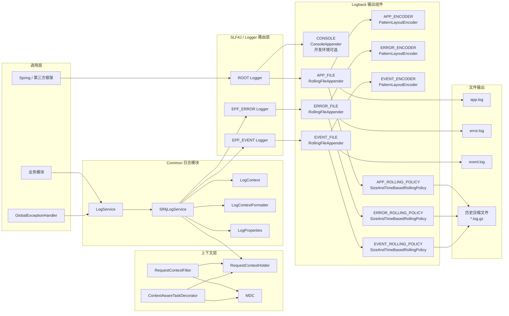
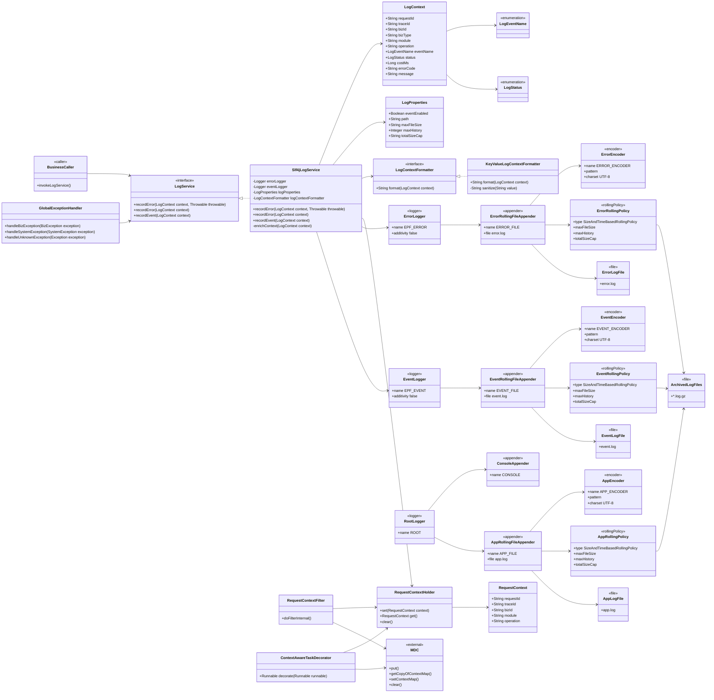
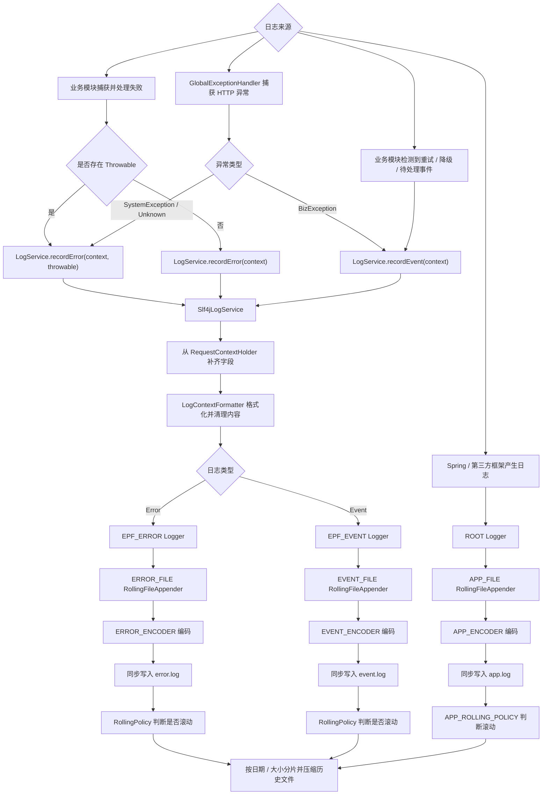
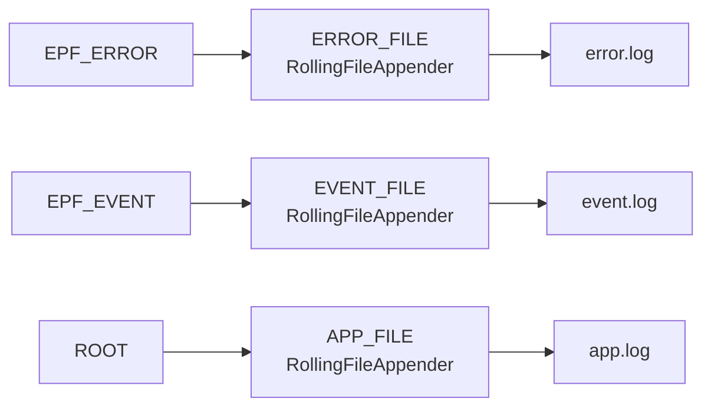
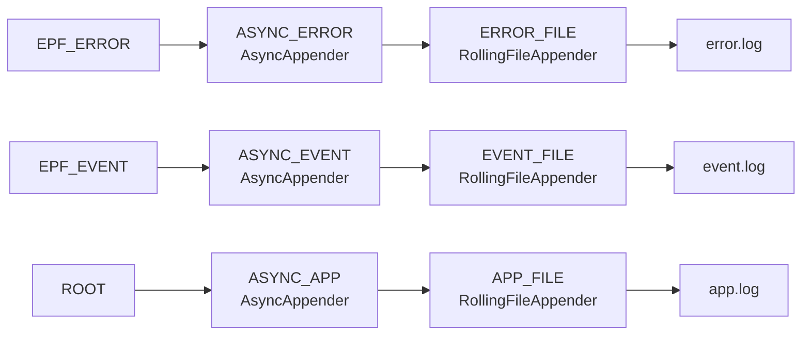

# EveryPicFound Common 日志模块架构与类设计

## 1. 文档目的

本文档定义 EveryPicFound 日志系统的整体组件架构、Common 日志模块接口、上下文机制、SLF4J/Logback 路由、同步文件输出以及后续异步切换方案。

日志在什么场景下调用、由哪个模块负责记录以及如何避免重复记录，见《EveryPicFound 日志记录职责与用例流程说明》。

---

## 2. 设计目标

1. 为业务模块提供统一的错误和事件日志接口。
2. 错误日志支持完整 `Throwable` 堆栈和 cause 链。
3. 日志自动携带 requestId、traceId 等链路字段。
4. 应用日志、错误日志和事件日志分别写入独立文件。
5. 当前使用同步 `RollingFileAppender`。
6. 业务代码不感知 Logger、Appender、文件路径和同步/异步模式。
7. 后续仅调整 Logback Appender 连接关系即可切换异步写入。
8. 日志系统与 Prometheus 指标系统完全分离。
9. 不提供普通业务成功日志接口。
10. 当前不实现 EventStore、事件消费或 MQ 清理。

---

## 3. 日志系统完整组件架构

日志系统由六层组成：

| 层级 | 主要组件 | 职责 |
|---|---|---|
| 调用层 | 业务模块、`GlobalExceptionHandler`、Spring/第三方框架 | 产生错误、事件或普通运行日志 |
| 上下文层 | `RequestContextFilter`、`RequestContextHolder`、MDC、`ContextAwareTaskDecorator` | 建立并传播 requestId、traceId 等字段 |
| 日志门面层 | `LogService` | 向业务模块提供稳定的错误和事件记录接口 |
| 日志实现层 | `Slf4jLogService`、`LogContextFormatter` | 补齐上下文、格式化内容并选择固定 Logger |
| Logback 路由层 | ROOT、`EPF_ERROR`、`EPF_EVENT` Logger | 根据日志类型选择 Appender |
| 输出层 | Appender、Encoder、RollingPolicy、日志文件 | 格式编码、同步写入、滚动、压缩和历史清理 |

### 3.1 完整组件架构图



### 3.2 架构说明

- `LogService`、`Slf4jLogService`、`LogContext` 等属于 Java 模块类。
- Logger、Appender、Encoder、RollingPolicy 属于 Logback 运行时组件，由 `logback-spring.xml` 创建和连接。
- `app.log`、`error.log`、`event.log` 是最终输出资源，不是 Java 类。
- `CONSOLE` 仅用于开发环境；性能测试环境可关闭。
- `EPF_ERROR` 和 `EPF_EVENT` 必须设置 `additivity=false`，避免日志继续传播到 ROOT 并重复写入 `app.log`。

---

## 4. 包与配置文件结构

```text
com.everypicfound.common
├─ log
│  ├─ LogService
│  ├─ Slf4jLogService
│  ├─ LogContext
│  ├─ LogEventName
│  ├─ LogStatus
│  ├─ LogProperties
│  ├─ LogContextFormatter
│  └─ KeyValueLogContextFormatter
├─ context
│  ├─ RequestContext
│  └─ RequestContextHolder
├─ filter
│  └─ RequestContextFilter
├─ executor
│  └─ ContextAwareTaskDecorator
└─ exception
   └─ GlobalExceptionHandler

resources
├─ application.yaml
└─ logback-spring.xml
```

`context`、`filter`、`executor` 和 `exception` 不属于 `common.log` 子包，但属于日志系统正常运行所需的公共配套。

---

# 5. Java 类与接口设计

## 5.1 类与接口总览

| 类 / 接口 | 类型 | 核心职责 |
|---|---|---|
| `LogService` | 接口 | 向业务模块提供错误和事件日志能力 |
| `Slf4jLogService` | 实现类 | 补齐上下文、格式化日志、选择固定 Logger |
| `LogContext` | 数据类 | 承载结构化日志字段 |
| `LogEventName` | 枚举 | 约束标准事件名称 |
| `LogStatus` | 枚举 | 约束错误和事件状态 |
| `LogProperties` | 配置类 | 绑定事件开关和文件滚动参数 |
| `LogContextFormatter` | 接口 | 定义日志上下文格式化策略 |
| `KeyValueLogContextFormatter` | 实现类 | 输出 `key=value` 格式并清理非法字符 |
| `RequestContext` | 数据类 | 保存当前请求或异步任务上下文 |
| `RequestContextHolder` | 上下文容器 | 基于 ThreadLocal 保存当前上下文 |
| `RequestContextFilter` | Filter | 初始化 HTTP 请求上下文和 MDC |
| `ContextAwareTaskDecorator` | TaskDecorator | 传播业务线程池上下文 |
| `GlobalExceptionHandler` | Advice | 统一记录 HTTP 链路异常 |

---

## 5.2 LogService

| 函数 | 输入 | 输出 | 说明 |
|---|---|---|---|
| `recordError` | `LogContext context`、`Throwable throwable` | `void` | 记录错误上下文和完整异常堆栈 |
| `recordError` | `LogContext context` | `void` | 记录无 Throwable 的明确系统失败 |
| `recordEvent` | `LogContext context` | `void` | 记录重试、降级、状态变化和待处理事件 |

`LogService` 使用门面模式。

门面模式为调用方提供统一入口，并隐藏：

- Logger 名称；
- Appender 类型；
- 日志文件路径；
- Encoder；
- RollingPolicy；
- 同步或异步写入模式。

业务模块只能依赖 `LogService`，不能直接控制日志基础设施。

---

## 5.3 Slf4jLogService

### 依赖

| 依赖 | 用途 |
|---|---|
| `LogContextFormatter` | 将上下文转换为统一文本 |
| `LogProperties` | 判断事件日志是否启用 |
| `RequestContextHolder` | 补齐当前线程上下文 |
| `EPF_ERROR` Logger | 将错误路由到错误日志通道 |
| `EPF_EVENT` Logger | 将事件路由到事件日志通道 |

### 内部处理过程

```text
接收 LogContext
    ↓
从 RequestContextHolder 读取当前上下文
    ↓
补齐 requestId / traceId / bizId / module / operation
    ↓
LogContextFormatter.format
    ↓
recordError → EPF_ERROR
recordEvent → EPF_EVENT
```

固定 Logger：

| Logger 名称 | 默认级别 | 输出目标 |
|---|---:|---|
| `EPF_ERROR` | ERROR | `ERROR_FILE` |
| `EPF_EVENT` | WARN | `EVENT_FILE` |

当前事件统一使用 WARN，因为本阶段不记录普通成功事件，只记录需要关注的业务拒绝、重试、降级和待补偿事件。

---

## 5.4 LogContext

| 字段 | 类型 | 必填性 | 说明 |
|---|---|---:|---|
| `requestId` | `String` | 可补齐 | 当前请求唯一标识 |
| `traceId` | `String` | 可补齐 | 跨模块链路标识 |
| `bizId` | `String` | 可选 | 业务对象标识，通常为 imageId |
| `bizType` | `String` | 可选 | SEARCH、IMAGE_UPLOAD 等 |
| `module` | `String` | 建议必填 | 产生日志的模块 |
| `operation` | `String` | 建议必填 | 当前执行操作 |
| `eventName` | `LogEventName` | 必填 | 标准事件名称 |
| `status` | `LogStatus` | 必填 | 当前错误或事件状态 |
| `costMs` | `Long` | 可选 | 当前节点耗时 |
| `errorCode` | `String` | 错误时建议填写 | 标准错误码 |
| `message` | `String` | 必填 | 补充说明 |

`Throwable` 不放入 `LogContext`，而作为 `recordError` 的独立参数传入。

---

## 5.5 LogEventName

初始事件名称建议包含：

```text
COMMON_UNHANDLED_EXCEPTION
SYSTEM_EXCEPTION_OCCURRED
BUSINESS_REQUEST_REJECTED
ORPHAN_FILE_DETECTED
TASK_PUBLISH_FAILED
VECTORIZATION_RETRY_SCHEDULED
VECTORIZATION_DEAD_FAILED
IMAGE_FILE_MISSING
CACHE_DEGRADED
```

命名规范：

```text
<资源或模块>_<动作>_<结果>
```

`eventName` 表示发生了什么，`errorCode` 表示为什么失败。

---

## 5.6 LogStatus

建议初始状态：

```text
REJECTED
FAILED
RETRYING
DEGRADED
WAITING
INVALIDATED
```

使用枚举可以统一日志检索语义，并避免字符串拼写不一致。

---

## 5.7 LogProperties

配置前缀：

```text
everypicfound.log
```

| 字段 | 类型 | 说明 |
|---|---|---|
| `eventEnabled` | `Boolean` | 是否启用事件日志 |
| `path` | `String` | 日志根目录 |
| `maxFileSize` | `String` | 单个日志文件最大容量 |
| `maxHistory` | `Integer` | 历史文件保留天数 |
| `totalSizeCap` | `String` | 历史日志总容量限制 |

错误日志默认启用，不提供业务开关关闭。

---

## 5.8 LogContextFormatter

| 函数 | 输入 | 输出 |
|---|---|---|
| `format` | `LogContext context` | `String` |

默认实现 `KeyValueLogContextFormatter` 输出：

```text
requestId=..., traceId=..., bizId=..., bizType=..., module=...,
operation=..., eventName=..., status=..., costMs=...,
errorCode=..., message=...
```

职责：

- 字段顺序固定；
- null 安全；
- 清理 `\r` 和 `\n`；
- 防止日志注入；
- 不负责选择 Logger；
- 不负责写入文件。

---

# 6. 上下文与异常处理配套设计

## 6.1 RequestContextFilter

职责：

1. 读取 `X-Request-Id` 和 `X-Trace-Id`。
2. 缺失时调用 `TraceIdGenerator` 生成。
3. 构建 `RequestContext`。
4. 写入 `RequestContextHolder`。
5. 写入 MDC。
6. 将两个 ID 写入响应头。
7. 请求结束时在 finally 中清理上下文。

Logback Pattern 从 MDC 中读取：

```text
%X{requestId}
%X{traceId}
```

---

## 6.2 ContextAwareTaskDecorator

职责：

1. 在任务提交线程读取 RequestContext。
2. 复制字段形成快照。
3. 复制 MDC Context Map。
4. 在工作线程执行前设置两个快照。
5. 执行原始 Runnable。
6. finally 中恢复或清理上下文。

它解决的是业务任务跨线程上下文传播，不等同于 Logback `AsyncAppender`。

---

## 6.3 GlobalExceptionHandler

| 异常类型 | 日志通道 | 是否打印堆栈 |
|---|---|---:|
| `BizException` | `event.log` | 否 |
| `SystemException` | `error.log` | 是 |
| 未知 `Exception` | `error.log` | 是 |

`GlobalExceptionHandler` 是 HTTP 同步链路的统一错误记录终点。

---

# 7. Logback 配置组件设计

## 7.1 Logger

| Logger | 来源 | Appender | 说明 |
|---|---|---|---|
| ROOT | Spring、第三方框架、普通系统日志 | `CONSOLE`、`APP_FILE` | 开发环境可输出控制台 |
| `EPF_ERROR` | `LogService.recordError` | `ERROR_FILE` | `additivity=false` |
| `EPF_EVENT` | `LogService.recordEvent` | `EVENT_FILE` | `additivity=false` |

---

## 7.2 Appender

| Appender | 类型 | 输出目标 | 当前模式 |
|---|---|---|---|
| `CONSOLE` | `ConsoleAppender` | 标准输出 | 开发环境可选 |
| `APP_FILE` | `RollingFileAppender` | `app.log` | 同步 |
| `ERROR_FILE` | `RollingFileAppender` | `error.log` | 同步 |
| `EVENT_FILE` | `RollingFileAppender` | `event.log` | 同步 |
| `ASYNC_APP` | `AsyncAppender` | 包装 `APP_FILE` | 后续 |
| `ASYNC_ERROR` | `AsyncAppender` | 包装 `ERROR_FILE` | 后续 |
| `ASYNC_EVENT` | `AsyncAppender` | 包装 `EVENT_FILE` | 后续 |

Appender 是日志输出目的地组件。

当前 `RollingFileAppender` 在调用日志的线程中完成编码和文件写入，因此属于同步磁盘 IO。

---

## 7.3 Encoder

| Encoder | 所属 Appender | 作用 |
|---|---|---|
| `CONSOLE_ENCODER` | `CONSOLE` | 控制台日志格式编码 |
| `APP_ENCODER` | `APP_FILE` | `app.log` 格式编码 |
| `ERROR_ENCODER` | `ERROR_FILE` | `error.log` 格式编码 |
| `EVENT_ENCODER` | `EVENT_FILE` | `event.log` 格式编码 |

建议 Pattern 包含：

```text
%d{yyyy-MM-dd HH:mm:ss.SSS}
%-5level
[%thread]
requestId=%X{requestId}
traceId=%X{traceId}
%logger{36}
%msg%n
```

错误 Appender 输出 Throwable 时，Logback 会在消息后继续输出异常堆栈。

---

## 7.4 RollingPolicy

三个文件 Appender 均使用：

```text
SizeAndTimeBasedRollingPolicy
```

职责：

- 按日期滚动；
- 单文件达到 `maxFileSize` 时分片；
- 历史文件 gzip 压缩；
- 保留 `maxHistory` 天；
- 总容量受 `totalSizeCap` 限制。

示例历史文件：

```text
app.2026-06-15.0.log.gz
error.2026-06-15.0.log.gz
event.2026-06-15.0.log.gz
```

---

## 7.5 配置来源

```text
application.yaml
    ↓
everypicfound.log.*
    ↓
┌───────────────────────┬────────────────────────┐
│ LogProperties Bean    │ logback-spring.xml     │
│ Java 运行逻辑使用      │ springProperty 读取     │
└───────────────────────┴────────────────────────┘
```

- `eventEnabled` 由 `LogProperties` 控制事件记录。
- `path`、`maxFileSize`、`maxHistory`、`totalSizeCap` 由 Logback 配置读取。
- Logger 与 Appender 连接关系由 `logback-spring.xml` 决定。

---

# 8. 完整系统类与配置组件图

下面的图同时包含 Java 类、SLF4J Logger、Logback Appender、Encoder、RollingPolicy 和日志文件。



### 8.1 图中组件性质说明

| 图中元素 | 是否 Java 类 | 实际来源 |
|---|---:|---|
| `LogService`、`Slf4jLogService` 等 | 是 | Java 代码 |
| ROOT、`EPF_ERROR`、`EPF_EVENT` | 否 | SLF4J/Logback 运行时 Logger |
| `APP_FILE`、`ERROR_FILE`、`EVENT_FILE` | 否 | `logback-spring.xml` 配置出的 Appender |
| Encoder | 否 | Appender 内部配置组件 |
| RollingPolicy | 否 | Logback 文件滚动组件 |
| 日志文件 | 否 | 文件系统资源 |

在类图中纳入非 Java 组件，是为了完整表达整个日志系统的组成和依赖关系，而不是要求为每个 Appender 编写 Java 类。

---

# 9. 日志记录基本总流程

## 9.1 从调用到落盘的统一流程



## 9.2 每个阶段的职责

| 阶段 | 组件 | 职责 |
|---|---|---|
| 日志产生 | 业务模块、全局异常处理器、框架 | 判断是否需要记录 |
| 上下文组装 | `Slf4jLogService`、`RequestContextHolder` | 补齐链路字段 |
| 内容格式化 | `LogContextFormatter` | 生成统一文本 |
| 通道路由 | Logger | 选择 APP、ERROR 或 EVENT 通道 |
| 编码 | Encoder | 将日志事件转换为 UTF-8 文本 |
| 写入 | Appender | 将文本同步写入当前日志文件 |
| 滚动 | RollingPolicy | 按时间和大小分片、压缩和清理历史文件 |

## 9.3 重要边界

- `Slf4jLogService` 不直接操作文件。
- Logger 不负责格式化 `LogContext` 业务字段。
- Encoder 不决定日志应进入哪个文件。
- Appender 不判断业务异常类型。
- RollingPolicy 不参与当前请求的业务流程。
- 当前同步模式下，Appender 文件写入发生在调用日志的线程中。

---

# 10. 三个日志通道的数据流

## 10.1 应用日志

```text
Spring / 第三方框架 / 普通系统日志
    → ROOT Logger
    → APP_FILE
    → APP_ENCODER
    → app.log
    → APP_ROLLING_POLICY
```

## 10.2 错误日志

```text
业务模块 / GlobalExceptionHandler
    → LogService.recordError
    → Slf4jLogService
    → EPF_ERROR
    → ERROR_FILE
    → ERROR_ENCODER
    → error.log
    → ERROR_ROLLING_POLICY
```

## 10.3 事件日志

```text
业务模块 / GlobalExceptionHandler
    → LogService.recordEvent
    → Slf4jLogService
    → EPF_EVENT
    → EVENT_FILE
    → EVENT_ENCODER
    → event.log
    → EVENT_ROLLING_POLICY
```

---

# 11. 当前同步模式与后续异步模式

## 11.1 当前同步模式



当前业务线程在调用日志后，会经过编码和文件写入过程。

---

## 11.2 后续异步模式



切换异步模式时保持不变：

- `LogService`；
- `LogContext`；
- `Slf4jLogService`；
- Logger 名称；
- Encoder；
- RollingPolicy；
- 业务调用方式；
- 日志文件名称和格式。

只改变：

```text
Logger → RollingFileAppender
```

为：

```text
Logger → AsyncAppender → RollingFileAppender
```

---

# 12. 配置建议

```yaml
everypicfound:
  log:
    event-enabled: true
    path: ./logs
    max-file-size: 100MB
    max-history: 30
    total-size-cap: 5GB
```

建议 Logback Pattern：

```text
%d{yyyy-MM-dd HH:mm:ss.SSS} %-5level
[%thread]
requestId=%X{requestId}
traceId=%X{traceId}
%logger{36} - %msg%n
```

同步和异步模式由 Logback Profile 或独立配置文件控制，不由业务代码判断。

当前阶段不加入：

- 普通成功日志采样；
- 慢日志；
- JSON 日志；
- 远程日志采集；
- EventStore；
- MQ Producer / Consumer；
- AsyncAppender 正式实现。

---

# 13. 开发顺序

## 第一阶段：重构 Java 日志核心

完成：

- `LogService`；
- `LogContext`；
- `LogEventName`；
- `LogStatus`；
- `LogProperties`。

## 第二阶段：实现格式化与 SLF4J 适配

完成：

- `LogContextFormatter`；
- `KeyValueLogContextFormatter`；
- `Slf4jLogService`；
- `EPF_ERROR`、`EPF_EVENT` 固定 Logger。

## 第三阶段：配置 Logback 完整同步输出链路

完成：

- ROOT、`EPF_ERROR`、`EPF_EVENT`；
- `CONSOLE`；
- `APP_FILE`、`ERROR_FILE`、`EVENT_FILE`；
- 三组 Encoder；
- 三组 `SizeAndTimeBasedRollingPolicy`；
- `app.log`、`error.log`、`event.log`。

## 第四阶段：完善上下文

调整：

- `RequestContextFilter`；
- `ContextAwareTaskDecorator`；
- MDC Pattern。

## 第五阶段：接入全局异常处理

调整：

- `GlobalExceptionHandler`。

业务模块调用点在日志模块稳定后集中适配。

## 第六阶段：同步日志验收

验证：

- Logger 路由；
- Appender 文件输出；
- Encoder 格式；
- Throwable 堆栈；
- MDC 字段；
- additivity 去重；
- RollingPolicy。

## 第七阶段：异步性能优化

新增：

- `ASYNC_APP`；
- `ASYNC_ERROR`；
- `ASYNC_EVENT`；
- `perf-async` Profile。

Java 业务代码不修改。

---

# 14. 文件改动清单

## 14.1 必须修改

| 文件 | 改动目标 |
|---|---|
| `LogService.java` | 重构为三个核心函数 |
| `Slf4jLogService.java` | 支持 Throwable、固定 Logger 和上下文补齐 |
| `LogContext.java` | 使用事件名和状态枚举 |
| `LogEventName.java` | 清理成功事件并补充基础事件 |
| `LogProperties.java` | 增加事件开关和文件参数 |
| `RequestContextFilter.java` | 初始化并清理 RequestContext、MDC |
| `ContextAwareTaskDecorator.java` | 复制 RequestContext 和 MDC 快照 |
| `GlobalExceptionHandler.java` | 统一记录 HTTP 链路异常 |
| `logback-spring.xml` | 配置完整 Logger、Appender、Encoder、RollingPolicy |
| `application.yaml` | 增加日志配置 |

## 14.2 新增

| 文件 | 作用 |
|---|---|
| `LogStatus.java` | 统一错误和事件状态 |
| `LogContextFormatter.java` | 定义格式化策略 |
| `KeyValueLogContextFormatter.java` | 默认键值格式实现 |

## 14.3 本轮不实现

| 能力                            | 原因                    |
| ----------------------------- | --------------------- |
| `EventPublisher`、`EventStore` | 当前事件只追加写入 `event.log` |
| MQ 清理消费者                      | 孤儿文件异步处理属于后续扩展        |
| 普通成功日志接口                      | 成功数据由 Prometheus 指标记录 |
| 慢日志                           | 后续性能测试阶段单独设计          |
| JSON 日志                       | 当前先使用键值日志             |
| `AsyncAppender`               | 同步模式验收后再加入            |

---

# 15. 模块验收标准

1. `recordError(context, throwable)` 能输出完整异常堆栈。
2. `recordError(context)` 不创建伪异常。
3. `recordEvent(context)` 只进入 `event.log`。
4. `EPF_ERROR` 只连接 `ERROR_FILE`。
5. `EPF_EVENT` 只连接 `EVENT_FILE`。
6. ROOT 连接 `APP_FILE`，开发环境可额外连接 `CONSOLE`。
7. ERROR、EVENT 日志不因 additivity 重复进入 `app.log`。
8. 三个文件 Appender 均配置 Encoder。
9. 三个文件 Appender 均配置时间和大小联合 RollingPolicy。
10. requestId 和 traceId 能从 MDC 输出。
11. 异步业务任务能够继承日志上下文。
12. 日志文本能够防止换行注入。
13. 指标记录不依赖日志模块。
14. 后续切换异步日志不修改 Java 业务代码。
