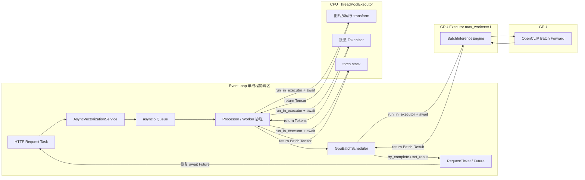
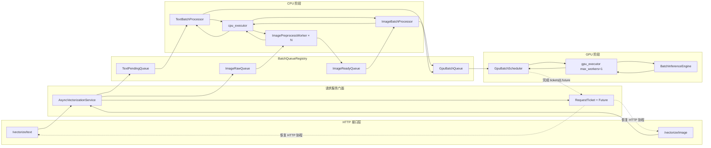
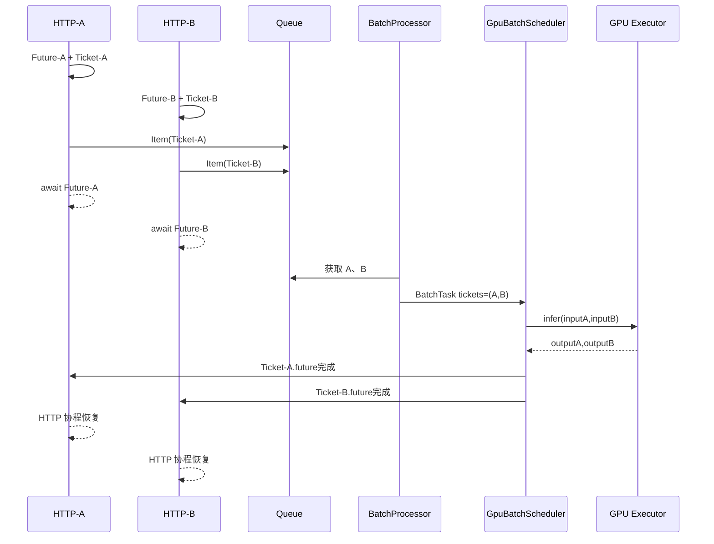
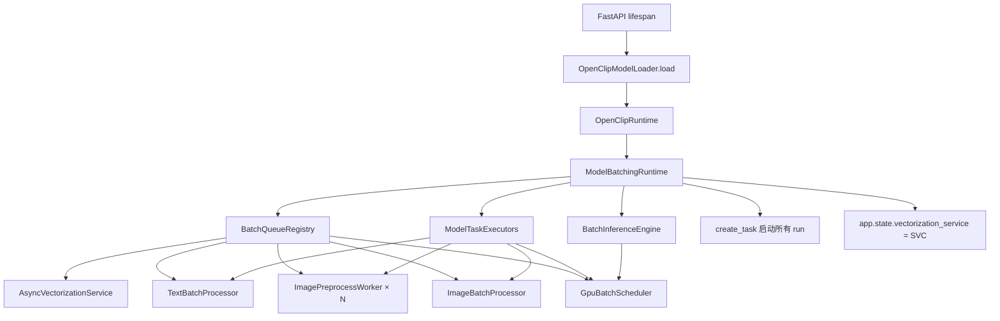
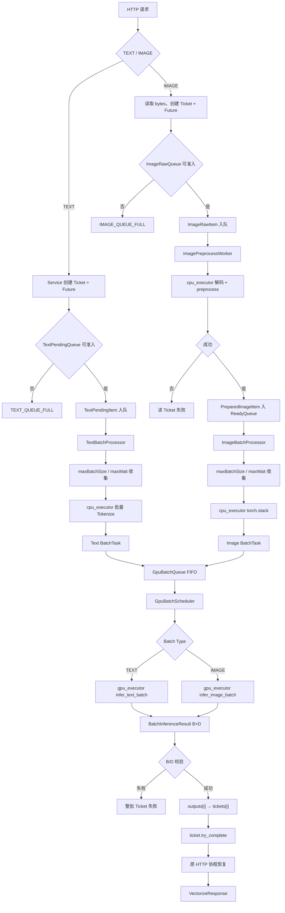

# EveryPicFound ModelService 动态批处理技术设计文档

> 适用范围：Python `modelservice`  
> 部署约束：单 Uvicorn Worker、单 OpenCLIP 模型实例、单 GPU  
> 核心目标：文本与图片动态组批、CPU 阶段并行、GPU 批次 FIFO 串行、结果精确回传

---

## 0. 改造涉及的技术原理

本次改造不是简单地在模型调用前增加一个列表，而是将 Python 模型服务组织成一种：

```text
异步请求协调
+
有界队列缓冲
+
动态批处理
+
CPU 多线程计算
+
单 GPU 批次串行执行
+
Future 精确回传
```

的混合并发模型。

这一节先解释后续类设计所依赖的技术原理。

### 0.1 动态批处理原理

#### 0.1.1 什么是批处理

批处理（Batching）是指将多个独立请求的输入合并成一个带有批次维度的 Tensor，再通过一次模型前向计算生成多个结果。

当前单请求推理的输入是：

```text
文本：[1, tokenLength]
图片：[1, channel, height, width]
```

动态批处理后的输入是：

```text
文本：[B, tokenLength]
图片：[B, channel, height, width]
```

其中 `B` 表示当前批次包含的请求数量。

OpenCLIP 的文本编码器和图片编码器本身都支持批次输入。因此，本次改造不需要修改模型结构，只需要在模型推理前完成请求收集、输入拼接和结果拆分。

#### 0.1.2 为什么批处理能够提高吞吐量

GPU 更适合一次执行较大规模的矩阵计算。若每个请求单独调用模型，则每次调用都需要承担：

```text
Python 函数调用
Tensor 搬运
GPU Kernel 启动
CUDA 同步
结果搬回 CPU
```

等固定开销。

将多个请求组成一个批次后，这些固定开销可以由多个请求共同承担，并且 GPU 可以使用更大的矩阵并行计算。

因此，动态批处理主要优化的是：

```text
单位时间内完成的请求数量，即吞吐量。
```

但批处理也会引入待批等待时间，所以不能无限等待请求凑满。

#### 0.1.3 动态批次的两种触发条件

Batch Processor 使用数量和时间两个条件决定是否提交批次。

数量触发：

```text
已收集请求数 == maxBatchSize
```

此时立即提交满批。

时间触发：

```text
当前时间 >= 首个请求入队时间 + maxBatchWait
```

即使批次没有达到最大数量，也必须提交，避免低并发时请求长期等待。

因此批处理策略是在以下两者之间平衡：

```text
更大的 Batch
→ GPU 吞吐更高

更短的等待
→ 单请求延迟更低
```

#### 0.1.4 为什么文本和图片分开组批

文本和图片虽然最终使用同一个 OpenCLIP 模型，但 CPU 准备阶段不同：

```text
文本：
字符串列表
→ Tokenizer
→ [B,L] Token Tensor

图片：
图片字节
→ 解码
→ Resize/Normalize
→ 单图 [C,H,W]
→ torch.stack
→ [B,C,H,W]
```

图片预处理耗时还会因文件大小、格式和解码复杂度不同而产生差异。

因此：

```text
文本使用 TextPendingQueue + TextBatchProcessor；
图片使用 ImageRawQueue + ImagePreprocessWorker
             + ImageReadyQueue + ImageBatchProcessor。
```

二者形成 `BatchTask` 后，再进入同一个 GPU FIFO 队列。

---

### 0.2 Python 异步中的 EventLoop

#### 0.2.1 EventLoop 的含义

EventLoop，中文称为事件循环，是 asyncio 的协程调度中心。

它不断执行以下循环：

```text
检查哪些 Task 已经可以运行
→ 执行其中一个协程片段
→ 协程遇到未完成的 await 后暂停
→ 执行其他已经就绪的协程
→ 等待 I/O、定时器或 Future 完成
→ 恢复对应协程
```

在单 Uvicorn Worker 模式下，FastAPI 请求协程、Batch Processor、Image Worker 和 GPU Scheduler 都由同一个 EventLoop 调度。

#### 0.2.2 协程、Task 和 Future 的关系

`async def` 定义的是协程函数。调用协程函数会得到 Coroutine 对象。

Task 是 EventLoop 用来驱动 Coroutine 执行的运行载体。

Future 是一个未来结果的占位对象。

可以概括为：

```text
Coroutine：
可以暂停和恢复的异步执行过程

Task：
由 EventLoop 调度，并负责驱动 Coroutine

Future：
当前尚未产生、未来会被设置的结果
```

例如，一个文本 HTTP 请求调用：

```python
result = await service.vectorize_text(...)
```

该请求由一个 Task 驱动。服务内部创建一个 Future，并执行：

```python
result = await ticket.future
```

Future 尚未完成时，请求 Task 会暂停，但 EventLoop 不会停止。它会继续执行其他 HTTP 请求和后台处理协程。

#### 0.2.3 `await` 的实际作用

`await` 不是创建新线程。

当协程执行：

```python
result = await future
```

且 Future 尚未完成时，会发生：

```text
保存当前协程执行位置和局部变量
→ 将当前 Task 注册为 Future 的等待者
→ 当前 Task 暂停
→ 执行权返回 EventLoop
→ EventLoop 调度其他可运行 Task
```

当 Future 被完成后，该 Task 被重新放入 EventLoop 的可运行队列，并从原来的 `await` 位置继续执行。

---

### 0.3 Future 如何连接 GPU 结果与原 HTTP 请求

每个 HTTP 请求创建一个独立 Future：

```python
loop = asyncio.get_running_loop()
future: asyncio.Future[VectorizeResult] = loop.create_future()
```

`get_running_loop()` 取得当前 FastAPI 请求所在的 EventLoop。

`loop.create_future()` 在该 EventLoop 上创建一个初始状态为 `PENDING` 的结果对象。

随后 Future 被放入 RequestTicket：

```python
ticket = RequestTicket(
    task_id=task_id,
    future=future,
    ...
)
```

请求协程执行：

```python
result = await future
```

并暂停等待。

同一个 Ticket 被 QueueItem 和 BatchTask 持续携带：

```text
HTTP 请求
→ RequestTicket
→ TextPendingItem / ImageRawItem
→ PreparedImageItem
→ BatchTask.tickets[i]
```

GPU 推理返回后，GpuBatchScheduler 根据相同下标取得：

```text
outputs[i]
和
batch.tickets[i]
```

然后调用：

```python
ticket.try_complete(result)
```

`try_complete()` 内部执行：

```python
if ticket.future.done():
    return False

ticket.future.set_result(result)
return True
```

`set_result()` 将 Future 从 `PENDING` 改为 `FINISHED`，并通知 EventLoop 恢复等待该 Future 的 HTTP Task。

完整路径是：

```text
GpuBatchScheduler._complete_batch
→ RequestTicket.try_complete
→ Future.set_result
→ EventLoop 将原 HTTP Task 标记为可运行
→ await future 返回 VectorizeResult
→ AsyncVectorizationService 返回
→ API 构造并返回 Response
```

Future 因此是批处理结果和原请求协程之间的结果桥梁。

---

### 0.4 EventLoop 与线程池的互动原理

#### 0.4.1 为什么还需要线程池

EventLoop 适合调度：

```text
网络 I/O
asyncio.Queue 等待
Future 等待
定时器
协程状态流转
```

但图片解码、Tokenizer、`torch.stack` 和 GPU 同步推理都是同步耗时函数。

如果直接在 EventLoop 中调用：

```python
async def process_image():
    tensor = preprocess_image(image_bytes)
```

即使外层函数使用 `async def`，`preprocess_image()` 运行期间也没有 `await`，EventLoop 无法切换到其他协程，整个服务的异步调度会被阻塞。

因此需要通过 ThreadPoolExecutor 将同步耗时函数移出 EventLoop 线程。

#### 0.4.2 提交线程池后的运行轨迹

例如：

```python
tensor = await loop.run_in_executor(
    cpu_executor,
    preprocess_image,
    image_bytes,
)
```

运行轨迹是：

```text
EventLoop 线程：
ImagePreprocessWorker 开始运行
→ 将 preprocess_image(image_bytes) 提交给 cpu_executor
→ 得到一个可等待 Future
→ Worker 协程 await 该 Future
→ Worker 协程暂停
→ EventLoop 继续运行其他协程

CPU 工作线程：
取得 preprocess_image 任务
→ 图片解码
→ OpenCLIP transform
→ 返回 CPU Tensor
→ 通知 EventLoop 线程池任务完成

EventLoop 线程：
原 ImagePreprocessWorker 恢复
→ await 返回 CPU Tensor
→ 构造 PreparedImageItem
→ 放入 ImageReadyQueue
```

因此执行位置发生了三段变化：

```text
协程前半段：EventLoop 线程
同步计算段：线程池工作线程
协程后半段：重新回到 EventLoop 线程
```

#### 0.4.3 线程池执行期间 EventLoop 让出执行权

```text
当前协程在 await 线程池结果时让出 EventLoop 执行权。
```

EventLoop 本身仍在运行，并可继续处理：

```text
新的 HTTP 请求
其他图片预处理 Worker
TextBatchProcessor
ImageBatchProcessor
GpuBatchScheduler
已完成 Future 的回调
```

因此多个图片预处理函数可以在线程池中执行，同时 EventLoop 继续负责业务流程协调。

#### 0.4.4 CPU Executor 和 GPU Executor

本设计使用两个明确的 Executor：

```text
cpu_executor：
ThreadPoolExecutor(max_workers=N)

执行图片解码、图片 transform、批量 Tokenizer、torch.stack。
```

```text
gpu_executor：
ThreadPoolExecutor(max_workers=1)

执行 Tensor 搬运、encode_text、encode_image、
向量归一化、CUDA 同步和结果搬回 CPU。
```

CPU Executor 可以拥有多个工作线程，使多个图片预处理任务并发推进。

GPU Executor 固定单线程，并且 GPU Queue 只有一个 Scheduler 消费者，从而保证文本批次和图片批次按照 FIFO 顺序串行提交到同一个 GPU。

---

### 0.5 多线程完成顺序与请求顺序

假设三个图片请求按顺序提交：

```text
A → B → C
```

它们可能分别由三个 CPU 工作线程处理：

```text
Thread-1 处理 A
Thread-2 处理 B
Thread-3 处理 C
```

由于图片复杂度不同，完成顺序可能是：

```text
B → C → A
```

因此 ImageReadyQueue 的顺序是预处理完成顺序，而不一定是 HTTP 到达顺序。

这不会导致结果错配，因为线程返回的 Tensor 会在 EventLoop 中重新和原 Ticket 绑定：

```python
PreparedImageItem(
    ticket=raw_item.ticket,
    image_tensor=tensor,
)
```

组批时再保持：

```text
batch.input_tensor[i]
对应
batch.tickets[i]
```

GPU 输出继续保持 Batch 维度顺序：

```text
outputs[i]
对应
input_tensor[i]
对应
tickets[i]
```

所以系统不依赖多个线程的完成先后顺序，而依赖 Ticket 与数据对象的显式绑定。

---

### 0.6 asyncio.Queue 的一致性原理

#### 0.6.1 同一 EventLoop 中不需要给 Queue 额外加线程锁

因为本设计所有 `asyncio.Queue` 操作只发生在同一个 EventLoop 中。

同一个时刻，只有一个协程片段在 EventLoop 线程中执行 Python 代码。

因此以下不含 `await` 的同步片段不会执行到一半被另一个协程插入：

```python
queue.put_nowait(item)
```

```python
item = queue.get_nowait()
```

`asyncio.Queue` 自身还负责维护：

```text
FIFO 元素顺序
等待中的生产者
等待中的消费者
maxsize 容量
QueueFull / QueueEmpty
task_done / join
```

所以在单 EventLoop 协程并发范围内，不需要再给 Queue 套普通线程锁。

#### 0.6.2 单线程不代表跨 await 的业务判断永远安全

协程会在 `await` 处让出执行权。

下面的写法仍然可能出现逻辑竞争：

```python
if not queue.empty():
    await do_something()
    item = queue.get_nowait()
```

在 `await do_something()` 期间，其他协程可能已经取走元素。

因此不能依赖：

```text
先检查
→ 中间 await
→ 再执行
```

这种跨等待点的组合判断。

应直接使用 Queue 提供的操作：

```python
item = await queue.get()
```

或者捕获：

```python
try:
    item = queue.get_nowait()
except asyncio.QueueEmpty:
    ...
```

#### 0.6.3 asyncio.Queue 不是线程安全队列

虽然它适合同一个 EventLoop 内的多个协程，但不能由 ThreadPoolExecutor 工作线程直接调用：

```python
image_ready_queue.put_nowait(...)
```

正确路径必须是：

```text
EventLoop 协程从 Queue 取得输入
→ 在线程池中只执行计算
→ 线程返回结果
→ 原协程回到 EventLoop
→ EventLoop 协程修改下一阶段 Queue
```

---

### 0.7 EventLoop 与工作线程的状态所有权

为减少锁和一致性问题，本设计采用状态单线程所有权原则。

EventLoop 拥有：

```text
asyncio.Queue
asyncio.Future
RequestTicket.state
active_tickets
批次状态
请求超时和取消
服务启动与关闭状态
结果回填
```

工作线程只拥有：

```text
当前同步函数的局部变量
image_bytes
文本列表
输入 Tensor
计算中的临时对象
返回值或异常
```

推荐线程函数：

```python
def preprocess_image(
    image_bytes: bytes,
) -> torch.Tensor:
    image = decode_image(image_bytes)
    return preprocess(image)
```

不推荐：

```python
def preprocess_image(raw_item):
    tensor = preprocess(raw_item.image_bytes)
    raw_item.ticket.state = RequestState.READY
    raw_item.ticket.future.set_result(tensor)
    image_ready_queue.put_nowait(raw_item)
```

后一种写法使线程同时修改：

```text
RequestTicket
asyncio.Future
asyncio.Queue
```

而 EventLoop 也可能正在处理超时、取消或服务关闭，从而产生线程安全和状态覆盖问题。

因此线程池函数应遵循：

```text
只接收完成计算所需的纯输入
→ 只执行同步计算
→ 通过返回值或异常把结果交回协程
```

`bytes`、字符串、数值、不可变元组和只读配置快照适合作为线程输入。

完整可变 RequestTicket 不应作为线程函数的业务操作对象。即使因日志需要读取 `task_id` 或 `trace_id`，也应复制为不可变上下文，而不是在线程中修改 Ticket。

---

### 0.7.1 线程池任务参数隔离原则

**提交到线程池的函数应尽量只接收完成计算所需的普通数据**，例如 `image_bytes`、文本列表或 Tensor，不应直接传入并修改 `asyncio.Future`、`asyncio.Queue`、`RequestTicket` 等由 EventLoop 管理的对象。

原因是线程池函数运行在工作线程中，而 Future、Queue 和 Ticket 状态由 EventLoop 线程统一管理。如果工作线程也直接修改这些对象，就可能与请求超时、取消、结果回填等流程发生并发竞争，造成 Future 重复完成、Ticket 状态覆盖或 Queue 线程安全问题。

因此统一遵循以下规则：

```
EventLoop：
管理 Queue、Future、Ticket、超时、取消和状态流转。

工作线程：
只执行同步计算，接收普通输入，返回计算结果或抛出异常。
```

正确方法：

```
tensor = await executors.run_cpu(
    preprocess_image,
    image_bytes,
)
```

而不是：

```
await executors.run_cpu(
    preprocess_image,
    request_ticket,
    image_ready_queue,
)
```

线程计算完成后，结果返回原协程，再由 EventLoop 更新 Ticket、写入下一阶段 Queue 或完成 Future。

---

### 0.8 异步取消与线程任务

取消一个正在等待线程池结果的协程，并不代表已经开始运行的线程函数会立即停止。

例如：

```text
HTTP 请求取消
→ Worker 协程收到 CancelledError
→ 已开始的图片预处理线程仍可能继续执行
→ 线程最终返回 Tensor
→ 由于 Ticket 已取消，后续结果被丢弃
```

Python 不能安全地强制终止一个已经开始运行的普通线程。

同理：

```text
异步 wait_for 超时
≠
工作线程中的同步函数立即停止
```

因此系统需要：

```text
有界 Queue
受控 Worker 数量
请求 deadline
Ticket 终态判断
try_complete 的 done 检查
晚到结果丢弃指标
```

`try_complete()` 的意义不仅是设置结果，还用于保证 Future 只完成一次：

```python
def try_complete(self, result: VectorizeResult) -> bool:
    if self.future.done():
        return False

    self.future.set_result(result)
    return True
```

在 `done()` 检查和 `set_result()` 之间不能出现 `await`。由于二者都在同一个 EventLoop 中连续执行，不需要额外线程锁。

---

### 0.9 本系统的完整混合并发模型



可以将职责归纳为：

```text
EventLoop：
管理请求、Queue、Ticket、Future、状态和流程。

CPU ThreadPool：
并发执行不能阻塞 EventLoop 的 CPU 同步计算。

GPU Executor：
串行提交批次推理，避免多个调用同时操作单 GPU。

BatchTask：
固定输入行和 RequestTicket 的下标关系。

Future：
把 Scheduler 的最终结果精确传回原 HTTP 请求。
```

这也是后续类设计中最重要的并发边界。


## 1. 设计目标

当前调用方式是：

```text
HTTP 请求
→ 获取 inference_lock
→ CPU 预处理
→ batchSize=1 GPU 推理
→ 返回
```

目标结构是：

```text
多个 HTTP 请求
→ 各自创建 RequestTicket + Future
→ 文本/图片进入各自队列
→ CPU 阶段准备输入
→ 形成不可变 BatchTask
→ 进入统一 GPU FIFO 队列
→ 一次模型前向得到多个向量
→ 按 BatchTask 中 Ticket 顺序完成各自 Future
→ 原 HTTP 协程分别恢复并返回
```

Hybrid 不需要模型端专用结构。它仍然表现为一个文本请求和一个图片请求。

---

# 2. 三类对象必须分开理解

之前结构不清晰，主要是将 Worker、Executor 和 Processor 混在一起。

## 2.1 后台协程 Worker / Processor

它们运行在 asyncio EventLoop 中，负责业务流程协调：

- 从 `asyncio.Queue` 取任务；
- 判断组批阈值；
- 修改 RequestTicket 状态；
- 将阻塞计算提交给线程池；
- 把结果放入下一阶段队列；
- 完成 Future。

本设计中的后台协程：

```text
TextBatchProcessor.run
ImagePreprocessWorker.run × N
ImageBatchProcessor.run
GpuBatchScheduler.run
```

它们不能直接执行耗时图片解码、Tokenizer 或 GPU 推理。

## 2.2 Executor

Executor 是线程池基础设施，只负责运行同步阻塞函数。

本设计只保留两个 Executor：

### `cpu_executor`

```text
ThreadPoolExecutor(max_workers=N)
```

执行：

- 图片解码和 OpenCLIP 图片 transform；
- 批量 Tokenizer；
- `torch.stack` 组装图片批量 Tensor。

### `gpu_executor`

```text
ThreadPoolExecutor(max_workers=1)
```

执行：

- Tensor 搬到 GPU；
- `encode_text` / `encode_image`；
- 向量归一化；
- CUDA 同步；
- 批量结果搬回 CPU。

所以不再使用没有提前定义清楚的 `imageExecutor`。图片 CPU 计算统一提交给 `cpu_executor`。

## 2.3 Processor / Scheduler

Processor 是业务协调类，不是线程池。

| 类 | 职责 |
|---|---|
| `TextBatchProcessor` | 收集文本、批量 Tokenize、创建文本 BatchTask |
| `ImagePreprocessWorker` | 单图片 CPU 预处理、发布 PreparedImageItem |
| `ImageBatchProcessor` | 收集预处理图片、stack、创建图片 BatchTask |
| `GpuBatchScheduler` | FIFO 执行 BatchTask、按下标完成 Future |

---

# 3. 总体对象连接



这里有两种连接关系：

```text
Queue：连接处理阶段；
RequestTicket：连接同一个请求的身份。
```

---

# 4. 四个队列

所有队列使用：

```text
asyncio.Queue(maxsize=N)
```

Queue 只能由 EventLoop 协程操作，线程池函数不能直接 `put/get`。

## 4.1 TextPendingQueue

元素：`TextPendingItem`  
生产者：`AsyncVectorizationService.vectorize_text`  
消费者：唯一 `TextBatchProcessor`  
职责：等待文本达到数量阈值或时间阈值。

文本尚未 Tokenize，所以不叫 TextReadyQueue。

## 4.2 ImageRawQueue

元素：`ImageRawItem`  
生产者：`AsyncVectorizationService.vectorize_image`  
消费者：多个 `ImagePreprocessWorker`  
职责：限制等待图片 CPU 预处理的请求数量。

## 4.3 ImageReadyQueue

元素：`PreparedImageItem`  
生产者：多个 `ImagePreprocessWorker`  
消费者：唯一 `ImageBatchProcessor`  
职责：保存已经获得 `[C,H,W]` CPU Tensor 的图片请求。

## 4.4 GpuBatchQueue

元素：`BatchTask`  
生产者：文本、图片 BatchProcessor  
消费者：唯一 `GpuBatchScheduler`  
职责：按照 BatchTask 实际入队顺序执行纯 FIFO。

---

# 5. 核心数据结构

## 5.1 RequestTicket

RequestTicket 是一个请求从进入模型服务到返回响应的身份载体。

同一个 Ticket 对象会被以下对象依次持有：

```text
TextPendingItem / ImageRawItem
→ PreparedImageItem（图片）
→ BatchTask
→ GpuBatchScheduler
```

### 属性

| 属性 | 说明 |
|---|---|
| `task_id` | 模型服务内部唯一任务 ID |
| `request_id` | Java HTTP 请求 ID |
| `trace_id` | 链路 ID |
| `vectorize_type` | TEXT / IMAGE |
| `image_id` | 图片业务 ID，可空 |
| `arrival_at` | 请求到达单调时间 |
| `deadline_at` | 请求总截止时间 |
| `future` | 原 HTTP 协程等待的 asyncio.Future |
| `state` | 当前状态 |
| `batch_id` | 所属批次 ID |
| `completed_at` | 完成时间 |

### 方法

| 方法 | 职责 |
|---|---|
| `is_terminal()` | 判断是否已进入终态 |
| `is_expired(now)` | 判断是否超时 |
| `transition(expected,target)` | 校验状态转移 |
| `try_complete(result)` | 成功完成 Future |
| `try_fail(result)` | 失败完成 Future |
| `try_cancel()` | 取消尚未完成请求 |

所有方法都只由 EventLoop 调用。

## 5.2 TextPendingItem

```text
ticket
text
enqueue_at
```

## 5.3 ImageRawItem

```text
ticket
image_bytes
original_file_name
mime_type
file_size
enqueue_at
```

## 5.4 PreparedImageItem

```text
ticket
image_tensor       # [C,H,W]，CPU Tensor
ready_at
preprocess_cost_ms
```

## 5.5 BatchTask

使用不可变 dataclass，内部请求集合使用 tuple：

```text
batch_id
batch_type
tickets: tuple[RequestTicket,...]
input_tensor
trigger
created_at
gpu_enqueue_at
```

必须保证：

```text
input_tensor[i] ↔ tickets[i]
```

## 5.6 BatchInferenceResult

```text
embeddings         # [B,D]，CPU Tensor
batch_size
vector_dim
inference_cost_ms
```

---

# 6. ModelTaskExecutors

它是两个线程池的容器，不参与业务调度。

## 属性

```text
cpu_executor
gpu_executor
started
closed
```

## 方法

| 方法 | 职责 |
|---|---|
| `start()` | 创建两个 ThreadPoolExecutor |
| `run_cpu(func,*args)` | 将同步 CPU 函数提交给 cpu_executor |
| `run_gpu(func,*args)` | 将同步 GPU 函数提交给 gpu_executor |
| `close()` | 关闭两个线程池 |

调用方式：

```text
Processor 协程
→ await executors.run_cpu(...)
→ CPU 线程执行
→ 结果回到原 Processor 协程
```

```text
GpuBatchScheduler
→ await executors.run_gpu(...)
→ 唯一 GPU 线程执行
→ 批量结果回到 Scheduler
```

Executor 不知道 Queue、Ticket 和 Future。

---

# 7. AsyncVectorizationService

## 定位

它是 API 层唯一调用的内部门面。

API 不直接接触 Queue、Processor、Executor 或 Scheduler。

## vectorize_text

```text
校验服务状态和文本
→ 创建 Future
→ 创建 RequestTicket
→ 创建 TextPendingItem
→ put_nowait(TextPendingQueue)
→ await ticket.future
→ 返回 VectorizeResult
```

队列满时立即返回 `TEXT_QUEUE_FULL`。

## vectorize_image

```text
校验服务状态和 image_bytes
→ 创建 Future
→ 创建 RequestTicket
→ 创建 ImageRawItem
→ put_nowait(ImageRawQueue)
→ await ticket.future
→ 返回 VectorizeResult
```

队列满时立即返回 `IMAGE_QUEUE_FULL`。

`await Future` 只挂起当前 HTTP 协程，不会占用一个线程等待。


# 8. TextBatchProcessor

## 定位

它是 TextPendingQueue 的唯一消费者，完整负责：

```text
收集文本请求
→ 判断批次边界
→ 批量 Tokenize
→ 创建 BatchTask
→ 提交 GPU Queue
```

因此文本链路不需要 TextReadyQueue。

## 依赖

```text
TextPendingQueue
GpuBatchQueue
ModelTaskExecutors
runtime.tokenizer
TextBatchProperties
stop_event
```

## 方法

### run()

```text
while 未停止:
    items, trigger = await _collect_batch()
    tokens = await _tokenize_batch(items)
    batch = _build_batch_task(items,tokens,trigger)
    await _submit_batch(batch)
```

### _collect_batch()

1. `await queue.get()` 获取首项；
2. `get_nowait()` 尽量取满 `max_batch_size`；
3. 未满时只等待首项剩余 `max_wait`；
4. 满批或时间到停止；
5. 过滤取消和超时请求；
6. 每个成功 get 的元素最终调用一次 `task_done()`。

### _tokenize_batch(items)

```text
texts = [item.text for item in items]
→ await executors.run_cpu(runtime.tokenizer,texts)
→ tokens [B,L]
```

Tokenizer 失败时，当前批次所有 Ticket 分别失败，不能留下未完成 Future。

### _build_batch_task()

```text
tickets = tuple(item.ticket for item in items)
```

校验：

```text
tokens.shape[0] == len(tickets)
```

### _submit_batch()

将 BatchTask 放入 GpuBatchQueue，并将 Ticket 更新为 `GPU_QUEUED`。

---

# 9. ImagePreprocessWorker

## 定位

它负责单张图片的 CPU 阶段。

会启动多个 Worker 协程，但真正解码在线程池中执行。

## 依赖

```text
ImageRawQueue
ImageReadyQueue
ModelTaskExecutors
runtime.preprocess
stop_event
worker_id
```

## run()

```text
while 未停止:
    raw_item = await ImageRawQueue.get()
    ticket → PREPROCESSING
    try:
        tensor = await _preprocess(raw_item)
        ready_item = _build_ready_item(raw_item,tensor)
        await ImageReadyQueue.put(ready_item)
        ticket → READY
    except:
        完成该 Ticket 失败
    finally:
        ImageRawQueue.task_done()
```

## _preprocess()

```text
await executors.run_cpu(preprocess_image_sync,image_bytes)
```

同步函数执行：

```text
Image.open
→ convert RGB
→ runtime.preprocess
→ [C,H,W] CPU Tensor
```

这里不能 `.to(cuda)`，否则多个 Worker 会绕过 GPU Scheduler 并发操作 GPU。

## _build_ready_item()

关键点：将原始 Ticket 原样带入 PreparedImageItem。

```text
PreparedImageItem(ticket=raw_item.ticket,...)
```

---

# 10. ImageBatchProcessor

## 定位

它是 ImageReadyQueue 的唯一消费者。

负责：

```text
收集 PreparedImageItem
→ 判断批次边界
→ torch.stack
→ 创建 Image BatchTask
→ 提交 GPU Queue
```

## 方法

### run()

```text
while 未停止:
    items, trigger = await _collect_batch()
    tensor = await _stack_batch(items)
    batch = _build_batch_task(items,tensor,trigger)
    await _submit_batch(batch)
```

### _collect_batch()

和文本相同，但等待时间从 `PreparedImageItem.ready_at` 计算，同时检查 Ticket 的总 `deadline_at`。

### _stack_batch()

```text
tensors = [item.image_tensor for item in items]
→ await executors.run_cpu(torch.stack,tensors)
→ [B,C,H,W]
```

### _build_batch_task()

```text
tickets = tuple(item.ticket for item in items)
```

保持：

```text
batch_tensor[i] ↔ tickets[i]
```

---

# 11. BatchInferenceEngine

## 定位

只负责模型批推理，不知道 Queue、Future 或 HTTP 请求。

## infer_text_batch

```text
tokens.to(device)
→ inference_mode
→ encode_text
→ normalize
→ cuda synchronize
→ detach().cpu()
→ BatchInferenceResult
```

## infer_image_batch

```text
images.to(device)
→ inference_mode
→ encode_image
→ normalize
→ cuda synchronize
→ detach().cpu()
→ BatchInferenceResult
```

Engine 只校验输出是 `[B,D]` 且 D 等于配置维度，不负责按请求组装结果。

---

# 12. GpuBatchScheduler

## 定位

GpuBatchQueue 的唯一消费者，使用纯 FIFO。

## run()

```text
while 未停止:
    batch = await GpuBatchQueue.get()
    try:
        Ticket → INFERENCING
        result = await _execute_batch(batch)
        _validate_batch_result(batch,result)
        _complete_batch(batch,result)
    except:
        _fail_batch(batch)
    finally:
        GpuBatchQueue.task_done()
```

## _execute_batch()

```text
TEXT  → executors.run_gpu(engine.infer_text_batch,input_tensor)
IMAGE → executors.run_gpu(engine.infer_image_batch,input_tensor)
```

## _validate_batch_result()

```text
result.batch_size == len(batch.tickets)
result.vector_dim == runtime.vector_dim
```

不满足时整批失败，不能继续按不可靠下标回填。

## _complete_batch()

```text
for index,ticket in enumerate(batch.tickets):
    embedding = result.embeddings[index]
    ticket.try_complete(VectorizeResult(...))
```

## _fail_batch()

逐个 Ticket 完成失败结果，保证没有 Future 永久悬挂。

---

# 13. Future 为什么能找回原 HTTP 请求

请求到达时：

```text
HTTP-A 创建 Future-A 和 Ticket-A
HTTP-B 创建 Future-B 和 Ticket-B
HTTP-C 创建 Future-C 和 Ticket-C
```

组批时：

```text
BatchTask.tickets = (Ticket-A,Ticket-B,Ticket-C)
```

模型输入：

```text
input[0]=A
input[1]=B
input[2]=C
```

模型输出：

```text
output[0]=vectorA
output[1]=vectorB
output[2]=vectorC
```

Scheduler：

```text
output[0] → Ticket-A.future
output[1] → Ticket-B.future
output[2] → Ticket-C.future
```

完整引用链：

```text
HTTP Coroutine-A
    ↓ await
Future-A
    ↑ Ticket-A 持有
Ticket-A
    ↑ BatchTask.tickets[0] 持有
outputs[0]
```

不需要从大量请求中重新搜索，也不依赖全局 `requestId → Future` 路由。



---

# 14. ModelBatchingRuntime 如何装配所有类

`ModelBatchingRuntime` 是对象装配根。

创建顺序：

```text
OpenClipRuntime
→ BatchQueueRegistry
→ ModelTaskExecutors
→ BatchInferenceEngine
→ AsyncVectorizationService
→ TextBatchProcessor
→ ImagePreprocessWorker × N
→ ImageBatchProcessor
→ GpuBatchScheduler
```

启动：

```text
create_task(text_processor.run())
create_task(image_worker_1.run())
...
create_task(image_batch_processor.run())
create_task(gpu_scheduler.run())
```

FastAPI 只注册：

```text
app.state.vectorization_service = AsyncVectorizationService
```

API 不需要知道其他内部对象。



---

# 15. 两条完整类调用链

## 文本

```text
api.vectorize_text
→ AsyncVectorizationService.vectorize_text
→ TextPendingQueue
→ TextBatchProcessor.run
→ TextBatchProcessor._collect_batch
→ ModelTaskExecutors.run_cpu(tokenizer)
→ TextBatchProcessor._build_batch_task
→ GpuBatchQueue
→ GpuBatchScheduler.run
→ ModelTaskExecutors.run_gpu
→ BatchInferenceEngine.infer_text_batch
→ GpuBatchScheduler._complete_batch
→ RequestTicket.try_complete
→ AsyncVectorizationService.vectorize_text 恢复
→ API 返回
```

## 图片

```text
api.vectorize_image
→ AsyncVectorizationService.vectorize_image
→ ImageRawQueue
→ ImagePreprocessWorker.run
→ ModelTaskExecutors.run_cpu(preprocess_image)
→ ImageReadyQueue
→ ImageBatchProcessor.run
→ ModelTaskExecutors.run_cpu(torch.stack)
→ ImageBatchProcessor._build_batch_task
→ GpuBatchQueue
→ GpuBatchScheduler.run
→ ModelTaskExecutors.run_gpu
→ BatchInferenceEngine.infer_image_batch
→ GpuBatchScheduler._complete_batch
→ RequestTicket.try_complete
→ AsyncVectorizationService.vectorize_image 恢复
→ API 返回
```

---

# 16. 线程安全

## Queue 不需要额外套大锁

原因：

- 使用 `asyncio.Queue`；
- Queue 只在一个 EventLoop 中操作；
- 每个组批队列只有一个消费者；
- CPU/GPU 线程不直接操作 Queue。

## 多个图片 Worker

多个 Worker 并发调用 `ImageRawQueue.get()`，同一个元素只会被一个 Worker 取得。

线程池完成图片处理后，结果先回到 Worker 协程，再由协程执行：

```text
await ImageReadyQueue.put(...)
```

## Future 竞争

超时、取消、GPU 完成、服务关闭可能竞争完成同一个 Future。

所有操作最终都在 EventLoop 调用 `try_complete/try_fail/try_cancel`。

方法内部：

```text
检查 future.done()
→ 中间不 await
→ 立即完成
```

所以只有一个操作会成功。

---

# 17. 完整流程图



---

# 18. 包结构

```text
modelservice/app
├── api.py
├── schemas.py
├── model_loader.py
│
├── batching
│   ├── enums.py
│   ├── models.py
│   ├── properties.py
│   ├── queue_registry.py
│   ├── executors.py
│   ├── ticket_factory.py
│   ├── vectorization_service.py
│   ├── text_batch_processor.py
│   ├── image_preprocess_worker.py
│   ├── image_batch_processor.py
│   ├── gpu_batch_scheduler.py
│   └── runtime.py
│
└── inference
    ├── preprocessors.py
    └── batch_inference_engine.py
```

---

# 19. 核心不变量

```text
一个 HTTP 子请求只创建一个 RequestTicket；
一个 Ticket 只持有一个 Future；
一个 Queue 元素只被一个消费者取得；
一个 Ticket 最多进入一个 BatchTask；
BatchTask 创建后不可修改；
input_tensor[i] 与 tickets[i] 一致；
outputs[i] 与 input_tensor[i] 一致；
一个 Future 最多完成一次；
所有成功、失败、取消、关闭路径最终结束 Future；
Queue、Future、Ticket 状态只在 EventLoop 操作；
CPU/GPU 线程不直接修改共享业务状态。
```

---

# 20. 最终理解方式

类之间不是互相随意调用，而是按阶段连接：

```text
AsyncVectorizationService
→ Queue
→ Processor / Worker
→ Queue
→ GpuBatchScheduler
→ Future
→ AsyncVectorizationService 返回
```

Executor 只是被 Processor/Scheduler 调用的计算工具：

```text
Processor / Scheduler
→ Executor 执行同步耗时函数
→ 结果返回原协程
```

Executor 不拥有队列、不拥有 Ticket，也不负责 HTTP 返回。
