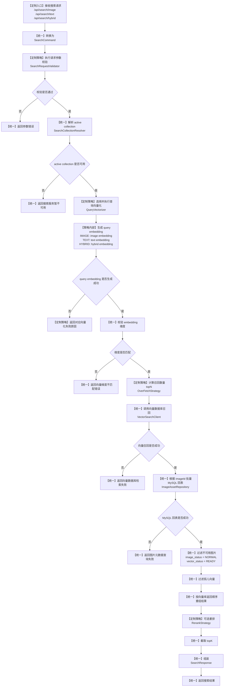

# EverythingFound 搜图系统 PRD（产品需求文档）

> 当前状态：PRD 讨论稿 0.1  
> 当前阶段：先确认项目定位、核心能力、优化方向和可扩展原则。后续每确认一章，逐步补充详细内容。

---

## 1. 文档说明

### 1.1 文档目的

本 PRD 用于指导 EverythingFound 搜图系统的产品设计、技术设计、开发迭代和最终项目展示。

该文档不仅描述系统要实现什么功能，也会记录为什么这样设计、后续如何扩展、哪些能力可以沉淀为后端工程亮点。

### 1.2 项目定位

EverythingFound 是一个面向图片素材库/个人图片库/通用图片集合的多模态搜图系统。

系统的核心能力是：

- 以图搜图：用户上传一张查询图片，系统返回语义相似或视觉相似的图片。
- 以文搜图：用户输入一段文本，系统返回与文本语义匹配的图片。
- 图文联合搜图：用户同时输入图片和文本，系统综合图片视觉信息和文本语义约束，返回更精准的搜索结果。

从产品角度看，它是一个搜图软件。  
从技术角度看，它是一个多模态向量检索系统。  
从后端项目角度看，它是一个用于展示现代 Java 后端工程能力的高并发检索系统。

### 1.3 MVP 范围

首期 MVP 先保证核心搜索链路跑通，不一开始堆叠复杂优化。

MVP 必须完成：

- 图片上传与基础管理。
- 图片向量化。
- 文本向量化。
- 图片向量存储。
- 以图搜图。
- 以文搜图。
- 图文联合搜图。
- 搜索结果返回与前端基础展示。

MVP 暂不强制完成：

- 复杂用户系统。
- 复杂权限系统。
- 收藏、点赞、评论等社区功能。
- 完整推荐系统。
- 完整缓存体系。
- 完整高并发治理体系。

但是，MVP 的数据库设计、接口设计、服务分层和代码结构必须支持后续扩展缓存、异步任务、限流、降级、压测和向量检索优化。

### 1.4 核心设计原则

#### 1.4.1 先简单可用，再逐步优化

第一阶段不追求一次性做成最终架构，而是优先完成可运行、可演示、可验证的搜索闭环。

原因：搜图系统的基础闭环依赖模型、向量库、数据库、文件存储、前端展示等多个模块。如果一开始引入过多优化组件，容易导致系统复杂度过高，影响主链路交付。

#### 1.4.2 接口和数据模型必须面向扩展

虽然第一阶段可以不做缓存、不做复杂并发控制、不做复杂重排，但接口和数据模型不能写死。

需要预留：

- 模型版本字段。
- 向量版本字段。
- 搜索类型字段。
- 搜索参数字段。
- 索引状态字段。
- 向量化状态字段。
- 相似度分数字段。
- 检索耗时字段。
- 缓存命中字段。

原因：后续做性能优化、搜索质量优化、A/B 测试、模型替换、向量库替换时，需要依赖这些基础字段。如果早期设计过于简单，后续会大量返工。

#### 1.4.3 搜索能力和工程优化解耦

核心搜索能力包括图搜图、文搜图、图文联合搜索。  
工程优化能力包括缓存、异步、限流、降级、线程池隔离、数据库并发控制、压测和可观测性。

两者要分层设计，不能把优化逻辑硬编码进业务逻辑。

原因：这样后续可以单独替换缓存策略、向量库策略、重排策略或并发策略，不影响搜索主流程。

---

## 2. 项目概述

### 2.1 项目背景

图片数量变多后，传统基于文件名、标签或目录的搜索方式难以满足语义化搜索需求。

EverythingFound 通过多模态模型将图片和文本转换成向量表示，再基于向量相似度进行图片检索，从而支持更自然的搜索方式。

例如：

- 用户上传一张风景图，系统返回构图、语义或视觉风格相近的图片。
- 用户输入“夜晚的城市街道”，系统返回相关图片。
- 用户上传一张人物图，并输入“红色背景”，系统在相似图片中进一步偏向红色背景结果。

### 2.2 核心价值

#### 2.2.1 产品价值

让用户可以通过图片、文本或图片加文本的方式快速找到目标图片。

#### 2.2.2 技术价值

完成一个典型的多模态向量检索系统，覆盖：

- 多模态向量化。
- 向量存储。
- TopK 相似度检索。
- 结构化元数据管理。
- 搜索结果组装。
- 搜索质量优化。

#### 2.2.3 后端工程价值

围绕搜索这种高频、高并发、低延迟场景，逐步引入：

- Redis 缓存。
- Kafka 异步任务。
- 线程池隔离。
- 限流与降级。
- 数据库连接池优化。
- 向量库索引优化。
- 慢查询和热点查询治理。
- 搜索日志与性能指标。
- 压测与优化对比。

### 2.3 优化方向总览

#### 2.3.1 向量数据库搜索匹配优化

后续可优化方向包括：

- 向量索引类型优化。
- 相似度算法选择。
- TopK 参数调优。
- 图片向量和文本向量融合策略。
- 召回后重排策略。
- 元数据过滤与向量搜索结合。
- 分批检索与分页策略。
- 索引构建和在线查询之间的一致性控制。

名词解释：

- TopK：返回相似度最高的 K 条结果。
- 向量索引：用于加速向量搜索的数据结构。
- 召回：先从大量图片中找出一批可能相关的候选结果。
- 重排：对召回结果进行二次排序，使最终结果更符合用户意图。

#### 2.3.2 后端高并发搜索优化

后续可优化方向包括：

- 搜索结果缓存。
- 文本向量缓存。
- 图片向量缓存。
- 热点搜索保护。
- 接口限流。
- 服务降级。
- 线程池隔离。
- 数据库连接池优化。
- 向量化服务调用超时控制。
- 查询请求和入库任务的资源隔离。
- 搜索日志异步写入。
- 压测指标采集。

名词解释：

- 限流：限制单位时间内进入系统的请求数量，避免系统被压垮。
- 降级：当某些能力不可用或压力过高时，返回简化结果或明确错误，保证主系统不崩溃。
- 线程池隔离：不同类型任务使用不同线程池，避免慢任务拖垮核心请求。
- 数据库连接池：复用数据库连接，控制数据库并发访问规模。

#### 2.3.3 数据库并发管理优化

后续可优化方向包括：

- 图片元数据表索引优化。
- 搜索日志异步写入。
- 图片入库状态机设计。
- 向量化任务幂等处理。
- 乐观锁控制图片状态更新。
- 读写分离预留。
- 批量查询图片元数据，避免循环查库。
- 查询字段裁剪，避免返回无用大字段。

名词解释：

- 幂等：同一个请求或任务执行多次，结果仍然一致。
- 乐观锁：通过版本号等方式避免并发更新互相覆盖。
- 读写分离：读请求和写请求走不同数据库实例，提升高并发下的数据库承载能力。

#### 2.3.4 其他可优化方向

除用户已提出方向外，系统还可以继续优化：

- 图片存储优化：原图、缩略图、访问 URL 分离。
- 批量向量化：提升图片批量导入效率。
- 搜索质量评估：构造测试集，评估召回效果。
- 可观测性：记录搜索耗时、向量化耗时、向量库耗时、数据库耗时。
- 灰度模型切换：支持不同模型版本对比。
- 前端体验优化：搜索中状态、空结果提示、相似度展示。

---

## 3. 用户与使用场景

### 3.1 用户画像

#### 主要用户：开发者 / 技术面试展示者
- 展示现代 Java 后端工程能力
- 展示多模态 AI 搜索能力
- 展示向量数据库与检索优化能力
- 展示高并发系统设计与性能调优能力

#### 次级用户：素材管理用户
适用对象：
- 设计师
- 内容创作者
- 电商运营
- 摄影资源管理者

核心需求：
- 海量图片管理
- 快速语义检索
- 相似图片定位
- 素材归档效率提升

#### 扩展用户：企业资源库
适用方向：
- 企业素材库
- 商品图库
- 媒体资源管理
- AI内容平台

---

### 3.2 核心使用场景

#### 场景一：以图搜图
用户上传图片后检索相似图片，用于：
- 原图定位
- 相似素材搜索
- 去重
- 商品检索

技术重点：
- Image Embedding
- ANN近邻搜索
- TopK排序

#### 场景二：以文搜图
用户通过自然语言描述搜索图片，例如：
- 红色跑车
- 海边日落
- 商务风背景图

技术重点：
- Text Embedding
- CLIP跨模态搜索
- 图文统一语义空间

#### 场景三：图 + 文联合搜索
用户上传图片并增加文本约束，例如：
- 相似鞋子 + 黑色款
- 相似海报 + 更简洁风格

技术重点：
- 多模态融合
- 权重控制
- Query Re-ranking
- 高级搜索策略

#### 场景四：图库管理
- 图片上传
- 删除
- 标签预留
- 元数据维护
- 异步向量化处理

---

### 3.3 产品演示价值

本项目重点服务于：
- 技术简历项目展示
- Java后端能力证明
- AI工程实践证明
- 向量数据库与搜索系统能力展示

核心亮点：
- 多模态搜索
- 搜索优化
- 高并发架构
- 工程规范
- 可扩展性

---

### 3.4 后续扩展方向

#### 搜索优化方向
- Query Expansion
- Re-ranking
- OCR辅助搜索
- 标签融合
- 元数据搜索

#### 后端优化方向
- Redis缓存
- Kafka削峰
- 限流熔断
- 分布式锁
- 分库分表
- 热冷数据分层

#### AI能力扩展
- 自动标签生成
- 图片描述生成
- 用户行为推荐
- 个性化搜索

---

### 当前阶段产品策略

#### MVP阶段优先：
- 搜索闭环
- 架构可扩展
- 工程完整
- 接口规范

#### 暂缓功能：
- 用户权限
- 推荐系统
- 多租户
- 完整分布式部署


## 4. 产品功能范围

### 4.1 MVP核心功能

#### 图片上传与入库
- 单图上传
- 图片文件存储
- 图片元数据记录
- 上传状态管理

#### 图片向量化
- 调用多模态模型生成图片Embedding
- 写入向量数据库
- 向量状态记录
- 后续支持异步扩展

#### 搜索核心能力
##### 图搜图
- 上传查询图片
- 相似向量检索
- 返回TopK结果

##### 文搜图
- 文本Embedding生成
- 图文统一向量检索
- 返回TopK结果

##### 图 + 文联合搜索
- 多模态融合查询
- 权重控制
- 混合检索策略

#### 图片管理
- 图片列表
- 图片详情
- 删除
- 标签预留
- 状态管理

#### 搜索结果展示
- 相似度排序
- 缩略图展示
- 元数据展示
- 搜索耗时展示

---

### 4.2 架构预留能力（第一阶段设计必须支持）

#### 缓存扩展预留
- Query Hash设计
- 搜索条件标准化
- Redis缓存接口预留
- 热点搜索扩展

#### 搜索策略扩展
建议抽象：
- ImageSearchStrategy
- TextSearchStrategy
- HybridSearchStrategy

目标：
- 易于增加Re-ranking
- 易于增加标签过滤
- 易于增加多阶段召回

#### 向量数据库适配层
建议抽象：
- VectorRepository
- VectorSearchService
- VectorIndexClient

目标：
- FAISS快速启动
- 后续平滑迁移Qdrant/Milvus
- 降低底层替换成本

#### 异步任务预留
- vector_status
- retry_count
- fail_reason

目标：
- 后续接Kafka/RocketMQ
- 批量任务调度
- 削峰填谷

#### 元数据过滤预留
字段建议：
- category
- tags
- source
- upload_time
- status

目标：
- 分类搜索
- 条件过滤
- 后续企业级扩展

---

### 4.3 增强功能（后续迭代）

#### 搜索质量优化
- Re-ranking
- Query Expansion
- OCR辅助搜索
- 自动标签
- 元数据融合搜索

#### 系统性能优化
- Redis缓存
- 异步向量化
- 批量上传
- 批量入库
- 热冷数据分层

#### 可观测性
- 搜索日志
- 用户行为日志
- 接口耗时监控
- P95/P99统计
- 告警预留

#### AI能力增强
- 图片描述生成
- 自动标签生成
- 个性化推荐
- 搜索行为学习

---

### 4.4 高并发后端优化方向

#### 服务治理
- 线程池隔离
- 接口限流
- 熔断降级
- 超时控制
- 重试机制

#### 数据层优化
- MySQL索引优化
- 分页优化
- 批处理
- 分库分表预留
- 连接池调优

#### 向量搜索优化
- IVF
- HNSW
- PQ压缩
- 分片
- ANN参数调优

#### 流量治理
- MQ削峰
- 异步任务队列
- 热点缓存
- 分布式锁
- 幂等控制

---

### 4.5 暂缓功能

#### 当前阶段不做
- 用户系统
- 权限系统
- 多租户
- 推荐系统
- 在线训练
- 分布式微服务拆分
- 企业级权限管理

---

### 当前阶段产品原则

#### 第一优先级
- 搜索核心闭环
- 工程完整性
- 模块解耦
- 接口规范
- 可扩展架构

#### 第二优先级
- 搜索优化空间
- 后端高并发能力
- 数据结构前瞻设计

#### 第三优先级
- 企业化扩展能力

## 5. 核心业务流程

### 5.1 图片上传入库流程

#### 1. 流程说明

图片上传流程用于将用户本地图片保存到 EverythingFound 系统中，并记录图片基础元数据，为后续图搜图、文搜图、图文联合搜索提供数据基础。

在当前阶段，图片上传流程只负责完成：

- 图片文件保存；
- 图片基础元数据入库；
- 图片去重校验；
- 初始化向量化状态；
- 触发后续向量化任务。

需要明确区分两个动作：

```text
图片入库
  ≠
图片向量化完成
```

图片入库表示图片已经成为系统可管理的资源；图片向量化完成表示该图片已经具备参与语义搜索的能力。

因此，上传流程不应该和向量化逻辑强绑定。上传成功后，可以立即触发向量化请求，但向量化本身应当作为独立任务处理，后续可以平滑演进到 MQ 异步消费模式。

---

#### 2. 当前阶段设计结论

根据当前讨论，图片上传流程采用以下策略：

```text
图片上传成功
  ↓
图片文件保存
  ↓
MySQL 元数据入库
  ↓
初始化向量状态
  ↓
触发向量化任务
  ↓
返回上传结果
```

当前阶段的具体结论：

| 问题 | 当前决策 |
|---|---|
| 图片存储方式 | 先使用本地文件系统 |
| 图片入库和向量化是否耦合 | 不强耦合，拆成两个流程 |
| 上传成功后是否触发向量化 | 可以触发，但向量化任务独立处理 |
| 后续是否支持 MQ | 支持，接口和状态设计预留 |
| 重复图片处理 | 直接拒绝，不返回已有图片信息 |
| 去重依据 | 使用文件内容 hash |
| 是否保留 FAILED 状态 | 保留，用于超过重试上限或人工排查 |

---

#### 3. 主流程

MVP 阶段采用 **后端直传 + 本地存储 + 入库后触发向量化任务** 的方案。

所谓后端直传，是指前端将图片文件上传给 Java 后端，由 Java 后端完成校验、保存文件、写入数据库。

主流程如下：

```text
用户选择图片并点击上传
  ↓
前端调用图片上传接口
  ↓
Java 后端接收 multipart 文件
  ↓
校验图片格式、大小、文件名、MIME 类型
  ↓
解析图片基础信息，例如宽度、高度
  ↓
计算文件内容 hash
  ↓
根据 file_hash 查询数据库，判断是否重复
  ↓
如果重复，直接返回图片已存在
  ↓
如果不重复，保存图片文件到本地文件系统
  ↓
写入 MySQL 图片元数据
  ↓
初始化 image_status = NORMAL
  ↓
初始化 vector_status = PENDING
  ↓
触发向量化任务
  ↓
返回上传成功
```

这里的“触发向量化任务”在不同阶段可以有不同实现：

```text
MVP 初期：
Java 后端直接调用向量化服务或调用内部任务方法

后续优化：
Java 后端创建任务记录，并向 MQ 投递消息
消费者异步调用 Python 向量化服务
```

这样可以避免一开始把流程写死。

---

#### 4. 向量化状态与向量库对齐

图片元数据存储在 MySQL 中，图片向量存储在向量数据库中。为了保证两个系统之间能够对齐，需要在 MySQL 中保存向量相关状态和引用信息。

##### 4.1 image_status

```text
NORMAL    图片正常可用
DELETED   图片已删除
INVALID   图片资产异常，文件缺失或不可用
```

上传失败时不入库，因此不需要额外设计复杂的图片失败状态。`INVALID` 主要用于后续流程中发现 MySQL 元数据存在但图片文件本体不可用的情况，例如向量化任务读取 `storage_path` 时确认文件不存在。

##### 4.2 vector_status

建议将原来的 `NONE` 调整为更清晰的 `PENDING`。

```text
PENDING      待向量化
PROCESSING   向量化处理中
READY        向量已生成，可参与搜索
FAILED       向量化失败，超过重试上限或需要人工排查
```

状态流转如下：

```text
PENDING
  ↓
PROCESSING
  ↓
READY
```

临时失败时：

```text
PROCESSING
  ↓
PENDING
  ↓
重新入队
```

达到最大重试次数后：

```text
PROCESSING
  ↓
FAILED
```

##### 4.3 为什么不能完全去掉 FAILED

可以在失败后重新变成 `PENDING` 并重新入队，但不能完全去掉 `FAILED`。

原因是：如果某张图片因为文件损坏、模型不支持、图片解码异常等原因一直失败，系统必须有一个终止状态，否则会出现无限重试，持续消耗模型服务、队列资源和数据库连接。

因此建议策略是：

```text
retry_count < max_retry_count
  → vector_status = PENDING
  → 重新入队

retry_count >= max_retry_count
  → vector_status = FAILED
  → 不再自动重试
  → 记录 fail_reason
```

##### 4.4 MySQL 与向量数据库的对齐原则

MySQL `image_asset` 是图片资产主数据源，不直接管理某个向量库 collection 的构建状态。

当前阶段 `image_asset` 只需要保存图片资产状态和图片级向量化状态：

```text
vector_status
vector_updated_time
retry_count
fail_reason
```

字段解释：

| 字段 | 含义 |
|---|---|
| vector_status | 当前图片向量化状态 |
| vector_updated_time | 向量最后更新时间 |
| retry_count | 向量化失败后的重试次数 |
| fail_reason | 最近一次失败原因 |

其中，向量库中的 `vector_id` 默认直接使用 `image_asset.id`，不需要在 `image_asset` 中额外维护一套 `vector_id` 字段。

原因是：

- MySQL 和向量库可以通过同一个 ID 直接关联；
- 搜索返回向量结果后，可以直接拿 image_id 回表查询图片元数据；
- 避免额外维护一套 ID 映射关系。

`vector_collection`、`vector_model`、`vector_dim`、`vector_version` 属于向量 collection 配置和构建任务的管理范围，不下沉到 `image_asset`。

因此，`vector_status = READY` 表示这张图片曾经完成图片级向量化流程，不保证当前 active collection 中一定存在该图片向量。collection 切换或重建期间，如果新 collection 尚未写入某张 READY 图片的向量，应由 collection 构建任务、缺失向量扫描或补偿事件处理。

---

#### 5. 去重设计

图片去重基于 `file_hash` 实现。

`file_hash` 是对图片文件内容计算得到的哈希值，推荐使用 SHA-256 或 MD5。MVP 阶段可以先用 MD5，后续如果更关注冲突风险，可以升级为 SHA-256。

不能只根据文件名判断重复，因为同一张图片可以被改名上传。

去重流程如下：

```text
接收上传文件
  ↓
计算 file_hash
  ↓
查询 image_asset 表中是否存在相同 file_hash 且 image_status = NORMAL 的记录
  ↓
如果存在，直接返回 DUPLICATE_IMAGE
  ↓
如果不存在，继续保存文件和写入元数据
```

##### 5.1 数据库索引设计

为了让 hash 匹配高效，需要在数据库中维护 `file_hash` 字段，并建立唯一索引或普通索引。

推荐设计：

```sql
UNIQUE KEY uk_file_hash_status (file_hash, image_status)
```

如果只允许全局唯一，则可以使用：

```sql
UNIQUE KEY uk_file_hash (file_hash)
```

MVP 阶段建议使用：

```sql
UNIQUE KEY uk_file_hash (file_hash)
```

原因：

- 简单；
- 查询快；
- 能直接防止并发重复上传；
- 符合当前单用户图库定位。

##### 5.2 重复图片返回策略

当前阶段采用直接拒绝策略：

```text
发现 file_hash 已存在
  ↓
不保存文件
  ↓
不写入新图片记录
  ↓
返回 DUPLICATE_IMAGE
```

不返回已有图片信息。

原因：

- 接口更简单；
- 不暴露额外资源信息；
- 当前阶段没有必要引导跳转已有图片；
- 后续如果做用户体验优化，再扩展返回 existing_image_id。

---

#### 6. 异常分支处理

上传流程异常分为三类：

- 入库前失败；
- 入库中失败；
- 入库后补偿失败。

##### 6.1 入库前失败

这类失败直接返回错误，不保存文件，不写数据库。

| 异常情况 | 处理策略 |
|---|---|
| 文件为空 | 返回“上传文件不能为空” |
| 文件格式不支持 | 返回“仅支持 jpg/png/webp 等格式” |
| 文件大小超限 | 返回“图片大小超过限制” |
| MIME 类型不合法 | 返回“文件类型不合法” |
| 图片内容无法解析 | 返回“图片文件损坏或格式异常” |
| file_hash 已存在 | 返回“图片已存在” |

##### 6.2 文件存储失败

```text
文件保存失败
  ↓
不写 MySQL
  ↓
返回上传失败
```

原因是文件是图片资源的本体。如果文件保存失败，数据库里不应该出现这张图片。

##### 6.3 MySQL 写入失败

如果文件已经保存成功，但 MySQL 写入失败，需要执行补偿删除：

```text
文件保存成功
  ↓
MySQL 写入失败
  ↓
尝试删除已保存文件
  ↓
返回上传失败
```

如果补偿删除成功，流程结束。

如果补偿删除失败，需要记录孤儿文件清理日志。

```text
orphan_file_log:
- storage_path
- file_hash
- fail_reason
- retry_count
- clean_status
- created_time
- updated_time
```

后续通过定时任务扫描 `orphan_file_log`，对清理失败的文件进行重试删除。

孤儿文件指：

> 文件存储里存在，但数据库没有对应记录的文件。系统正常查询不到它，但它会占用存储空间。

##### 6.4 向量化触发失败

上传流程和向量化流程解耦后，向量化触发失败不应该影响图片上传成功。

处理策略：

```text
图片文件已保存
MySQL 元数据已写入
向量化任务触发失败
  ↓
保留图片
vector_status = PENDING
记录任务触发失败日志
后续由补偿任务重新扫描 PENDING 数据
```

这样可以保证用户上传链路稳定，同时通过后台任务补偿最终完成向量化。

---

#### 7. 数据变化

图片上传成功后，主要产生两类数据：

- 本地文件系统中的图片文件；
- MySQL 中的图片元数据。

后续向量化成功后，会额外产生：

- 向量数据库中的图片向量；
- MySQL 中向量状态和向量引用字段更新。

##### 7.1 文件存储

MVP 阶段使用本地文件系统。

建议存储路径不要使用用户原始文件名作为唯一依据，而是使用系统生成路径。

推荐路径：

```text
/images/{yyyy}/{MM}/{dd}/{imageId}.{ext}
```

示例：

```text
/images/2026/05/15/100001.jpg
```

原因：

- 可读性好；
- 便于调试；
- 便于按日期排查上传文件；
- 后续迁移对象存储时也可以保留类似 key 结构。

##### 7.2 MySQL 图片元数据表

建议上传成功后写入 `image_asset` 表。

核心字段如下：

| 字段 | 含义 |
|---|---|
| id | 图片主键，系统内部唯一标识 |
| file_name | 系统生成的文件名，避免原始文件名冲突 |
| original_file_name | 用户上传时的原始文件名，用于展示和排查 |
| file_hash | 文件内容 hash，用于去重和秒传 |
| file_size | 文件大小，单位 byte，用于限制和统计 |
| mime_type | 文件 MIME 类型，例如 image/jpeg |
| file_ext | 文件扩展名，例如 jpg、png、webp |
| width | 图片宽度 |
| height | 图片高度 |
| storage_path | 图片在本地文件系统或对象存储中的路径 |
| thumbnail_path | 缩略图路径，MVP 可为空，后续生成缩略图时使用 |
| image_status | 图片状态，例如 NORMAL、DELETED |
| vector_status | 向量状态，例如 PENDING、PROCESSING、READY、FAILED |
| vector_updated_time | 向量更新时间 |
| retry_count | 向量化失败重试次数 |
| fail_reason | 最近一次向量化失败原因 |
| created_time | 创建时间 |
| updated_time | 更新时间 |

这里的 `asset` 是媒体系统中常用概念，可以理解为“资源对象”。图片不是普通文件，而是系统可管理、可搜索、可展示、可扩展处理的媒体资产。

---

#### 8. 接口建议

图片上传接口建议设计为：

```text
POST /api/images
Content-Type: multipart/form-data
```

请求参数：

```text
file        图片文件，必填
category    分类，可选，MVP 可以先不实现
tags        标签，可选，MVP 可以先不实现
remark      备注，可选
```

成功返回结果示例：

```json
{
  "code": 0,
  "message": "success",
  "data": {
    "imageId": 100001,
    "originalFileName": "cat.jpg",
    "imageUrl": "/images/2026/05/15/100001.jpg",
    "imageStatus": "NORMAL",
    "vectorStatus": "PENDING"
  }
}
```

重复图片返回结果示例：

```json
{
  "code": 409,
  "message": "image already exists",
  "data": null
}
```

---

#### 9. 当前阶段策略

MVP 阶段采用下面策略：

```text
上传接口负责图片文件和元数据入库
上传成功后触发向量化任务
向量化任务与上传流程解耦
上传失败直接返回错误，不入库
向量状态默认 PENDING
重复文件基于 file_hash 判断
重复图片直接拒绝
文件存储先使用本地文件系统
```

这样做的好处是：

1. 上传主链路清晰，容易先跑通；
2. 入库和向量化解耦，后续可以平滑接入 MQ；
3. `vector_status` 和 `vector_id` 等字段能保证 MySQL 与向量数据库对齐；
4. `file_hash` 唯一索引可以解决重复上传和并发重复写入问题；
5. 本地存储启动成本低，适合 MVP；
6. 孤儿文件日志和定时清理任务为异常补偿预留空间。

---

#### 10. 后续优化点

##### 10.1 MQ 异步向量化

上传成功后创建任务，投递 MQ，由消费者调用 Python 模型服务生成图片向量。

优势：

- 缩短上传接口响应时间；
- 避免模型服务拖慢主链路；
- 便于做失败重试和削峰填谷。

##### 10.2 定时补偿任务

定时扫描：

```text
vector_status = PENDING
或 orphan_file_log.clean_status = WAITING
```

分别处理：

- 未成功触发的向量化任务；
- 未成功删除的孤儿文件。

##### 10.3 生成缩略图

上传原图后生成 thumbnail，前端列表只加载缩略图。

优势：

- 降低前端图片加载压力；
- 降低网络带宽消耗；
- 提升图库列表展示速度。

##### 10.4 文件秒传

前端先计算 hash，后端判断是否存在，存在则直接拒绝或直接返回成功。

当前阶段先由后端计算 hash，后续再考虑前端 hash 秒传。

##### 10.5 对象存储迁移

后续可以从本地文件系统迁移到 MinIO/S3，并支持预签名上传。

优势：

- 减少 Java 后端带宽压力；
- 更适合大文件上传；
- 更接近生产级媒体资源系统设计。

##### 10.6 批量上传

支持一次上传多张图片，但每张图片独立记录状态和错误原因。

优势：

- 适合素材库场景；
- 支持批量入库；
- 便于后续接批量向量化任务。

##### 10.7 安全扫描

检查恶意文件、伪造 MIME、超大图片解码风险。

优势：

- 降低异常文件导致系统崩溃的风险；
- 提升系统安全性；
- 符合生产级上传服务设计。

---

### 5.2 图片向量化入库流程

#### 1. 流程说明

图片向量化入库流程用于将已经上传成功的图片转换为语义向量，并写入向量数据库，使图片具备被图搜图、文搜图、图文联合搜索命中的能力。

该流程承接图片上传流程。图片上传成功后，MySQL 中的图片记录会进入待向量化状态：

```text
image_status = NORMAL
vector_status = PENDING
```

图片上传流程只负责让图片成为系统可管理的图片资产；图片向量化流程负责让图片成为系统可检索的语义向量资源。

因此需要明确：

```text
图片入库成功
  ≠
图片可被语义搜索命中

图片向量化成功
  =
图片可被语义搜索命中
```

当前阶段，上传成功后由上传服务调用统一的向量化任务发布接口。该接口当前可以使用本地线程池实现，后续可以平滑替换为 MQ 消息队列实现。

---

#### 2. 当前阶段设计结论

根据当前讨论，图片向量化入库流程采用以下策略：

| 问题 | 当前决策 |
|---|---|
| 图片上传和向量化是否强耦合 | 不强耦合，拆成两个流程 |
| 上传后是否触发向量化 | 上传成功后触发向量化任务 |
| 任务投递方式 | 通过统一的 `VectorizationTaskPublisher` 接口投递 |
| MVP 阶段任务执行方式 | `VectorizationTaskPublisher` 的实现使用本地线程池 |
| 后续是否支持 MQ 异步消费 | 支持，替换任务发布接口实现即可 |
| MySQL 和向量库是否使用同一个图片 ID | 是，`image_asset.id = vector_id` |
| 多模型如何隔离 | 不同模型使用不同 collection |
| collection 是否可以随意切换 | 不可以，新 collection 构建完成并校验后才能切换 |
| 是否考虑多用户/多租户 | 当前阶段不考虑 |
| 向量库写入方式 | 使用 upsert，保证重试幂等 |
| MySQL 是否存储完整 embedding | 不存，只存图片元数据和图片级向量状态 |
| 图片二进制文件是否存 MySQL | 不存，MVP 阶段存本地文件系统，后续可迁移对象存储 |
| 向量化失败是否无限重试 | 不允许，超过最大重试次数后进入 FAILED |
| 图片文件不存在如何处理 | 标记 `image_status = INVALID`，终止向量化，不再自动重试 |
| MySQL 与向量库的一致性原则 | MySQL 是主数据源，向量库是派生索引 |
| 孤儿向量如何处理 | 搜索时过滤，不返回给用户，后续异步清理 |

---

#### 3. 核心设计原则

##### 3.1 数据存储边界

图片向量化流程涉及三类数据，每类数据应当存储在适合它的系统中。

| 数据类型 | 存储位置 | 示例 |
|---|---|---|
| 图片二进制文件 | 本地文件系统，后续可迁移 MinIO / S3 | `/images/2026/05/15/100001.jpg` |
| 图片业务元数据 | MySQL | 文件名、hash、宽高、路径、状态、创建时间 |
| 图片语义向量 | 向量数据库 | 512 维或 768 维 embedding |
| 向量索引信息 | 向量数据库 / collection 配置 | `vector_id = image_asset.id`、`collection_name`、`model_name` |

因此，文档中所说的“MySQL 不存完整向量”准确含义是：

```text
MySQL 不保存完整 embedding 数组；
MySQL 不保存图片二进制文件；
MySQL 保存图片元数据、文件路径和图片级向量状态。
```

这样设计的原因：

1. 图片文件通常较大，放入 MySQL 会增加数据库 IO、备份和恢复压力；
2. 文件系统或对象存储更适合保存图片二进制文件；
3. MySQL 更适合保存结构化业务元数据；
4. 向量数据库更适合保存 embedding 并执行相似度检索；
5. 三类数据职责清晰，便于后续扩展和迁移。

##### 3.2 MySQL 是主数据源

在 EverythingFound 中，图片资产的权威数据源是 MySQL。

MySQL 负责保存：

```text
image_id
文件路径
文件名
文件 hash
图片宽高
图片状态
向量状态
创建时间
标签
备注
```

系统判断一张图片是否存在、是否正常、是否可以展示，应当以 MySQL 的 `image_asset` 表为准。

##### 3.3 向量数据库是派生索引

向量数据库负责保存图片向量，用于相似度检索。

向量数据库保存：

```text
vector_id
embedding
少量 payload
```

向量数据库不是图片资产的权威来源，而是由 MySQL 图片资产派生出来的搜索索引。

“派生索引”指：

> 它由主数据生成，可以重建、可以删除、可以修复；当它和主数据不一致时，业务系统应该以主数据为准。

##### 3.4 MySQL 和向量库使用同一个业务 ID

当前阶段确定：

```text
MySQL image_asset.id = 向量数据库 vector_id
```

示例：

```text
MySQL:
image_asset.id = 100001

向量数据库:
vector_id = 100001
```

这样做可以减少 ID 映射关系，降低系统复杂度。

---

#### 4. 主流程

图片向量化主流程如下：

```text
图片上传成功
  ↓
image_asset.vector_status = PENDING
  ↓
上传服务调用 VectorizationTaskPublisher.publish(imageId)
  ↓
当前实现：任务发布器将任务提交到本地线程池
后续实现：任务发布器将任务投递到 MQ
  ↓
任务处理器读取 image_id
  ↓
根据 image_id 查询 MySQL 图片元数据
  ↓
校验 image_status = NORMAL
  ↓
校验 vector_status = PENDING
  ↓
更新 vector_status = PROCESSING
  ↓
记录 processing_started_time
  ↓
读取图片文件 storage_path
  ↓
调用 Python 向量化服务
  ↓
Python 服务加载图片并生成 embedding
  ↓
Java 后端校验向量维度、模型版本、返回结果合法性
  ↓
使用 image_id 作为 vector_id
  ↓
upsert 写入向量数据库
  ↓
更新 MySQL 图片级向量状态
  ↓
vector_status = READY
  ↓
图片完成图片级向量化
```

这里有一个重要原则：

> 在当前 active collection 的首次图片向量化链路中，只有向量数据库写入成功后，MySQL 才能更新为 `vector_status = READY`。

不能先把 MySQL 标记为 READY，再写入向量数据库。否则会出现 MySQL 显示图片可搜索，但向量库中没有对应向量的错误状态。

但当后续切换 active collection 或重建 collection 时，`image_asset.vector_status = READY` 不会因为新 collection 暂时缺少该图片向量而回退。此时缺失的是“当前 collection 的向量索引”，不是图片资产本身的向量化状态。

---

#### 5. 状态设计

图片向量化流程涉及两个状态字段：

```text
image_status    表示图片资产本身是否有效
vector_status   表示图片向量是否可用
```

两者职责不同，不能混用。

##### 5.1 image_status

`image_status` 用于表达图片资产本身是否有效。

```text
NORMAL      图片正常可用，可以展示，可以参与后续处理
DELETED     图片已删除，逻辑删除，不展示，不搜索
INVALID     图片资产异常，文件缺失或不可用，不展示，不搜索，不再自动向量化
```

新增 `INVALID` 的原因是：

```text
MySQL 中可能存在图片元数据
但图片文件本体已经不存在或不可读取
```

这种情况不是普通的向量化失败，而是图片资产本身失效。因此不能只通过 `vector_status` 表达。

##### 5.2 vector_status

`vector_status` 用于表达图片向量是否可用。

```text
PENDING      待向量化
PROCESSING   向量化处理中
READY        向量已生成，可参与搜索
FAILED       向量化失败，超过重试上限或需要人工排查
```

只有当：

```text
image_status = NORMAL
```

时，`vector_status` 才具备业务意义。

一张图片能够参与搜索，必须同时满足：

```sql
image_status = 'NORMAL'
and vector_status = 'READY'
```

##### 5.3 正常状态流转

上传成功后：

```text
image_status = NORMAL
vector_status = PENDING
```

向量化正常流转：

```text
PENDING
  ↓
PROCESSING
  ↓
READY
```

##### 5.4 临时失败状态流转

如果失败原因是临时性的，例如 Python 服务超时、向量数据库短暂不可用，则可以重新入队：

```text
PROCESSING
  ↓
PENDING
  ↓
重新触发向量化任务
```

##### 5.5 最终失败状态流转

如果达到最大重试次数，或者失败原因明显不可恢复，则进入 FAILED：

```text
PROCESSING
  ↓
FAILED
```

例如：

- 图片内容损坏；
- 模型无法解码；
- 向量维度与配置不匹配；
- 多次重试仍然失败。

##### 5.6 图片文件不存在状态流转

如果向量化任务读取 `storage_path` 时发现图片文件不存在，则说明图片资产本身已经失效。

此时不应继续向量化，也不应只更新 `vector_status`。

推荐状态更新：

```text
image_status = INVALID
vector_status = FAILED
fail_reason = FILE_NOT_FOUND
```

处理原则：

```text
不再自动重试
不返回给搜索结果
不继续进入向量化任务
后续由图片资产清理任务统一处理
```

##### 5.7 PROCESSING 卡死处理

本地线程池版本存在一个问题：

```text
任务已经进入 PROCESSING
但服务宕机或线程异常退出
```

此时任务可能长期停留在 `PROCESSING`。

因此需要记录：

```text
processing_started_time
```

后续补偿任务可以扫描：

```text
vector_status = PROCESSING
and processing_started_time < 当前时间 - 超时阈值
and image_status = NORMAL
```

然后将其回退为：

```text
vector_status = PENDING
```

并重新提交向量化任务。

#### 6. MySQL 与向量数据库对齐设计

图片元数据存储在 MySQL 中，图片向量存储在向量数据库中。两者通过同一个业务 ID 对齐：

```text
image_asset.id = vector_id
```

搜索时的回表流程：

```text
向量数据库返回 vector_id = 100001
  ↓
Java 后端将 vector_id 作为 image_id
  ↓
批量查询 MySQL image_asset 表
  ↓
过滤 image_status != NORMAL 的图片
  ↓
过滤 vector_status != READY 的图片
  ↓
组装图片 URL、文件名、标签、状态等元数据
  ↓
返回给前端
```

这样设计的好处：

1. 不需要额外维护 `vector_id -> image_id` 映射表；
2. 搜索结果回表简单；
3. 任务重试时可以基于同一个 ID 幂等写入；
4. 后续删除图片时，也可以根据 image_id 删除对应向量；
5. 向量库返回结果后，业务数据仍然以 MySQL 为准。

---

#### 7. 多模型与 collection 设计

如果后续更换或升级向量模型，不建议改变图片本身的 `image_id`。

推荐使用不同 collection 隔离不同模型版本。

示例：

```text
collection: image_clip_v1
vector_id: 100001

collection: image_clip_v2
vector_id: 100001
```

这种设计表示：

```text
同一张图片
  ↓
在不同模型 collection 中
  ↓
可以拥有不同版本的向量
  ↓
但业务图片 ID 始终不变
```

这样做的原因：

1. 不同模型的向量维度可能不同；
2. 不同模型适合的索引参数可能不同；
3. 模型升级时可以先构建新 collection，再切换搜索流量；
4. 回滚时可以重新切回旧 collection；
5. MySQL 图片主键保持稳定，不影响业务层。

当前阶段只需要使用一个默认 collection，例如：

```text
image_clip_v1
```

后续模型升级时再增加新的 collection。

---

#### 8. collection 构建与切换流程

不同模型使用不同 collection 后，必须解决一个问题：

```text
新 collection 中的图片向量数量
可能和旧 collection 不一致
```

例如：

```text
image_clip_v1 中有 10000 张图片向量
image_clip_v2 构建过程中只有 7000 张图片向量
```

如果此时直接把搜索流量切到 `image_clip_v2`，会导致搜索结果缺失。因此，collection 不能随意切换，必须经过构建、校验、激活三个阶段。

##### 8.1 collection 状态

建议后续维护 `vector_collection_config` 配置。

collection 状态可以设计为：

```text
BUILDING     构建中
READY        构建完成，可切换
ACTIVE       当前线上搜索使用
DEPRECATED   已废弃
```

##### 8.2 collection 构建流程

```text
创建新 collection，例如 image_clip_v2
  ↓
使用新模型对所有 image_status = NORMAL 的图片生成向量
  ↓
写入 image_clip_v2
  ↓
统计 expected_image_count
  ↓
统计 ready_image_count
  ↓
校验构建完成度
  ↓
collection_status = READY
```

##### 8.3 collection 切换流程

```text
确认新 collection 状态为 READY
  ↓
确认 ready_image_count 满足切换要求
  ↓
将搜索默认 collection 从 image_clip_v1 切换为 image_clip_v2
  ↓
image_clip_v2 状态变为 ACTIVE
  ↓
image_clip_v1 状态变为 DEPRECATED 或保留为回滚版本
```

MVP 阶段不做复杂灰度切换，默认要求新 collection 完整构建后再切换。

##### 8.4 collection 配置字段建议

后续可以设计 `vector_collection_config` 表，字段包括：

| 字段 | 含义 |
|---|---|
| id | 主键 |
| collection_name | collection 名称，例如 image_clip_v1 |
| model_name | 模型名称 |
| vector_dim | 向量维度 |
| vector_version | 向量版本 |
| status | BUILDING、READY、ACTIVE、DEPRECATED |
| expected_image_count | 预期应构建的图片数量 |
| ready_image_count | 已成功构建的图片数量 |
| active | 是否为当前线上使用 collection |
| created_time | 创建时间 |
| activated_time | 激活时间 |
| updated_time | 更新时间 |

##### 8.5 多 collection 下的向量状态管理

MVP 阶段只有一个默认 collection，`image_asset.vector_status` 只表示图片级向量化状态。

如果后续支持多个 collection，则不能把 collection 级构建状态塞进 `image_asset`。单个 `vector_status` 不足以表达不同模型版本下的状态。

例如：

```text
image_clip_v1: READY
image_clip_v2: PENDING
image_clip_v3: FAILED
```

此时可以增加一张 `image_vector_index` 表，专门记录“某张图片在某个 collection 下的向量状态”。也可以先由 collection 构建任务和向量库存在性检查维护，不强制在 MVP 建表。

字段建议：

| 字段 | 含义 |
|---|---|
| id | 主键 |
| image_id | 图片 ID |
| collection_name | collection 名称 |
| vector_id | 向量 ID，默认等于 image_id |
| vector_status | 当前 collection 下的向量状态 |
| model_name | 模型名称 |
| vector_dim | 向量维度 |
| vector_version | 向量版本 |
| retry_count | 重试次数 |
| fail_reason | 失败原因 |
| vector_updated_time | 向量更新时间 |
| created_time | 创建时间 |
| updated_time | 更新时间 |

当前阶段结论：

```text
MVP 阶段：
单 collection，image_asset 只保存图片级向量状态，不保存 collection/model/dim/version。

后续多模型、多 collection 阶段：
由 collection 构建任务、向量库存在性检查，或 image_vector_index 表管理每个 collection 的向量状态。
```

---

#### 9. 幂等与最终一致性设计

图片向量化任务天然可能重复执行。

重复执行的原因包括：

- 本地线程池执行异常后被补偿任务重新拉起；
- 后续 MQ 消息重复投递；
- 任务执行超时后被补偿扫描重新处理；
- 向量库写入成功但 MySQL 更新失败；
- 服务宕机后任务状态未知；
- 人工重新触发向量化。

因此向量化入库必须设计为幂等，并通过补偿机制实现最终一致性。

“幂等”指：

> 同一个操作执行一次和执行多次，最终结果一致。

“最终一致性”指：

> 系统一开始可能短时间不一致，但通过重试、补偿和清理机制，最终恢复到一致状态。

##### 9.1 向量库写入使用 upsert

向量库写入使用 upsert，而不是普通 insert。

```text
upsert(vector_id = image_id, embedding, payload)
```

如果同一个 `image_id` 的任务执行多次，最终向量库中仍然只有一条该图片对应的向量记录。

##### 9.2 MySQL READY 状态必须后置更新

正确顺序：

```text
生成 embedding
  ↓
upsert 写入向量数据库
  ↓
向量库写入成功
  ↓
更新 MySQL vector_status = READY
```

错误顺序：

```text
先更新 MySQL vector_status = READY
  ↓
再写向量数据库
```

错误原因：

```text
如果 MySQL 已经 READY
但向量库写入失败
系统会误以为图片已经可以被搜索
```

相比之下，下面这种短暂不一致更容易接受：

```text
向量库已有向量
但 MySQL 还不是 READY
```

因为搜索结果最终需要回表查询 MySQL，MySQL 不存在或不是 READY 的图片不会返回给用户。

---

#### 10. 关键一致性场景处理

##### 10.1 向量库写入成功，但 MySQL 更新 READY 失败

这是当前流程中最重要的一致性问题。

可能出现的情况：

```text
向量库 upsert 成功
  ↓
MySQL 更新 vector_status = READY 失败
```

此时系统处于短暂不一致状态：

```text
向量库中已有 vector_id = image_id 的向量
MySQL 中仍然不是 READY
```

处理策略：

```text
不回滚向量库
不把图片标记为 READY
记录任务失败日志
等待任务重试或补偿扫描
```

任务重试时再次执行：

```text
重新生成或复用 embedding
  ↓
再次 upsert 同一个 vector_id
  ↓
再次更新 MySQL
```

由于向量库写入是 upsert，因此重复写入同一个 `vector_id` 不会造成重复数据。

最终目标：

```text
向量库存在 vector_id = image_id 的向量
MySQL vector_status = READY
MySQL vector_id = image_id
```

该方案不追求跨存储系统强事务，而是通过：

```text
upsert 幂等写入
+
MySQL 状态兜底
+
任务重试
+
补偿扫描
```

保证最终一致。

##### 10.2 向量库有向量，但 MySQL 找不到图片

这种数据称为“孤儿向量”。

孤儿向量指：

> 向量数据库中存在 vector_id，但 MySQL 的 image_asset 表中不存在对应图片记录。

可能原因：

- MySQL 图片被硬删除，但向量库删除失败；
- 手动清理 MySQL 数据，但没有同步清理向量库；
- 向量库 upsert 成功后，MySQL 更新失败且后续图片记录被删除；
- 测试环境反复导入删除导致残留。

处理原则：

```text
不能返回给用户
搜索回表时过滤
记录孤儿向量
后续异步清理
```

搜索时处理方式：

```text
向量库返回 vector_id 列表
  ↓
Java 后端批量回表查询 MySQL
  ↓
如果某个 vector_id 在 MySQL 中不存在
  ↓
过滤该结果
  ↓
记录 orphan_vector_log
  ↓
异步删除向量库中的该 vector
```

为了避免过滤后结果数量不足，可以在向量检索时多召回一部分候选结果。

例如：

```text
用户需要 TopK = 20
向量库实际召回 TopN = 40
回表过滤后取前 20
```

这种策略称为 over-fetch。

“over-fetch” 指：

> 搜索阶段多召回一批候选结果，为后续 MySQL 回表过滤、权限过滤、状态过滤和重排序预留空间。

MVP 阶段可以先在搜索时过滤孤儿向量，并记录日志；后续再实现异步清理任务。

##### 10.3 READY 图片在当前 collection 中没有对应向量

这种情况需要区分原因。

在首次向量化当前 active collection 时，如果先标记 MySQL READY 再写向量库，属于错误状态。

但在 collection 切换、重建或新模型灰度期间，`image_asset.vector_status = READY` 只表示图片曾完成图片级向量化，不保证新 active collection 已经包含该图片向量。

可能原因：

- 错误地先更新了 MySQL READY；
- 向量库数据被误删；
- 向量 collection 重建不完整；
- 向量库写入失败但 MySQL 状态错误更新；
- active collection 切换后，新 collection 尚未补齐该图片向量。

处理策略：

```text
一致性校验任务发现问题
  ↓
判断是否属于当前 active collection 缺失
  ↓
记录 VectorMissingForReadyImage 事件或加入 collection 补建任务
  ↓
不直接回退 image_asset.vector_status
```

补偿逻辑：

```text
扫描 MySQL 中 vector_status = READY 的图片
  ↓
检查当前 active collection 中是否存在 vector_id = image_asset.id
  ↓
如果不存在
  ↓
为当前 collection 重新提交向量写入任务
```

MVP 阶段该校验任务可以暂缓，但 PRD 中需要预留该能力。

---

#### 11. 异常分支处理

##### 11.1 图片记录不存在

```text
任务收到 image_id
  ↓
查询 MySQL 无记录
  ↓
丢弃任务
  ↓
记录异常日志
```

原因：

图片可能已经被删除，或者任务消息异常。

##### 11.2 图片状态不是 NORMAL

```text
image_status != NORMAL
  ↓
不执行向量化
  ↓
丢弃任务或标记任务结束
```

原因：

已删除图片不应该继续向量化。

##### 11.3 图片已经 READY

```text
vector_status = READY
  ↓
默认不重复向量化
```

如果后续需要重新生成向量，应通过专门的“重建向量”任务触发，而不是普通向量化任务重复执行。

##### 11.4 图片文件不存在

如果任务处理器根据 `storage_path` 读取图片文件失败，并确认图片文件不存在，则说明该图片资产已经失效。

该情况不是普通的向量化失败，而是图片元数据与文件存储之间已经不一致。

处理流程：

```text
读取 storage_path
  ↓
确认图片文件不存在
  ↓
不继续调用 Python 向量化服务
  ↓
更新 image_status = INVALID
  ↓
更新 vector_status = FAILED
  ↓
记录 fail_reason = FILE_NOT_FOUND
  ↓
记录异常日志
  ↓
不再自动重试
  ↓
后续由图片资产清理任务统一处理
```

说明：

```text
图片文件不存在
  ≠
模型向量化失败
```

图片文件不存在表示图片资产本身已经不可用。系统应该通过 `image_status = INVALID` 标记该图片不可展示、不可搜索、不可继续向量化，而不是简单地重新入队重试。

如果后续使用对象存储或网络文件系统，可以进一步区分：

```text
临时存储不可用：允许重试
确认文件不存在：标记 INVALID
```


##### 11.5 图片解码失败

```text
Python 服务无法解码图片
  ↓
retry_count + 1
  ↓
多次失败后 vector_status = FAILED
  ↓
记录 fail_reason = IMAGE_DECODE_ERROR
```

##### 11.6 Python 向量化服务超时

```text
调用 Python 服务超时
  ↓
retry_count + 1
  ↓
vector_status = PENDING
  ↓
重新入队
```

这是临时异常，适合重试。

##### 11.7 向量维度不匹配

```text
模型返回向量维度 != 系统配置维度
  ↓
vector_status = FAILED
  ↓
记录 fail_reason = VECTOR_DIM_MISMATCH
```

这通常是配置错误，不建议无限重试。

##### 11.8 向量数据库写入失败

```text
upsert 向量数据库失败
  ↓
不更新 MySQL 为 READY
  ↓
retry_count + 1
  ↓
未超过上限：vector_status = PENDING，重新入队
  ↓
超过上限：vector_status = FAILED
```

##### 11.9 向量库写入成功但 MySQL 更新失败

```text
向量库 upsert 成功
  ↓
MySQL 更新 READY 失败
  ↓
记录失败日志
  ↓
任务后续重试
  ↓
再次 upsert 同一个 vector_id
  ↓
再次更新 MySQL
```

---

#### 12. 数据变化

##### 12.1 MySQL 图片表更新

MVP 阶段，向量化流程主要更新 `image_asset` 表中的图片级向量状态字段。

字段包括：

| 字段 | 含义 |
|---|---|
| vector_status | 当前向量化状态 |
| vector_updated_time | 向量最后更新时间 |
| processing_started_time | 本次处理开始时间，用于识别卡死任务 |
| retry_count | 当前重试次数 |
| fail_reason | 最近一次失败原因 |

向量库中的 `vector_id` 默认使用 `image_asset.id`。collection、模型、维度和版本由 `vector-index` 的 collection 配置管理，不写入 `image_asset`。

##### 12.2 向量数据库写入

向量数据库写入内容包括：

```text
vector_id
embedding
payload
```

推荐 payload 示例：

```json
{
  "imageId": 100001,
  "vectorVersion": "v1",
  "model": "openclip-vit-b-32"
}
```

payload 中只保存必要字段，不保存完整图片元数据。

原因：

1. MySQL 是图片资产主数据源；
2. 向量数据库主要负责相似度检索；
3. 图片 URL、文件名、标签等信息应该回表查询；
4. 避免 MySQL 和向量库之间出现大规模冗余字段不一致。

##### 12.3 孤儿向量日志

当搜索回表或一致性校验发现向量库中存在孤儿向量时，可以记录 `orphan_vector_log`。

建议字段：

| 字段 | 含义 |
|---|---|
| id | 日志主键 |
| vector_id | 孤儿向量 ID |
| vector_collection | 所在 collection |
| reason | 发现原因，例如 MYSQL_NOT_FOUND |
| clean_status | 清理状态，例如 WAITING、SUCCESS、FAILED |
| retry_count | 清理重试次数 |
| fail_reason | 清理失败原因 |
| created_time | 创建时间 |
| updated_time | 更新时间 |

MVP 阶段可以先记录普通日志；后续再落库形成清理任务。

---

#### 13. 接口与任务设计

图片向量化不一定直接暴露给普通用户，但系统内部需要有明确的任务触发方式。

##### 13.1 任务发布接口

建议抽象任务发布接口：

```java
public interface VectorizationTaskPublisher {
    void publish(Long imageId);
}
```

该接口只表达“发布一个图片向量化任务”，不关心底层任务如何执行。

MVP 阶段实现：

```java
public class ThreadPoolVectorizationTaskPublisher implements VectorizationTaskPublisher {

    private final Executor executor;
    private final ImageVectorizationProcessor imageVectorizationProcessor;

    @Override
    public void publish(Long imageId) {
        executor.execute(() -> imageVectorizationProcessor.process(imageId));
    }
}
```

后续 MQ 阶段实现：

```java
public class KafkaVectorizationTaskPublisher implements VectorizationTaskPublisher {

    private final KafkaTemplate<String, Long> kafkaTemplate;

    @Override
    public void publish(Long imageId) {
        kafkaTemplate.send("image-vectorization-topic", imageId);
    }
}
```

这样上传服务只依赖 `VectorizationTaskPublisher`，不依赖本地线程池、Kafka、RocketMQ 等具体实现。

##### 13.2 任务处理器

建议抽象任务处理器：

```java
public interface ImageVectorizationProcessor {
    void process(Long imageId);
}
```

核心职责：

```text
查询图片元数据
校验状态
更新 PROCESSING
读取图片文件
调用 Python 向量化服务
写入向量数据库
更新 MySQL READY
处理异常和重试状态
```

##### 13.3 Python 向量化服务接口

内部接口可以设计为：

```text
POST /internal/vectorize/image
```

请求示例：

```json
{
  "imageId": 100001,
  "imagePath": "/images/2026/05/15/100001.jpg",
  "model": "openclip-vit-b-32"
}
```

返回示例：

```json
{
  "imageId": 100001,
  "model": "openclip-vit-b-32",
  "dim": 512,
  "embedding": [0.012, -0.034, 0.221]
}
```

MVP 阶段 embedding 示例中只展示少量元素，真实返回为完整向量数组。

---

#### 14. 当前阶段策略

MVP 阶段采用以下策略：

```text
上传成功后触发向量化任务
上传服务调用 VectorizationTaskPublisher
VectorizationTaskPublisher 当前实现为本地线程池
后续可以替换为 MQ 消费
向量化任务与上传流程解耦
MySQL image_asset.id 作为向量库 vector_id
不同模型使用不同 collection
当前阶段只使用一个默认 collection
新 collection 构建完成并校验后才能切换
向量库写入使用 upsert
MySQL 不保存 embedding 数组，只保存图片元数据和图片级向量状态
图片文件保存在本地文件系统，后续可迁移对象存储
首次写入当前 collection 成功后，才能将图片级 vector_status 更新为 READY
向量化失败支持有限重试
超过重试上限后进入 FAILED
搜索回表时过滤 MySQL 不存在或状态异常的数据
只有 image_status = NORMAL 且 vector_status = READY 的图片可以参与搜索
图片文件不存在时标记 image_status = INVALID，不再自动向量化
孤儿向量不返回给用户，后续异步清理
```

---

#### 15. 后续优化点

##### 15.1 MQ 异步消费

后续将 `VectorizationTaskPublisher` 的实现从本地线程池切换为 MQ 生产者。

优势：

- 上传接口响应更快；
- 向量化任务可以削峰填谷；
- 模型服务异常不会阻塞上传主链路；
- 可以配合重试队列和死信队列。

##### 15.2 PROCESSING 超时补偿

增加定时任务扫描：

```text
vector_status = PROCESSING
and processing_started_time < 当前时间 - 超时阈值
```

将超时任务重新置为：

```text
vector_status = PENDING
```

并重新入队。

##### 15.3 PENDING 补偿扫描

增加定时任务扫描：

```text
vector_status = PENDING
```

用于补偿上传成功但任务发布失败、本地线程池任务丢失等情况。

##### 15.4 孤儿向量清理任务

增加定时任务扫描 `orphan_vector_log`，删除向量库中已经不存在 MySQL 主数据的向量。

处理逻辑：

```text
读取 orphan_vector_log 中 clean_status = WAITING 的记录
  ↓
调用向量库 delete(vector_id)
  ↓
删除成功后 clean_status = SUCCESS
  ↓
删除失败则 retry_count + 1
```

##### 15.5 当前 collection 向量缺失校验

增加定时任务扫描：

```text
MySQL vector_status = READY
```

并检查当前 active collection 中是否存在对应 `vector_id = image_asset.id`。

如果不存在：

```text
记录 VectorMissingForReadyImage
为当前 collection 重新触发向量写入任务
不直接回退 image_asset.vector_status
```

##### 15.6 向量重建任务

当模型升级时，创建新的 collection，并对所有图片重新生成向量。

示例：

```text
旧 collection: image_clip_v1
新 collection: image_clip_v2
```

重建完成并校验通过后，搜索服务切换默认 collection。

##### 15.7 批量向量化

后续可以批量读取待向量化图片，批量调用模型服务或批量写入向量库。

优势：

- 减少网络调用次数；
- 提升 GPU 推理吞吐；
- 提升向量库写入效率。

##### 15.8 向量化状态管理

当前设计不引入独立状态字段。

MVP 阶段依赖 `image_asset.vector_status`、`processing_started_time`、`retry_count` 和 `fail_reason` 管理图片向量化状态。

```text
PENDING      待处理或等待重试
PROCESSING   正在处理
READY        图片级向量化完成
FAILED       达到重试上限或不可恢复失败
```

后续即使接入 MQ，也优先保持 `vector_status` 作为业务状态来源；MQ 消息只作为任务投递载体，不额外引入新的任务状态语义。

##### 15.9 多 collection 状态表设计

后续支持多模型、多 collection 时，需要增加：

```text
vector_collection_config
image_vector_index
```

用途：

```text
vector_collection_config:
管理 collection 的构建状态、模型版本、是否在线使用

image_vector_index:
管理每张图片在每个 collection 下的向量状态
```

---

### 5.3 搜索统一流程与公共服务设计

#### 1. 流程说明

以图搜图、以文搜图、图文联合搜图三个用例在产品入口和查询输入上不同，但进入搜索主链路后，大部分流程一致。

三个搜索用例都可以抽象为：

```text
接收查询输入
  ↓
生成 query embedding
  ↓
在 active collection 中进行向量召回
  ↓
MySQL 批量回表
  ↓
过滤不可用图片和孤儿向量
  ↓
按向量相似度顺序组装结果
  ↓
返回搜索结果
```

因此，PRD 不再为三个用例分别维护三套完整搜索流程，而是统一抽象为一条 `SearchPipeline`。

三个搜索用例的差异主要体现在：

```text
1. 搜索入口不同
2. 请求参数不同
3. 参数校验规则不同
4. 查询向量化策略不同
5. topK / topN / over-fetch 策略可能不同
6. 图文联合搜图的查询向量化策略内部存在图文融合逻辑
7. 特有异常分支不同
```

公共搜索主链路统一复用，差异点通过策略接口进行定制。

---

#### 2. 名词说明

##### 2.1 SearchPipeline

`SearchPipeline` 表示统一搜索编排流程。

它负责控制搜索请求从标准化命令到最终返回结果的完整生命周期。

例如：

```text
SearchCommand
  ↓
QueryEmbedding
  ↓
VectorSearchResult
  ↓
ImageAsset 回表结果
  ↓
SearchResult
```

`SearchPipeline` 不关心当前搜索是以图搜图、以文搜图还是图文联合搜图，它只依赖统一的输入命令和策略接口。

##### 2.2 SearchCommand

`SearchCommand` 表示标准化搜索命令。

Controller 层接收到不同类型请求后，需要统一转换为 `SearchCommand`。

示例字段：

| 字段 | 说明 |
| --- | --- |
| searchType | 搜索类型，IMAGE / TEXT / HYBRID |
| queryImage | 查询图片，仅图搜图和图文联合搜图使用 |
| queryText | 查询文本，仅文搜图和图文联合搜图使用 |
| topK | 用户希望返回的结果数量 |
| requestId | 请求 ID，用于日志追踪 |
| userId | 用户 ID，后续用于权限、日志、个性化搜索 |

##### 2.3 QueryVectorizer

`QueryVectorizer` 表示查询向量化策略。

不同搜索类型生成 query embedding 的方式不同：

```text
以图搜图：
查询图片 → ImageQueryVectorizer → image embedding

以文搜图：
查询文本 → TextQueryVectorizer → text embedding

图文联合搜图：
查询图片 + 查询文本 → HybridQueryVectorizer → hybrid embedding
```

对 `SearchPipeline` 来说，三种搜索类型最终都只需要产出一个 `QueryEmbedding`。

其中，`HybridFusionStrategy` 属于 `HybridQueryVectorizer` 的内部策略，不作为 `SearchPipeline` 的独立流程节点。

这样可以保证公共搜索主链路只关心“是否已经生成 query embedding”，不关心图文联合搜图内部是如何完成图片向量、文本向量和融合向量计算的。

##### 2.4 active collection

`active collection` 表示当前线上搜索默认使用的图片向量 collection。

搜索流程不允许前端直接指定 collection，后端需要通过 `SearchCollectionResolver` 获取当前 active collection 配置。

配置内容包括：

```text
collectionName
modelName
vectorDim
vectorVersion
distanceMetric
imageEncoder
textEncoder
```

原因是：查询向量和图库向量必须处于同一模型、同一维度、同一语义空间，否则相似度计算不可信。

##### 2.5 over-fetch

`over-fetch` 表示向量召回阶段返回比用户请求更多的候选结果。

例如：

```text
用户请求 topK = 20
系统实际召回 topN = 40
回表过滤后再截取前 20 条返回
```

原因是向量库召回结果经过 MySQL 回表后，可能会过滤掉：

```text
1. MySQL 中不存在的孤儿向量
2. image_status != NORMAL 的图片
3. vector_status != READY 的图片
4. 后续权限、标签、分类等过滤不满足的图片
```

因此需要预留候选空间。

---

#### 3. 搜索统一流程图

说明：

```text
【统一】表示三个搜索用例完全复用。
【定制入口】表示 Controller endpoint 或请求参数不同。
【定制策略】表示通过策略接口按 searchType 选择不同实现。
【策略内部】表示该逻辑发生在某个策略实现内部，SearchPipeline 不直接感知。
```



补充说明：

```text
图文联合搜图不会在 SearchPipeline 中额外插入一个独立的“图文融合节点”。
图文融合发生在 HybridQueryVectorizer 内部。
SearchPipeline 只接收最终生成的 query embedding。
```

---

#### 4. 三个搜索用例的统一点与差异点

| 能力点 | 以图搜图 | 以文搜图 | 图文联合搜图 | 是否统一 |
| --- | --- | --- | --- | --- |
| Controller 类 | SearchController | SearchController | SearchController | 统一 |
| endpoint | `/api/search/image` | `/api/search/text` | `/api/search/hybrid` | 不统一 |
| SearchApplicationService | 复用 | 复用 | 复用 | 统一 |
| SearchPipeline | 复用 | 复用 | 复用 | 统一 |
| SearchCommand | 复用统一命令模型 | 复用统一命令模型 | 复用统一命令模型 | 统一 |
| 参数校验 | 图片校验 | 文本校验 | 图片 + 文本校验 | 策略定制 |
| query embedding 生成 | ImageQueryVectorizer | TextQueryVectorizer | HybridQueryVectorizer | 策略定制 |
| 图文融合 | 不需要 | 不需要 | 由 HybridQueryVectorizer 内部完成 | 策略内部 |
| active collection | 使用 | 使用 | 使用 | 统一 |
| 向量数据库召回 | 复用 | 复用 | 复用 | 统一 |
| MySQL 回表 | 复用 | 复用 | 复用 | 统一 |
| 图片状态过滤 | 复用 | 复用 | 复用 | 统一 |
| 孤儿向量过滤 | 复用 | 复用 | 复用 | 统一 |
| 结果顺序恢复 | 复用 | 复用 | 复用 | 统一 |
| topK 截取 | 复用 | 复用 | 复用 | 统一 |
| over-fetch 策略 | ImageOverFetchStrategy | TextOverFetchStrategy | HybridOverFetchStrategy | 策略定制 |
| 搜索结果组装 | SearchResultAssembler | SearchResultAssembler | SearchResultAssembler | 统一 |
| 公共异常处理 | 复用 | 复用 | 复用 | 统一 |

---

#### 5. Controller 层设计

##### 5.1 Controller 类统一，endpoint 不强行统一

推荐保留一个 `SearchController` 类，但提供三个不同 endpoint。

```text
POST /api/search/image
POST /api/search/text
POST /api/search/hybrid
```

不推荐将三个接口强行合并成：

```text
POST /api/search
```

原因：

```text
以图搜图：
multipart/form-data，参数是 file + topK

以文搜图：
application/json，参数是 queryText + topK

图文联合搜图：
multipart/form-data，参数是 file + queryText + topK
```

如果强行合并成一个 endpoint，会导致 Controller 中出现大量输入类型判断，使接口语义、参数校验、接口文档和测试用例都变复杂。

##### 5.2 推荐 Controller 结构

```java
@RestController
@RequestMapping("/api/search")
public class SearchController {

    @PostMapping("/image")
    public SearchResponse searchByImage(...) {
        // 构建 SearchCommand(searchType = IMAGE)
    }

    @PostMapping("/text")
    public SearchResponse searchByText(...) {
        // 构建 SearchCommand(searchType = TEXT)
    }

    @PostMapping("/hybrid")
    public SearchResponse searchByHybrid(...) {
        // 构建 SearchCommand(searchType = HYBRID)
    }
}
```

设计原则：

```text
Controller endpoint 保持清晰
Controller 不承载复杂搜索逻辑
Controller 只负责接收参数、基础校验、构建 SearchCommand
搜索业务统一进入 SearchApplicationService
```

---

#### 6. 应用服务与 Pipeline 设计

##### 6.1 SearchApplicationService

`SearchApplicationService` 是搜索用例的应用服务入口。

职责：

```text
1. 接收 SearchCommand
2. 根据 searchType 选择对应策略
3. 调用 SearchPipeline 执行统一搜索流程
4. 统一处理搜索结果和异常返回
```

示例：

```java
public interface SearchApplicationService {

    SearchResponse search(SearchCommand command);
}
```

##### 6.2 SearchPipeline

`SearchPipeline` 是统一搜索主流程。

职责：

```text
1. 解析 active collection
2. 调用 QueryVectorizer 生成 query embedding
3. 校验 embedding 维度
4. 根据 OverFetchStrategy 计算 topN
5. 调用 VectorSearchClient 执行向量召回
6. 调用 ImageAssetRepository 批量回表
7. 过滤不可用图片
8. 过滤孤儿向量
9. 按向量库返回顺序组装结果
10. 截取 topK
11. 返回 SearchResponse
```

`SearchPipeline` 使用模板方法思想。

模板方法的含义是：

```text
主流程顺序固定
变化点通过接口注入
```

这样可以避免三个搜索用例重复实现相同流程。

##### 6.3 策略模式

不同搜索用例的变化点通过策略模式实现。

策略模式的含义是：

```text
把不同搜索方式中变化的算法封装为独立策略类
主流程只依赖策略接口，不依赖具体实现
```

推荐策略接口：

| 接口 | 职责 |
| --- | --- |
| SearchRequestValidator | 按 searchType 校验请求参数 |
| QueryVectorizer | 生成查询向量；图文联合搜图时由 HybridQueryVectorizer 内部完成融合 |
| HybridFusionStrategy | 处理图文联合向量融合；作为 HybridQueryVectorizer 的内部策略使用 |
| OverFetchStrategy | 计算 topN |
| RecallStrategy | 执行召回策略 |
| RerankStrategy | 对结果进行可选重排 |
| SearchResultAssembler | 组装统一返回结果 |

这样做的原因：

```text
1. 避免 SearchPipeline 中出现大量 if else
2. 新增搜索类型时，只需要新增策略实现
3. 公共流程稳定，变化点可扩展
4. 更符合开闭原则
5. 更方便单元测试
```

---

#### 7. 推荐接口与实现类

##### 7.1 SearchType

```java
public enum SearchType {

    IMAGE,

    TEXT,

    HYBRID
}
```

##### 7.2 QueryVectorizer

```java
public interface QueryVectorizer {

    SearchType supportType();

    QueryEmbedding vectorize(SearchCommand command, SearchCollectionConfig collectionConfig);
}
```

实现类：

```text
ImageQueryVectorizer
TextQueryVectorizer
HybridQueryVectorizer
```

##### 7.3 SearchRequestValidator

```java
public interface SearchRequestValidator {

    SearchType supportType();

    void validate(SearchCommand command);
}
```

实现类：

```text
ImageSearchRequestValidator
TextSearchRequestValidator
HybridSearchRequestValidator
```

##### 7.4 OverFetchStrategy

```java
public interface OverFetchStrategy {

    SearchType supportType();

    int calculateTopN(int topK);
}
```

实现类：

```text
ImageOverFetchStrategy
TextOverFetchStrategy
HybridOverFetchStrategy
```

##### 7.5 HybridFusionStrategy

```java
public interface HybridFusionStrategy {

    HybridEmbedding fuse(ImageEmbedding imageEmbedding, TextEmbedding textEmbedding);
}
```

说明：

```text
HybridFusionStrategy 只用于图文联合搜图。
以图搜图和以文搜图不需要该接口。

HybridFusionStrategy 不由 SearchPipeline 直接调用，
而是由 HybridQueryVectorizer 在生成 hybrid embedding 时内部调用。
```

---

#### 8. 公共异常分支

以下异常属于三个搜索用例的公共异常，统一由搜索公共错误处理逻辑处理。

| 异常场景 | 处理方式 |
| --- | --- |
| active collection 不存在 | 返回搜索服务暂不可用，记录配置错误日志 |
| active collection 配置不完整 | 返回搜索服务暂不可用，记录缺失字段 |
| Python 向量化服务超时 | 返回搜索暂时不可用，记录超时日志 |
| Python 向量化服务异常 | 返回搜索失败，记录调用参数和异常信息 |
| embedding 维度不匹配 | 终止搜索，记录 expectedDim 和 actualDim |
| 向量数据库连接失败 | 返回搜索失败，记录 collectionName 和耗时 |
| 向量数据库检索失败 | 返回搜索失败，记录 topN、collectionName 和异常原因 |
| MySQL 回表失败 | 返回搜索失败，记录 imageId 列表和数据库异常 |
| 向量库返回结果但 MySQL 查不到 | 不作为接口异常，过滤该结果并记录孤儿向量日志 |
| image_status != NORMAL | 不返回给前端 |
| vector_status != READY | 不返回给前端 |
| 搜索结果为空 | 不作为异常，返回空 results |
| 搜索整体超时 | 返回搜索暂时不可用，记录链路耗时 |

---

#### 9. 当前阶段统一策略

MVP 阶段采用以下统一策略：

```text
1. 查询输入不默认入库
2. 查询 embedding 不写入向量数据库
3. 搜索使用 active collection
4. 不允许前端指定 collectionName、modelName、vectorVersion
5. 查询 embedding 必须与 active collection 的 vectorDim 一致
6. 向量库返回 vector_id + similarity_score
7. vector_id 默认等于 image_asset.id
8. MySQL 回表后只返回 NORMAL + READY 的图片
9. MySQL 查不到的向量结果视为孤儿向量，过滤并记录
10. MySQL 批量查询结果不可信，需要按向量库返回顺序重组
11. 无结果返回空列表，不作为异常
12. MVP 不做查询缓存
13. MVP 不做复杂重排
14. MVP 不做失败降级
15. MVP 不开放用户自定义融合权重
```

---

#### 10. 当前阶段不做事项

| 不做事项 | 原因 |
| --- | --- |
| 查询图片自动入库 | 避免污染图库资产 |
| 查询文本入库 | 当前文本只是临时搜索输入 |
| 查询向量写入向量库 | 查询向量只用于本次搜索，不是图库资产 |
| 前端传 collectionName | 避免前端错误指定模型或 collection |
| 用户自定义图文权重 | 搜索融合权重属于后端策略，不应暴露给普通用户 |
| 单侧失败自动降级 | MVP 先保证错误明确，不引入复杂降级链路 |
| 搜索结果复杂重排 | MVP 先按向量相似度返回 |
| scoreThreshold | 后续根据搜索质量再引入 |
| 查询缓存 | 后续根据性能瓶颈再引入 |

---

#### 11. 后续统一优化点

以下优化点不再归属于单个搜索用例，而是作为搜索能力的统一演进方向维护。

这里的“统一适用”不是指三个搜索用例完全采用相同实现，而是指这些能力需要纳入统一的搜索架构、统一的策略接口和统一的质量评估体系中。具体是否启用、如何启用，可以根据 `searchType` 选择不同策略。

| 优化方向 | 适用范围 | 说明 |
| --- | --- | --- |
| 查询向量缓存 | 以图搜图、以文搜图、图文联合搜图 | 对重复查询减少向量化调用成本。图片可基于文件 hash，文本可基于标准化 queryText，图文联合可基于图片 hash + 文本内容。 |
| 动态 over-fetch | 以图搜图、以文搜图、图文联合搜图 | 根据 topK、历史过滤率、召回质量动态计算 topN，避免固定倍数导致召回不足或资源浪费。 |
| scoreThreshold | 以图搜图、以文搜图、图文联合搜图 | 根据相似度阈值过滤低质量结果，后续需要结合模型、距离度量和线上数据确定阈值。 |
| 元数据过滤 | 以图搜图、以文搜图、图文联合搜图 | 支持按标签、分类、时间、来源、用户权限等条件过滤，过滤逻辑应在统一 SearchPipeline 中规划。 |
| 搜索日志 | 以图搜图、以文搜图、图文联合搜图 | 记录 searchType、topK、topN、耗时、召回数量、过滤数量、异常原因等，用于排障和质量分析。 |
| 搜索质量评估 | 以图搜图、以文搜图、图文联合搜图 | 建立点击、收藏、人工标注、召回率、满意度等评估指标，为重排和策略调整提供依据。 |
| 结果重排 | 以图搜图、以文搜图、图文联合搜图 | 在向量召回后增加 RerankStrategy，根据相似度、元数据、文本相关性、用户行为等进行二次排序。 |
| 多路召回 | 以图搜图、以文搜图、图文联合搜图 | 后续可以同时使用视觉向量、文本向量、标签索引、关键词索引等多路召回，再统一合并。 |
| 后期融合 | 主要适用于图文联合搜图，也会影响统一召回框架 | 图片向量和文本向量分别召回结果，再进行分数归一化、合并和重排。该能力需要在统一 RecallStrategy / RerankStrategy 中规划。 |
| 动态融合权重 | 主要适用于图文联合搜图 | 根据查询文本长度、图片置信度、业务场景动态调整 imageWeight 和 textWeight。MVP 阶段不开放给用户。 |
| 图文相关性校验 | 主要适用于图文联合搜图 | 判断查询图片和查询文本是否明显冲突，避免融合后产生不可解释结果。 |
| 失败降级策略 | 以图搜图、以文搜图、图文联合搜图 | 后续可统一设计降级策略，例如向量化服务超时、向量库不可用、图文联合单侧失败等场景。MVP 阶段不做自动降级。 |
| 限流、熔断与超时控制 | 以图搜图、以文搜图、图文联合搜图 | 对 Python 向量化服务、向量数据库、MySQL 回表进行统一保护，避免局部故障拖垮搜索链路。 |

其中，图文联合搜图的单侧失败降级需要单独设计。

后续如果引入该能力，需要明确：

```text
1. 什么场景允许降级
2. 降级后 searchType 如何返回
3. 前端是否需要提示用户
4. 日志中如何记录原始搜索类型和实际执行类型
5. 搜索质量如何评估
```

### 5.4 以图搜图用例特有说明

#### 1. 用例说明

以图搜图用于支持用户上传一张查询图片，系统根据该图片的视觉语义，在图库中检索相似图片。

该用例复用 `5.3 搜索统一流程与公共服务设计` 中定义的 SearchPipeline。

以图搜图的特有部分是：

```text
查询输入是图片
查询向量化策略是 ImageQueryVectorizer
请求参数校验规则是图片校验
```

---

#### 2. 接口设计

```text
POST /api/search/image
Content-Type: multipart/form-data
```

请求参数：

| 参数 | 必填 | 说明 |
| --- | --- | --- |
| file | 是 | 用户上传的查询图片 |
| topK | 否 | 返回结果数量，默认值由后端配置 |

当前阶段不允许前端传入：

```text
collectionName
modelName
vectorVersion
imageWeight
textWeight
```

---

#### 3. 特有流程

```text
用户上传查询图片
  ↓
前端调用 /api/search/image
  ↓
Controller 校验图片参数
  ↓
构建 SearchCommand(searchType = IMAGE)
  ↓
进入统一 SearchPipeline
  ↓
ImageQueryVectorizer 生成 image embedding
  ↓
后续复用统一向量召回、MySQL 回表、过滤和结果组装流程
```

---

#### 4. 特有参数校验

| 校验项 | 处理方式 |
| --- | --- |
| file 为空 | 返回参数错误，不调用向量化服务 |
| 文件大小超过限制 | 返回参数错误 |
| 文件格式不支持 | 返回参数错误 |
| MIME 类型不合法 | 返回参数错误 |
| 图片内容无法解析 | 返回参数错误 |
| topK 非法 | 使用默认值或返回参数错误，具体由后端统一规则决定 |

---

#### 5. 特有向量化策略

以图搜图使用：

```text
ImageQueryVectorizer
```

职责：

```text
1. 接收查询图片
2. 根据 active collection 中的 imageEncoder 配置选择模型
3. 调用 Python 图片向量化服务
4. 返回 image embedding
5. 交给 SearchPipeline 校验 embedding 维度
```

---

#### 6. 特有异常分支

| 异常码 | 说明 |
| --- | --- |
| QUERY_IMAGE_EMPTY | 查询图片为空 |
| QUERY_IMAGE_SIZE_EXCEEDED | 查询图片大小超过限制 |
| QUERY_IMAGE_FORMAT_UNSUPPORTED | 查询图片格式不支持 |
| QUERY_IMAGE_MIME_INVALID | 查询图片 MIME 类型不合法 |
| QUERY_IMAGE_DECODE_FAILED | 查询图片无法解析 |
| IMAGE_QUERY_VECTORIZATION_FAILED | 查询图片向量化失败 |

---

#### 7. 当前阶段策略

```text
1. 查询图片不默认入库
2. 查询图片不写入向量数据库
3. 查询图片只用于本次搜索请求
4. 查询图片使用 active collection 对应的 image encoder 生成向量
5. 后续搜索流程全部复用 SearchPipeline
```

原因：

```text
查询图片可能只是用户临时搜索输入。
如果默认入库，会污染图库资产，并引入额外的文件存储、去重、状态管理和清理问题。
```

---

### 5.5 以文搜图用例特有说明

#### 1. 用例说明

以文搜图用于支持用户输入自然语言文本，系统将文本转换为语义向量，并在图片向量 collection 中检索匹配图片。

该用例复用 `5.3 搜索统一流程与公共服务设计` 中定义的 SearchPipeline。

以文搜图的特有部分是：

```text
查询输入是文本
查询向量化策略是 TextQueryVectorizer
请求参数校验规则是文本校验
```

---

#### 2. 接口设计

```text
POST /api/search/text
Content-Type: application/json
```

请求参数：

```json
{
  "queryText": "一只白色的猫",
  "topK": 20
}
```

参数说明：

| 参数 | 必填 | 说明 |
| --- | --- | --- |
| queryText | 是 | 用户输入的自然语言搜索文本 |
| topK | 否 | 返回结果数量，默认值由后端配置 |

当前阶段不允许前端传入：

```text
collectionName
modelName
vectorVersion
imageWeight
textWeight
```

---

#### 3. 特有流程

```text
用户输入查询文本
  ↓
前端调用 /api/search/text
  ↓
Controller 校验文本参数
  ↓
构建 SearchCommand(searchType = TEXT)
  ↓
进入统一 SearchPipeline
  ↓
TextQueryVectorizer 生成 text embedding
  ↓
后续复用统一向量召回、MySQL 回表、过滤和结果组装流程
```

---

#### 4. 特有参数校验

| 校验项 | 处理方式 |
| --- | --- |
| queryText 为空 | 返回参数错误，不调用向量化服务 |
| queryText 全是空白字符 | 返回参数错误 |
| queryText 超过最大长度 | 返回参数错误 |
| topK 非法 | 使用默认值或返回参数错误，具体由后端统一规则决定 |

---

#### 5. 特有向量化策略

以文搜图使用：

```text
TextQueryVectorizer
```

职责：

```text
1. 接收查询文本
2. 根据 active collection 中的 textEncoder 配置选择模型
3. 调用 Python 文本向量化服务
4. 返回 text embedding
5. 交给 SearchPipeline 校验 embedding 维度
```

---

#### 6. 以文搜图不是搜索文本库

以文搜图并不是在文本 collection 中搜索文本，而是：

```text
查询文本
  ↓
text encoder
  ↓
text embedding
  ↓
搜索图片向量 collection
  ↓
返回图片
```

原因是当前图库中存储的是图片向量。文本向量和图片向量需要处于同一个多模态语义空间中，才能直接进行相似度检索。

---

#### 7. 特有异常分支

| 异常码 | 说明 |
| --- | --- |
| QUERY_TEXT_EMPTY | 查询文本为空 |
| QUERY_TEXT_TOO_LONG | 查询文本超过最大长度 |
| TEXT_ENCODER_NOT_CONFIGURED | active collection 未配置文本编码器 |
| TEXT_QUERY_VECTORIZATION_FAILED | 查询文本向量化失败 |

---

#### 8. 当前阶段策略

```text
1. 查询文本不入库
2. 查询文本 embedding 不写入向量数据库
3. 查询文本只用于本次搜索请求
4. 查询文本使用 active collection 对应的 text encoder 生成向量
5. 文本 embedding 用于检索图片向量 collection
6. 后续搜索流程全部复用 SearchPipeline
```

原因：

```text
查询文本是一次性搜索输入，不属于图库资产。
如果写入长期存储，会引入无必要的数据管理成本。
```

---

### 5.6 图文联合搜图用例特有说明

#### 1. 用例说明

图文联合搜图用于支持用户同时上传查询图片并输入查询文本，系统综合图片语义和文本语义，在图库中检索更符合联合条件的图片。

该用例复用 `5.3 搜索统一流程与公共服务设计` 中定义的 SearchPipeline。

图文联合搜图的特有部分是：

```text
查询输入包含图片和文本
查询向量化策略是 HybridQueryVectorizer
HybridQueryVectorizer 内部执行图文融合策略 HybridFusionStrategy
请求参数校验规则是图片 + 文本联合校验
```

---

#### 2. 接口设计

```text
POST /api/search/hybrid
Content-Type: multipart/form-data
```

请求参数：

| 参数 | 必填 | 说明 |
| --- | --- | --- |
| file | 是 | 用户上传的查询图片 |
| queryText | 是 | 用户输入的查询文本 |
| topK | 否 | 返回结果数量，默认值由后端配置 |

当前阶段不允许前端传入：

```text
collectionName
modelName
vectorVersion
imageWeight
textWeight
```

特别说明：

```text
imageWeight 和 textWeight 不允许由用户选择。
融合权重属于后端搜索策略配置。
```

原因：

```text
图文融合权重会直接影响搜索质量和结果稳定性。
如果暴露给用户，会导致搜索结果不可控，也会增加前端交互和测试复杂度。
MVP 阶段应先由后端统一配置，后续再根据实验效果决定是否开放高级配置。
```

---

#### 3. 特有流程

```text
用户上传查询图片并输入查询文本
  ↓
前端调用 /api/search/hybrid
  ↓
Controller 校验图片参数和文本参数
  ↓
构建 SearchCommand(searchType = HYBRID)
  ↓
进入统一 SearchPipeline
  ↓
SearchPipeline 调用 HybridQueryVectorizer
  ↓
HybridQueryVectorizer 内部生成 image embedding 和 text embedding
  ↓
HybridQueryVectorizer 内部调用 HybridFusionStrategy 生成 hybrid embedding
  ↓
SearchPipeline 校验 hybrid embedding 维度
  ↓
后续复用统一向量召回、MySQL 回表、过滤和结果组装流程
```

---

#### 4. 特有参数校验

| 校验项 | 处理方式 |
| --- | --- |
| file 为空 | 返回参数错误，不调用向量化服务 |
| queryText 为空 | 返回参数错误，不调用向量化服务 |
| 图片格式不支持 | 返回参数错误 |
| 图片大小超过限制 | 返回参数错误 |
| 图片 MIME 类型不合法 | 返回参数错误 |
| 图片内容无法解析 | 返回参数错误 |
| queryText 超过最大长度 | 返回参数错误 |
| topK 非法 | 使用默认值或返回参数错误，具体由后端统一规则决定 |

---

#### 5. 特有向量化策略

图文联合搜图使用：

```text
HybridQueryVectorizer
```

职责：

```text
1. 接收查询图片和查询文本
2. 调用 ImageQueryVectorizer 生成 image embedding
3. 调用 TextQueryVectorizer 生成 text embedding
4. 调用 HybridFusionStrategy 生成 hybrid embedding
5. 返回 hybrid embedding 给 SearchPipeline
```

---

#### 6. 图文融合策略

##### 6.1 MVP 使用早期融合

MVP 阶段采用早期融合。

以下融合过程发生在 `HybridQueryVectorizer` 内部，`SearchPipeline` 不直接感知融合细节。

早期融合指：

```text
先融合 image embedding 和 text embedding
再执行一次向量检索
```

流程：

```text
image embedding
  ↓
text embedding
  ↓
HybridFusionStrategy
  ↓
hybrid embedding
  ↓
向量数据库检索
```

选择早期融合的原因：

```text
1. 搜索链路简单
2. 只需要执行一次向量数据库检索
3. 可以最大程度复用现有 SearchPipeline
4. MVP 实现成本较低
5. 后续可以平滑扩展到后期融合或多路召回
```

##### 6.2 当前阶段融合权重

MVP 阶段融合权重由后端配置。

示例：

```text
imageWeight = 0.5
textWeight = 0.5
```

融合示意：

```text
hybridEmbedding = normalize(
    imageEmbedding * imageWeight
    +
    textEmbedding * textWeight
)
```

说明：

```text
融合后需要进行 normalize，保证 hybrid embedding 仍然适合使用 cosine similarity 进行检索。
```

##### 6.3 当前阶段不做后期融合

后期融合指：

```text
图片向量单独召回一批结果
文本向量单独召回一批结果
再对两批结果进行合并、加权和重排
```

MVP 阶段暂不使用后期融合。

原因：

```text
1. 需要执行多次向量检索
2. 需要设计多路召回结果合并规则
3. 需要处理同一图片在多路召回中的分数归一化
4. 需要额外设计重排策略
5. 实现复杂度高于早期融合
```

后期融合作为后续优化项保留。

---

#### 7. 特有异常分支

| 异常码 | 说明 |
| --- | --- |
| HYBRID_QUERY_IMAGE_EMPTY | 图文联合搜图中查询图片为空 |
| HYBRID_QUERY_TEXT_EMPTY | 图文联合搜图中查询文本为空 |
| IMAGE_QUERY_VECTORIZATION_FAILED | 图片侧向量化失败 |
| TEXT_QUERY_VECTORIZATION_FAILED | 文本侧向量化失败 |
| HYBRID_FUSION_CONFIG_INVALID | 图文融合配置不合法 |
| HYBRID_FUSION_FAILED | 图文融合失败 |
| HYBRID_EMBEDDING_DIMENSION_MISMATCH | 融合后向量维度不匹配 |

---

#### 8. 任一侧向量化失败处理

MVP 阶段，图文联合搜图不做单侧失败自动降级。

也就是说：

```text
图片向量化失败：
不自动退化为以文搜图

文本向量化失败：
不自动退化为以图搜图
```

处理方式：

```text
直接返回具体是哪一侧向量化失败。
```

原因：

```text
1. 图文联合搜图语义上要求图片和文本共同参与
2. 自动降级会导致用户得到的结果与预期不一致
3. 降级逻辑会增加错误处理和测试复杂度
4. MVP 阶段优先保证行为明确、结果可解释
```

---

#### 9. 当前阶段策略

```text
1. 查询图片必填
2. 查询文本必填
3. 查询图片不入库
4. 查询文本不入库
5. image embedding 不写入向量数据库
6. text embedding 不写入向量数据库
7. hybrid embedding 不写入向量数据库
8. MVP 使用早期融合
9. 融合权重由后端配置
10. 不允许用户选择融合权重
11. 任一侧向量化失败不自动降级
12. 直接返回具体是哪一侧失败
13. 后续搜索流程复用 SearchPipeline
```

## 6. 系统架构设计

见`docs/系统架构设计文档.md`

## 7. 功能需求详细设计

待讨论。

## 8. 非功能需求

待讨论。

## 9. 数据模型设计
见 `docs/数据模型设计文档.md`

## 10. API 接口规划

待讨论。

## 11. 项目开发计划

待讨论。

## 12. 验收标准

待讨论。

## 13. 风险与待确认项

待讨论。
