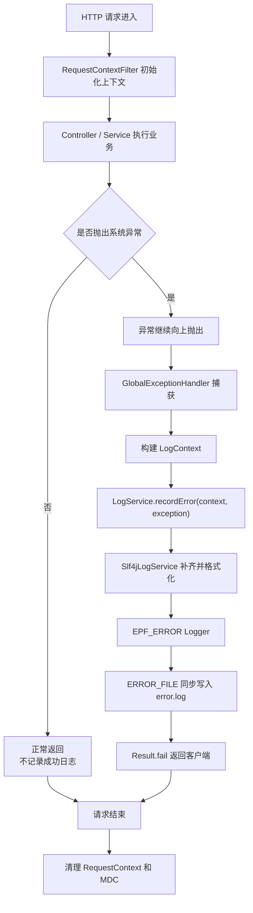
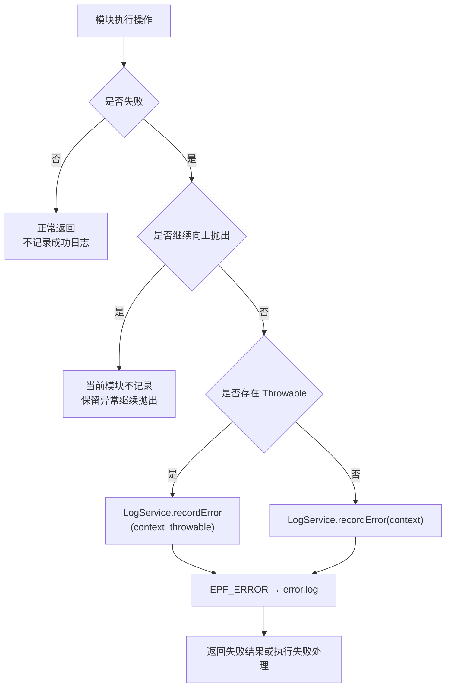
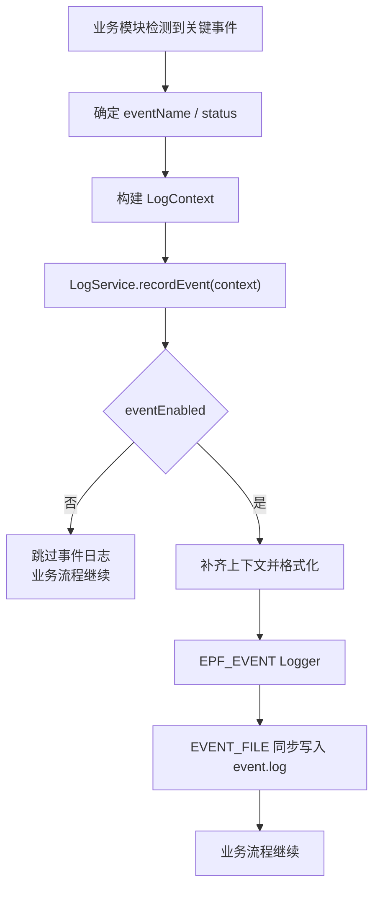
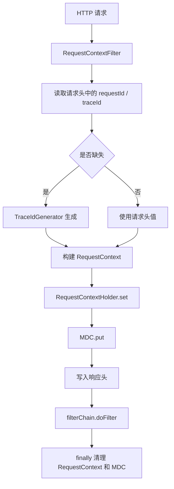
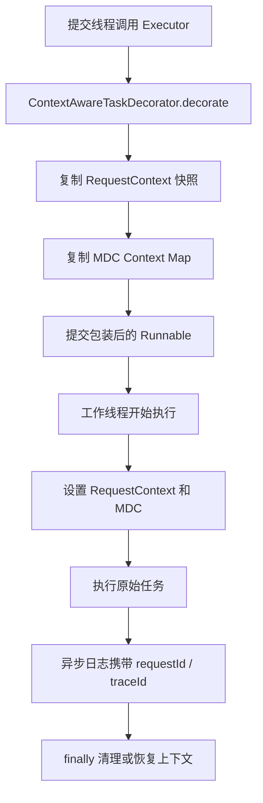
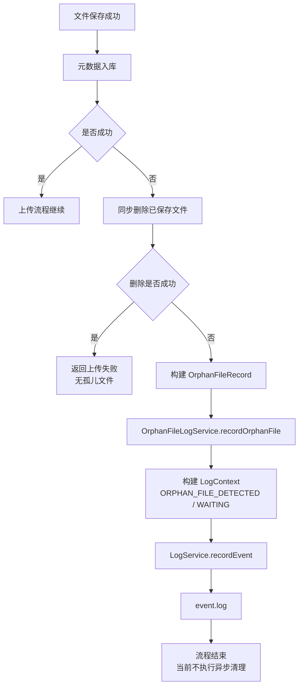

# EveryPicFound 日志记录职责与用例流程说明

## 1. 文档目的

本文档从用例和职责角度说明 EveryPicFound 日志系统在什么场景下被调用、由谁调用、记录什么内容以及日志最终写入哪个通道。

本文档不定义日志模块内部类的具体实现。类、接口、配置和 Logback 结构统一在《EveryPicFound Common 日志模块架构与类设计》中说明。

---

## 2. 日志系统职责边界

系统可观测能力分为指标和日志两部分。

### 2.1 指标系统职责

以下内容由 `MetricRecorder → Micrometer → Prometheus` 记录：

- 请求次数；
- 请求耗时和阶段耗时；
- 成功率、错误率；
- Redis 缓存命中率；
- 搜索结果数量；
- Model、Qdrant、MySQL 调用耗时；
- 线程池、连接池和 JVM 状态。

指标不逐条写入业务日志文件。

### 2.2 日志系统职责

以下内容由 `LogService → SLF4J → Logback` 记录：

- 系统错误及完整异常堆栈；
- 未捕获异常；
- 外部依赖错误；
- 任务拒绝或任务发布失败；
- 重试、降级和关键状态变化；
- 孤儿文件等待后续补偿的事件；
- 已被业务流程接管、但仍需要后续追踪的异常状态。

普通成功事件不记录业务日志。

---

## 3. 日志通道

| 日志通道 | 输出文件 | 记录内容 |
|---|---|---|
| 应用日志通道 | `app.log` | Spring Boot、配置加载、连接池、框架 WARN 和少量系统运行日志 |
| 错误日志通道 | `error.log` | 系统错误、未知异常、外部依赖错误、完整 Throwable 堆栈 |
| 事件日志通道 | `event.log` | 业务拒绝、重试、降级、关键状态变化、待补偿事件 |

`error.log` 和 `event.log` 不重复写入 `app.log`。

---

## 4. 参与者

| 参与者 | 类型 | 职责 |
|---|---|---|
| 业务模块 | 调用方 | 在错误被转换为失败结果或关键事件发生时调用日志接口 |
| `GlobalExceptionHandler` | HTTP 异常终点 | 对继续向上抛出的异常统一记录一次 |
| `LogService` | 日志门面接口 | 向业务模块提供错误和事件记录能力 |
| `Slf4jLogService` | 日志实现 | 补齐上下文、格式化日志并选择 Logger |
| `RequestContextFilter` | HTTP 入口组件 | 初始化 requestId、traceId、RequestContext 和 MDC |
| `ContextAwareTaskDecorator` | 异步上下文组件 | 将 RequestContext 和 MDC 快照传入业务线程池 |
| Logback | 日志基础设施 | 根据 Logger 名称将日志同步写入对应文件 |
| Prometheus | 指标系统 | 记录指标，不参与事件和错误日志写入 |

---

## 5. 全局记录规则

### 5.1 同一个错误只记录一次

对于继续向上抛出的异常：

```text
Service / Domain
    → 不记录
    → 继续抛出
    → GlobalExceptionHandler 统一记录
```

对于已经转换成失败结果、不再向上抛出的异常：

```text
当前模块
    → 记录错误或事件
    → 返回 failure / degraded / retrying 结果
```

### 5.2 错误与事件的判断

| 场景 | 记录方式 |
|---|---|
| 存在 Throwable，且属于系统错误 | `recordError(context, throwable)` |
| 没有 Throwable，但存在明确系统失败结果 | `recordError(context)` |
| 业务拒绝、重试、降级、状态变化、待补偿 | `recordEvent(context)` |
| 普通成功结果 | 不记录日志，使用 Prometheus 指标 |
| 异常继续抛到 HTTP 层 | 当前模块不记录，由全局异常处理器记录 |

### 5.3 日志上下文最低要求

错误日志至少包含：

- requestId；
- traceId；
- module；
- operation；
- eventName；
- status；
- errorCode；
- message；
- Throwable（存在时）。

事件日志至少包含：

- requestId；
- traceId；
- module；
- operation；
- eventName；
- status；
- bizId（存在业务对象时）；
- message。

---

# 6. 用例总览

| 用例编号 | 用例名称 | 主要参与者 | 结果 |
|---|---|---|---|
| UC-LOG-01 | 记录 HTTP 链路系统错误 | `GlobalExceptionHandler`、`LogService` | 错误写入 `error.log` |
| UC-LOG-02 | 记录模块内部系统错误 | 业务模块、`LogService` | 错误写入 `error.log` |
| UC-LOG-03 | 记录关键业务事件 | 业务模块、`LogService` | 事件写入 `event.log` |
| UC-LOG-04 | 初始化 HTTP 日志上下文 | `RequestContextFilter` | 当前请求建立 RequestContext 和 MDC |
| UC-LOG-05 | 传播异步任务日志上下文 | `ContextAwareTaskDecorator` | 工作线程继承 requestId 和 traceId |
| UC-LOG-06 | 记录孤儿文件待处理事件 | `OrphanFileLogService`、`LogService` | `ORPHAN_FILE_DETECTED` 写入 `event.log` |

---

# 7. UC-LOG-01：记录 HTTP 链路系统错误

## 7.1 用例目标

当 Controller 或 Service 抛出的系统异常继续传播到 HTTP 层时，由 `GlobalExceptionHandler` 统一记录一次错误日志并返回统一失败响应。

## 7.2 触发条件

出现以下异常之一：

- `SystemException`；
- 未知 `Exception`；
- 其他未被业务模块转换成失败结果的系统异常。

## 7.3 前置条件

- `RequestContextFilter` 已初始化 requestId 和 traceId；
- `LogService` 可用；
- `EPF_ERROR` Logger 已绑定 `ERROR_FILE`。

## 7.4 主流程

1. HTTP 请求进入系统。
2. `RequestContextFilter` 初始化 RequestContext 和 MDC。
3. Controller 或 Service 执行业务。
4. 业务代码抛出 `SystemException` 或未知异常。
5. 中间 Service 不记录日志，继续抛出异常。
6. `GlobalExceptionHandler` 捕获异常。
7. 异常处理器构建 `LogContext`。
8. 调用 `LogService.recordError(context, exception)`。
9. `Slf4jLogService` 补齐上下文并格式化日志。
10. 使用 `EPF_ERROR` Logger 输出错误和完整堆栈。
11. Logback 同步写入 `error.log`。
12. 异常处理器返回统一 `Result.fail`。
13. 请求结束后清理 RequestContext 和 MDC。

## 7.5 异常与替代流程

- `LogContext` 中某些字段为空时，由 `Slf4jLogService` 从 `RequestContextHolder` 补齐。
- RequestContext 不存在时，日志仍应写入，但缺失字段使用空值或 `unknown`。
- 日志记录失败不能改变原始异常响应结果。

## 7.6 后置条件

- `error.log` 中存在一条包含 Throwable 堆栈的错误记录；
- 同一异常没有在 Service 和全局异常处理器中重复记录；
- 前端收到统一失败响应。

## 7.7 流程图



---

# 8. UC-LOG-02：记录模块内部系统错误

## 8.1 用例目标

当模块捕获异常并将其转换为失败结果、不再继续向上抛出时，由当前模块记录错误，避免异常丢失。

## 8.2 典型场景

- Qdrant 调用失败后返回 `VectorOperationResult.success=false`；
- 模型服务异常被转换为向量化失败结果；
- 线程池提交任务失败后返回发布失败结果；
- 文件操作失败后转换为统一失败结果。

## 8.3 主流程

1. 模块执行外部依赖或内部操作。
2. 操作发生异常或返回明确失败结果。
3. 模块决定不再继续抛出异常。
4. 模块构建 `LogContext`。
5. 有 Throwable 时调用 `recordError(context, throwable)`。
6. 无 Throwable 但属于明确系统失败时调用 `recordError(context)`。
7. 日志同步写入 `error.log`。
8. 模块返回失败结果或进入后续失败处理流程。

## 8.4 约束

- 已经继续抛出的异常不能在当前模块再次记录。
- 失败结果包含的 errorCode 应写入 `LogContext.errorCode`。
- 不允许为了生成堆栈而创建伪异常对象。

## 8.5 流程图



---

# 9. UC-LOG-03：记录关键业务事件

## 9.1 用例目标

记录已经被业务流程接管、但仍需要追踪的状态变化、重试、降级和待补偿事件。

## 9.2 典型事件

- 业务参数拒绝；
- 向量化进入重试；
- 向量化最终失败；
- 文件缺失导致图片失效；
- Redis 异常后降级回源；
- 任务发布失败并保留 PENDING 状态；
- 孤儿文件等待后续处理。

## 9.3 主流程

1. 业务模块检测到关键事件。
2. 模块确定 `eventName` 和 `status`。
3. 构建 `LogContext`。
4. 调用 `LogService.recordEvent(context)`。
5. `Slf4jLogService` 检查事件日志开关。
6. 补齐 RequestContext 字段并格式化。
7. 使用 `EPF_EVENT` Logger 输出。
8. Logback 同步写入 `event.log`。
9. 原业务流程继续执行，不等待任何事件消费者。

## 9.4 后置条件

- `event.log` 中存在对应事件；
- 事件写入不改变原业务结果；
- 当前阶段不读取或消费 `event.log`。

## 9.5 流程图



---

# 10. UC-LOG-04：初始化 HTTP 日志上下文

## 10.1 用例目标

为每个 HTTP 请求初始化 requestId、traceId、RequestContext 和 MDC，保证后续日志可以关联到同一请求。

## 10.2 主流程

1. HTTP 请求进入 `RequestContextFilter`。
2. 从请求头读取 `X-Request-Id` 和 `X-Trace-Id`。
3. 缺失时调用 `TraceIdGenerator` 生成。
4. 构建 `RequestContext`。
5. 写入 `RequestContextHolder`。
6. 将 requestId 和 traceId 写入 MDC。
7. 将两个 ID 写入响应头。
8. 放行请求。
9. 请求结束后在 finally 中清理 RequestContext 和 MDC。

## 10.3 流程图



---

# 11. UC-LOG-05：传播异步任务日志上下文

## 11.1 用例目标

在线程池执行异步任务时，将提交线程中的 RequestContext 和 MDC 快照复制到工作线程，使异步日志仍携带原请求的 requestId 和 traceId。

## 11.2 主流程

1. 请求线程提交异步任务。
2. `ContextAwareTaskDecorator.decorate` 在提交线程读取上下文。
3. 复制 RequestContext 字段形成快照。
4. 复制 MDC Context Map。
5. 返回包装后的 Runnable。
6. 工作线程执行包装任务。
7. 设置 RequestContext 快照和 MDC 快照。
8. 执行原始业务任务。
9. 任务中的日志正常携带 requestId 和 traceId。
10. finally 中清理或恢复工作线程上下文。

## 11.3 约束

- 不能在线程之间共享同一个可变 RequestContext 对象。
- 无论任务成功还是失败，都必须清理线程上下文。
- 业务线程池上下文传播与 Logback AsyncAppender 是两个独立机制。

## 11.4 流程图



---

# 12. UC-LOG-06：记录孤儿文件待处理事件

## 12.1 用例目标

当图片文件保存成功、元数据入库失败，并且补偿删除文件也失败时，将孤儿文件记录为待处理事件。

## 12.2 主流程

1. 图片文件保存成功。
2. 图片元数据写入 MySQL 失败。
3. 系统尝试同步删除已保存文件。
4. 删除失败。
5. 构建 `OrphanFileRecord`。
6. `OrphanFileLogService` 将记录转换为 `LogContext`。
7. 设置：
   - `eventName=ORPHAN_FILE_DETECTED`；
   - `status=WAITING`；
   - `bizId=imageId`。
8. 调用 `LogService.recordEvent(context)`。
9. 事件同步写入 `event.log`。
10. 当前流程结束，不执行 MQ 发布或异步清理。

## 12.3 后续扩展

未来可以在记录事件后增加：

```text
发布 OrphanFileCleanupMessage
    → MQ
    → OrphanFileCleanupConsumer
    → 异步清理
```

该扩展不属于本轮日志模块开发范围。

## 12.4 流程图



---

# 13. 用例涉及的接口与数据

| 类 / 接口 | 函数 / 字段 | 用途 |
|---|---|---|
| `LogService` | `recordError(LogContext, Throwable)` | 记录带堆栈的系统错误 |
| `LogService` | `recordError(LogContext)` | 记录无 Throwable 的明确系统失败 |
| `LogService` | `recordEvent(LogContext)` | 记录关键业务事件 |
| `LogContext` | requestId、traceId、bizId、module、operation、eventName、status、errorCode、message | 日志上下文 |
| `RequestContextFilter` | `doFilterInternal` | 初始化 HTTP 请求上下文 |
| `ContextAwareTaskDecorator` | `decorate` | 传播异步线程上下文 |
| `GlobalExceptionHandler` | 三类异常处理函数 | HTTP 链路错误记录终点 |
| `OrphanFileLogService` | `recordOrphanFile` | 记录孤儿文件待处理事件 |

---

# 14. 用例验收标准

1. `SystemException` 能在 `error.log` 中看到完整堆栈。
2. 未知异常包含 requestId 和 traceId。
3. `BizException` 不默认进入 `error.log`。
4. 同一 HTTP 异常只记录一次。
5. 已转换为失败结果的系统错误不会丢失。
6. 普通成功请求不产生日志。
7. 关键事件写入 `event.log`。
8. 孤儿文件仅记录为 `WAITING` 事件。
9. 当前不读取、不消费 `event.log`。
10. 异步任务日志能够继承 requestId 和 traceId。
11. 指标数据不进入日志文件。
12. 日志写入失败不改变原业务响应。
