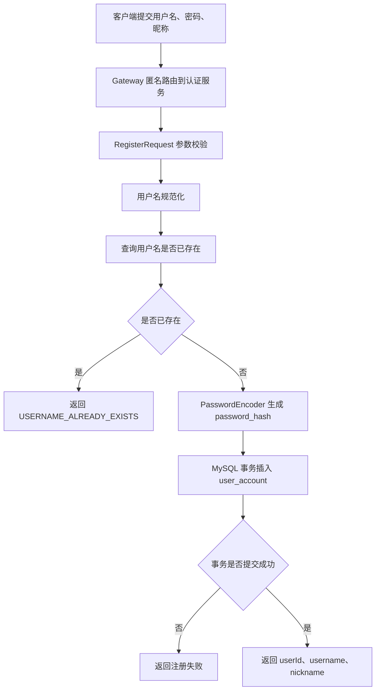
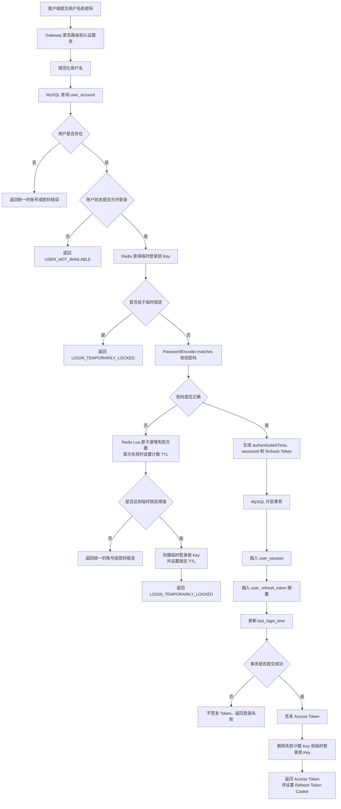
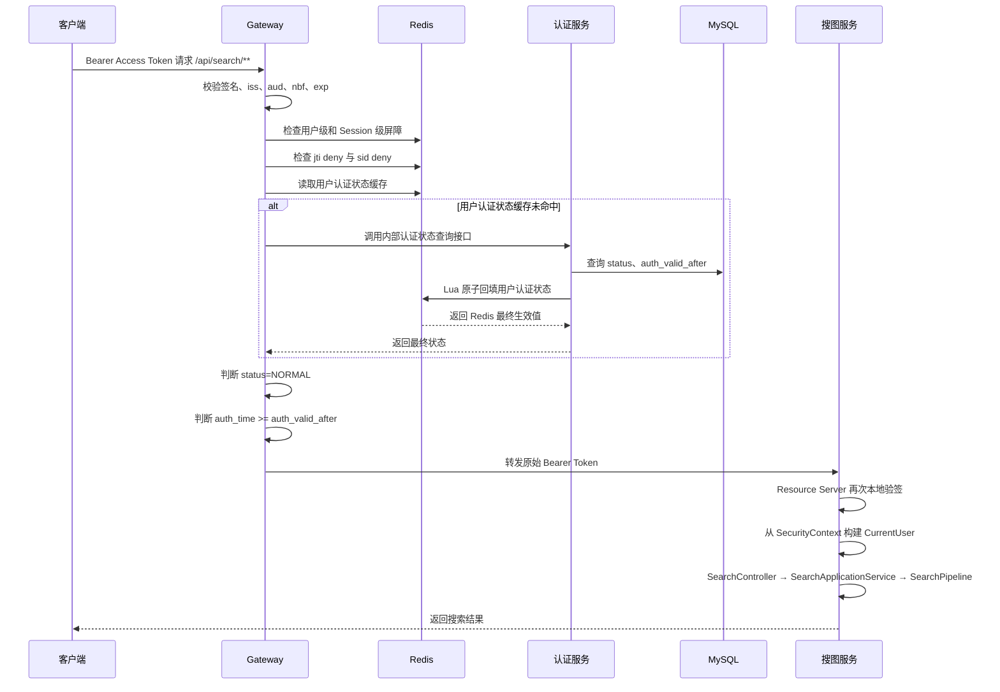
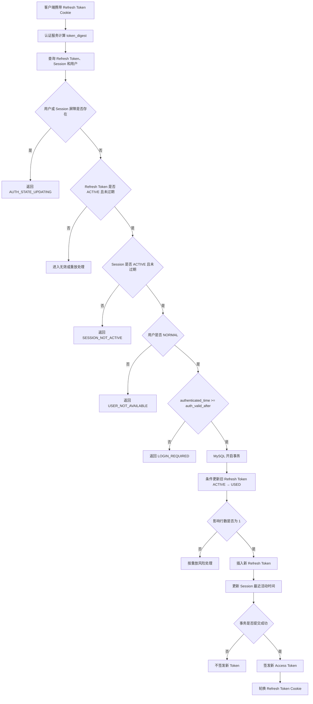
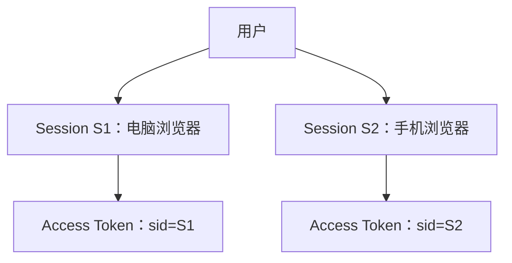
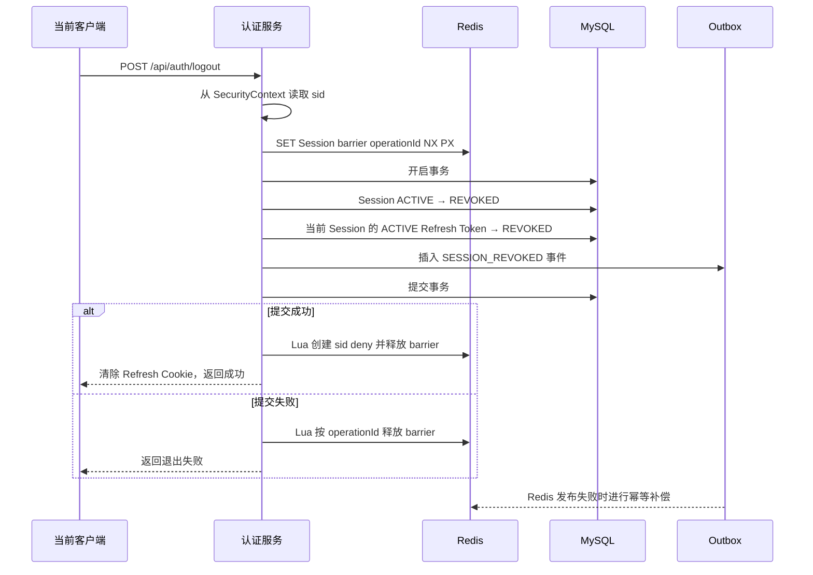
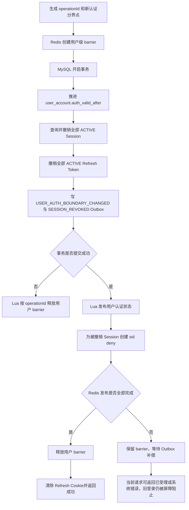
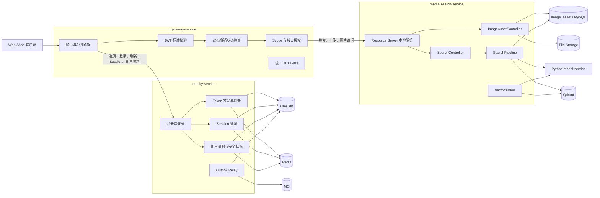

#  EveryPicFound 用户与认证模块设计

## 文档目的

本文档定义 EveryPicFound 用户与认证模块的业务用例、数据流通路径、系统架构、模块分层及后续扩展方式，用于指导接口设计、数据库建模和编码实现。

认证方案采用以下核心模型：

- 短期 JWT Access Token 承载用户身份和访问范围；
- 持久化 Session 区分不同客户端登录；
- Refresh Token 轮换维持长期登录状态；
- `auth_valid_after` 与 JWT `auth_time` 判断用户级登录是否仍然有效；
- MySQL 保存账户、Session、Refresh Token 和事件等权威状态；
- Redis 保存高频认证状态、撤销标识、登录保护计数和短期变更屏障；
- Outbox 保证 MySQL 已提交的关键认证变更最终可靠传播到 Redis 和其他服务。

本文中的 Session 是认证服务维护的应用登录会话，不是 Servlet `HttpSession`。

---

# 1. 用户与认证用例设计

## 1.1 用例与接口总览

| 用例 | 对外接口 | 是否需要 Access Token | 主要写入位置 |
|---|---|---:|---|
| 用户注册 | `POST /api/auth/register` | 否 | MySQL |
| 用户登录 | `POST /api/auth/login` | 否 | MySQL、Redis |
| Token 刷新 | `POST /api/auth/refresh` | 否，使用 Refresh Cookie | MySQL |
| 退出当前设备 | `POST /api/auth/logout` | 是 | MySQL、Redis、Outbox |
| 查询登录设备 | `GET /api/auth/sessions` | 是 | 只读 MySQL |
| 指定设备下线 | `DELETE /api/auth/sessions/{sessionId}` | 是 | MySQL、Redis、Outbox |
| 退出全部设备 | `POST /api/auth/logout-all` | 是 | MySQL、Redis、Outbox |
| 查询当前用户 | `GET /api/users/me` | 是 | 只读 MySQL，可使用 Redis 缓存 |
| 修改基础资料 | `PATCH /api/users/me/profile` | 是 | MySQL、Redis、Outbox |
| 修改密码 | `POST /api/users/me/password` | 是 | MySQL、Redis、Outbox |
| 注销账号 | `DELETE /api/users/me` | 是 | MySQL、Redis、Outbox |
| 管理员禁用或启用用户 | 管理端内部接口 | 是，需管理权限 | MySQL、Redis、Outbox |
| 访问搜图与图片接口 | `/api/search/**`、`/api/images/**` | 是 | 认证过程通常只读 Redis |

公开接口由 Gateway 直接路由到认证服务；受保护接口先经过 Gateway 认证链路，再进入认证服务或搜图服务。

---

## 1.2 用户注册

### 1.2.1 用例目标

创建新的用户账户，但不自动创建登录 Session。注册成功后，客户端进入登录流程。

### 1.2.2 主流程



### 1.2.3 MySQL 数据变化

新增 `user_account`：

```text
username          = 规范化后的用户名
password_hash     = 自适应单向哈希结果
nickname          = 用户昵称
status            = NORMAL
auth_valid_after  = 系统初始时间
last_login_time   = NULL
version           = 0
```

用户名重复检查分为两层：

1. 应用层预查询用于尽早返回友好错误；
2. `username` 唯一索引承担并发条件下的最终正确性。

并发注册相同用户名时，应用层捕获 `DuplicateKeyException` 并转换为统一业务错误。

### 1.2.4 Redis 数据变化

注册不创建 Session、Refresh Token 或认证状态缓存，Redis 无强制写入。

### 1.2.5 一致性处理

注册核心数据只写 MySQL，不需要 Redis 锁。通过`unique key`即可实现唯一用户名

需要向其他服务传播用户创建事件时，在插入账户的同一事务中写入 `outbox_event`，事务提交后再由 Relay 发布消息。

---

## 1.3 用户登录

### 1.3.1 用例目标

校验用户名和密码，创建新的应用 Session，签发 Access Token 与 Refresh Token，并建立该客户端的登录状态。

每次成功登录均创建新的 `sessionId`。同一用户在不同浏览器、不同设备或清除 Cookie 后重新登录，需要创建新session。

### 1.3.2 登录主流程



### 1.3.3 登录成功时的 MySQL 变化

新增 `user_session`：

```text
session_id            = 新生成的唯一标识
user_id               = 当前用户
status                = ACTIVE
authenticated_time    = 本次密码校验成功时间
absolute_expires_time = Session 绝对过期时间
client_type           = WEB / MOBILE
device_info            = 浏览器与系统信息
login_ip               = 登录 IP
last_active_time       = 当前时间
```

新增 `user_refresh_token`：

```text
token_id       = Refresh Token 唯一标识
session_id     = 当前 sessionId
token_digest   = Refresh Token 摘要
status         = ACTIVE
issued_time    = 当前时间
expires_time   = Refresh Token 过期时间
```

更新 `user_account.last_login_time`。

`user_session`、`user_refresh_token` 和 `last_login_time` 必须在同一个 MySQL 事务中提交。事务失败时不得签发或返回任何 Token。

### 1.3.4 Access Token 关键声明

```text
sub       = userId
sid       = sessionId
jti       = 当前 Access Token 唯一标识
auth_time = user_session.authenticated_time
iat       = 当前签发时间
nbf       = iat，或省略
exp       = iat + Access Token TTL
scope     = 当前用户允许访问的能力范围
```

刷新 Access Token 时只更新 `iat`、`nbf`、`exp` 和 `jti`，`auth_time` 始终保持为该 Session 真正完成身份认证的时间。

### 1.3.5 登录失败时的 Redis 变化

Redis Key：

```text
auth:login:{usernameHash}:failure
auth:login:{usernameHash}:lock //限制用户登录
```

失败计数使用 Lua 原子完成：

```text
INCR failure
首次失败时设置 failure TTL
达到阈值时创建 lock Key 并设置锁定 TTL
```

这样可以避免计数增加成功但 TTL 设置失败，导致失败计数永久存在。

用户不存在和密码错误返回相同的外部错误信息，避免通过接口判断用户名是否已经注册。

### 1.3.6 登录成功后的 Redis 处理

登录事务提交成功后删除失败计数和临时锁定 Key。删除失败不回滚已创建的 Session，因为这些 Key 本身具有短 TTL；实现层应记录指标并进行有限重试。

普通登录不推进 `auth_valid_after`，也不创建 Session 撤销或 Access Token 撤销标识。

---

## 1.4 受保护接口访问

### 1.4.1 用例目标

对搜索、图片上传、用户资料和 Session 管理等接口统一完成身份认证，再把可信身份传递给目标业务服务。

### 1.4.2 完整访问流程



### 1.4.3 Gateway 校验顺序

Gateway 按以下顺序处理，前一步失败后立即终止：

1. Access Token 是否存在；
2. JWT 签名是否合法；
3. `iss`、`aud`、`nbf`、`exp` 是否有效；
4. 用户级或 Session 级变更屏障是否存在；
5. 当前 `jti` 是否被撤销；
6. 当前 `sid` 是否被撤销；
7. 用户状态是否为 `NORMAL`；
8. Token 的 `auth_time` 是否不早于 `auth_valid_after`；
9. 当前 Token 的 Scope 是否允许访问目标接口。

主要失败结果：

| 条件 | 返回结果 |
|---|---|
| 未携带 Token | `401 ACCESS_TOKEN_MISSING` |
| 签名或声明非法 | `401 ACCESS_TOKEN_INVALID` |
| Token 尚未生效 | `401 TOKEN_NOT_ACTIVE` |
| Token 已过期 | `401 ACCESS_TOKEN_EXPIRED` |
| 用户或 Session 正在变更 | `503 AUTH_STATE_UPDATING` |
| `jti` 被撤销 | `401 ACCESS_TOKEN_REVOKED` |
| `sid` 被撤销 | `401 SESSION_REVOKED` |
| 用户状态异常 | `401 USER_NOT_AVAILABLE` |
| `auth_time` 早于分界点 | `401 LOGIN_REQUIRED` |
| 权限范围不足 | `403 ACCESS_DENIED` |

### 1.4.4 Redis 查询

```text
auth:user:{userId}:barrier
auth:session:{sessionId}:barrier
auth:access:{issuerHash}:{jti}:deny
auth:session:{sessionId}:deny
auth:user:{userId}:state
```

`sid deny` 撤销整个 Session，适用于退出当前设备、指定设备下线和 Refresh Token 重放。

`jti deny` 只撤销某一张 Access Token，适用于保留 Session 但单独作废某个 Token 的特殊场景。退出整个 Session 时无需枚举该 Session 曾经签发的全部 `jti`。

- 注意浏览器会在Access Token有效期结束一段时间之前申请新的Access Token以防止在访问业务的过程中返回`401`

### 1.4.5 缓存未命中与并发回填

用户状态缓存未命中时，认证服务从 MySQL 查询：

```text
user_account.status
user_account.auth_valid_after
```

查询结果不能直接覆盖 Redis，而应通过用户认证状态 Lua 脚本写入。脚本只允许 `auth_valid_after` 向前推进，并返回 Redis 中最终生效的状态。

调用方必须使用脚本返回结果继续判断，避免缓存查询期间另一个请求已经发布更新状态，随后又被旧查询结果覆盖。

### 1.4.6 业务服务的二次校验

搜图服务不能只信任客户端或 Gateway 附加的 `X-User-Id`。Gateway 转发原始 Bearer Token，搜图服务使用 Spring Security Resource Server 本地验证签名和标准时间声明，并从 `SecurityContext` 获取 `userId`、`sessionId` 和 Scope。

Gateway 负责动态撤销状态检查；业务服务负责防止请求绕过 Gateway 后伪造身份。搜图服务只在内部网络开放，并通过网络策略禁止客户端直接访问。

### 1.4.7 数据变化

正常业务访问不修改认证 MySQL 数据。Session 最近活动时间不应在每次请求中同步更新，可采用以下任一方式降低写放大：

- 仅在 Token 刷新时更新；
- Redis 聚合最近活动时间，定时批量回写；
- 按最小更新时间间隔进行采样更新。

---

## 1.5 Access Token 自然过期与 Token 刷新

### 1.5.1 Access Token 自然过期

当当前时间达到 `exp`：

```text
Gateway 返回 401 ACCESS_TOKEN_EXPIRED
客户端调用 POST /api/auth/refresh
```

Access Token 自然过期不需要修改 MySQL 或 Redis。与该 Token 关联的短期撤销 Key 到期后由 Redis 自动清理。

### 1.5.2 Token 刷新主流程



刷新条件：

```text
Refresh Token.status = ACTIVE
Refresh Token.expires_time > 当前时间
Session.status = ACTIVE
Session.absolute_expires_time > 当前时间
User.status = NORMAL
Session.authenticated_time >= User.auth_valid_after
用户和 Session 不存在变更屏障
```

### 1.5.3 并发刷新控制

Refresh Token 轮换以 MySQL 为权威状态，使用条件更新保证一个旧 Token 只能成功使用一次：

```sql
UPDATE user_refresh_token
SET status = 'USED',
    used_time = NOW(3),
    updated_time = NOW(3)
WHERE token_digest = ?
  AND status = 'ACTIVE'
  AND expires_time > NOW(3);
```

影响行数必须为 `1`。更新旧 Token、插入新 Token 和更新 Session 必须处于同一事务。

Redis Lua 不参与替代该数据库事务，因为 Refresh Token 的轮换关系、审计状态和并发正确性均由 MySQL 持久状态决定。

---

## 1.6 Refresh Token 重放处理

### 1.6.1 触发条件

客户端提交的 Refresh Token 已处于 `USED` 状态，或并发条件更新失败后确认同一 Token 已经被使用。

### 1.6.2 处理流程

```text
识别可能的 Refresh Token 重放
  ↓
生成 operationId
  ↓
创建 Session 变更屏障
  ↓
MySQL 事务：
  Session → COMPROMISED
  该Session当前 Tokens → REVOKED
  写入 SESSION_COMPROMISED Outbox
  ↓
事务提交后执行 Lua：
  创建 sid deny
  仅在 operationId 匹配时释放 Session 屏障
  ↓
清除 Refresh Cookie
  ↓
返回 LOGIN_REQUIRED
```

该操作只撤销对应 Session，不影响同一用户的其他设备，也不推进用户级 `auth_valid_after`。

如果提交后 Redis 更新失败，Session 屏障继续存在并阻止旧 Token 访问；Outbox 消费者随后重复执行同一个幂等 Lua 脚本。

---

## 1.7 多设备登录与 Session 查询

### 1.7.1 多设备模型



普通多设备登录不会改变已有 Session，也不会推进用户级认证分界点。

### 1.7.2 查询登录设备

`GET /api/auth/sessions` 根据当前 `userId` 查询该用户未过期的 Session，返回：

```text
sessionId
clientType
deviceInfo
loginIp
authenticatedTime
lastActiveTime
status
currentSession
```

返回结果不得包含 Refresh Token 摘要、完整 User-Agent 原文或其他不必要的敏感字段。

---

## 1.8 退出当前设备

### 1.8.1 用例目标

撤销当前 `sessionId` 下的所有 Refresh Token 和尚未过期的 Access Token，同时保留其他设备的登录状态。

### 1.8.2 完整流程



### 1.8.3 MySQL 数据变化

`user_session`：

```text
status        = REVOKED
revoked_time  = 当前时间
revoke_reason = USER_LOGOUT
version       = version + 1
```

当前 Session 下所有 `ACTIVE` Refresh Token 更新为 `REVOKED`。

同一事务插入 `SESSION_REVOKED` Outbox 事件。

### 1.8.4 Redis 数据变化

事务前：

```text
SET auth:session:{sessionId}:barrier operationId NX PX 30000
```

事务提交后使用 Lua 原子执行：

```text
创建 auth:session:{sessionId}:deny
TTL = Access Token 最大剩余有效期 + clockSkew
仅在 barrier 的 operationId 匹配时删除 barrier
```

退出当前设备不修改 `auth_valid_after`。其他 Session 继续有效。

---

## 1.9 指定设备下线

用户可以在 Session 列表中撤销另一个设备的登录。

**该功能属于扩展性功能，与1.10退出所有设备都先不实现**

流程：

```text
从当前 Token 获取 userId
  ↓
查询目标 Session 并校验 session.user_id = 当前 userId
  ↓
拒绝操作不存在或不属于当前用户的 Session
  ↓
创建目标 Session 屏障
  ↓
MySQL 事务撤销目标 Session、Refresh Token并写 Outbox
  ↓
提交后 Lua 创建目标 sid deny 并释放屏障
```

所有权校验必须由数据库查询结果完成，不能信任客户端提交的 `userId`。

如果目标 Session 已经是 `REVOKED`、`EXPIRED` 或 `COMPROMISED`，接口按幂等语义返回成功，不重复扩大影响范围。

---

## 1.10 退出全部设备

### 1.10.1 用例目标

使当前用户已有的全部登录状态失效，随后必须重新输入密码登录。

**该功能属于扩展性功能，先不实现**

### 1.10.2 完整流程



### 1.10.3 MySQL 数据变化

`user_account`：

```text
auth_valid_after = 新认证分界点
version           = version + 1
```

该用户所有 `ACTIVE` Session 更新为 `REVOKED`，所有 `ACTIVE` Refresh Token 更新为 `REVOKED`。

业务更新和 Outbox 事件处于同一事务。

### 1.10.4 Redis 数据变化

```text
auth:user:{userId}:state
  status         = NORMAL
  authValidAfter = 新认证分界点

auth:session:{sessionId}:deny
  为本次撤销的 Session 分别创建
```

用户级状态通过 Lua 只允许 `authValidAfter` 向前推进。旧 Token 满足：

```text
Token.auth_time < user.auth_valid_after
```

因此被 Gateway 拒绝。新登录会生成更晚的 `auth_time` 和新的 `sessionId`，不会受到旧 Session 撤销事件影响。

---

## 1.11 查询与修改当前用户资料

### 1.11.1 查询当前用户

`GET /api/users/me` 从 `SecurityContext` 获取 `userId`，再查询用户资料。

查询顺序：

```text
读取 user:profile:{userId} 缓存
  ↓ 未命中
查询 MySQL user_account / user_profile
  ↓
回填短 TTL 缓存
  ↓
返回资料
```

用户资料缓存与认证状态缓存使用不同 Key，避免昵称或头像更新影响认证链路。

### 1.11.2 修改基础资料

普通资料包括昵称、头像等非安全字段。用户名、密码、账户状态使用独立接口。

```text
校验请求字段
  ↓
MySQL 事务更新资料
  ↓
事务提交成功
  ↓
删除 user:profile:{userId} 缓存
  ↓
返回最新资料
```

一致性采用 Cache Aside：先提交 MySQL，再删除缓存。原因是 MySQL 是权威数据源，先删缓存再更新数据库可能导致并发请求把旧数据库值重新写回缓存。

如果缓存删除失败：

- 同一事务写入 `USER_PROFILE_CHANGED` Outbox；
- 消费者幂等删除资料缓存；
- 缓存自身设置有限 TTL 作为最终兜底。

普通资料更新不推进 `auth_valid_after`，也不撤销 Session。

---

## 1.12 修改密码

### 1.12.1 用例目标

更新密码并立即使全部已有登录失效。

### 1.12.2 流程

```text
从 SecurityContext 获取 userId
  ↓
查询用户并校验旧密码
  ↓
校验新密码策略，生成新 password_hash
  ↓
生成 operationId 和新认证分界点
  ↓
创建用户级 barrier
  ↓
MySQL 事务：
  更新 password_hash
  推进 auth_valid_after
  撤销全部 Session
  撤销全部 Refresh Token
  写 Outbox
  ↓
提交后 Lua 发布用户状态和各 Session deny
  ↓
释放 barrier
  ↓
清除 Refresh Cookie并要求重新登录
```

旧密码不正确时不创建屏障、不修改数据库。新密码与旧密码相同、复杂度不满足要求或密码哈希失败时直接返回业务错误。

Redis 发布失败时保留用户屏障，Outbox 消费者完成状态发布后再安全释放。该流程不能退化为只更新数据库后异步删除缓存，否则数据库已修改而旧 Token 仍可能在补偿完成前继续访问。

---

## 1.13 管理员禁用与重新启用用户

### 1.13.1 禁用用户

```text
鉴权并校验管理员权限
  ↓
创建用户级 barrier
  ↓
MySQL 事务：
  status = DISABLED
  推进 auth_valid_after
  撤销全部 Session 和 Refresh Token
  写 Outbox
  ↓
Lua 发布 DISABLED 状态和 Session deny
  ↓
释放 barrier
```

Gateway 读取到 `status != NORMAL` 后拒绝登录、刷新和受保护接口访问。

### 1.13.2 重新启用用户

```text
创建用户级 barrier
  ↓
MySQL 事务：
  status = NORMAL
  再次推进 auth_valid_after
  写 Outbox
  ↓
Lua 发布 NORMAL 和更晚的 authValidAfter
  ↓
释放 barrier
```

重新启用不会恢复旧 Session，用户必须重新登录。

因为每次认证有效性变化都会推进 `auth_valid_after`，延迟到达的旧禁用事件无法覆盖更晚的启用状态。

---

## 1.14 注销账号

账号注销采用逻辑删除，不直接物理删除账户主记录。

```text
重新验证密码
  ↓
检查是否存在未完成的订单或其他注销阻断条件
  ↓
创建用户级 barrier
  ↓
MySQL 事务：
  status = DELETED
  推进 auth_valid_after
  撤销全部 Session 和 Refresh Token
  写 USER_DELETED Outbox
  ↓
Lua 发布 DELETED 状态和 Session deny
  ↓
释放 barrier
  ↓
清除客户端凭证
```

认证服务只负责账户与认证数据。图片、评论、点赞、订单等其他领域的数据，由对应服务消费 `USER_DELETED` 事件后按照各自的数据生命周期处理，认证服务不跨库直接删除其他服务数据。

---

## 1.15 关键一致性编排总结

| 业务场景 | MySQL | Redis | 一致性策略 |
|---|---|---|---|
| 注册 | 插入账户 | 无强制更新 | 单库事务 |
| 登录成功 | 新增 Session、Refresh Token | 清除失败计数 | MySQL 先提交，Redis 清理失败依靠 TTL |
| 登录失败 | 无 | 原子递增失败计数 | Redis Lua |
| Token 刷新 | 轮换 Refresh Token | 通常不写 | MySQL 条件更新与事务 |
| 资料修改 | 更新资料并写 Outbox | 删除资料缓存 | MySQL 提交后删缓存，Outbox 补偿 |
| 退出当前设备 | 撤销 Session 与 Refresh Token并写 Outbox | Session barrier、sid deny | 屏障 + MySQL 事务 + 提交 Lua |
| 退出全部设备 | 推进认证分界点、撤销全部 Session并写 Outbox | 用户 barrier、状态缓存、sid deny | 屏障 + MySQL 事务 + 提交 Lua |
| 修改密码、禁用、注销 | 更新用户安全状态、撤销全部 Session并写 Outbox | 用户 barrier、状态缓存、sid deny | 屏障 + MySQL 事务 + 提交 Lua |
| Redis 发布失败 | MySQL 已提交且 Outbox 存在 | 屏障暂时保留 | Outbox 重试幂等 Lua |
| MySQL 事务失败 | 全部回滚 | 释放本次屏障 | operationId 安全释放 Lua |

关键认证变更中，屏障承担短时间的 Fail Closed：数据库状态变更过程中暂时拒绝相关请求，防止旧 Token 在 MySQL 已提交而 Redis 尚未同步的窗口继续访问。

- 因为撤销登录可以通过添加`sid`黑名单实现，`jti`目前偏预留性质，也可以在撤销登录的时候同时设置`jti deny & sid deny`

---

# 2. 系统与模块架构设计

## 2.1 系统整体架构

EveryPicFound 的用户认证能力分为 Gateway、认证服务和资源服务三部分。现有 Java 搜图后端作为资源服务，继续承载图片上传、向量化和搜索链路。



### 2.1.1 服务职责

| 服务 | 核心职责 |
|---|---|
| `gateway-service` | 外部统一入口、JWT 标准校验、Redis 动态撤销检查、路由和接口授权 |
| `identity-service` | 用户账户、密码、Session、Refresh Token、Access Token 签发、认证状态与 Outbox |
| `media-search-service` | 图片资产、向量化、搜图和图片访问，作为 OAuth2 Resource Server 再次本地验签 |
| `model-service` | 图片与文本向量化，不感知用户认证规则 |

只有 Gateway 对公网开放。认证服务、搜图服务、模型服务和数据库均部署在内部网络。

### 2.1.2 与当前 Java 后端的衔接

现有 Java 后端入口继续作为搜图服务入口，沿用以下组织方式：

```text
com.everypicfound
├─ common
├─ imageasset
├─ modelclient
├─ search
├─ storage
├─ vectorindex
└─ vectorization
```

现有 Controller 已按 `interfaces → application → domain → infrastructure` 的职责组织，用户与认证模块继续采用相同分层规范。

搜图服务的 `/api/search/**` 和 `/api/images/**` 路径保持稳定，Gateway 只负责在外部增加认证和路由，不修改 `SearchController → SearchApplicationService → SearchPipeline` 的核心调用关系。

---

## 2.2 Gateway 安全架构

Gateway 使用 Spring Cloud Gateway 与 Spring Security Resource Server，采用响应式安全链路。

### 2.2.1 核心组件

| 组件 | 职责 |
|---|---|
| `SecurityWebFilterChain` | 配置匿名接口、受保护接口和管理接口 |
| `ReactiveJwtDecoder` | 验证签名、`iss`、`aud`、`nbf`、`exp` |
| `JwtAuthenticationConverter` | 将 `sub`、`sid`、`scope` 转换为认证主体和权限 |
| `AuthChangeBarrierChecker` | 检查用户级与 Session 级屏障 |
| `TokenRevocationChecker` | 检查 `jti deny` 和 `sid deny` |
| `UserAuthStateChecker` | 获取用户状态并比较 `auth_time` 与 `auth_valid_after` |
| `RouteAuthorizationManager` | 判断 Scope 是否满足目标路由要求 |
| `GatewayAuthenticationEntryPoint` | 输出统一 401 响应 |
| `GatewayAccessDeniedHandler` | 输出统一 403 响应 |

### 2.2.2 路由分类

公开路由：

```text
POST /api/auth/register
POST /api/auth/login
POST /api/auth/refresh
GET  /actuator/health
```

受保护路由：

```text
/api/auth/logout
/api/auth/logout-all
/api/auth/sessions/**
/api/users/me/**
/api/search/**
/api/images/**
```

管理路由除有效身份外还必须包含管理权限，例如 `ROLE_ADMIN` 或对应 Scope。

### 2.2.3 Redis 故障策略

EveryPicFound 默认对所有受保护路由采用 Fail Closed。Redis 不可用时无法确认屏障、Session 撤销和用户认证分界点，Gateway 返回认证依赖不可用，不仅依赖 JWT 签名结果继续放行。

选择该策略的原因是当前系统规模较小，优先保证退出、禁用和修改密码能够立即生效，避免为了有限的可用性提升引入安全语义不一致。后续可根据接口风险对公开图片读取等低风险能力单独配置降级策略。

---

## 2.3 认证服务分层架构

认证服务采用模块化分层结构：

```text
interfaces
application
domain
infrastructure
```

| 分层 | 职责 | 允许依赖 |
|---|---|---|
| `interfaces` | 接收 HTTP 请求、参数校验、DTO 与 Command 转换、统一响应 | `application` |
| `application` | 编排用例、事务边界、屏障、Repository 和事件 | `domain`、基础设施接口 |
| `domain` | 用户、Session、Token 轮换与状态规则 | 不依赖 Spring MVC、MyBatis、Redis SDK |
| `infrastructure` | MyBatis、JWT、密码哈希、Redis、Lua、MQ 与配置实现 | 实现上层定义的接口 |

### 2.3.1 建议包结构

```text
com.everypicfound.identity
├─ interfaces
│  ├─ controller
│  │  ├─ AuthController
│  │  ├─ SessionController
│  │  └─ UserController
│  ├─ request
│  └─ response
├─ application
│  ├─ command
│  ├─ result
│  ├─ service
│  │  ├─ AuthApplicationService
│  │  ├─ SessionApplicationService
│  │  └─ UserApplicationService
│  └─ context
│     └─ CurrentUser
├─ domain
│  ├─ user
│  ├─ session
│  ├─ token
│  ├─ password
│  ├─ policy
│  ├─ repository
│  └─ enums
└─ infrastructure
   ├─ persistence
   │  ├─ mapper
   │  ├─ po
   │  └─ repository
   ├─ security
   │  ├─ jwt
   │  └─ password
   ├─ redis
   │  ├─ key
   │  ├─ script
   │  └─ repository
   ├─ outbox
   └─ config
```

Controller 不直接调用 Mapper、RedisTemplate、PasswordEncoder 或 JWT 库。应用服务负责编排完整用例，领域对象和策略保存业务规则，基础设施层负责具体技术实现。

---

## 2.4 功能模块细分

### 2.4.1 账户模块

| 组件 | 职责 |
|---|---|
| `UserRegistrationValidator` | 注册参数、用户名规范和密码格式校验 |
| `UserStateChecker` | 判断用户是否允许登录、刷新和访问 |
| `UserRepository` | 用户新增、查询、资料和状态更新 |
| `UserApplicationService` | 查询当前用户、修改资料、修改密码、注销 |

### 2.4.2 登录认证模块

| 组件 | 职责 |
|---|---|
| `AuthController` | 注册、登录、刷新、退出接口 |
| `AuthApplicationService` | 编排登录、刷新和退出事务 |
| `PasswordHasher` | 密码哈希和匹配抽象 |
| `AccessTokenIssuer` | 签发 Access Token |
| `RefreshTokenGenerator` | 生成高熵 Refresh Token 和摘要 |
| `LoginProtectionService` | 登录失败计数和临时锁定 |

命名使用业务语义接口，避免上层代码直接依赖某个具体算法。基础设施实现可命名为：

```text
BCryptPasswordHasher
JwtAccessTokenIssuer
HmacRefreshTokenDigester
RedisLoginProtectionService
```

### 2.4.3 Session 模块

| 组件 | 职责 |
|---|---|
| `SessionApplicationService` | 查询 Session、退出当前设备、指定设备下线、退出全部设备 |
| `UserSessionRepository` | Session 新增、查询、状态更新 |
| `RefreshTokenRepository` | Refresh Token 轮换和撤销 |
| `SessionRevocationPublisher` | 创建 sid deny 并处理 Session 屏障 |

### 2.4.4 认证状态模块

| 组件 | 职责 |
|---|---|
| `UserAuthStateRepository` | 读取和发布用户状态、认证分界点 |
| `AuthChangeBarrierRepository` | 创建与安全释放用户或 Session 屏障 |
| `TokenRevocationRepository` | 维护 `sid deny` 与 `jti deny` |
| `UserAuthStateLuaExecutor` | 原子发布用户认证状态并防止旧状态覆盖 |
| `SessionRevocationLuaExecutor` | 只创建或延长 Session 撤销状态 |

### 2.4.5 Outbox 模块

| 组件 | 职责 |
|---|---|
| `OutboxEventRepository` | 在业务事务中插入待发布事件 |
| `OutboxRelay` | 定时扫描 `PENDING` 事件并发布 MQ |
| `AuthStateEventConsumer` | 幂等执行 Redis 状态发布 |
| `ConsumedEventRepository` | 可选，记录已消费事件以增强幂等 |

Outbox Relay 可使用当前项目已启用的定时任务能力实现初版扫描，后续再替换为 CDC 或专门的消息中继组件。

---

## 2.5 安全上下文与请求上下文

链路上下文与用户身份上下文必须分离：

```text
RequestContext：
requestId、traceId、bizId、module、operation

SecurityContext / CurrentUser：
userId、sessionId、jti、scope、authorities
```

现有 `RequestContext` 继续用于日志和链路追踪，不向其中混入认证身份。业务代码需要用户身份时，通过 `CurrentUserProvider` 从 Spring Security `SecurityContext` 读取并转换为不可变对象。

建议接口：

```java
public interface CurrentUserProvider {
    CurrentUser getRequiredUser();
    Optional<CurrentUser> getOptionalUser();
}
```

`SearchController`、`ImageAssetController` 和应用服务不得从请求参数读取可信 `userId`。

---

## 2.6 MySQL 数据模型

### 2.6.1 `user_account`

| 字段 | 类型 | 说明 |
|---|---|---|
| `id` | BIGINT | 用户稳定主键 |
| `username` | VARCHAR(64) | 规范化后的唯一登录名 |
| `password_hash` | VARCHAR(255) | 密码哈希 |
| `nickname` | VARCHAR(64) | 展示昵称 |
| `avatar_url` | VARCHAR(500) | 头像地址，可为空 |
| `status` | VARCHAR(16) | NORMAL、LOCKED、DISABLED、DELETED |
| `auth_valid_after` | DATETIME(3) | 早于此时间完成的认证全部失效 |
| `last_login_time` | DATETIME(3) | 最近成功登录时间 |
| `version` | INT | MySQL 乐观锁字段 |
| `created_time` | DATETIME(3) | 创建时间 |
| `updated_time` | DATETIME(3) | 更新时间 |

索引：

```sql
PRIMARY KEY (id);
UNIQUE KEY uk_user_account_username (username);
KEY idx_user_account_status (status);
```

`version` 只用于 MySQL 并发更新，不进入 JWT，也不参与 Redis 状态排序。

### 2.6.2 `user_session`

| 字段 | 类型 | 说明 |
|---|---|---|
| `id` | BIGINT | 主键 |
| `session_id` | VARCHAR(64) | Session 唯一标识 |
| `user_id` | BIGINT | 所属用户 |
| `status` | VARCHAR(16) | ACTIVE、REVOKED、EXPIRED、COMPROMISED |
| `authenticated_time` | DATETIME(3) | 本次真正完成身份认证的时间 |
| `client_type` | VARCHAR(32) | WEB、MOBILE 等 |
| `device_id` | VARCHAR(128) | 客户端辅助标识，可为空 |
| `device_info` | VARCHAR(255) | 浏览器、系统等展示信息 |
| `login_ip` | VARCHAR(64) | 登录 IP |
| `last_active_time` | DATETIME(3) | 最近活动时间 |
| `absolute_expires_time` | DATETIME(3) | Session 绝对过期时间 |
| `revoked_time` | DATETIME(3) | 撤销时间，可为空 |
| `revoke_reason` | VARCHAR(64) | 撤销原因，可为空 |
| `version` | INT | 乐观锁字段 |
| `created_time` | DATETIME(3) | 创建时间 |
| `updated_time` | DATETIME(3) | 更新时间 |

索引：

```sql
UNIQUE KEY uk_user_session_session_id (session_id);
KEY idx_user_session_user_status (user_id, status);
KEY idx_user_session_expires_time (absolute_expires_time);
```

### 2.6.3 `user_refresh_token`

| 字段 | 类型 | 说明 |
|---|---|---|
| `id` | BIGINT | 主键 |
| `token_id` | VARCHAR(64) | Token 唯一标识 |
| `session_id` | VARCHAR(64) | 所属 Session |
| `token_digest` | CHAR(64) | Refresh Token 摘要 |
| `parent_token_id` | VARCHAR(64) | 上一个 Token，可为空 |
| `replaced_by_token_id` | VARCHAR(64) | 替换后的 Token，可为空 |
| `status` | VARCHAR(16) | ACTIVE、USED、REVOKED、EXPIRED |
| `issued_time` | DATETIME(3) | 签发时间 |
| `expires_time` | DATETIME(3) | 过期时间 |
| `used_time` | DATETIME(3) | 使用时间，可为空 |
| `created_time` | DATETIME(3) | 创建时间 |
| `updated_time` | DATETIME(3) | 更新时间 |

索引：

```sql
UNIQUE KEY uk_refresh_token_token_id (token_id);
UNIQUE KEY uk_refresh_token_digest (token_digest);
KEY idx_refresh_token_session_status (session_id, status);
KEY idx_refresh_token_expires_time (expires_time);
```

### 2.6.4 `outbox_event`

| 字段 | 类型 | 说明 |
|---|---|---|
| `id` | BIGINT | 主键 |
| `event_id` | VARCHAR(64) | 全局唯一事件标识 |
| `aggregate_type` | VARCHAR(64) | USER、SESSION 等聚合类型 |
| `aggregate_id` | VARCHAR(64) | userId 或 sessionId |
| `event_type` | VARCHAR(64) | 事件类型 |
| `payload` | JSON | 状态、分界点、撤销原因、operationId 等 |
| `status` | VARCHAR(16) | PENDING、PUBLISHED、FAILED |
| `retry_count` | INT | 重试次数 |
| `next_retry_time` | DATETIME(3) | 下次重试时间 |
| `created_time` | DATETIME(3) | 创建时间 |
| `published_time` | DATETIME(3) | 发布时间，可为空 |

主要事件：

```text
USER_CREATED
USER_PROFILE_CHANGED
USER_AUTH_BOUNDARY_CHANGED
SESSION_REVOKED
SESSION_COMPROMISED
USER_DELETED
```

业务状态更新和 Outbox 插入必须由同一个应用服务方法在同一事务中完成。

---

## 2.7 Redis 数据模型

| Key | 类型 | 主要字段或值 | TTL |
|---|---|---|---|
| `auth:user:{userId}:state` | Hash | `status`、`authValidAfter` | 1～5 分钟 |
| `auth:user:{userId}:barrier` | String | `operationId` | 15～30 秒 |
| `auth:session:{sessionId}:barrier` | String | `operationId` | 15～30 秒 |
| `auth:session:{sessionId}:deny` | String | `revokeReason` | Access Token 最大剩余时间 |
| `auth:access:{issuerHash}:{jti}:deny` | String | `1` | 当前 Access Token 剩余时间 |
| `auth:login:{usernameHash}:failure` | String | 失败次数 | 登录保护窗口 |
| `auth:login:{usernameHash}:lock` | String | `1` | 临时锁定时间 |
| `user:profile:{userId}` | String / Hash | 用户公开资料 | 短 TTL |

Redis Cluster 下需要被同一个 Lua 脚本操作的 Key 使用相同 Hash Tag，例如：

```text
auth:user:{10001}:state
auth:user:{10001}:barrier
```

用户认证状态脚本根据 `authValidAfter` 保证状态单调向前；Session 撤销脚本只创建或延长 deny TTL；屏障释放脚本只允许持有相同 `operationId` 的操作删除屏障。

---

## 2.8 接口与应用服务设计

### 2.8.1 Controller

| Controller | 主要方法 |
|---|---|
| `AuthController` | `register`、`login`、`refresh`、`logout`、`logoutAll` |
| `SessionController` | `listSessions`、`revokeSession` |
| `UserController` | `getCurrentUser`、`updateProfile`、`changePassword`、`deleteAccount` |
| `InternalAuthStateController` | 仅内部网络查询用户认证状态 |

Controller 只完成：

```text
请求参数接收
Bean Validation
Request → Command 转换
调用 ApplicationService
Result → Response 转换
统一返回 Result<T>
```

### 2.8.2 Application Service

| 接口 | 主要方法 |
|---|---|
| `AuthApplicationService` | `register`、`login`、`refresh` |
| `SessionApplicationService` | `logoutCurrent`、`logoutAll`、`listSessions`、`revokeSession` |
| `UserApplicationService` | `getCurrentUser`、`updateProfile`、`changePassword`、`deleteAccount` |
| `AdminUserApplicationService` | `disableUser`、`enableUser` |

事务边界放在 Application Service。领域服务不控制事务，Controller 不直接添加复杂事务逻辑。

### 2.8.3 Repository 与基础能力接口

```java
public interface UserRepository {
    Optional<UserAccount> findByUsername(String username);
    Optional<UserAccount> findById(Long userId);
    Long save(UserAccount account);
    boolean updateProfile(UserProfileChange change);
    boolean updateSecurityState(UserSecurityChange change);
}

public interface UserSessionRepository {
    void save(UserSession session);
    Optional<UserSession> findBySessionId(String sessionId);
    List<UserSession> findActiveByUserId(Long userId);
    int revokeSession(SessionRevokeCommand command);
    int revokeAllByUserId(UserSessionBatchRevokeCommand command);
}

public interface RefreshTokenRepository {
    void save(RefreshToken token);
    Optional<RefreshToken> findByDigest(String digest);
    int markUsed(RefreshTokenUseCommand command);
    int revokeBySessionId(String sessionId, Instant revokedTime);
    int revokeByUserId(Long userId, Instant revokedTime);
}
```

接口参数使用明确的 Command 或值对象，避免方法出现大量顺序难以辨认的基础类型参数。

---

## 2.9 配置结构

现有项目通过 `@ConfigurationPropertiesScan` 扫描配置类，用户与认证配置继续统一放在 `everypicfound` 前缀下，并按职责拆分配置类。

建议配置：

```yaml
everypicfound:
  auth:
    jwt:
      issuer: everypicfound-identity
      audience: everypicfound-api
      access-token-ttl: 15m
      clock-skew: 30s
      key-id: ${EPF_JWT_KEY_ID}
      private-key-location: ${EPF_JWT_PRIVATE_KEY}
      public-key-location: ${EPF_JWT_PUBLIC_KEY}

    refresh-token:
      ttl: 14d
      cookie-name: epf_refresh_token
      cookie-path: /api/auth
      secure: true
      same-site: Lax
      pepper: ${EPF_REFRESH_TOKEN_PEPPER}

    session:
      absolute-ttl: 30d
      max-active-sessions: 10
      revoke-deny-ttl: 20m

    login-protection:
      enabled: true
      failure-window: 15m
      max-failures: 5
      lock-duration: 15m

    redis:
      user-state-ttl: 3m
      barrier-ttl: 30s
      key-prefix: epf:auth

    outbox:
      relay-enabled: true
      scan-interval: 1s
      batch-size: 100
      max-retry-count: 10
```

配置类建议：

```text
JwtProperties
RefreshTokenProperties
SessionProperties
LoginProtectionProperties
AuthRedisProperties
OutboxProperties
```

配置类使用 `@Validated` 校验 TTL、阈值和必填字段。私钥、Pepper 和数据库密码通过环境变量或密钥管理系统注入，不直接写入仓库配置文件。

Gateway 和搜图服务只配置 JWT 公钥与 `issuer`、`audience`；只有认证服务持有签名私钥。

---

## 2.10 依赖与部署边界

### 2.10.1 认证服务依赖

```text
Spring Boot Web
Spring Security
OAuth2 Resource Server / JOSE
Spring Validation
MyBatis-Plus
MySQL Driver
Spring Data Redis
MQ Client
Actuator + Micrometer
```

### 2.10.2 Gateway 依赖

```text
Spring Cloud Gateway
Spring Security
OAuth2 Resource Server / JOSE
Spring Data Redis Reactive
Actuator + Micrometer
```

Gateway 使用 WebFlux，不能和当前基于 `spring-boot-starter-web` 的 MVC 搜图服务混为同一个启动应用。认证服务可使用 Spring MVC；搜图服务继续保持现有 MVC 模式。

### 2.10.3 服务间信任

- Gateway 到内部服务使用内网地址；
- 认证状态查询接口只允许 Gateway 调用；
- 搜图服务拒绝公网直连；
- 服务间可增加 mTLS 或内部签名；
- 业务服务始终本地验签，不直接信任普通请求头中的用户身份。

---

## 2.11 编码规范与依赖方向

1. Controller 不写业务流程，不直接访问 Mapper 或 Redis。
2. Application Service 负责用例编排和事务边界，方法名体现完整业务语义。
3. Domain 层不依赖 HTTP、MyBatis、RedisTemplate 和具体 JWT 库。
4. Repository 接口定义在领域或应用边界，实现放在 Infrastructure。
5. `PO` 只负责数据库映射，不能直接作为 Controller 响应。
6. Request、Command、Domain Model、PO、Response 分别表达不同边界的数据。
7. 状态更新使用条件 SQL，并检查影响行数，禁止无条件覆盖并发状态。
8. 关键写接口使用 `requestId`、`eventId` 或业务唯一键实现幂等。
9. 时间统一使用 `Instant`，MySQL 使用 `DATETIME(3)`，Redis 使用 Epoch Millisecond，JWT 使用 NumericDate。
10. 错误码按模块分组，例如 `AUTH_*`、`SESSION_*`、`USER_*`，业务异常与系统异常分开处理。

---

## 2.12 日志与指标

认证模块接入现有 `RequestContext`、`LogService` 和 `MetricRecorder`。

建议指标：

```text
auth_login_total{result}
auth_login_failure_count{reason}
auth_refresh_total{result}
auth_token_validation_total{result}
auth_session_revoke_total{reason}
auth_redis_script_duration
auth_barrier_active_count
auth_outbox_pending_count
auth_outbox_retry_total
```

日志记录：

- 系统错误、Redis/MQ/MySQL 异常记录到错误日志；
- Refresh Token 重放、Session 撤销、用户禁用和 Outbox 重试记录为关键事件；
- 密码、Token 原文、Refresh Token 摘要和 Cookie 内容不得写入日志；
- 同一个异常只在责任终点记录一次，避免重复堆栈。

---

# 3. 扩展功能设计

## 3.1 搜图次数额度

新增独立额度模块，不在 `user_account` 中直接增加剩余次数。

建议模型：

```text
user_quota_account：当前周期额度账户
user_quota_record：额度发放、消费、退还流水
```

搜索前由 `SearchAccessPolicy` 调用 `QuotaService.tryConsume`。高并发扣减可使用 Redis Lua 原子校验和扣减，MySQL 保存周期账户与消费流水，`requestId` 作为幂等键。Redis 与 MySQL 的最终对账通过消费流水和补偿任务完成。

## 3.2 VIP 与订单购买

VIP 权益、订单和支付分别建模：

```text
order：订单状态与金额
payment_record：支付回调与交易流水
user_entitlement：用户当前生效权益
```

支付回调完成订单后，在同一事务写入 Outbox；权益服务消费事件并激活 VIP。认证 Token 不直接携带实时 VIP 状态，业务访问时由权益服务或短期权益缓存判断，避免权益变更后旧 Token 长时间保留过期权限。

## 3.3 图片评论区

评论属于图片社区领域，建立独立模块：

```text
image_comment
comment_reply 或 parent_comment_id
comment_status
```

图片资产服务只提供图片存在性和可访问性判断。评论服务保存评论内容、作者、父评论和状态，并通过 `userId`、`imageId` 关联，不跨模块直接修改用户或图片主表。

## 3.4 用户点赞与点赞计数

点赞关系和聚合计数分开保存：

```text
image_like(user_id, image_id)：唯一关系，防止重复点赞
image_stat(image_id, like_count, comment_count)：聚合计数
```

点赞或取消点赞先以唯一索引和事务保证关系正确，再更新计数。高并发场景可先通过 Redis 原子更新热点计数，异步合并到 MySQL，并通过定时对账修正关系表与聚合计数的偏差。

## 3.5 扩展原则

- 认证模块只回答“用户是谁、登录是否有效”；
- 权益模块回答“用户具备哪些能力”；
- 额度模块回答“当前还可使用多少次”；
- 订单模块保存交易事实；
- 评论和点赞模块维护社区关系；
- 图片资产模块维护图片归属和状态；
- 搜索模块通过 `SearchAccessPolicy`、`SearchScopeResolver` 等稳定接口接入新增规则。

新增能力优先建立独立领域模型、Repository 和应用服务，通过接口或事件协作，避免把 VIP、额度、评论和点赞逻辑写入 JWT 解析、向量检索、Qdrant 调用或搜索结果组装代码。
