# 基于 JWT 的登录认证、会话管理与权限撤销技术设计

## 文档说明

本文整理一种适用于前后端分离和微服务系统的登录认证方案。方案以短期 JWT Access Token、持久化登录 Session、Refresh Token 轮换、用户级认证时间分界点、MySQL 权威状态、Redis 在线撤销状态以及 Outbox 可靠补偿为核心。

本文覆盖以下内容：

- JWT、Access Token、Refresh Token、Session、Cookie 等基础技术；
- Gateway、认证服务、业务服务和基础设施层的实现架构；
- 注册、登录、接口访问、Token 刷新、多设备登录、退出、修改密码、禁用和注销等完整流程；
- MySQL 与 Redis 的数据变化；
- 使用 Redis Lua 脚本维护 Redis 内部原子性；
- 使用变更屏障、MySQL 事务和 Outbox 缩小跨存储一致性窗口。

本文中的 Session 是认证服务维护的**应用登录会话**，不是 Servlet `HttpSession` 或 `JSESSIONID`。

---

# 1. 登录鉴权依赖技术

## 1.1 Authentication 与 Authorization

- **Authentication，认证**：确认请求方是谁，例如校验用户名密码、JWT 签名和 Token 有效期。
- **Authorization，授权**：确认已认证用户可以做什么，例如是否允许访问搜索、上传、订单或管理接口。

典型流程：

```text
认证身份
  ↓
建立 Authentication
  ↓
根据 Scope、角色或业务规则授权
```

认证失败通常返回 `401 Unauthorized`；身份有效但权限不足通常返回 `403 Forbidden`。

---

## 1.2 密码哈希与 PasswordEncoder

密码不能以明文或可逆加密形式保存。当前项目使用 BCrypt，并通过 Spring Security `DelegatingPasswordEncoder` 保存为 `{bcrypt}<哈希>`；登录时根据 `{id}` 前缀选择匹配算法，从而为以后逐次升级密码算法保留兼容路径。RS256 是 JWT 签名算法，不能用于密码哈希。

Spring Security 通过 `PasswordEncoder` 抽象密码编码能力，常见自适应算法包括：

```text
BCrypt
PBKDF2
SCrypt
Argon2
```

处理过程：

```text
注册：
明文密码
  ↓ PasswordEncoder.encode()
password_hash

登录：
输入密码 + password_hash
  ↓ PasswordEncoder.matches()
匹配成功或失败
```

当前密码输入策略：

- 长度为 6～25 个 Unicode Code Point；
- UTF-8 编码后不得超过 72 字节，避免触及 BCrypt 输入上限；
- 不强制字符组合，但禁止空白和控制字符；
- 不执行 `trim`、大小写转换或 Unicode 规范化，注册与登录必须对同一原始字节序列进行处理；
- BCrypt 工作因子不在设计阶段写死，在编码切片通过本机耗时测试确定。

密码哈希只用于身份认证，不参与每次业务请求。

---

## 1.3 Access Token 与 Refresh Token

| Token | 作用 | 当前项目有效期 | 能否调用业务接口 |
|---|---|---:|---|
| Access Token | 证明当前请求的身份与权限 | 30 分钟 | 可以 |
| Refresh Token | 换取新的 Access Token | 1 小时 | 不可以 |

双 Token 机制解决以下矛盾：

```text
Access Token 有效期短
→ 减少泄漏后的可利用时间

Refresh Token 有效期长且服务端可撤销
→ Access Token 过期后无需反复输入密码
```

Refresh Token 只能提交到认证服务的刷新接口，不能直接访问搜索、上传和订单等业务接口。

---

## 1.4 JWT

JWT 是 **JSON Web Token**，用于紧凑地传递声明。常见的签名 JWT 由三部分组成：

```text
Base64Url(Header)
.
Base64Url(Payload)
.
Base64Url(Signature)
```

### 1.4.1 Header

```json
{
  "typ": "JWT",
  "alg": "RS256"
}
```

| 字段 | 含义 |
|---|---|
| `typ` | Token 类型 |
| `alg` | 签名算法 |
| `kid` | 可选密钥标识，用于公钥选择和密钥轮换；当前项目在 JWT 签发切片再确认是否加入及其轮换规则 |

微服务系统推荐使用非对称签名：

```text
认证服务：
持有 RSA 私钥并签发 Token

Gateway 和业务服务：
持有 RSA 公钥并验证 Token
```

业务服务只有公钥，可以验签但不能伪造 Token。

当前密钥基线为 RS256、RSA 2048 位、PKCS#8 PEM 私钥和 X.509 PEM 公钥。开发密钥在本地生成，通过外部路径配置注入并禁止提交 Git；测试使用独立密钥。

### 1.4.2 Payload

推荐的 Access Token Payload：

```json
{
  "iss": "https://auth.example.internal",
  "aud": ["example-api"],
  "sub": "10001",
  "jti": "01JACCESS001",
  "sid": "01JSESSION001",
  "scope": "image:search image:upload",
  "auth_time": 1783814400,
  "iat": 1783814700,
  "nbf": 1783814700,
  "exp": 1783815600
}
```

| 字段 | 含义 |
|---|---|
| `iss` | Token 签发者 |
| `aud` | Token 允许访问的资源服务 |
| `sub` | Token 主体，通常为用户 ID |
| `jti` | 当前 JWT 的唯一标识 |
| `sid` | 当前登录 Session 标识 |
| `scope` | Token 允许使用的能力范围 |
| `auth_time` | 用户本次真正完成身份认证的时间 |
| `iat` | 当前 JWT 的签发时间 |
| `nbf` | 当前 JWT 在此时间前不能使用 |
| `exp` | 当前 JWT 从此时间开始失效 |

Payload 只是编码，不等于加密，不能放入密码、Refresh Token、敏感资料或实时额度。

### 1.4.3 Signature

Signature 用于验证 Header 和 Payload 是否被篡改，并证明 Token 来自可信签发者。

JWT 签名提供完整性和来源校验，不负责隐藏 Payload。

---

## 1.5 JWT 时间字段

### `iat`：Issued At

`iat` 表示当前 JWT 的签发时间。刷新 Access Token 后，新的 Token 会获得新的 `iat`。

```text
Access Token A1：
iat = 10:00

刷新后的 Access Token A2：
iat = 10:15
```

### `auth_time`：Authentication Time

`auth_time` 表示用户最近一次真正完成密码、验证码或其他身份认证的时间。

同一 Session 内刷新 Token 时，`auth_time` 保持不变：

```text
用户在 09:50 输入密码

Access Token A1：
auth_time = 09:50
iat = 10:00

Access Token A2：
auth_time = 09:50
iat = 10:15
```

刷新 Token 不是重新认证，因此不能把刷新时间当作新的 `auth_time`。

### `nbf`：Not Before

`nbf` 表示当前 JWT 在该时间之前不能使用。

```text
当前时间 < nbf
→ Token 尚未生效

nbf <= 当前时间 < exp
→ Token 处于有效时间窗口

当前时间 >= exp
→ Token 已过期
```

多数即时生效的 Access Token 可以使用：

```text
nbf = iat
```

协议层允许某些 Token 省略 `nbf`，但当前项目首版保留该 Claim，并固定 `nbf = iat`。

### `exp`：Expiration Time

`exp` 表示当前 JWT 的失效时间。当前时间达到或超过 `exp` 后，Token 必须被拒绝。

### Clock Skew

分布式系统不同机器的时钟可能存在少量误差。当前项目验证 `nbf` 和 `exp` 时使用 30 秒 Clock Skew，但所有服务仍应通过 NTP 同步时间并统一使用 UTC。

---

## 1.6 用户认证时间分界点 `auth_valid_after`

`auth_valid_after` 是认证服务保存的用户级安全状态：

> 早于该时间完成身份认证的登录 Session 和 Token 不再有效。

账户创建时 `auth_valid_after = created_time`，两个字段取自 Java 应用同一次 `Clock` 读取。后续只在修改密码、禁用/启用、注销、退出全部设备等需要使既有认证整体失效的安全事件中推进；昵称、头像、最近登录时间和单 Session 退出不修改它。

例如：

```text
用户认证分界点：
auth_valid_after = 10:30

旧 Token：
auth_time = 10:00

判断：
10:00 < 10:30
→ 旧登录失效
```

重新登录：

```text
新 Token：
auth_time = 10:35

判断：
10:35 >= 10:30
→ 继续验证其他条件
```

适用操作：

```text
退出全部设备
修改密码
禁用账号
重新启用账号
注销账号
管理员强制全部登录失效
```

普通登录、Token 刷新和退出单个 Session 不修改该分界点。

`nbf` 与 `auth_valid_after` 的区别：

| 对比项 | `nbf` | `auth_valid_after` |
|---|---|---|
| 保存位置 | 单张 JWT | MySQL 权威保存，Redis 缓存 |
| 作用范围 | 当前 JWT | 用户的全部登录 |
| Token 签发后能否改变 | 不能 | 可以 |
| 主要用途 | 控制 Token 何时开始生效 | 撤销某时间前完成的认证 |
| 比较方式 | 当前时间与 `nbf` | `auth_time` 与分界点 |

---

## 1.7 登录 Session

本文中的 Session 表示：

> 用户在一个客户端环境中完成一次身份认证后，由认证服务建立并持久化的一次应用登录会话。

它不是物理设备标识。每次登录都创建新的 `sessionId`：

```text
电脑 A 登录 → Session S1
电脑 B 登录 → Session S2
同一电脑不同浏览器登录 → 不同 Session
清除 Cookie 后重新登录 → 新 Session
```

关系：

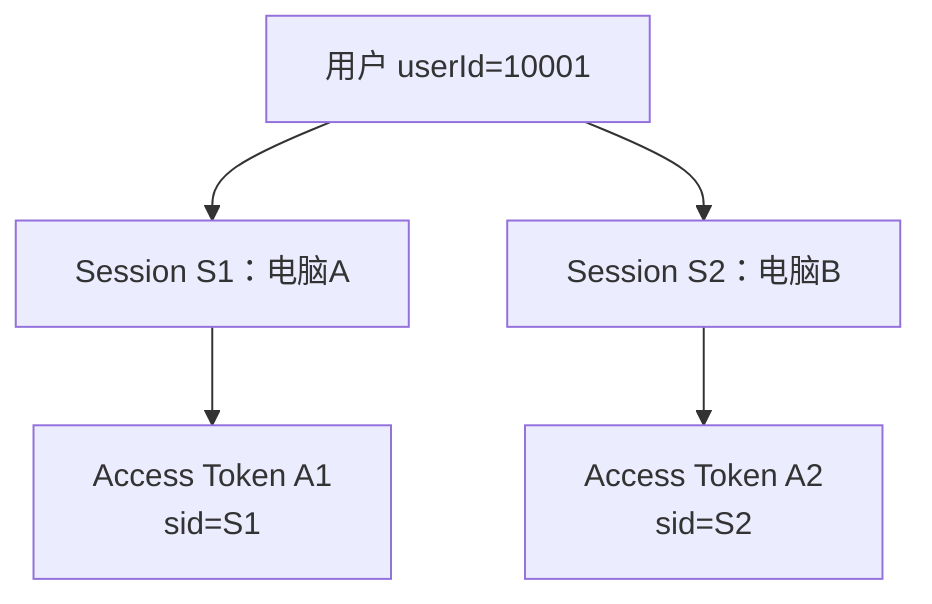

Session 状态：

```text
ACTIVE       正常
REVOKED      主动退出或被管理员撤销
EXPIRED      超过绝对有效期
COMPROMISED  检测到 Refresh Token 重放等异常
```

Session 的作用：

- 区分多设备或多浏览器登录；
- 撤销某一个客户端的登录权限；
- 关联 Refresh Token 轮换历史；
- 展示登录设备列表；
- 保存本次登录的 `authenticated_time`；
- 记录最近活动时间和撤销原因。

---

## 1.8 Refresh Token

Refresh Token 推荐使用高熵随机字符串。客户端保存原文，MySQL 保存摘要：

```text
token_digest =
HMAC-SHA256(serverPepper, rawRefreshToken)
```

轮换关系：

```text
R1 ACTIVE
  ↓ 使用一次
R1 USED
  ↓
R2 ACTIVE
```

为检测重放，可以记录：

```text

parent_token_id
replaced_by_token_id
```

如果已经使用过的 Refresh Token 再次出现，应将对应 Session 标记为 `COMPROMISED`，撤销该 Token session，并要求重新登录。

---

## 1.9 Cookie

Cookie 是浏览器保存并自动发送数据的机制，不等于 Session 或 Token。

推荐组合：

```text
Access Token：
前端内存保存，通过 Authorization 请求头发送

Refresh Token：
HttpOnly Cookie 保存
```

Refresh Token Cookie 建议包含：

```text
HttpOnly
Secure
SameSite=Lax 或 Strict
Path=/api/auth
```

刷新、退出等状态变更接口还应结合 Origin 校验和 CSRF 防护。

---

## 1.10 Spring Security Resource Server

Gateway 和业务服务不需要自己编写 JWT 解析 Filter。Spring Security Resource Server 可以完成：

```text
读取 Authorization Bearer Token
验证 JWT 签名
验证 iss
验证 aud
验证 nbf 和 exp
创建 Authentication
映射 sub 和 scope
```

典型组件：

| 场景 | Spring 组件 |
|---|---|
| Spring Cloud Gateway | `SecurityWebFilterChain`、`ReactiveJwtDecoder` |
| Spring MVC 业务服务 | `SecurityFilterChain`、`JwtDecoder` |
| 时间验证 | `JwtTimestampValidator` |
| 401 处理 | `AuthenticationEntryPoint` 或响应式对应组件 |
| 403 处理 | `AccessDeniedHandler` 或响应式对应组件 |

`auth_valid_after`、Session 撤销和 Access Token 黑名单不是 JWT 标准校验，需要由自定义认证检查组件完成。

---

## 1.11 MySQL、Redis需要保存的相关数据

职责划分：

```text
MySQL：
保存长期、可审计、可恢复的权威状态

Redis：
保存高频认证状态缓存、短期撤销标识和变更屏障
```

| 数据 | MySQL | Redis |
|---|---|---|
| 用户状态、`auth_valid_after` | 权威保存 | 高频缓存 |
| Session | 权威保存 | Session 撤销标识 |
| Refresh Token 摘要和轮换关系 | 权威保存 | 默认不缓存 |
| Access Token 原文 | 不保存 | 不保存 |
| Access Token 撤销 | 通常不保存 | `jti` 黑名单 |
| 登录失败次数 | 可选审计 | 高频计数 |
| 认证状态变更屏障 | 不保存 | 短期 Key |

Outbox 在同一个 MySQL 事务中完成：

```text
修改业务数据
+
插入 outbox_event
```

事务提交后，由 Relay 发布 MQ；消费者重复执行幂等的 Redis 更新或撤销操作。

---

## 1.12 Redis Lua 脚本

Redis Lua 脚本在 Redis 服务端执行。脚本运行期间，其读取、判断和写入作为一个原子过程完成，其他客户端命令不会插入脚本执行中间。

Lua 适合完成：

```text
读取旧值
  ↓
比较条件
  ↓
更新多个Redis字段或Key
  ↓
设置TTL
```

但是

> Lua 只能保证 Redis 内部的原子性，不能让 MySQL 和 Redis 组成同一个事务。

因此跨存储一致性仍然需要：

```text
Redis变更屏障
+
MySQL事务
+
Outbox
+
提交后Lua更新
```

在 Redis Cluster 中，Lua 脚本涉及的所有 Key 必须显式通过 `KEYS` 传入，并位于同一个 Hash Slot。可以使用 Hash Tag：

```text
auth:user:{10001}:state
auth:user:{10001}:barrier
```

两个 Key 都包含 `{10001}`，因此会被路由到同一个 Slot。

---

## 1.13 Outbox事件

微服务架构中，服务之间需要通过异步消息传递来解耦。在这里，当我们修改了业务数据库，就需要对redis/mq或其他服务同步通知修改，但是无论是直接`双写MySQL和redis`还是`双写MySQL和MQ`都会存在一边成功、一边失败的问题。比如：

- 数据库更新失败，但redis更新成功了
- 数据库更新成功，但redis更新失败了

这时候就无法保证两边数据的一致性

这时候我们就可以使用MySQL的事务机制来实现业务表和outbox_event双写

Outbox模式在同一个MySQL事务中完成，结果只有都成功或者都失败：

```text
更新业务表
+
插入outbox_event
```

事务提交后，由Relay扫描Outbox并发送MQ。消费者根据 `eventId` 幂等处理，并按版本更新Redis安全状态。

Outbox保证的是可靠最终传播，即业务表的更新最终一定会随着event反映到其他服务上。适用于核心链路必须保证事件可靠传递的情况，但是因为需要先通过写入event然后等待扫描和消费者处理，Outbox不适合要求毫秒级相应的一致性事务。

---

# 2. 登录鉴权实现架构

## 2.1 总体架构

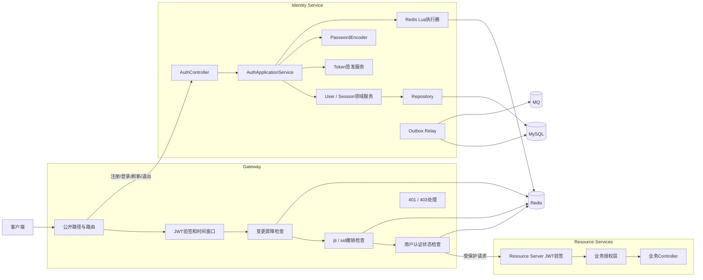

---

## 2.2 Gateway 安全层

| 组件 | 职责 |
|---|---|
| `SecurityWebFilterChain` | 配置公开接口和受保护接口 |
| `ReactiveJwtDecoder` | 验证 JWT 签名与标准声明 |
| `JwtAuthenticationConverter` | 将 Claim 转换成认证身份与权限 |
| `AuthChangeBarrierChecker` | 检查用户或 Session 是否正在发生关键状态变更 |
| `TokenRevocationChecker` | 检查 `jti` 和 `sid` 撤销状态 |
| `UserAuthStateChecker` | 检查用户状态和 `auth_valid_after` |
| `ServerAuthenticationEntryPoint` | 返回统一 401 |
| `ServerAccessDeniedHandler` | 返回统一 403 |

匿名接口：

```text
POST /api/auth/register
POST /api/auth/login
POST /api/auth/refresh
```

业务服务仍应使用 Resource Server 本地验签，不能信任客户端自行传入的 `X-User-Id`。

---

## 2.3 认证服务分层

```text
interfaces
application
domain
infrastructure
```

| 分层 | 核心组件 | 职责 |
|---|---|---|
| `interfaces` | `AuthController`、`SessionController` | 接收注册、登录、刷新和 Session 管理请求 |
| `application` | `AuthApplicationService`、`SessionApplicationService` | 编排用例、事务、屏障和事件 |
| `domain` | User、Session、Refresh Token、认证策略 | 保存认证业务规则 |
| `infrastructure` | MyBatis、JWT、Redis、Lua、PasswordEncoder、Outbox | 适配基础设施 |

链路追踪和认证上下文分离：

```text
RequestContext：
requestId、traceId、module、operation

SecurityContext：
userId、sessionId、scope、authorities
```

---

## 2.4 MySQL 数据模型

### 2.4.1 `user_account`

| 字段 | 类型 | 说明 |
|---|---|---|
| `id` | BIGINT NOT NULL AUTO_INCREMENT | 有符号用户稳定主键 |
| `username` | VARCHAR(32) CHARACTER SET ascii COLLATE ascii_bin NOT NULL | 大小写敏感的唯一登录名；注销后改为 `#deleted#<userId>` |
| `password_hash` | VARCHAR(255) NOT NULL | `{id}encodedPassword`，当前为 `{bcrypt}<哈希>` |
| `nickname` | VARCHAR(32) NULL | 展示昵称；为空时回退到 username |
| `avatar_url` | VARCHAR(500) NULL | 头像地址 |
| `status` | VARCHAR(16) CHARACTER SET ascii COLLATE ascii_bin NOT NULL | NORMAL、DISABLED、DELETED |
| `auth_valid_after` | DATETIME(3) NOT NULL | 早于该时间完成的认证失效 |
| `last_login_time` | DATETIME(3) NULL | 最近登录时间 |
| `version` | INT NOT NULL | MySQL 乐观锁版本，初始为 0 |
| `created_time` | DATETIME(3) NOT NULL | UTC 创建时间 |
| `updated_time` | DATETIME(3) NOT NULL | UTC 更新时间 |

建表索引与约束片段：

```sql
PRIMARY KEY (id),
UNIQUE KEY uk_user_account_username (username),
CONSTRAINT chk_user_account_status
    CHECK (status IN ('NORMAL', 'DISABLED', 'DELETED')),
CONSTRAINT chk_user_account_version
    CHECK (version >= 0)
```

当前不建立低选择性的 `status` 单列索引；出现真实管理查询后，根据查询条件和 `EXPLAIN` 决定组合索引。用户名、昵称和密码的复杂内容规则由 Java 校验，不重复写成 SQL 正则。`version` 只用于 MySQL 乐观锁，不写入 JWT，也不用于 Redis 事件排序。

所有时间由 Java 应用通过注入的 `Clock` 生成，以 UTC `Instant` 表达，并在持久化边界显式转换为 UTC `DATETIME(3)`。JDBC 连接时区必须为 UTC，数据库不使用 `CURRENT_TIMESTAMP` 自动初始化或自动更新。

### 2.4.2 `user_session`

| 字段 | 类型 | 说明 |
|---|---|---|
| `id` | BIGINT | 主键 |
| `session_id` | VARCHAR(64) | 会话唯一标识 |
| `user_id` | BIGINT | 所属用户 |
| `status` | VARCHAR(16) | ACTIVE、REVOKED、EXPIRED、COMPROMISED |
| `authenticated_time` | DATETIME(3) | 用户完成本次身份认证的时间 |
| `client_type` | VARCHAR(32) | WEB、MOBILE 等 |
| `device_id` | VARCHAR(128) | 客户端辅助标识，可为空 |
| `device_info` | VARCHAR(255) | 浏览器和系统信息 |
| `login_ip` | VARCHAR(64) | 登录 IP |
| `last_active_time` | DATETIME(3) | 最近活动时间 |
| `absolute_expires_time` | DATETIME(3) | Session 绝对过期时间 |
| `revoked_time` | DATETIME(3) | 撤销时间 |
| `revoke_reason` | VARCHAR(64) | 撤销原因 |
| `version` | INT | 乐观锁版本 |
| `created_time` | DATETIME(3) | 创建时间 |
| `updated_time` | DATETIME(3) | 更新时间 |

索引：

```sql
UNIQUE KEY uk_user_session_session_id (session_id);
KEY idx_user_session_user_status (user_id, status);
KEY idx_user_session_expires_time (absolute_expires_time);
```

### 2.4.3 `user_refresh_token`

| 字段 | 类型 | 说明 |
|---|---|---|
| `id` | BIGINT | 主键 |
| `token_id` | VARCHAR(64) | Token 唯一标识 |
| `session_id` | VARCHAR(64) | 所属 Session |
| `token_digest` | CHAR(64) | Refresh Token 摘要 |
| `parent_token_id` | VARCHAR(64) | 上一个 Token |
| `replaced_by_token_id` | VARCHAR(64) | 替换后的 Token |
| `status` | VARCHAR(16) | ACTIVE、USED、REVOKED、EXPIRED |
| `issued_time` | DATETIME(3) | 签发时间 |
| `expires_time` | DATETIME(3) | 过期时间 |
| `used_time` | DATETIME(3) | 使用时间 |
| `created_time` | DATETIME(3) | 创建时间 |
| `updated_time` | DATETIME(3) | 更新时间 |

索引：

```sql
UNIQUE KEY uk_refresh_token_token_id (token_id);
UNIQUE KEY uk_refresh_token_digest (token_digest);
KEY idx_refresh_token_session_status (session_id, status);
KEY idx_refresh_token_expires_time (expires_time);
```

### 2.4.4 `outbox_event`

认证相关事件：

```text
USER_AUTH_BOUNDARY_CHANGED
SESSION_REVOKED
SESSION_COMPROMISED
```

`USER_DELETED` 只有在图片、评论等服务出现真实生命周期消费者后才建立消息契约、Outbox 写入和 RocketMQ Topic；不得提前创建无人消费的事件通道。

事件包含：

```text
event_id
event_type
aggregate_id
occurred_time
payload
```

用户级事件 Payload 至少携带：

```text
userId
status
authValidAfter
operationId
```

Session 事件至少携带：

```text
sessionId
revokeReason
denyTtlMillis
operationId
```

---

## 2.5 Redis 数据模型

### 用户认证状态缓存

```text
Key:
auth:user:{userId}:state

Type:
Hash

Fields:
status
authValidAfter

TTL:
1～5 分钟
```

`authValidAfter` 使用统一的 Epoch Millisecond 或其他可稳定比较的数字形式写入 Redis。

### 用户认证状态变更屏障

```text
Key:
auth:user:{userId}:barrier

Value:
operationId

TTL:
例如 15～30 秒
```

屏障表示该用户正在执行退出全部设备、修改密码、禁用、启用或注销等关键操作。

Gateway 发现屏障时，对该用户的受保护请求采取 **Fail Closed**：

```text
暂时拒绝请求
或返回可重试的认证状态更新中错误
```

### Session 变更屏障

```text
Key:
auth:session:{sessionId}:barrier

Value:
operationId

TTL:
例如 15～30 秒
```

### Session 撤销标识

```text
Key:
auth:session:{sessionId}:deny

Value:
revokeReason

TTL:
Access Token 最大剩余有效期 + clockSkew
```

### Access Token 撤销标识

```text
Key:
auth:access:{issuerHash}:{jti}:deny

Value:
1

TTL:
当前 Access Token 剩余有效期 + clockSkew
```

### 登录失败计数

```text
Key:
auth:login:{usernameHash}:failure

Value:
失败次数

TTL:
在登录保护切片与失败窗口、阈值和锁定时间一起确认
```

Refresh Token 摘要和状态只保存在 MySQL。

---

## 2.6 Redis Lua 一致性脚本

## 2.6.1 用户认证状态原子发布

用户级认证状态只允许按照 `auth_valid_after` 向前推进。所有影响认证有效性的用户状态变化都必须产生一个不早于旧值的新分界点，包括禁用、重新启用、修改密码和退出全部设备。

Lua 脚本：

```lua
-- KEYS[1] auth:user:{userId}:state
-- KEYS[2] auth:user:{userId}:barrier
--
-- ARGV[1] incomingStatus
-- ARGV[2] incomingAuthValidAfter
-- ARGV[3] cacheTtlMillis
-- ARGV[4] operationId，可为空

local cachedBoundary =
    redis.call('HGET', KEYS[1], 'authValidAfter')

local incomingBoundary = tonumber(ARGV[2])

if (not cachedBoundary)
   or incomingBoundary >= tonumber(cachedBoundary) then

    redis.call(
        'HSET',
        KEYS[1],
        'status', ARGV[1],
        'authValidAfter', ARGV[2]
    )

    redis.call('PEXPIRE', KEYS[1], ARGV[3])
end

if ARGV[4] ~= '' then
    local barrierOwner = redis.call('GET', KEYS[2])

    if barrierOwner == ARGV[4] then
        redis.call('DEL', KEYS[2])
    end
end

return {
    redis.call('HGET', KEYS[1], 'status'),
    redis.call('HGET', KEYS[1], 'authValidAfter')
}
```

作用：

1. 状态比较和写入在 Redis 内部原子完成；
2. 延迟到达的旧事件不能用更早的 `auth_valid_after` 覆盖新状态；
3. 同一脚本完成状态发布和当前操作屏障释放；
4. 只有持有相同 `operationId` 的操作才能删除自己的屏障；
5. 脚本返回 Redis 中最终生效的状态，调用方不能继续使用可能已经过期的本地数据。

这里不需要额外的事件顺序字段，因为 `auth_valid_after` 本身具有单调向前的业务语义。

---

## 2.6.2 用户认证状态缓存回填

缓存未命中时，认证服务从 MySQL 查询：

```text
status
auth_valid_after
```

然后使用同一个原子发布脚本写入 Redis。

如果在数据库查询期间，另一个线程已经向 Redis 写入了更新的分界点，脚本会保留 Redis 中较新的状态，并把最终状态返回给调用方。

调用方必须使用脚本返回值，而不是无条件使用查询 MySQL 后保存在本地变量中的旧结果。

---

## 2.6.3 Session 撤销原子发布

重复事件不能缩短撤销 Key 的 TTL。Session 撤销脚本：

```lua
-- KEYS[1] auth:session:{sessionId}:deny
-- KEYS[2] auth:session:{sessionId}:barrier
--
-- ARGV[1] revokeReason
-- ARGV[2] denyTtlMillis
-- ARGV[3] operationId

local incomingTtl = tonumber(ARGV[2])
local currentTtl = redis.call('PTTL', KEYS[1])

if currentTtl < 0 or incomingTtl > currentTtl then
    redis.call(
        'SET',
        KEYS[1],
        ARGV[1],
        'PX',
        incomingTtl
    )
end

local barrierOwner = redis.call('GET', KEYS[2])

if barrierOwner == ARGV[3] then
    redis.call('DEL', KEYS[2])
end

return 1
```

作用：

```text
第一次撤销：
创建 deny Key

Outbox 重复消费：
保持撤销结果

较旧事件延迟到达：
不能缩短现有撤销 TTL

状态发布完成：
只删除本次 operationId 对应的屏障
```

Access Token 的 `jti` 黑名单可以使用同样的“只延长、不缩短”脚本。

---

## 2.6.4 屏障安全释放

事务回滚时，只允许创建屏障的操作释放自己的屏障：

```lua
-- KEYS[1] barrierKey
-- ARGV[1] operationId

if redis.call('GET', KEYS[1]) == ARGV[1] then
    return redis.call('DEL', KEYS[1])
end

return 0
```

不能直接执行：

```text
DEL barrierKey
```

否则一个较慢的旧操作可能删除新操作刚创建的屏障。

---

## 2.6.5 脚本执行方式

Spring Data Redis 可以使用 `DefaultRedisScript` 执行脚本。客户端通常优先执行 `EVALSHA`，Redis 中没有脚本缓存时再回退加载或执行脚本。

脚本要求：

- 脚本内容固定，通过 `KEYS` 和 `ARGV` 参数化；
- 不在运行时动态拼接脚本文本；
- 脚本保持短小，避免长时间阻塞 Redis；
- Redis Cluster 下相关 Key 使用相同 Hash Tag；
- 监控脚本执行耗时、错误数和屏障超时数量。

---

## 2.7 Token 验证链路

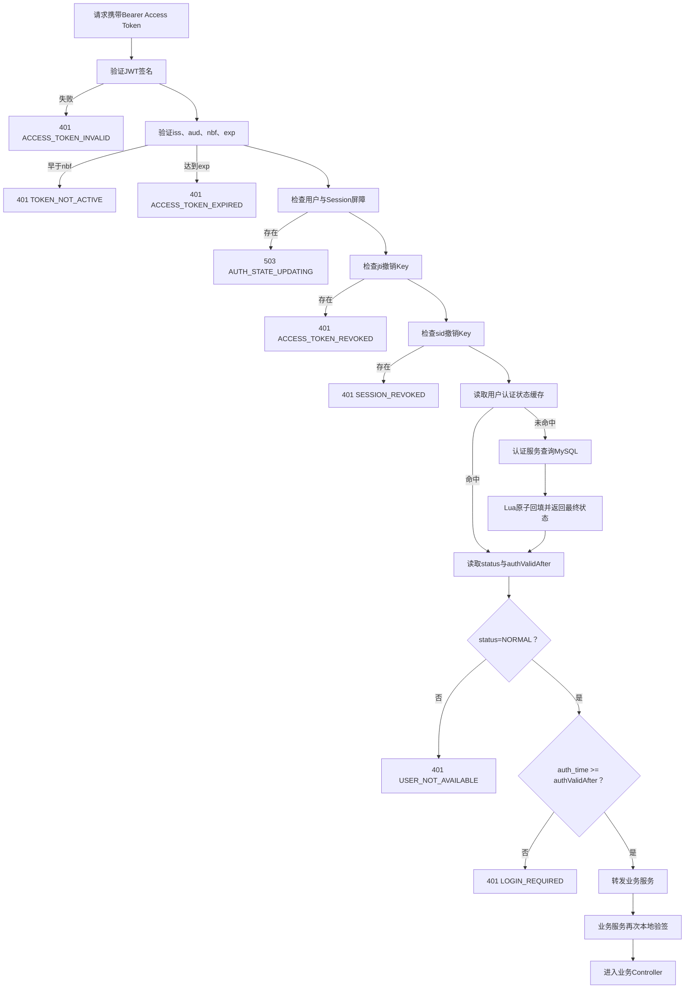

---

# 3. 登录鉴权流程与数据变化

## 3.1 用户注册

### 请求路径

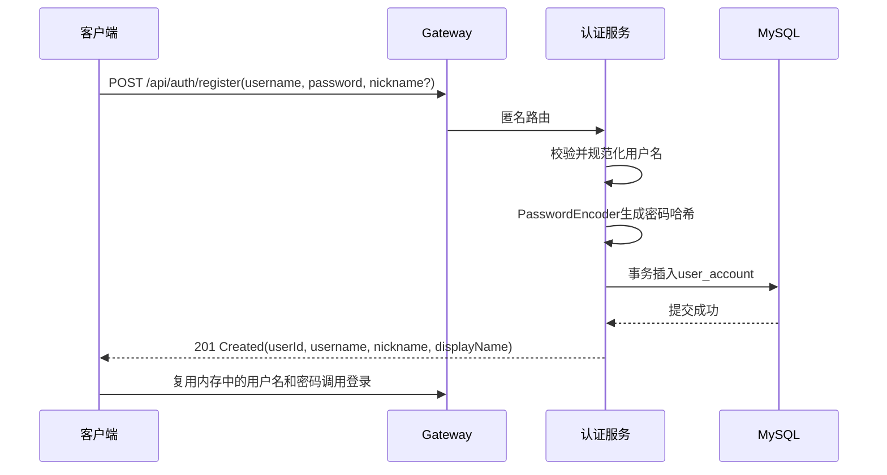

### MySQL 变化

新增 `user_account`：

```text
username          = 规范化用户名
password_hash     = {bcrypt}<BCrypt 哈希>
nickname          = 用户昵称或 NULL
avatar_url        = NULL
status            = NORMAL
auth_valid_after  = 与 created_time 相同的 UTC 时间
last_login_time   = NULL
version           = 0
created_time      = Java Clock 生成的 UTC 时间
updated_time      = 与 created_time 相同
```

用户名唯一性由数据库唯一索引最终保证。并发注册时，Java 捕获 `DuplicateKeyException` 并转换为“用户名已存在”。

用户名输入先执行 `strip()`，结果长度 3～32，只允许大小写英文字母、数字和位于字母数字段之间的单个下划线；大小写敏感。昵称和密码遵循 1.2 节规则。注册接口不创建登录状态；前端只在内存中短暂复用凭据调用登录接口，随后立即清除密码变量。

### Redis 变化

正常注册不创建 Token、Session 或用户认证状态缓存。

### 一致性

注册只写 MySQL。当前没有真实消费者，因此不创建注册事件、Outbox 记录或 RocketMQ Topic；以后出现消费者时先补齐契约和传播方案。

---

## 3.2 用户登录

### 请求路径

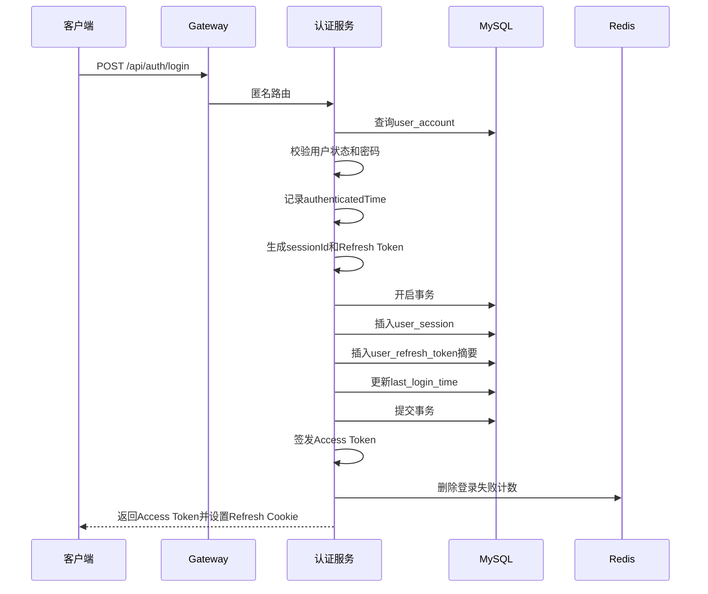

### MySQL 变化

`user_session`：

```text
session_id          = 新生成
user_id             = 当前用户
status              = ACTIVE
authenticated_time  = 用户通过认证的时间
absolute_expires_time
```

`user_refresh_token`：

```text
token_id
session_id
token_digest
status = ACTIVE
expires_time
```

Session 和 Refresh Token 必须在同一个 MySQL 事务中提交。数据库提交失败时不能返回 Token。

### Access Token 时间字段

```text
auth_time = Session.authenticated_time
iat       = 当前签发时间
nbf       = iat
exp       = iat + Access Token TTL
```

### Redis 变化

```text
DEL auth:login:{usernameHash}:failure
```

登录不更新 `auth_valid_after`，也不创建撤销 Key。

---

## 3.3 受保护接口访问

### 请求路径

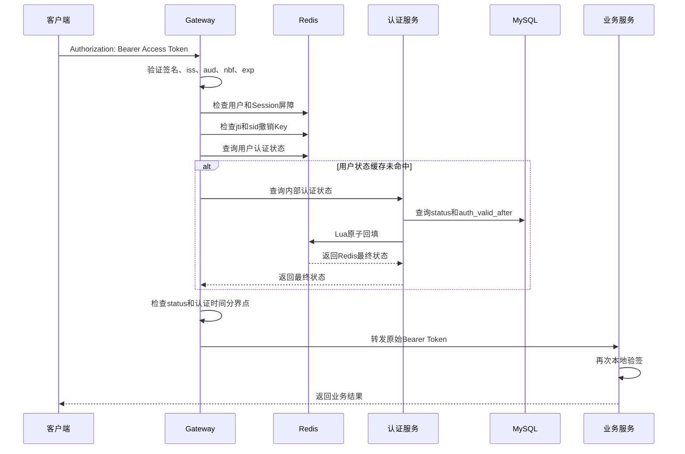

### Redis 查询

```text
auth:user:{userId}:barrier
auth:session:{sessionId}:barrier
auth:access:{issuerHash}:{jti}:deny
auth:session:{sessionId}:deny
auth:user:{userId}:state
```

### MySQL 查询

Redis 用户认证状态未命中时，由认证服务查询：

```text
user_account.status
user_account.auth_valid_after
```

Gateway 不直接访问认证服务数据库。

### 判断条件

```text
用户状态为 NORMAL
Token.auth_time >= user.auth_valid_after
用户与Session不存在变更屏障
jti和sid未被撤销
```

---

## 3.4 Access Token 自然过期

```text
当前时间 >= exp
  ↓
Gateway返回401 ACCESS_TOKEN_EXPIRED
  ↓
客户端调用刷新接口
```

MySQL 和 Redis 不需要因 Token 自然过期主动更新。

撤销 Key 会在 TTL 结束后自动清理。

---

## 3.5 Refresh Token 刷新

### 请求路径

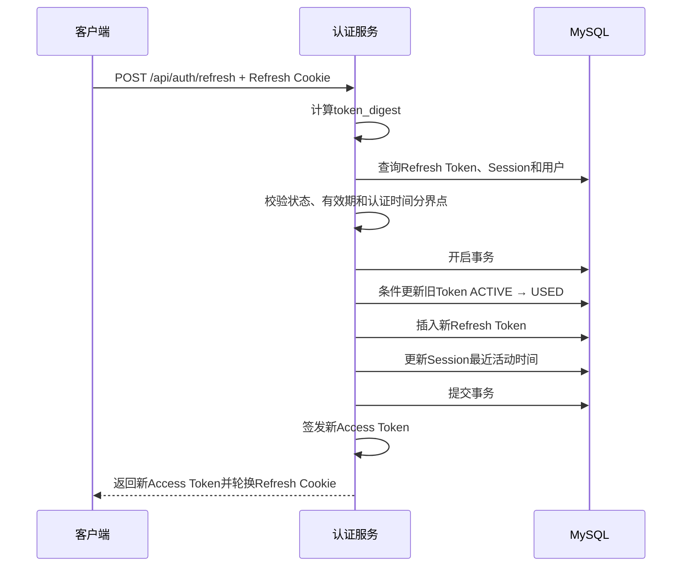

刷新必须满足：

```text
Refresh Token为ACTIVE且未过期
Session为ACTIVE且未过期
用户status=NORMAL
Session.authenticated_time >= user.auth_valid_after
用户和Session不存在变更屏障
```

新 Access Token：

```text
auth_time保持为Session.authenticated_time
iat更新为本次签发时间
nbf固定为iat
exp重新计算
```

Refresh Token 并发轮换属于 MySQL 权威状态更新，使用 SQL 条件更新和事务控制，不能用 Redis Lua 代替：

```sql
UPDATE user_refresh_token
SET status = 'USED',
    used_time = NOW(3),
    updated_time = NOW(3)
WHERE token_digest = ?
  AND status = 'ACTIVE'
  AND expires_time > NOW(3);
```

影响行数必须为 `1`。

---

## 3.6 Refresh Token 重放

如果提交的 Refresh Token 已经是 `USED`：

```text
识别为可能的Token重放
  ↓
创建Session变更屏障
  ↓
MySQL事务将Session设为COMPROMISED
  ↓
撤销该Token session
  ↓
写SESSION_COMPROMISED Outbox
  ↓
提交后Lua写Session deny并释放屏障
  ↓
要求重新登录
```

该操作只影响对应 Session，不修改用户级 `auth_valid_after`。

---

## 3.7 多设备登录

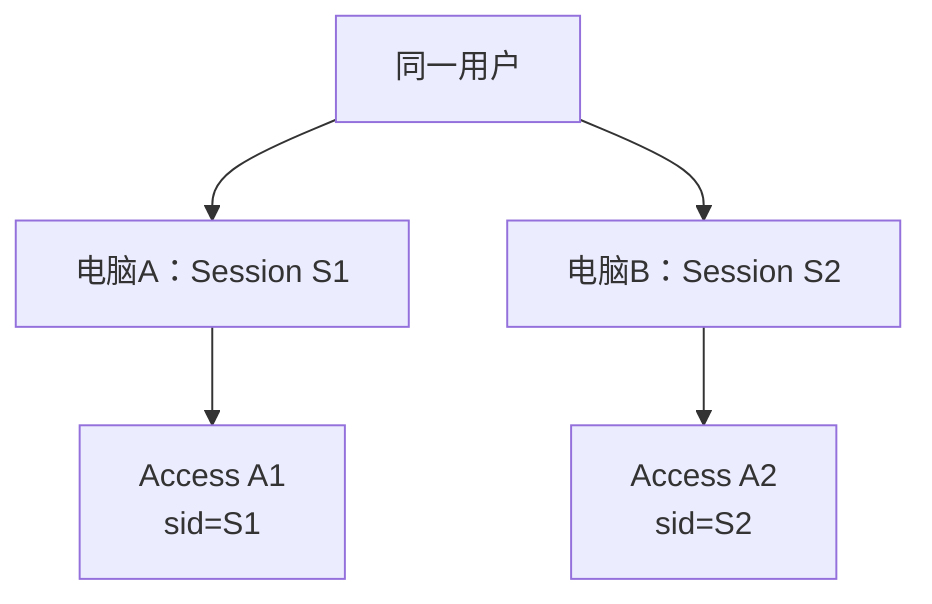

每次登录分别插入：

```text
一条user_session
一条ACTIVE user_refresh_token
```

普通多设备登录不修改 `auth_valid_after`。

请求属于哪个 Session，由 Access Token 的 `sid` 判断；刷新属于哪个 Session，由 Refresh Token 摘要查询得到的 `session_id` 判断。

---

## 3.8 退出当前设备

### 请求路径

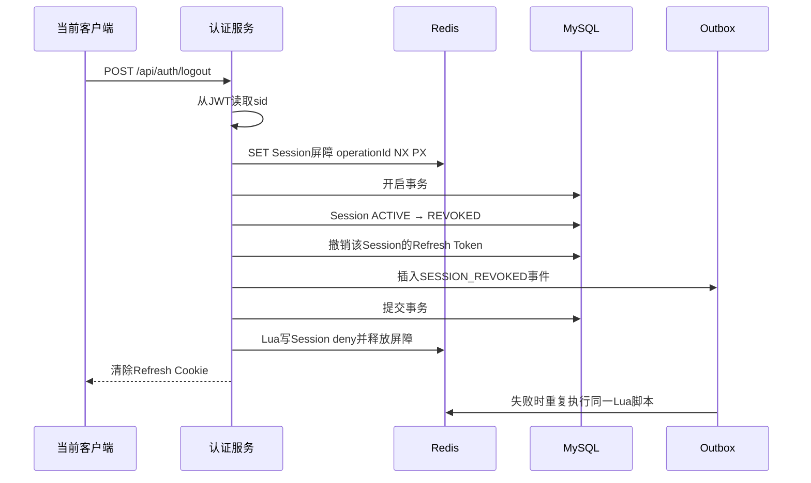

### MySQL 变化

`user_session`：

```text
status        = REVOKED
revoked_time  = NOW(3)
revoke_reason = USER_LOGOUT
version       = version + 1
```

`user_refresh_token`：

```text
当前Session下ACTIVE Token
→ REVOKED
```

`outbox_event`：

```text
event_type = SESSION_REVOKED
aggregate_id = sessionId
```

### Redis 变化

事务前：

```text
SET auth:session:{sid}:barrier operationId NX PX 30000
```

事务提交后，通过 Lua：

```text
SET auth:session:{sid}:deny USER_LOGOUT PX denyTtl
DEL auth:session:{sid}:barrier
```

屏障和 deny 更新使用同一 Hash Tag，并在 Lua 中原子完成。

### `jti` 黑名单

退出整个 Session 时，`sid` 撤销已经能阻止该 Session 下全部 Access Token，因此不必再枚举所有 `jti`。

`jti` 黑名单保留给“只撤销单张 Access Token，但保留 Session”的特殊场景。

### `auth_valid_after`

退出当前设备不修改用户级分界点，其他设备继续有效。

---

## 3.9 指定设备下线

当前 Session 为 S1，目标 Session 为 S2。

流程：

```text
验证当前用户身份
  ↓
校验S2属于当前userId
  ↓
创建S2的Session屏障
  ↓
MySQL事务撤销S2及其Refresh Token
  ↓
写SESSION_REVOKED Outbox
  ↓
提交后Lua写S2 deny并释放屏障
```

Redis：

```text
auth:session:{S2}:barrier
auth:session:{S2}:deny
```

不需要知道目标 Session 签发过的所有 `jti`。

---

## 3.10 退出全部设备

### 请求路径

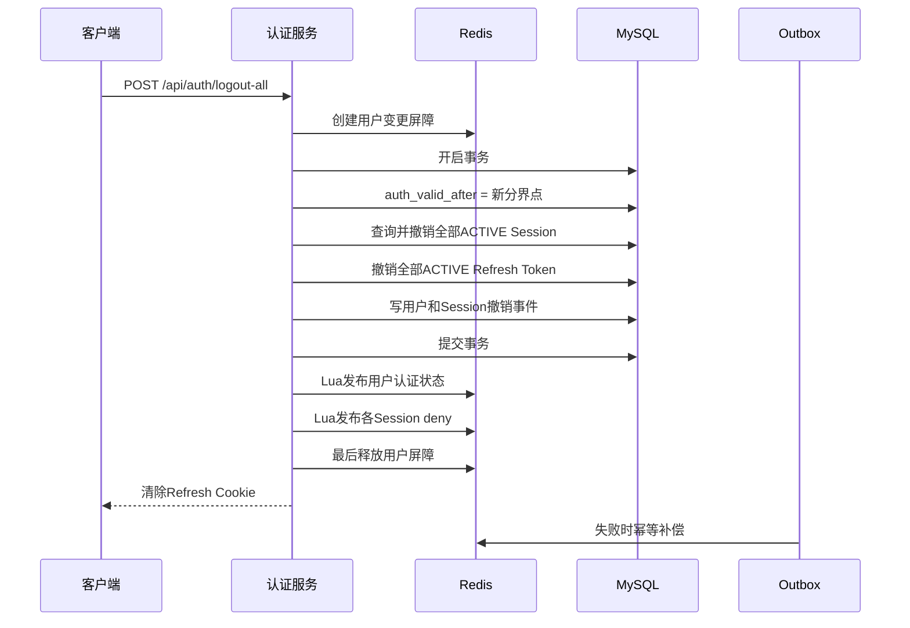

### MySQL 变化

`user_account`：

```text
auth_valid_after = 当前认证撤销分界点
version = version + 1
```

`user_session`：

```text
该用户全部ACTIVE Session
→ REVOKED
```

`user_refresh_token`：

```text
该用户全部ACTIVE Refresh Token
→ REVOKED
```

### Redis 变化

事务前：

```text
SET auth:user:{userId}:barrier operationId NX PX 30000
```

提交后：

1. 使用用户状态发布 Lua 更新：

```text
auth:user:{userId}:state
{
  status: NORMAL,
  authValidAfter: 新分界点
}
```

2. 为事务中撤销的每个 Session 写入 deny Key；
3. 所有必须的 Redis 撤销状态发布完成后，释放用户屏障。

用户屏障存在期间，Gateway 对该用户请求 Fail Closed，因此不会在数据库已提交、Redis 尚未完成同步时继续接受旧 Token。

### 新旧登录判断

```text
旧登录：
auth_time < auth_valid_after
→ 失效

重新登录：
auth_time >= auth_valid_after
且使用新的sid
→ 有效
```

旧 Session 同时具有 deny Key，因此可以覆盖时间字段秒级精度造成的边界情况。

---

## 3.11 修改密码

### 流程

```text
校验旧密码
  ↓
创建用户变更屏障
  ↓
MySQL事务：
  更新password_hash
  推进auth_valid_after
  撤销全部Session
  撤销全部Refresh Token
  写Outbox
  ↓
提交后Lua发布用户状态和Session deny
  ↓
释放用户屏障
  ↓
清除客户端Refresh Cookie并要求重新登录
```

### MySQL 变化

```text
password_hash     = 新密码哈希
auth_valid_after  = 新分界点
version           = version + 1
```

### Redis 变化

```text
更新auth:user:{userId}:state
为旧Session创建deny Key
释放auth:user:{userId}:barrier
```

---

## 3.12 管理员禁用用户

### 流程

```text
创建用户变更屏障
  ↓
MySQL事务：
  status = DISABLED
  推进auth_valid_after
  撤销全部Session和Refresh Token
  写Outbox
  ↓
Lua发布新状态并写Session deny
  ↓
释放屏障
```

Redis 中最终状态：

```text
auth:user:{userId}:state
{
  status: DISABLED,
  authValidAfter: 新分界点
}
```

Gateway 发现 `status != NORMAL` 后拒绝访问。

---

## 3.13 重新启用用户

重新启用不是简单地把缓存中的 `DISABLED` 改为 `NORMAL`，而是一次新的用户认证状态变化。

### 流程

```text
创建用户变更屏障
  ↓
MySQL事务：
  status = NORMAL
  再次推进auth_valid_after
  写Outbox
  ↓
Lua根据更晚的auth_valid_after发布NORMAL状态
  ↓
释放屏障
```

旧的禁用事件即使延迟到达，也携带更早的 `auth_valid_after`，Lua 不允许它覆盖已经重新启用后的状态。

重新启用不会恢复原来的 Session，用户需要重新登录。

---

## 3.14 注销账号

账号注销推荐逻辑删除。

### 流程

```text
重新验证密码并检查注销条件
  ↓
创建用户变更屏障
  ↓
MySQL事务：
  username = #deleted#<userId>
  status = DELETED
  推进auth_valid_after
  撤销全部Session和Refresh Token
  写认证状态与Session撤销Outbox
  仅在存在真实生命周期消费者时写USER_DELETED Outbox
  ↓
Lua发布DELETED状态和Session deny
  ↓
释放屏障
```

旧 Token 会因为用户状态异常、Session 被撤销或认证时间早于分界点而失效。

注销后原用户名立即可以重新注册。已注销记录通过稳定 `userId` 精确定位；`#deleted#` 前缀查询只用于后台排查，不作为业务唯一条件或恢复标识。账号恢复不是首版能力，且原用户名可能已经被重新注册。

其他服务出现真实需求后通过 `USER_DELETED` 事件处理各自的数据生命周期，认证服务不跨库直接删除其他服务数据。

---

## 3.15 登录失败和临时限制

登录失败计数可以使用 Lua 原子完成“递增 + 首次设置 TTL”：

```lua
-- KEYS[1] auth:login:{usernameHash}:failure
-- ARGV[1] ttlMillis

local count = redis.call('INCR', KEYS[1])

if count == 1 then
    redis.call('PEXPIRE', KEYS[1], ARGV[1])
end

return count
```

这样不会出现：

```text
INCR成功
但EXPIRE失败
→ 失败计数永久存在
```

短期登录限流通常不影响已有 Session，因此不修改 `auth_valid_after`。

---

# 4. MySQL 与 Redis 一致性分析

## 4.1 Lua 能解决的范围

Lua 能保证：

```text
Redis内部读取、判断和写入原子执行
多个Redis字段或Key按一个逻辑完成
重复事件幂等
旧认证分界点不覆盖新分界点
重复撤销不缩短deny TTL
屏障只能由创建它的operationId释放
```

Lua 不能保证：

```text
MySQL提交与Redis写入同时成功
MySQL事务回滚时Redis自动回滚
MQ发布与Redis写入同时成功
```

因此不能只依靠 Lua 宣称 MySQL 与 Redis 强一致。

---

## 4.2 变更屏障的作用

关键认证状态操作开始前，先创建短期屏障：

```text
用户级操作：
auth:user:{userId}:barrier

Session级操作：
auth:session:{sessionId}:barrier
```

Gateway 在屏障存在时暂时拒绝相关请求。

这样即使发生：

```text
屏障创建成功
MySQL提交成功
应用在Redis状态发布前崩溃
```

旧 Token 也不会继续访问，因为屏障仍然存在。Outbox 消费者可以稍后完成状态发布并释放屏障。

如果应用在 MySQL 提交前崩溃，屏障 TTL 到期后自动消失，只造成短暂的 Fail Closed，不会放行错误状态。

---

## 4.3 跨存储更新流程

关键操作统一遵循：

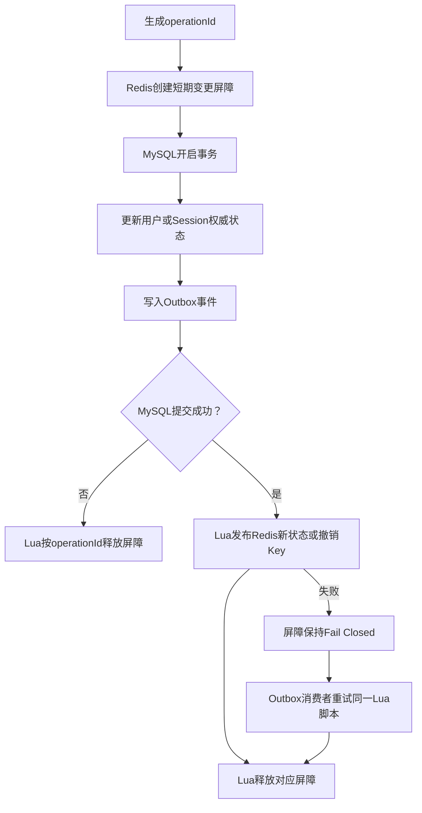

---

## 4.4 缓存未命中与并发回填

场景：

```text
请求A发现Redis缓存未命中
请求A开始查询MySQL旧状态

同时请求B完成用户状态更新
请求B把更新后的状态写入Redis

请求A随后准备把旧查询结果写回Redis
```

请求 A 不能直接 `SET`。它必须执行用户状态原子发布 Lua。

如果请求 B 写入的 `auth_valid_after` 更晚：

```text
incomingBoundary < cachedBoundary
```

Lua 会拒绝请求 A 的旧值覆盖，并返回 Redis 中当前的新状态。

因此调用方必须使用脚本返回的最终状态继续判断 Token。

---

## 4.5 Outbox 事件乱序

用户状态变化：

```text
事件E1：
DISABLED
authValidAfter = 10:00

事件E2：
NORMAL
authValidAfter = 11:00
```

即使 MQ 先消费 E2、后消费 E1：

```text
E2写入：
11:00 >= 当前值
→ 成功

E1延迟到达：
10:00 < 当前11:00
→ Lua忽略
```

事件顺序由 `auth_valid_after` 的业务单调性自然约束，不需要额外的缓存版本字段。

前提是：

> 每一次可能改变用户认证有效性的状态变化，都必须在 MySQL 中推进 `auth_valid_after`。

---

## 4.6 Session 事件乱序

Session 状态只有从有效走向撤销，不会通过旧事件重新变为有效。

Redis 只保存撤销 Key：

```text
不存在：
未发现撤销

存在：
Session已撤销
```

撤销脚本只会创建或延长 TTL，不会由事件删除 deny Key。因此重复消费和乱序消费不会把已撤销 Session 恢复为有效。

新登录会创建新的 `sessionId`，旧 Session 事件无法影响新 Session。

---

## 4.7 Redis 故障策略

Redis 不可用时无法确认：

```text
是否存在变更屏障
jti是否被撤销
sid是否被撤销
用户认证分界点是否变化
```

建议：

| 场景 | 策略 |
|---|---|
| 普通低风险只读接口 | 可根据可用性要求配置降级 |
| 搜索和普通上传 | 根据业务风险决定 |
| 修改密码、账号注销、订单、支付 | Fail Closed |
| 管理员接口 | Fail Closed |

认证安全优先的系统不应在无法确认撤销状态时默认放行。

---

## 4.8 时间精度

建议：

```text
Java：
注入的 Clock 生成 UTC Instant

MySQL：
DATETIME(3)

Redis：
Epoch Millisecond

JWT：
标准NumericDate
```

持久化适配层显式完成 `Instant` 与 UTC `DATETIME(3)` 的转换，JDBC 连接时区为 UTC；所有机器通过 NTP 同步时间。北京时间只在接口或日志展示边界转换。

当前时间参数为：Access Token TTL 30 分钟、Refresh Token TTL 1 小时、Session 绝对 TTL 1 天、Clock Skew 30 秒。Refresh Token 是否滑动到期在轮换切片确认。

用户级全局撤销还会同步撤销已有 Session，并写入 Session deny Key。因此即使 JWT `auth_time` 使用秒级表示，旧 Session 仍会被 `sid` 撤销检查阻止。

---

# 5. 完整状态演变示例

```text
初始：
created_time = 账户创建时间
auth_valid_after = created_time

T1 电脑A登录：
Session S1 = ACTIVE
Access A1(sid=S1, auth_time=10:00)
Refresh R1 = ACTIVE

T2 电脑B登录：
Session S2 = ACTIVE
Access A2(sid=S2, auth_time=10:10)
Refresh R2 = ACTIVE

T3 电脑A刷新：
R1 → USED
R3 → ACTIVE
Access A3(sid=S1, auth_time=10:00, iat=10:15)

T4 电脑A退出：
创建S1屏障
MySQL将S1和R3撤销
Lua写deny:S1并释放屏障
电脑B的S2继续有效
auth_valid_after不变

T5 10:30退出全部设备：
创建用户屏障
auth_valid_after → 10:30
S2和R2被撤销
Lua发布用户状态和deny:S2
释放用户屏障
A2失效

T6 10:35重新登录：
Session S3 = ACTIVE
Access A4(sid=S3, auth_time=10:35)
A4不早于auth_valid_after，因此有效
旧S1、S2事件不会影响新的S3
```

```mermaid
stateDiagram-v2
    [*] --> 未登录

    未登录 --> Session有效: 登录
    Session有效 --> Access过期: 到达exp
    Access过期 --> Session有效: Refresh Token轮换

    Session有效 --> Session变更中: 创建Session屏障
    Session变更中 --> Session撤销: MySQL提交并发布deny
    Session撤销 --> Session有效: 重新登录并创建新sid

    Session有效 --> 用户状态变更中: 创建用户屏障
    用户状态变更中 --> 全部旧登录失效: 推进auth_valid_after
    全部旧登录失效 --> Session有效: 重新认证
```

---

# 6. 设计原则总结

```text
密码只保存单向哈希
Access Token短期且使用JWT
Refresh Token长期但必须有状态
每次登录创建独立Session
刷新Token时auth_time保持原登录时间
nbf控制单张JWT何时开始生效
exp控制单张JWT何时结束
单Token撤销使用jti
单Session撤销使用sid
全部旧登录失效使用auth_valid_after
用户认证状态按auth_valid_after单调更新
Redis Lua保证Redis内部原子判断和写入
变更屏障覆盖MySQL与Redis同步间隙
MySQL事务保存权威状态并写Outbox
Outbox负责失败补偿和最终传播
Gateway与业务服务分别完成各自验证
```

---

# 7. 规范与权威资料

1. [RFC 7519：JSON Web Token](https://www.rfc-editor.org/rfc/rfc7519)
2. [OpenID Connect Core 1.0](https://openid.net/specs/openid-connect-core-1_0.html)
3. [RFC 6749：OAuth 2.0 Authorization Framework](https://www.rfc-editor.org/rfc/rfc6749)
4. [RFC 9700：OAuth 2.0 Security Best Current Practice](https://www.rfc-editor.org/rfc/rfc9700)
5. [Spring Security：OAuth 2.0 Resource Server JWT](https://docs.spring.io/spring-security/reference/servlet/oauth2/resource-server/jwt.html)
6. [Spring Security：Password Storage](https://docs.spring.io/spring-security/reference/features/authentication/password-storage.html)
7. [Spring Data Redis：Scripting](https://docs.spring.io/spring-data/redis/reference/redis/scripting.html)
8. [Redis：Scripting with Lua](https://redis.io/docs/latest/develop/programmability/eval-intro/)
9. [Redis：Transactions](https://redis.io/docs/latest/develop/using-commands/transactions/)
10. [Firebase Authentication：Manage User Sessions](https://firebase.google.com/docs/auth/admin/manage-sessions)
11. [Keycloak Server Administration Guide](https://www.keycloak.org/docs/latest/server_admin/)
12. [OWASP JSON Web Token for Java Cheat Sheet](https://cheatsheetseries.owasp.org/cheatsheets/JSON_Web_Token_for_Java_Cheat_Sheet.html)
