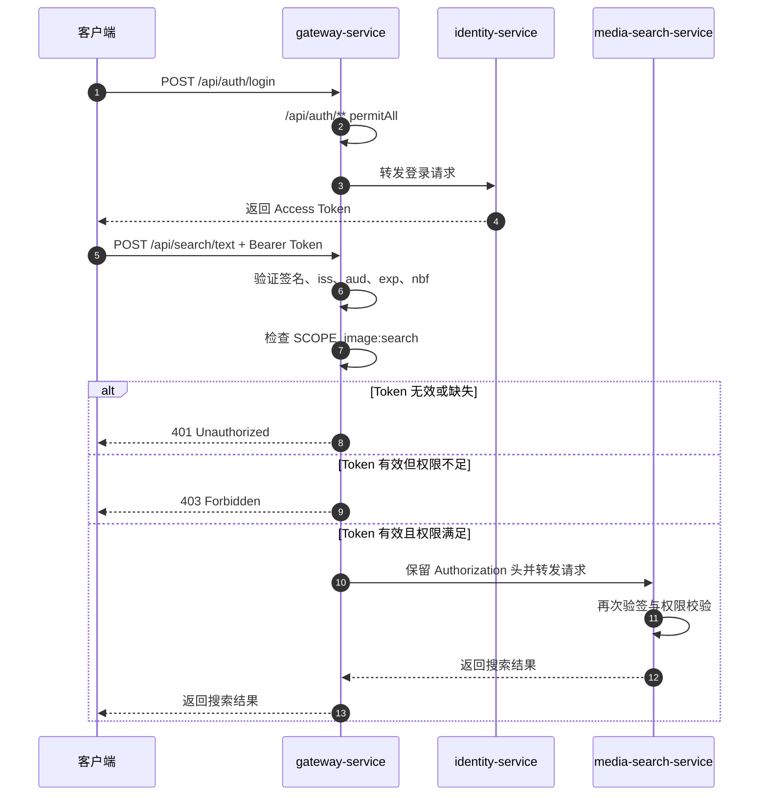

# Spring Cloud Gateway 路由与 JWT 权限校验

本文说明在 Spring 微服务项目中，如何用 Gateway 作为统一入口完成路由转发，并配合 Spring Security Resource Server 对 JWT Access Token 做认证与权限校验。内容以 EveryPicFound 当前实现为例，但尽量保留通用写法。

## 1. 当前采用的最小方案

当前阶段先完成“能登录、能携带 Access Token 访问受保护业务服务”的闭环，不引入服务注册中心、远程 Token introspection、Redis Session、Refresh Token、MQ 或 Outbox。

当前链路是：

```text
客户端
  -> gateway-service
  -> identity-service / media-search-service
```

服务访问方式：

- 客户端只直接访问 `gateway-service`，本地默认端口是 `8082`。
- `POST /api/auth/login`、`POST /api/auth/register` 路由到 `identity-service`。
- `/api/search/**`、`/api/images/**`、`/images/**` 路由到 `media-search-service`。
- Gateway 和 Media 都用 Identity 的 RSA 公钥本地验签，不远程调用 Identity 判断 Token 是否有效。

这样做的好处是简单、清晰、可测试；代价是当前还不能做到服务端主动撤销 Access Token，撤销能力会在后续 Session / Refresh Token 阶段补上。

## 2. 依赖引入

### Gateway 服务

Gateway 是 WebFlux 技术栈，所以使用 Spring Cloud Gateway WebFlux 版本，同时作为 OAuth2 Resource Server 验证 Bearer Token。

```xml
<dependency>
    <groupId>com.everypicfound</groupId>
    <artifactId>security-contract</artifactId>
</dependency>

<dependency>
    <groupId>org.springframework.cloud</groupId>
    <artifactId>spring-cloud-starter-gateway-server-webflux</artifactId>
</dependency>

<dependency>
    <groupId>org.springframework.boot</groupId>
    <artifactId>spring-boot-starter-security</artifactId>
</dependency>

<dependency>
    <groupId>org.springframework.boot</groupId>
    <artifactId>spring-boot-starter-oauth2-resource-server</artifactId>
</dependency>
```

对应项目入口：

- [`gateway-service/pom.xml`](../../gateway-service/pom.xml)
- [`GatewaySecurityConfiguration.java`](../../gateway-service/src/main/java/com/everypicfound/gateway/infrastructure/security/jwt/GatewaySecurityConfiguration.java)

### 下游业务服务

Media 是 Servlet MVC 技术栈，不引入 Gateway 依赖，只需要 Spring Security 和 Resource Server。它同样依赖 `security-contract`，复用 scope 常量和 JWT 校验工具。

```xml
<dependency>
    <groupId>org.springframework.boot</groupId>
    <artifactId>spring-boot-starter-security</artifactId>
</dependency>

<dependency>
    <groupId>org.springframework.boot</groupId>
    <artifactId>spring-boot-starter-oauth2-resource-server</artifactId>
</dependency>

<dependency>
    <groupId>com.everypicfound</groupId>
    <artifactId>security-contract</artifactId>
</dependency>
```

对应项目入口：

- [`media-search-service/pom.xml`](../../media-search-service/pom.xml)
- [`MediaSecurityConfiguration.java`](../../media-search-service/src/main/java/com/everypicfound/security/infrastructure/jwt/MediaSecurityConfiguration.java)

## 3. YAML 路由设置

当前没有使用 Nacos、Eureka 等服务注册中心，所以这里的“服务注册”不是自动注册发现，而是在 Gateway 的 `application.yaml` 里显式配置目标服务地址。

```yaml
spring:
  cloud:
    gateway:
      server:
        webflux:
          routes:
            - id: identity-auth-route
              uri: ${IDENTITY_SERVICE_URI:http://localhost:8081}
              predicates:
                - Path=/api/auth/**

            - id: media-search-route
              uri: ${MEDIA_SEARCH_SERVICE_URI:http://localhost:8080}
              predicates:
                - Path=/api/search/**
```

关键点：

- `id`：路由名称，方便日志、排查和管理。
- `uri`：目标服务地址，可以通过环境变量覆盖。
- `Path`：路径断言，请求路径匹配后转发到对应 `uri`。

当前 Gateway 配置入口：

- [`gateway-service/src/main/resources/application.yaml`](../../gateway-service/src/main/resources/application.yaml)

当用户访问：

```text
POST http://localhost:8082/api/search/text
```

Gateway 会匹配 `/api/search/**`，然后转发到：

```text
POST http://localhost:8080/api/search/text
```

## 4. JWT Properties 设置

JWT 校验参数放在统一配置前缀下：

```yaml
everypicfound:
  auth:
    jwt:
      issuer: ${EPF_JWT_ISSUER:everypicfound-identity}
      audience: ${EPF_JWT_AUDIENCE:everypicfound-api}
      clock-skew: ${EPF_JWT_CLOCK_SKEW:30s}
      public-key-location: ${EPF_JWT_PUBLIC_KEY_LOCATION:file:./config/keys/identity-public.pem}
```

对应的 `@ConfigurationProperties` 用来把 YAML 绑定为 Java 配置对象：

```java
@ConfigurationProperties(prefix = "everypicfound.auth.jwt")
public record GatewayJwtProperties(
        String issuer,
        String audience,
        Duration clockSkew,
        Resource publicKeyLocation) {
}
```

这些配置的作用：

| 配置项 | 作用 |
| --- | --- |
| `issuer` | 要求 Token 的 `iss` 与 Identity 签发方一致 |
| `audience` | 要求 Token 的 `aud` 面向当前 API |
| `clock-skew` | 允许客户端、服务端之间存在少量时钟偏差 |
| `public-key-location` | 读取 Identity 的 RSA 公钥，用于验证 RS256 签名 |

Gateway 和 Media 都配置同一组校验参数，是为了保证即使用户绕过 Gateway 直接访问 Media，Media 自己也能拒绝无效 Token。

## 5. SecurityConfig 权限设置

Gateway 使用 WebFlux Security：

```java
@Bean
SecurityWebFilterChain gatewaySecurityWebFilterChain(ServerHttpSecurity http) {
    return http
            .csrf(ServerHttpSecurity.CsrfSpec::disable)
            .authorizeExchange(exchange -> exchange
                    .pathMatchers("/actuator/health", "/actuator/info").permitAll()
                    .pathMatchers("/api/auth/**").permitAll()
                    .pathMatchers(HttpMethod.POST, "/api/images/upload")
                    .hasAuthority("SCOPE_image:upload")
                    .pathMatchers("/api/search/**")
                    .hasAuthority("SCOPE_image:search")
                    .anyExchange().authenticated())
            .oauth2ResourceServer(resourceServer -> resourceServer.jwt(jwt -> {
            }))
            .build();
}
```

Media 使用 Servlet Security：

```java
@Bean
SecurityFilterChain mediaSecurityFilterChain(HttpSecurity http) throws Exception {
    return http
            .csrf(AbstractHttpConfigurer::disable)
            .authorizeHttpRequests(authorize -> authorize
                    .requestMatchers("/actuator/health", "/actuator/info").permitAll()
                    .requestMatchers("/api/search/**")
                    .hasAuthority("SCOPE_image:search")
                    .requestMatchers("/api/images/**", "/images/**")
                    .hasAuthority("SCOPE_image:read")
                    .anyRequest().authenticated())
            .oauth2ResourceServer(resourceServer -> resourceServer.jwt(jwt -> {
            }))
            .build();
}
```

`scope` 到权限的转换规则由 Spring Security Resource Server 默认完成：

```text
JWT claim: scope = "image:search image:read"
Spring authority: SCOPE_image:search, SCOPE_image:read
```

所以配置里判断的是 `SCOPE_` 前缀后的权限。

## 6. JWT Decoder 与验签设置

Gateway 和 Media 都创建自己的 `JwtDecoder`，区别只是技术栈不同：

- Gateway 使用 `NimbusReactiveJwtDecoder`。
- Media 使用 `NimbusJwtDecoder`。

核心逻辑一致：

```java
NimbusJwtDecoder decoder = NimbusJwtDecoder
        .withPublicKey(new PemRsaPublicKeyLoader().load(properties.publicKeyLocation()))
        .signatureAlgorithm(SignatureAlgorithm.RS256)
        .build();

decoder.setJwtValidator(new DelegatingOAuth2TokenValidator<Jwt>(List.of(
        new JwtTimestampValidator(properties.clockSkew()),
        new JwtIssuerValidator(properties.issuer()),
        new JwtAudienceValidator(properties.audience()),
        new JwtRequiredClaimsValidator())));
```

这里会校验：

- Token 是否由对应私钥签名，且能被公钥验证。
- Token 是否过期，是否尚未生效。
- `issuer` 是否正确。
- `audience` 是否正确。
- 必要声明是否存在。

## 7. Controller 设置方式

Gateway 本身通常不写业务 Controller；它主要通过路由配置和过滤器把请求转发到下游服务。

下游服务的 Controller 需要做到两件事：

1. 路径要和 Gateway 路由匹配。
2. 业务接口语义要和 SecurityConfig 的权限规则匹配。

例如 Media 的搜索 Controller：

```java
@RestController
@RequestMapping("/api/search")
public class SearchController {

    @PostMapping(path = "/text")
    public Result<?> searchByText(...) {
        ...
    }
}
```

它会被 Gateway 的 `/api/search/**` 路由匹配，也会被 Gateway 和 Media 的 `SCOPE_image:search` 权限规则保护。

如果以后某个 Controller 方法需要更细粒度权限，可以再启用方法级授权，例如：

```java
@PreAuthorize("hasAuthority('SCOPE_image:search')")
```

但当前阶段为了保持简单，权限规则主要集中在 SecurityConfig 中，不在 Controller 上重复贴太多注解。

## 8. 访问与验权流程



为什么 Gateway 和 Media 要验两次？

- Gateway 是统一入口，能尽早拒绝无 Token、假 Token、权限不足的请求，减少无意义转发。
- Media 是资源拥有者，必须保护自己，避免被绕过 Gateway 直接访问。

这是一种“边界防护 + 服务自防护”的基本做法。

## 9. 常见返回结果

| 场景 | 结果 | 原因 |
| --- | --- | --- |
| 访问 `/api/auth/login` | 允许访问 | 登录接口公开 |
| 不带 Token 访问 `/api/search/text` | `401 Unauthorized` | 未认证 |
| Token 签名错误或过期 | `401 Unauthorized` | Token 无效 |
| Token 有效但缺少 `image:search` | `403 Forbidden` | 已认证但无权限 |
| Token 有效且包含 `image:search` | 转发到 Media | 鉴权通过 |

## 10. 当前边界与后续演进

当前方案只负责 Access Token 的本地验签和 scope 授权，还没有实现：

- Refresh Token。
- Session 持久化。
- 登录撤销和主动踢下线。
- 修改密码后立即使旧 Token 失效。
- Redis 会话状态检查。
- MQ / Outbox 安全事件通知。

这些能力应该在基础登录访问闭环稳定后逐步加入。加入时优先保证每次只引入一种复杂度，并用测试或观测证明它解决了具体问题。

## 11. 验证命令

Java 24 环境下 Mockito / ByteBuddy 需要允许动态 agent attach，否则部分 Spring 测试会在启动阶段失败。当前可用验证命令：

```powershell
mvn -q "-Dmaven.repo.local=C:\Users\mxl_scut\.m2\repository" "-DargLine=-Djdk.attach.allowAttachSelf=true -XX:+EnableDynamicAgentLoading" -pl gateway-service,media-search-service -am "-Dtest=GatewaySecurityIntegrationTest,MediaSecurityConfigurationTest" "-Dsurefire.failIfNoSpecifiedTests=false" test
```

```powershell
mvn -q "-Dmaven.repo.local=C:\Users\mxl_scut\.m2\repository" "-DargLine=-Djdk.attach.allowAttachSelf=true -XX:+EnableDynamicAgentLoading" -pl gateway-service -am test
```

## 12. 关联文档

- [Spring Security JOSE 与 RSA JWT 签发验签](Spring-Security-JOSE与RSA-JWT签发验签.md)
- [EveryPicFound 用户与认证模块编码计划](../modules/EveryPicFound%20用户与认证模块编码计划.md)
