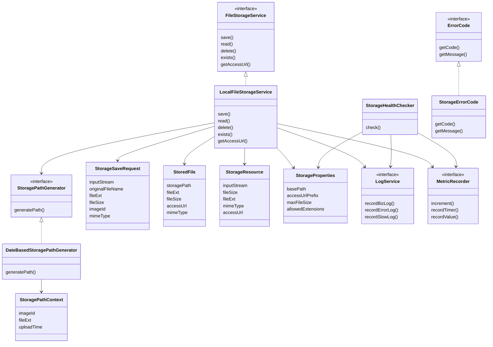
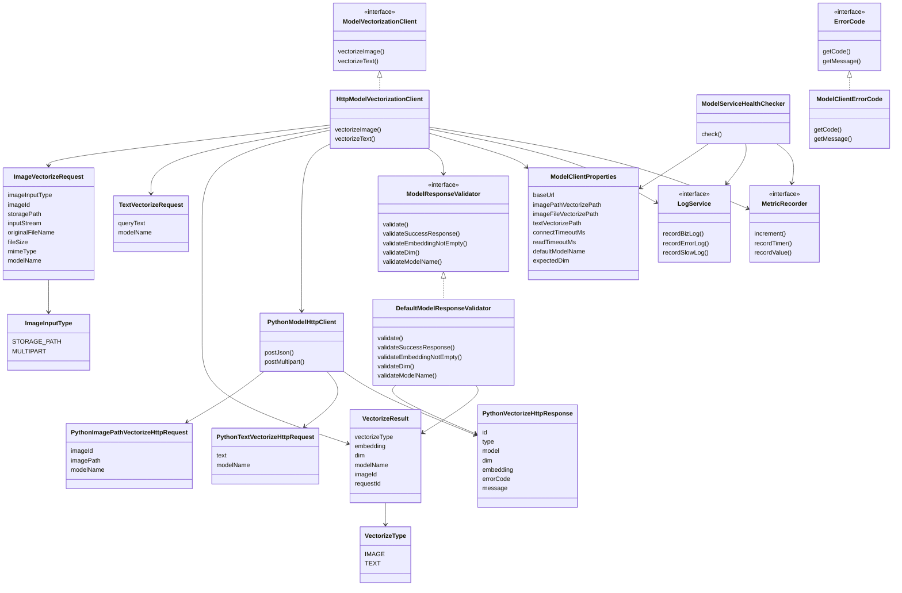
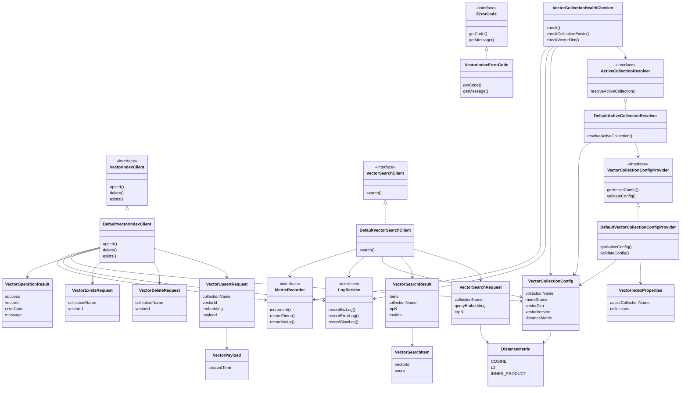

```mermaid
classDiagram
    class Result~T~ {
        code
        message
        data
        requestId
    }

    class PageResult~T~ {
        total
        pageNo
        pageSize
        records
    }

    class ResultFactory {
        success()
        fail()
    }

    class ErrorCode {
        <<interface>>
        getCode()
        getMessage()
    }

    class CommonErrorCode {
        getCode()
        getMessage()
    }

    class BizException {
        errorCode
        getErrorCode()
    }

    class SystemException {
        errorCode
        getErrorCode()
    }

    class GlobalExceptionHandler {
        handleBizException()
        handleSystemException()
        handleUnknownException()
    }

    class RequestContext {
        requestId
        traceId
        bizId
        module
        operation
    }

    class RequestContextHolder {
        set()
        get()
        clear()
    }

    class TraceIdGenerator {
        <<interface>>
        generateRequestId()
        generateTraceId()
    }

    class DefaultTraceIdGenerator {
        generateRequestId()
        generateTraceId()
    }

    class RequestContextFilter {
        doFilter()
    }

    class ContextAwareTaskDecorator {
        decorate()
    }

    class LogService {
        <<interface>>
        recordBizLog()
        recordSuccessLog()
        recordErrorLog()
        recordStateChangeLog()
        recordSlowLog()
    }

    class Slf4jLogService {
        recordBizLog()
        recordSuccessLog()
        recordErrorLog()
        recordStateChangeLog()
        recordSlowLog()
    }

    class LogContext {
        requestId
        traceId
        bizId
        module
        operation
        message
    }

    class MetricRecorder {
        <<interface>>
        increment()
        recordTimer()
        recordValue()
    }

    class LogMetricRecorder {
        increment()
        recordTimer()
        recordValue()
    }

    class MetricName
    class MetricTags

    class EventPublisher {
        <<interface>>
        publish()
    }

    class LogEventPublisher {
        publish()
    }

    class EventStore {
        <<interface>>
        recordEvent()
        markProcessing()
        markSuccess()
        markFailed()
        retryLater()
    }

    class LogEventStore {
        recordEvent()
        markProcessing()
        markSuccess()
        markFailed()
        retryLater()
    }

    class CommonEvent {
        eventId
        eventType
        eventStatus
        requestId
        traceId
        bizId
        sourceModule
        payload
    }

    class ExecutorProvider {
        <<interface>>
        getExecutor()
    }

    class DefaultExecutorProvider {
        getExecutor()
    }

    class ThreadPoolManager {
        getCommonExecutor()
        getExecutorByType()
    }

    class ExecutorBizType
    class ConcurrencyProperties

    class CacheService {
        <<interface>>
        get()
        put()
        evict()
        exists()
    }

    class NoOpCacheService {
        get()
        put()
        evict()
        exists()
    }

    class CacheKeyBuilder {
        buildSearchKey()
        buildVectorKey()
        buildImageKey()
    }

    class RateLimiter {
        <<interface>>
        tryAcquire()
    }

    class NoOpRateLimiter {
        tryAcquire()
    }

    class RateLimitContext
    class RateLimitResult

    ErrorCode <|.. CommonErrorCode
    BizException --> ErrorCode
    SystemException --> ErrorCode
    GlobalExceptionHandler --> BizException
    GlobalExceptionHandler --> SystemException
    GlobalExceptionHandler --> Result

    ResultFactory --> Result
    Result --> PageResult

    RequestContextHolder --> RequestContext
    TraceIdGenerator <|.. DefaultTraceIdGenerator
    RequestContextFilter --> RequestContextHolder
    RequestContextFilter --> TraceIdGenerator
    ContextAwareTaskDecorator --> RequestContextHolder

    LogService <|.. Slf4jLogService
    Slf4jLogService --> LogContext
    Slf4jLogService --> RequestContextHolder

    MetricRecorder <|.. LogMetricRecorder
    LogMetricRecorder --> MetricName
    LogMetricRecorder --> MetricTags

    EventPublisher <|.. LogEventPublisher
    EventStore <|.. LogEventStore
    LogEventPublisher --> CommonEvent
    LogEventStore --> CommonEvent

    ExecutorProvider <|.. DefaultExecutorProvider
    DefaultExecutorProvider --> ThreadPoolManager
    DefaultExecutorProvider --> ExecutorBizType
    DefaultExecutorProvider --> ConcurrencyProperties

    CacheService <|.. NoOpCacheService
    CacheKeyBuilder --> CacheService

    RateLimiter <|.. NoOpRateLimiter
    NoOpRateLimiter --> RateLimitContext
    NoOpRateLimiter --> RateLimitResult
```

```mermaid
classDiagram
    class SearchController {
        searchByImage()
        searchByText()
        searchByHybrid()
    }

    class ImageSearchRequest {
        queryImage
        topK
    }

    class TextSearchRequest {
        queryText
        topK
    }

    class HybridSearchRequest {
        queryImage
        queryText
        topK
    }

    class SearchApplicationService {
        <<interface>>
        search()
    }

    class DefaultSearchApplicationService {
        search()
    }

    class SearchCommand {
        searchType
        queryImage
        queryText
        topK
    }

    class SearchPipeline {
        <<interface>>
        execute()
    }

    class DefaultSearchPipeline {
        execute()
    }

    class SearchContext {
        searchType
        topK
        topN
        collectionContext
        queryEmbedding
        vectorSearchResult
        imageAssetBatchQueryResult
        filterResult
        rerankResult
    }

    class SearchRequestValidator {
        <<interface>>
        supportType()
        validate()
    }

    class ImageSearchRequestValidator {
        supportType()
        validate()
    }

    class TextSearchRequestValidator {
        supportType()
        validate()
    }

    class HybridSearchRequestValidator {
        supportType()
        validate()
    }

    class SearchValidateResult {
        valid
        errorCode
        message
    }

    class SearchCollectionResolver {
        <<interface>>
        resolve()
    }

    class DefaultSearchCollectionResolver {
        resolve()
    }

    class SearchCollectionContext {
        collectionName
        modelName
        vectorDim
        vectorVersion
        distanceMetric
    }

    class QueryVectorizer {
        <<interface>>
        supportType()
        vectorize()
    }

    class QueryVectorizerSelector {
        select()
    }

    class QueryVectorizeRequest {
        searchType
        queryImage
        queryText
    }

    class QueryEmbedding {
        searchType
        embedding
        dim
        modelName
    }

    class SearchEmbeddingValidator {
        <<interface>>
        validateNotEmpty()
        validateDim()
    }

    class DefaultSearchEmbeddingValidator {
        validateNotEmpty()
        validateDim()
    }

    class SearchEmbeddingValidateResult {
        valid
        actualDim
        expectedDim
        errorCode
    }

    class OverFetchStrategy {
        <<interface>>
        calculateTopN()
    }

    class DefaultOverFetchStrategy {
        calculateTopN()
    }

    class OverFetchContext {
        searchType
        topK
        maxTopN
        overFetchRatio
    }

    class VectorSearchClient {
        <<interface>>
        search()
    }

    class VectorSearchRequest {
        collectionName
        queryEmbedding
        topN
    }

    class VectorSearchResult {
        items
        collectionName
        topN
        costMs
    }

    class VectorSearchItem {
        vectorId
        score
    }

    class ImageAssetQueryService {
        <<interface>>
        batchQueryByIds()
    }

    class ImageAssetBatchQueryResult {
        items
    }

    class ImageAssetDTO {
        id
        imageUrl
        fileName
        originalFileName
        imageStatus
        vectorStatus
        width
        height
        mimeType
    }

    class SearchResultFilter {
        <<interface>>
        filter()
    }

    class DefaultSearchResultFilter {
        filter()
    }

    class SearchFilterContext {
        vectorItems
        imageAssets
        searchType
    }

    class SearchFilterResult {
        items
        orphanVectorCount
        invalidImageCount
    }

    class SearchResultItem {
        imageId
        imageUrl
        fileName
        score
        width
        height
        mimeType
    }

    class RerankStrategy {
        <<interface>>
        rerank()
    }

    class NoOpRerankStrategy {
        rerank()
    }

    class RerankContext {
        items
        searchType
        queryEmbedding
    }

    class RerankResult {
        items
        rerankApplied
    }

    class SearchResultAssembler {
        <<interface>>
        assemble()
    }

    class DefaultSearchResultAssembler {
        assemble()
    }

    class SearchAssembleContext {
        searchType
        items
        topK
        costMs
        totalRecallCount
        orphanVectorCount
        invalidImageCount
    }

    class SearchResponse {
        searchType
        total
        items
        costMs
    }

    class SearchProperties {
        defaultTopK
        maxTopK
        overFetchRatio
        maxTopN
        rerankEnabled
        cacheEnabled
    }

    class SearchErrorCode {
        getCode()
        getMessage()
    }

    class ErrorCode {
        <<interface>>
        getCode()
        getMessage()
    }

    class LogService {
        <<interface>>
        recordBizLog()
        recordErrorLog()
        recordSlowLog()
    }

    class MetricRecorder {
        <<interface>>
        increment()
        recordTimer()
        recordValue()
    }

    SearchController --> ImageSearchRequest
    SearchController --> TextSearchRequest
    SearchController --> HybridSearchRequest
    SearchController --> SearchApplicationService

    SearchApplicationService <|.. DefaultSearchApplicationService
    DefaultSearchApplicationService --> SearchCommand
    DefaultSearchApplicationService --> SearchPipeline
    DefaultSearchApplicationService --> LogService
    DefaultSearchApplicationService --> MetricRecorder

    SearchPipeline <|.. DefaultSearchPipeline
    DefaultSearchPipeline --> SearchContext
    DefaultSearchPipeline --> SearchRequestValidator
    DefaultSearchPipeline --> SearchCollectionResolver
    DefaultSearchPipeline --> QueryVectorizerSelector
    DefaultSearchPipeline --> SearchEmbeddingValidator
    DefaultSearchPipeline --> OverFetchStrategy
    DefaultSearchPipeline --> VectorSearchClient
    DefaultSearchPipeline --> ImageAssetQueryService
    DefaultSearchPipeline --> ImageAssetBatchQueryResult
    DefaultSearchPipeline --> SearchResultFilter
    DefaultSearchPipeline --> RerankStrategy
    DefaultSearchPipeline --> SearchResultAssembler
    DefaultSearchPipeline --> SearchProperties
    DefaultSearchPipeline --> LogService
    DefaultSearchPipeline --> MetricRecorder

    SearchContext --> SearchCollectionContext
    SearchContext --> QueryEmbedding
    SearchContext --> VectorSearchResult
    SearchContext --> ImageAssetBatchQueryResult
    SearchContext --> SearchFilterResult
    SearchContext --> RerankResult

    SearchRequestValidator <|.. ImageSearchRequestValidator
    SearchRequestValidator <|.. TextSearchRequestValidator
    SearchRequestValidator <|.. HybridSearchRequestValidator
    SearchRequestValidator --> SearchValidateResult

    SearchCollectionResolver <|.. DefaultSearchCollectionResolver
    DefaultSearchCollectionResolver --> SearchCollectionContext

    QueryVectorizerSelector --> QueryVectorizer
    QueryVectorizer --> QueryVectorizeRequest
    QueryVectorizer --> QueryEmbedding

    SearchEmbeddingValidator <|.. DefaultSearchEmbeddingValidator
    DefaultSearchEmbeddingValidator --> SearchEmbeddingValidateResult
    DefaultSearchEmbeddingValidator --> QueryEmbedding
    DefaultSearchEmbeddingValidator --> SearchCollectionContext

    OverFetchStrategy <|.. DefaultOverFetchStrategy
    DefaultOverFetchStrategy --> OverFetchContext
    DefaultOverFetchStrategy --> SearchProperties

    VectorSearchClient --> VectorSearchRequest
    VectorSearchClient --> VectorSearchResult
    VectorSearchResult --> VectorSearchItem

    ImageAssetQueryService --> ImageAssetBatchQueryResult
    ImageAssetBatchQueryResult --> ImageAssetDTO

    SearchResultFilter <|.. DefaultSearchResultFilter
    DefaultSearchResultFilter --> SearchFilterContext
    DefaultSearchResultFilter --> SearchFilterResult
    SearchFilterContext --> VectorSearchItem
    SearchFilterContext --> ImageAssetDTO
    SearchFilterResult --> SearchResultItem

    RerankStrategy <|.. NoOpRerankStrategy
    NoOpRerankStrategy --> RerankContext
    NoOpRerankStrategy --> RerankResult
    RerankContext --> SearchResultItem
    RerankResult --> SearchResultItem

    SearchResultAssembler <|.. DefaultSearchResultAssembler
    DefaultSearchResultAssembler --> SearchAssembleContext
    DefaultSearchResultAssembler --> SearchResponse
    SearchAssembleContext --> SearchResultItem
    SearchResponse --> SearchResultItem

    ErrorCode <|.. SearchErrorCode
```

# 模块设计文档
## common模块设计
### 模块说明
| 模块   | common                                                             |
| ---- | ------------------------------------------------------------------ |
| 定位   | 通用基础模块                                                             |
| 主要作用 | 为其他模块提供统一规范和横切能力                                                   |
| 使用方  | image-asset、storage、vectorization、model-client、vector-index、search |
### 模块职责
|职责|说明|
|---|---|
|统一响应|定义接口统一返回结构|
|统一错误|定义错误码接口、通用错误码、业务异常、系统异常|
|请求上下文|管理 requestId、traceId、bizId、module、operation|
|日志记录|统一记录业务日志、成功日志、异常日志、状态变更日志、慢日志|
|指标记录|统一记录次数、耗时、数值类指标|
|补偿事件|MVP 阶段只把待补偿事件记录到 event.log，不执行具体补偿业务；后续再扩展事件落库、消费和补偿执行|
|线程池分派|统一管理线程池入口，MVP 共享线程池，后续支持隔离线程池|
|缓存抽象|提供缓存统一接口，MVP 空实现，后续接 Redis|
|限流抽象|提供限流统一接口，MVP 默认放行，后续接本地或分布式限流|
|通用配置|管理日志、指标、事件、线程池、缓存、限流等配置|
### 对应接口设计
1. **统一相应**

| 实现类 / 数据类       | 对应接口 | 核心函数 / 字段                                            | 功能说明                                       |
| --------------- | ---- | ---------------------------------------------------- | ------------------------------------------ |
| `Result<T>`     | 无    | `success`、`fail`、`code`、`message`、`data`、`requestId` | 所有接口统一返回外壳                                 |
| `PageResult<T>` | 无    | `total`、`pageNo`、`pageSize`、`records`                | 分页数据结构，通常作为 `Result<PageResult<T>>` 的 data |
| `ResultFactory` | 无    | `success`、`fail`                                     | 可选工具类，统一创建返回结果                             |
2. **统一错误**

| 实现类 / 枚举                 | 对应接口        | 核心函数                                                                  | 功能说明                          |
| ------------------------ | ----------- | --------------------------------------------------------------------- | ----------------------------- |
| `ErrorCode`              | 无           | `getCode`、`getMessage`                                                | 全系统错误码接口                      |
| `CommonErrorCode`        | `ErrorCode` | `getCode`、`getMessage`                                                | common 通用错误码，例如参数错误、系统错误、请求过多 |
| `BizException`           | 无           | `getErrorCode`                                                        | 业务异常，携带 `ErrorCode`           |
| `SystemException`        | 无           | `getErrorCode`                                                        | 系统异常，表示不可预期错误                 |
| `GlobalExceptionHandler` | 无           | `handleBizException`、`handleSystemException`、`handleUnknownException` | 全局异常处理，统一转换为 `Result`         |

3. **请求上下文**

| 实现类                         | 对应接口               | 核心函数 / 字段                                          | 功能说明                   |
| --------------------------- | ------------------ | -------------------------------------------------- | ---------------------- |
| `RequestContext`            | 无                  | `requestId`、`traceId`、`bizId`、`module`、`operation` | 保存当前请求或任务上下文           |
| `RequestContextHolder`      | 无                  | `set`、`get`、`clear`                                | 基于 ThreadLocal 保存上下文   |
| `DefaultTraceIdGenerator`   | `TraceIdGenerator` | `generateRequestId`、`generateTraceId`              | 生成 requestId 和 traceId |
| `RequestContextFilter`      | 无                  | `doFilter`                                         | HTTP 请求入口初始化上下文        |
| `ContextAwareTaskDecorator` | 无                  | `decorate`                                         | 异步任务中传递上下文             |

|接口|函数|说明|
|---|---|---|
|`TraceIdGenerator`|`generateRequestId`|生成单次请求 ID|
|`TraceIdGenerator`|`generateTraceId`|生成链路追踪 ID|

4. **日志记录**

| 实现类               | 对应接口         | 核心函数                   | 功能说明       |
| ----------------- | ------------ | ---------------------- | ---------- |
| `Slf4jLogService` | `LogService` | `recordBizLog`         | 记录普通业务节点日志 |
| `Slf4jLogService` | `LogService` | `recordSuccessLog`     | 记录成功节点日志   |
| `Slf4jLogService` | `LogService` | `recordErrorLog`       | 记录异常日志     |
| `Slf4jLogService` | `LogService` | `recordStateChangeLog` | 记录状态变更日志   |
| `Slf4jLogService` | `LogService` | `recordSlowLog`        | 记录慢链路日志    |

|数据类 / 枚举|说明|
|---|---|
|`LogContext`|日志上下文，包含 requestId、traceId、bizId、module、operation、message|
|`LogEventName`|日志事件名称枚举|
|`LogProperties`|日志配置，例如是否开启慢日志、慢请求阈值|

5. **指标记录**

|实现类|对应接口|核心函数|功能说明|
|---|---|---|---|
|`LogMetricRecorder`|`MetricRecorder`|`increment`|记录次数类指标|
|`LogMetricRecorder`|`MetricRecorder`|`recordTimer`|记录耗时类指标|
|`LogMetricRecorder`|`MetricRecorder`|`recordValue`|记录数值类指标|

| 数据类 / 枚举           | 说明                                         |
| ------------------ | ------------------------------------------ |
| `MetricName`       | 指标名称，例如 `search_total_count`               |
| `MetricTags`       | 指标标签，例如 `searchType=TEXT`、`status=SUCCESS` |
| `MetricProperties` | 指标配置，例如是否开启指标、采样率                          |

6. **补偿事件**

| 实现类                 | 对应接口             | 核心函数             | 功能说明              |
| ------------------- | ---------------- | ---------------- | ----------------- |
| `LogEventPublisher` | `EventPublisher` | `publish`        | MVP 阶段将待补偿事件追加写入 event.log |
| `LogEventStore`     | `EventStore`     | `recordEvent`    | 记录事件日志；MVP 只追加记录，不消费 |
| `LogEventStore`     | `EventStore`     | `markProcessing` | 后续扩展，标记事件处理中 |
| `LogEventStore`     | `EventStore`     | `markSuccess`    | 后续扩展，标记事件处理成功 |
| `LogEventStore`     | `EventStore`     | `markFailed`     | 后续扩展，标记事件处理失败 |
| `LogEventStore`     | `EventStore`     | `retryLater`     | 后续扩展，记录事件后续重试 |

| 数据类 / 枚举          | 说明                                        |
| ----------------- | ----------------------------------------- |
| `CommonEvent`     | 通用事件对象                                    |
| `EventType`       | 事件类型，例如孤儿文件、孤儿向量、向量化失败                    |
| `EventStatus`     | 事件状态，例如 WAITING、PROCESSING、SUCCESS、FAILED；MVP 只使用 WAITING / RECORDED 语义 |
| `EventProperties` | 事件配置，例如是否开启事件记录、event.log 路径；最大重试次数属于后续补偿扩展 |
- MVP 阶段 `common` 只发布和记录事件到 event.log，不读取 event.log，不执行补偿。
- 具体补偿执行器，例如 `OrphanFileCleaner`、`OrphanVectorCleaner`，后续在对应业务模块扩展。
- `PendingVectorizationScanner`、`ProcessingTimeoutScanner` 可以直接基于 `image_asset` 状态字段做后续扫描，不依赖事件表。

7. **线程池分派**

|实现类|对应接口|核心函数|功能说明|
|---|---|---|---|
|`DefaultExecutorProvider`|`ExecutorProvider`|`getExecutor`|根据业务类型返回 Executor；MVP 可统一返回公共线程池|
|`ThreadPoolManager`|无|`getCommonExecutor`、`getExecutorByType`|统一管理线程池|
|`ContextAwareTaskDecorator`|无|`decorate`|保证异步任务继承 requestId、traceId|

| 数据类 / 枚举                | 说明                                                      |
| ----------------------- | ------------------------------------------------------- |
| `ExecutorBizType`       | 线程池业务类型，例如 COMMON、UPLOAD、SEARCH、VECTORIZATION、LOG、EVENT |
| `ConcurrencyProperties` | 线程池配置，例如核心线程数、最大线程数、队列长度、拒绝策略                           |

8. 缓存抽象

| 实现类                | 对应接口           | 核心函数                                              | 功能说明          |
| ------------------ | -------------- | ------------------------------------------------- | ------------- |
| `NoOpCacheService` | `CacheService` | `get`                                             | MVP 空实现，永远返回空 |
| `NoOpCacheService` | `CacheService` | `put`                                             | MVP 空实现，不写缓存  |
| `NoOpCacheService` | `CacheService` | `evict`                                           | MVP 空实现，不删除缓存 |
| `NoOpCacheService` | `CacheService` | `exists`                                          | MVP 空实现，默认不存在 |
| `CacheKeyBuilder`  | 无              | `buildSearchKey`、`buildVectorKey`、`buildImageKey` | 统一生成缓存 key    |

| 数据类 / 枚举          | 说明                                             |
| ----------------- | ---------------------------------------------- |
| `CacheProperties` | 缓存配置，例如开关、TTL、key 前缀                           |
| `CacheType`       | 缓存类型，例如 SEARCH_RESULT、TEXT_VECTOR、IMAGE_VECTOR |

9. **限流抽象**

|实现类|对应接口|核心函数|功能说明|
|---|---|---|---|
|`NoOpRateLimiter`|`RateLimiter`|`tryAcquire`|MVP 默认放行所有请求|
|`RateLimitContext`|无|`module`、`operation`、`userId`、`clientIp`|限流上下文|
|`RateLimitResult`|无|`allowed`、`errorCode`、`message`|限流结果|

| 数据类 / 枚举              | 说明                  |
| --------------------- | ------------------- |
| `RateLimitProperties` | 限流配置，例如开关、阈值、时间窗口   |
| `RateLimitType`       | 限流类型，例如接口级、用户级、IP 级 |

### 模块类图


---

## storage模块设计
### 模块说明
| 模块     | storage                           |
| ------ | --------------------------------- |
| 定位     | 文件存储模块                            |
| 主要作用   | 屏蔽底层文件存储方式，为业务模块提供统一的文件保存、读取、删除能力 |
| 使用方    | image-asset、vectorization、search  |
| MVP 实现 | 本地文件系统                            |
| 设计目标   | 后续从本地文件系统切换到对象存储时，不影响业务模块调用方式     |

### 模块职责

|职责|说明|
|---|---|
|文件保存|接收文件内容，保存到本地文件系统|
|文件读取|根据 `storagePath` 读取文件，供向量化任务使用|
|文件删除|根据 `storagePath` 删除文件，用于上传失败补偿和图片删除|
|文件存在性检查|判断文件是否存在，避免向量化读取不存在文件|
|访问地址生成|根据 `storagePath` 生成前端可访问 URL|
|路径生成|统一生成图片存储路径，避免业务模块拼接路径|
|存储健康检查|检查本地存储目录是否存在、是否可读写|
|存储错误管理|定义 storage 模块自身错误码|
|日志与指标记录|记录文件保存、读取、删除的结果和耗时|

1. **文件操作 - 保存/读取/删除**

| 实现类 / 数据类                 | 对应接口                 | 核心函数 / 字段                                                                  | 功能说明                    |
| ------------------------- | -------------------- | -------------------------------------------------------------------------- | ----------------------- |
| `LocalFileStorageService` | `FileStorageService` | `save`                                                                     | 保存文件到本地文件系统，返回保存结果      |
| `LocalFileStorageService` | `FileStorageService` | `read`                                                                     | 根据 `storagePath` 读取文件   |
| `LocalFileStorageService` | `FileStorageService` | `delete`                                                                   | 根据 `storagePath` 删除文件   |
| `LocalFileStorageService` | `FileStorageService` | `exists`                                                                   | 判断文件是否存在                |
| `LocalFileStorageService` | `FileStorageService` | `getAccessUrl`                                                             | 根据 `storagePath` 生成访问地址 |
| `StorageSaveRequest`      | 无                    | `inputStream`、`originalFileName`、`fileExt`、`fileSize`、`imageId`、`mimeType` | 文件保存请求对象                |
| `StoredFile`              | 无                    | `storagePath`、`fileExt`、`accessUrl`、`mimeType`、`fileSize`                  | 文件保存成功后的返回结果            |
| `StorageResource`         | 无                    | `inputStream`、`fileSize`、`fileExt`、`mimeType`、`accessUrl`                  | 文件读取返回结果                |

- `originalFileName`只用于日志记录，并不参与文件逻辑路径生成 
- `accessUrl`是前端访问图片的地址，由`Service`生成并包装进`StorageResource`返回到前端
- `imageId` 由 `image-asset` 模块在保存文件前提前生成，使用雪花 ID。`storage` 模块不负责生成业务 ID，只根据 `imageId` 和 `fileExt` 生成系统文件名与逻辑存储路径。

| 接口                   | 函数             | 说明       |
| -------------------- | -------------- | -------- |
| `FileStorageService` | `save`         | 保存文件     |
| `FileStorageService` | `read`         | 读取文件     |
| `FileStorageService` | `delete`       | 删除文件     |
| `FileStorageService` | `exists`       | 判断文件是否存在 |
| `FileStorageService` | `getAccessUrl` | 生成文件访问地址 |

2. **路径生成**

| 实现类 / 数据类                       | 对应接口                   | 核心函数 / 字段                                                                  | 功能说明                    |
| ------------------------------- | ---------------------- | -------------------------------------------------------------------------- | ----------------------- |
| `DateBasedStoragePathGenerator` | `StoragePathGenerator` | `generatePath`                                                             | 根据保存请求生成存储路径            |
| `StorageSaveRequest`            | 无                      | `inputStream`、`originalFileName`、`fileExt`、`fileSize`、`imageId`、`mimeType` | 文件保存请求对象                |

| 接口                     | 函数             | 说明                 |
| ---------------------- | -------------- | ------------------ |
| `StoragePathGenerator` | `generatePath` | 生成统一 `storagePath` |

3. **存储健康检查**

| 实现类                    | 对应接口 | 核心函数    | 功能说明               |
| ---------------------- | ---- | ------- | ------------------ |
| `StorageHealthChecker` | 无    | `check` | 检查本地存储目录是否存在、是否可读写 |


4. **存储配置**

|配置类|核心字段|功能说明|
|---|---|---|
|`StorageProperties`|`basePath`|本地文件存储根目录|
|`StorageProperties`|`accessUrlPrefix`|文件访问 URL 前缀|
|`StorageProperties`|`maxFileSize`|最大文件大小限制，可供 image-asset 校验使用|
|`StorageProperties`|`allowedExtensions`|允许的文件扩展名，可供 image-asset 校验使用|
`storage`提供承载功能，但具体的文件格式校验交由 `image_asset`负责


5. **存储错误管理**

|实现类 / 枚举|对应接口|核心函数|功能说明|
|---|---|---|---|
|`StorageErrorCode`|`ErrorCode`|`getCode`、`getMessage`|storage 模块错误码|

|错误码|说明|
|---|---|
|`FILE_SAVE_FAILED`|文件保存失败|
|`FILE_READ_FAILED`|文件读取失败|
|`FILE_DELETE_FAILED`|文件删除失败|
|`FILE_NOT_FOUND`|文件不存在|
|`STORAGE_UNAVAILABLE`|存储不可用|
|`STORAGE_PATH_INVALID`|存储路径非法|

6. **日志与指标记录**

|实现类|依赖接口|核心记录内容|功能说明|
|---|---|---|---|
|`LocalFileStorageService`|`LogService`|`storagePath`、`operation`、`success`、`failReason`|记录文件操作日志|
|`LocalFileStorageService`|`MetricRecorder`|保存耗时、读取耗时、删除耗时、失败次数|记录文件操作指标|
|`StorageHealthChecker`|`LogService`|存储目录、检查结果、失败原因|记录存储健康检查日志|
|`StorageHealthChecker`|`MetricRecorder`|健康检查次数、不可用次数|记录存储健康指标|

### 模块类图



## image_asset 模块设计
### 模块说明

|模块|image-asset|
|---|---|
|定位|图片资产模块|
|主要作用|负责图片上传、元数据管理、图片状态管理、向量状态管理、去重和基础查询|
|使用方|search、vectorization、storage|
|依赖模块|storage、vectorization、common|
|核心数据表|`image_asset`|
|设计目标|以 MySQL 作为图片资产主数据源，统一维护图片元数据和状态|
### 模块职责

| 职责         | 说明                                      |
| ---------- | --------------------------------------- |
| 图片上传入库     | 接收上传请求，完成校验、去重、文件保存、元数据入库、触发向量化任务       |
| 图片基础校验     | 校验文件为空、大小、扩展名、MIME、图片可解析性               |
| 图片信息解析     | 解析文件扩展名、MIME、宽度、高度、文件大小                 |
| 文件 hash 计算 | 基于文件内容计算 `file_hash`，用于图片去重             |
| 图片去重       | 根据 `file_hash` 判断是否重复，重复则直接拒绝           |
| 图片 ID 生成   | 上传前生成 `imageId`，用于文件路径和数据库主键            |
| 图片元数据管理    | 维护 `image_asset` 表中的文件名、路径、大小、宽高等字段     |
| 图片状态管理     | 维护 `image_status`                       |
| 向量状态管理     | 维护 `vector_status`                      |
| 图片查询       | 支持详情查询、批量查询、分页查询                        |
| 搜索回表支持     | 根据 imageId 批量查询图片元数据，供 search 模块过滤和组装结果 |
| 向量化任务支持    | 向 vectorization 模块提供图片元数据和状态更新能力        |
| 上传失败补偿     | MySQL 入库失败时调用 storage 删除已保存文件           |
| 错误码管理      | 定义 image-asset 模块自身错误码                  |
| 日志与指标记录    | 记录上传、去重、入库、状态变更、查询等日志和指标                |

### 对应接口设计

1. **图片上传入口**

| 实现类 / 数据类              | 对应接口 | 核心函数 / 字段                                                                                                         | 功能说明                       |
| ---------------------- | ---- | ----------------------------------------------------------------------------------------------------------------- | -------------------------- |
| `ImageAssetController` | 无    | `upload`                                                                                                          | 接收 `POST /api/images` 上传请求 |
| `ImageAssetController` | 无    | `getDetail`                                                                                                       | 查询图片详情                     |
| `ImageAssetController` | 无    | `pageQuery`                                                                                                       | 分页查询图片列表                   |
| `ImageAssetController` | 无    | `delete`                                                                                                          | 逻辑删除图片                     |
| `ImageUploadRequest`   | 无    | `imageFile`                                                                                                       | 图片上传请求对象                   |
| `ImageUploadResponse`  | 无    | `imageId`、`originalFileName`、`imageUrl`、`imageStatus`、`vectorStatus`                                              | 上传成功返回对象                   |
| `ImageDetailResponse`  | 无    | `id`、`fileName`、`originalFileName`、`fileSize`、`mimeType`、`width`、`height`、`imageStatus`、`vectorStatus`、`imageUrl` | 图片详情返回对象                   |
| `ImageAssetPageQuery`  | 无    | `pageNo`、`pageSize`、`imageStatus`、`vectorStatus`                                                                  | 图片分页查询条件                   |

2. **图片上传应用服务**

|实现类|对应接口|核心函数|功能说明|
|---|---|---|---|
|`DefaultImageAssetApplicationService`|`ImageAssetApplicationService`|`upload`|编排图片上传完整流程|
|`DefaultImageAssetApplicationService`|`ImageAssetApplicationService`|`getDetail`|查询图片详情并生成访问 URL|
|`DefaultImageAssetApplicationService`|`ImageAssetApplicationService`|`pageQuery`|分页查询图片列表|
|`DefaultImageAssetApplicationService`|`ImageAssetApplicationService`|`delete`|逻辑删除图片资产|

|接口|函数|说明|
|---|---|---|
|`ImageAssetApplicationService`|`upload`|上传图片并写入元数据|
|`ImageAssetApplicationService`|`getDetail`|查询图片详情|
|`ImageAssetApplicationService`|`pageQuery`|分页查询图片|
|`ImageAssetApplicationService`|`delete`|删除图片资产，MVP 先逻辑删除|

- pageQuery 用于图库管理列表，不用于搜索链路。

3. **上传命令与返回模型**

| 数据类                  | 核心字段                                                                                                   | 功能说明       |
| -------------------- | ------------------------------------------------------------------------------------------------------ | ---------- |
| `ImageUploadCommand` | `inputStream`、`originalFileName`、`fileSize`、`mimeType`、`fileHash`、`fileExt`、`width`、`height`、`imageId` | 应用层上传命令    |
| `ImageUploadResult`  | `imageId`、`originalFileName`、`imageUrl`、`imageStatus`、`vectorStatus`                                   | 应用层上传结果    |
| `ImageAssetDTO`      | `id`、`fileName`、`originalFileName`、`storagePath`、`imageStatus`、`vectorStatus`                          | 图片资产数据传输对象 |

4. **图片校验**

| 实现类                           | 对应接口                   | 核心函数                    | 功能说明       |
| ----------------------------- | ---------------------- | ----------------------- | ---------- |
| `DefaultImageUploadValidator` | `ImageUploadValidator` | `validate`              | 统一校验上传图片   |
| `DefaultImageUploadValidator` | `ImageUploadValidator` | `validateFileNotEmpty`  | 校验文件不能为空   |
| `DefaultImageUploadValidator` | `ImageUploadValidator` | `validateFileSize`      | 校验文件大小     |
| `DefaultImageUploadValidator` | `ImageUploadValidator` | `validateFileExt`       | 校验文件扩展名    |
| `DefaultImageUploadValidator` | `ImageUploadValidator` | `validateMimeType`      | 校验 MIME 类型 |
| `DefaultImageUploadValidator` | `ImageUploadValidator` | `validateImageReadable` | 校验图片是否可解析  |

|接口|函数|说明|
|---|---|---|
|`ImageUploadValidator`|`validate`|执行上传前完整校验|

5. **图片信息解析**

|实现类 / 数据类|对应接口|核心函数 / 字段|功能说明|
|---|---|---|---|
|`DefaultImageMetadataExtractor`|`ImageMetadataExtractor`|`extract`|解析图片基础信息|
|`ImageMetadata`|无|`fileExt`、`mimeType`、`width`、`height`、`fileSize`|图片基础元数据|

|接口|函数|说明|
|---|---|---|
|`ImageMetadataExtractor`|`extract`|从图片文件中解析宽高、类型等信息|

6. **文件 hash 与文件名生成**

|实现类|对应接口|核心函数|功能说明|
|---|---|---|---|
|`Sha256FileHashCalculator`|`FileHashCalculator`|`calculateHash`|计算文件 SHA-256 hash|
|`DefaultImageFileNameGenerator`|`ImageFileNameGenerator`|`generateFileName`|根据 imageId 和 fileExt 生成系统文件名|
|`SnowflakeImageIdGenerator`|`ImageIdGenerator`|`nextId`|生成图片 ID|

|接口|函数|说明|
|---|---|---|
|`FileHashCalculator`|`calculateHash`|计算文件内容 hash|
|`ImageFileNameGenerator`|`generateFileName`|生成系统文件名，例如 `100001.jpg`|
|`ImageIdGenerator`|`nextId`|生成图片主键 ID|

说明：`file_hash` 当前数据模型是 `CHAR(64)`，因此默认采用 SHA-256。

7. **图片去重**

|实现类|对应接口|核心函数|功能说明|
|---|---|---|---|
|`DefaultImageDuplicateChecker`|`ImageDuplicateChecker`|`checkDuplicate`|根据 `file_hash` 判断图片是否重复|
|`DefaultImageDuplicateChecker`|`ImageDuplicateChecker`|`existsByFileHash`|判断 hash 是否已存在|

|接口|函数|说明|
|---|---|---|
|`ImageDuplicateChecker`|`checkDuplicate`|重复则抛出 `DUPLICATE_IMAGE`|
|`ImageDuplicateChecker`|`existsByFileHash`|返回是否存在相同 hash|

8. **图片元数据持久化**

|实现类 / 数据类|对应接口|核心函数 / 字段|功能说明|
|---|---|---|---|
|`ImageAssetRepositoryImpl`|`ImageAssetRepository`|`save`|新增图片资产记录|
|`ImageAssetRepositoryImpl`|`ImageAssetRepository`|`findById`|根据 ID 查询图片|
|`ImageAssetRepositoryImpl`|`ImageAssetRepository`|`findByIds`|批量查询图片|
|`ImageAssetRepositoryImpl`|`ImageAssetRepository`|`existsByFileHash`|根据 hash 判断是否存在|
|`ImageAssetRepositoryImpl`|`ImageAssetRepository`|`pageQuery`|分页查询图片|
|`ImageAssetRepositoryImpl`|`ImageAssetRepository`|`updateImageStatus`|更新图片状态|
|`ImageAssetRepositoryImpl`|`ImageAssetRepository`|`updateVectorStatus`|更新向量状态|
|`ImageAssetRepositoryImpl`|`ImageAssetRepository`|`updateVectorReady`|更新向量完成状态|
|`ImageAssetRepositoryImpl`|`ImageAssetRepository`|`updateVectorFailed`|更新向量失败状态|
|`ImageAssetPO`|无|`id`、`fileName`、`originalFileName`、`fileHash`、`fileSize`、`mimeType`、`fileExt`、`width`、`height`、`storagePath`、`thumbnailPath`、`imageStatus`、`vectorStatus`、`vectorUpdatedTime`、`processingStartedTime`、`retryCount`、`failReason`、`version`、`createdTime`、`updatedTime`|对应 `image_asset` 表|

|接口|函数|说明|
|---|---|---|
|`ImageAssetRepository`|`save`|保存图片元数据|
|`ImageAssetRepository`|`findById`|单个查询|
|`ImageAssetRepository`|`findByIds`|批量查询|
|`ImageAssetRepository`|`existsByFileHash`|去重查询|
|`ImageAssetRepository`|`pageQuery`|分页查询|
|`ImageAssetRepository`|`updateImageStatus`|更新 `image_status`|
|`ImageAssetRepository`|`updateVectorStatus`|更新 `vector_status`|
|`ImageAssetRepository`|`updateVectorReady`|标记向量 READY|
|`ImageAssetRepository`|`updateVectorFailed`|标记向量 FAILED|

9. **图片查询服务**

|实现类|对应接口|核心函数|功能说明|
|---|---|---|---|
|`DefaultImageAssetQueryService`|`ImageAssetQueryService`|`getById`|根据 imageId 查询图片|
|`DefaultImageAssetQueryService`|`ImageAssetQueryService`|`batchQueryByIds`|批量查询图片，供 search 回表|
|`DefaultImageAssetQueryService`|`ImageAssetQueryService`|`pageQuery`|分页查询图片|
|`DefaultImageAssetQueryService`|`ImageAssetQueryService`|`getSearchableAssets`|返回可搜索图片，即 NORMAL + READY|

|接口|函数|说明|
|---|---|---|
|`ImageAssetQueryService`|`getById`|查询单张图片|
|`ImageAssetQueryService`|`batchQueryByIds`|根据 imageId 批量查询|
|`ImageAssetQueryService`|`pageQuery`|分页查询|
|`ImageAssetQueryService`|`getSearchableAssets`|过滤可搜索图片|

10. **图片状态服务**

|实现类|对应接口|核心函数|功能说明|
|---|---|---|---|
|`DefaultImageAssetStatusService`|`ImageAssetStatusService`|`markNormal`|标记图片正常|
|`DefaultImageAssetStatusService`|`ImageAssetStatusService`|`markDeleted`|逻辑删除图片|
|`DefaultImageAssetStatusService`|`ImageAssetStatusService`|`markInvalid`|标记图片异常|
|`DefaultImageAssetStatusService`|`ImageAssetStatusService`|`markVectorPending`|标记待向量化|
|`DefaultImageAssetStatusService`|`ImageAssetStatusService`|`markVectorProcessing`|标记向量化处理中，并写入 `processing_started_time`|
|`DefaultImageAssetStatusService`|`ImageAssetStatusService`|`markVectorReady`|标记向量 READY，并写入 `vector_updated_time`|
|`DefaultImageAssetStatusService`|`ImageAssetStatusService`|`markVectorFailed`|标记向量失败，并写入 `fail_reason`|
|`DefaultImageAssetStatusService`|`ImageAssetStatusService`|`increaseRetryCount`|增加重试次数|
|`DefaultImageAssetStatusService`|`ImageAssetStatusService`|`resetProcessingToPending`|将超时 PROCESSING 回退为 PENDING|

|接口|函数|说明|
|---|---|---|
|`ImageAssetStatusService`|`markNormal`|图片可用|
|`ImageAssetStatusService`|`markDeleted`|图片逻辑删除|
|`ImageAssetStatusService`|`markInvalid`|图片文件缺失或不可读|
|`ImageAssetStatusService`|`markVectorPending`|初始化或重试待处理|
|`ImageAssetStatusService`|`markVectorProcessing`|向量化开始|
|`ImageAssetStatusService`|`markVectorReady`|向量化成功|
|`ImageAssetStatusService`|`markVectorFailed`|向量化失败|
|`ImageAssetStatusService`|`increaseRetryCount`|更新重试次数|
|`ImageAssetStatusService`|`resetProcessingToPending`|处理卡死任务|

说明：状态更新需要使用 `version` 乐观锁，避免并发任务覆盖状态。

11. **状态判断规则**

| 实现类                             | 对应接口                     | 核心函数                    | 功能说明               |
| ------------------------------- | ------------------------ | ----------------------- | ------------------ |
| `DefaultImageAssetStateChecker` | `ImageAssetStateChecker` | `isDisplayable`         | 判断图片是否可展示          |
| `DefaultImageAssetStateChecker` | `ImageAssetStateChecker` | `isSearchable`          | 判断图片是否可搜索          |
| `DefaultImageAssetStateChecker` | `ImageAssetStateChecker` | `canStartVectorization` | 判断是否允许开始向量化        |
| `DefaultImageAssetStateChecker` | `ImageAssetStateChecker` | `isProcessingTimeout`   | 判断 PROCESSING 是否超时 |


|接口|函数|说明|
|---|---|---|
|`ImageAssetStateChecker`|`isDisplayable`|`image_status = NORMAL`|
|`ImageAssetStateChecker`|`isSearchable`|`image_status = NORMAL && vector_status = READY`|
|`ImageAssetStateChecker`|`canStartVectorization`|`image_status = NORMAL && vector_status = PENDING`|
|`ImageAssetStateChecker`|`isProcessingTimeout`|判断是否需要回退为 PENDING|

12. **孤儿文件日志**

|实现类 / 数据类|对应接口|核心函数 / 字段|功能说明|
|---|---|---|---|
|`LogOrphanFileLogService`|`OrphanFileLogService`|`recordOrphanFile`|MVP 阶段记录孤儿文件日志|
|`OrphanFileRecord`|无|`storagePath`、`fileHash`、`failReason`、`retryCount`、`cleanStatus`|孤儿文件记录对象|

|接口|函数|说明|
|---|---|---|
|`OrphanFileLogService`|`recordOrphanFile`|记录文件已保存但 MySQL 入库失败的情况|

说明：当前数据模型没有单独设计 `orphan_file_log` 表，因此 MVP 阶段先走日志记录，不新增数据库表。

13. **枚举与错误码**

|实现类 / 枚举|对应接口|核心函数 / 字段|功能说明|
|---|---|---|---|
|`ImageStatus`|无|`NORMAL(1)`、`DELETED(2)`、`INVALID(3)`|图片状态枚举|
|`VectorStatus`|无|`PENDING(1)`、`PROCESSING(2)`、`READY(3)`、`FAILED(4)`|向量状态枚举|
|`FailReason`|无|`FILE_NOT_FOUND`、`IMAGE_DECODE_ERROR`、`MODEL_SERVICE_TIMEOUT`、`MODEL_SERVICE_ERROR`、`VECTOR_DIM_MISMATCH`、`VECTOR_DB_UPSERT_FAILED`、`READY_UPDATE_FAILED`、`RETRY_LIMIT_EXCEEDED`|失败原因枚举|
|`CleanStatus`|无|`WAITING`、`SUCCESS`、`FAILED`|孤儿文件清理状态预留|
|`ImageAssetErrorCode`|`ErrorCode`|`getCode`、`getMessage`|image-asset 模块错误码|

建议错误码：

|错误码|说明|
|---|---|
|`IMAGE_EMPTY`|上传图片为空|
|`IMAGE_SIZE_EXCEEDED`|图片大小超过限制|
|`IMAGE_FORMAT_UNSUPPORTED`|图片格式不支持|
|`IMAGE_MIME_INVALID`|MIME 类型不合法|
|`IMAGE_DECODE_FAILED`|图片无法解析|
|`DUPLICATE_IMAGE`|图片已存在|
|`IMAGE_NOT_FOUND`|图片不存在|
|`IMAGE_STATUS_INVALID`|图片状态不允许当前操作|
|`IMAGE_METADATA_SAVE_FAILED`|图片元数据入库失败|
|`IMAGE_STATUS_UPDATE_FAILED`|图片状态更新失败|
|`VECTOR_STATUS_UPDATE_FAILED`|向量状态更新失败|
|`ORPHAN_FILE_DELETE_FAILED`|孤儿文件补偿删除失败|

14. **日志与指标记录**

|实现类|依赖接口|核心记录内容|功能说明|
|---|---|---|---|
|`DefaultImageAssetApplicationService`|`LogService`|`imageId`、`originalFileName`、`fileSize`、`mimeType`、`uploadStatus`|记录上传链路日志|
|`DefaultImageAssetApplicationService`|`MetricRecorder`|上传次数、上传耗时、上传失败次数|记录上传指标|
|`DefaultImageDuplicateChecker`|`MetricRecorder`|去重次数、重复图片次数、hash 计算耗时|记录去重指标|
|`DefaultImageAssetStatusService`|`LogService`|`imageId`、`oldStatus`、`newStatus`、`failReason`|记录状态变更日志|
|`LogOrphanFileLogService`|`LogService`|`storagePath`、`fileHash`、`failReason`|记录孤儿文件日志|

### 模块类图


```mermaid
classDiagram
    class ImageAssetController {
        upload()
        getDetail()
        pageQuery()
        delete()
    }

    class ImageUploadRequest {
        file
    }

    class ImageUploadResponse {
        imageId
        originalFileName
        imageUrl
        imageStatus
        vectorStatus
    }

    class ImageDetailResponse {
        id
        fileName
        originalFileName
        fileSize
        mimeType
        fileExt
        width
        height
        imageStatus
        vectorStatus
        imageUrl
    }

    class ImageAssetPageQuery {
        pageNo
        pageSize
        imageStatus
        vectorStatus
    }

    class ImageAssetApplicationService {
        <<interface>>
        upload()
        getDetail()
        pageQuery()
        delete()
    }

    class DefaultImageAssetApplicationService {
        upload()
        getDetail()
        pageQuery()
        delete()
    }

    class ImageUploadCommand {
        inputStream
        originalFileName
        fileSize
        mimeType
        fileHash
        fileExt
        width
        height
        imageId
    }

    class ImageUploadResult {
        imageId
        originalFileName
        imageUrl
        imageStatus
        vectorStatus
    }

    class ImageAssetDTO {
        id
        fileName
        originalFileName
        fileHash
        fileSize
        mimeType
        fileExt
        width
        height
        storagePath
        thumbnailPath
        imageStatus
        vectorStatus
        createdTime
        updatedTime
    }

    class ImageUploadValidator {
        <<interface>>
        validate()
    }

    class DefaultImageUploadValidator {
        validate()
        validateFileNotEmpty()
        validateFileSize()
        validateFileExt()
        validateMimeType()
        validateImageReadable()
    }

    class ImageMetadataExtractor {
        <<interface>>
        extract()
    }

    class DefaultImageMetadataExtractor {
        extract()
    }

    class ImageMetadata {
        fileExt
        mimeType
        width
        height
        fileSize
    }

    class FileHashCalculator {
        <<interface>>
        calculateHash()
    }

    class Sha256FileHashCalculator {
        calculateHash()
    }

    class ImageFileNameGenerator {
        <<interface>>
        generateFileName()
    }

    class DefaultImageFileNameGenerator {
        generateFileName()
    }

    class ImageIdGenerator {
        <<interface>>
        nextId()
    }

    class SnowflakeImageIdGenerator {
        nextId()
    }

    class ImageDuplicateChecker {
        <<interface>>
        checkDuplicate()
        existsByFileHash()
    }

    class DefaultImageDuplicateChecker {
        checkDuplicate()
        existsByFileHash()
    }

    class ImageAssetRepository {
        <<interface>>
        save()
        findById()
        findByIds()
        existsByFileHash()
        pageQuery()
        updateImageStatus()
        updateVectorStatus()
        updateVectorReady()
        updateVectorFailed()
    }

    class ImageAssetRepositoryImpl {
        save()
        findById()
        findByIds()
        existsByFileHash()
        pageQuery()
        updateImageStatus()
        updateVectorStatus()
        updateVectorReady()
        updateVectorFailed()
    }

    class ImageAssetPO {
        id
        fileName
        originalFileName
        fileHash
        fileSize
        mimeType
        fileExt
        width
        height
        storagePath
        thumbnailPath
        imageStatus
        vectorStatus
        vectorUpdatedTime
        processingStartedTime
        retryCount
        failReason
        version
        createdTime
        updatedTime
    }

    class ImageAssetSaveCommand {
        id
        fileName
        originalFileName
        fileHash
        fileSize
        mimeType
        fileExt
        width
        height
        storagePath
        thumbnailPath
        imageStatus
        vectorStatus
    }

    class ImageAssetQueryCriteria {
        pageNo
        pageSize
        imageStatus
        vectorStatus
        createdStartTime
        createdEndTime
    }

    class BatchImageAssetQuery {
        imageIds
    }

    class ImageStatusUpdateCommand {
        imageId
        targetStatus
        failReason
        version
    }

    class VectorStatusUpdateCommand {
        imageId
        targetStatus
        processingStartedTime
        vectorUpdatedTime
        retryCount
        failReason
        version
    }

    class ImageAssetQueryService {
        <<interface>>
        getById()
        batchQueryByIds()
        pageQuery()
        getSearchableAssets()
    }

    class DefaultImageAssetQueryService {
        getById()
        batchQueryByIds()
        pageQuery()
        getSearchableAssets()
    }

    class ImageAssetStatusService {
        <<interface>>
        markNormal()
        markDeleted()
        markInvalid()
        markVectorPending()
        markVectorProcessing()
        markVectorReady()
        markVectorFailed()
        increaseRetryCount()
        resetProcessingToPending()
    }

    class DefaultImageAssetStatusService {
        markNormal()
        markDeleted()
        markInvalid()
        markVectorPending()
        markVectorReady()
        markVectorFailed()
        increaseRetryCount()
        resetProcessingToPending()
    }

    class ImageAssetStateChecker {
        <<interface>>
        isDisplayable()
        isSearchable()
        canStartVectorization()
        isProcessingTimeout()
    }

    class DefaultImageAssetStateChecker {
        isDisplayable()
        isSearchable()
        canStartVectorization()
        isProcessingTimeout()
    }

    class OrphanFileLogService {
        <<interface>>
        recordOrphanFile()
    }

    class LogOrphanFileLogService {
        recordOrphanFile()
    }

    class OrphanFileRecord {
        storagePath
        fileHash
        failReason
        retryCount
        cleanStatus
    }

    class ImageStatus {
        NORMAL
        DELETED
        INVALID
    }

    class VectorStatus {
        PENDING
        PROCESSING
        READY
        FAILED
    }

    class FailReason {
        FILE_NOT_FOUND
        IMAGE_DECODE_ERROR
        MODEL_SERVICE_TIMEOUT
        MODEL_SERVICE_ERROR
        VECTOR_DIM_MISMATCH
        VECTOR_DB_UPSERT_FAILED
        READY_UPDATE_FAILED
        RETRY_LIMIT_EXCEEDED
    }

    class CleanStatus {
        WAITING
        SUCCESS
        FAILED
    }

    class ImageAssetErrorCode {
        getCode()
        getMessage()
    }

    class ErrorCode {
        <<interface>>
        getCode()
        getMessage()
    }

    class FileStorageService {
        <<interface>>
        save()
        read()
        delete()
        exists()
        getAccessUrl()
    }

    class StoredFile {
        storagePath
        accessUrl
        fileName
        fileExt
        mimeType
        fileSize
    }

    class StorageSaveRequest {
        inputStream
        originalFileName
        fileExt
        fileSize
        imageId
        mimeType
    }

    class VectorizationTaskPublisher {
        <<interface>>
        publish()
    }

    class LogService {
        <<interface>>
        recordBizLog()
        recordErrorLog()
        recordStateChangeLog()
    }

    class MetricRecorder {
        <<interface>>
        increment()
        recordTimer()
        recordValue()
    }

    ImageAssetController --> ImageUploadRequest
    ImageAssetController --> ImageUploadResponse
    ImageAssetController --> ImageDetailResponse
    ImageAssetController --> ImageAssetPageQuery
    ImageAssetController --> ImageAssetApplicationService

    ImageAssetApplicationService <|.. DefaultImageAssetApplicationService
    DefaultImageAssetApplicationService --> ImageUploadCommand
    DefaultImageAssetApplicationService --> ImageUploadResult
    DefaultImageAssetApplicationService --> ImageAssetDTO
    DefaultImageAssetApplicationService --> ImageUploadValidator
    DefaultImageAssetApplicationService --> ImageMetadataExtractor
    DefaultImageAssetApplicationService --> FileHashCalculator
    DefaultImageAssetApplicationService --> ImageFileNameGenerator
    DefaultImageAssetApplicationService --> ImageIdGenerator
    DefaultImageAssetApplicationService --> ImageDuplicateChecker
    DefaultImageAssetApplicationService --> ImageAssetRepository
    DefaultImageAssetApplicationService --> FileStorageService
    DefaultImageAssetApplicationService --> StorageSaveRequest
    DefaultImageAssetApplicationService --> StoredFile
    DefaultImageAssetApplicationService --> VectorizationTaskPublisher
    DefaultImageAssetApplicationService --> OrphanFileLogService
    DefaultImageAssetApplicationService --> LogService
    DefaultImageAssetApplicationService --> MetricRecorder

    ImageUploadValidator <|.. DefaultImageUploadValidator
    DefaultImageUploadValidator --> ImageUploadCommand

    ImageMetadataExtractor <|.. DefaultImageMetadataExtractor
    DefaultImageMetadataExtractor --> ImageUploadCommand
    DefaultImageMetadataExtractor --> ImageMetadata

    FileHashCalculator <|.. Sha256FileHashCalculator
    Sha256FileHashCalculator --> ImageUploadCommand

    ImageFileNameGenerator <|.. DefaultImageFileNameGenerator
    ImageIdGenerator <|.. SnowflakeImageIdGenerator

    ImageDuplicateChecker <|.. DefaultImageDuplicateChecker
    DefaultImageDuplicateChecker --> ImageAssetRepository

    ImageAssetRepository <|.. ImageAssetRepositoryImpl
    ImageAssetRepositoryImpl --> ImageAssetPO
    ImageAssetRepositoryImpl --> ImageAssetSaveCommand
    ImageAssetRepositoryImpl --> ImageAssetQueryCriteria
    ImageAssetRepositoryImpl --> BatchImageAssetQuery
    ImageAssetRepositoryImpl --> ImageStatusUpdateCommand
    ImageAssetRepositoryImpl --> VectorStatusUpdateCommand

    ImageAssetQueryService <|.. DefaultImageAssetQueryService
    DefaultImageAssetQueryService --> ImageAssetRepository
    DefaultImageAssetQueryService --> ImageAssetDTO
    DefaultImageAssetQueryService --> BatchImageAssetQuery
    DefaultImageAssetQueryService --> ImageAssetQueryCriteria
    DefaultImageAssetQueryService --> ImageAssetStateChecker
    DefaultImageAssetQueryService --> FileStorageService

    ImageAssetStatusService <|.. DefaultImageAssetStatusService
    DefaultImageAssetStatusService --> ImageAssetRepository
    DefaultImageAssetStatusService --> ImageStatusUpdateCommand
    DefaultImageAssetStatusService --> VectorStatusUpdateCommand
    DefaultImageAssetStatusService --> LogService

    ImageAssetStateChecker <|.. DefaultImageAssetStateChecker
    DefaultImageAssetStateChecker --> ImageStatus
    DefaultImageAssetStateChecker --> VectorStatus

    OrphanFileLogService <|.. LogOrphanFileLogService
    LogOrphanFileLogService --> OrphanFileRecord
    LogOrphanFileLogService --> LogService

    ErrorCode <|.. ImageAssetErrorCode

    ImageAssetPO --> ImageStatus
    ImageAssetPO --> VectorStatus
    ImageAssetPO --> FailReason
    OrphanFileRecord --> CleanStatus
```

## model-client 模块设计
### 模块定位

| 模块   | model-client                                                    |
| ---- | --------------------------------------------------------------- |
| 定位   | Python 模型服务调用模块                                                 |
| 主要作用 | 屏蔽 Java 后端与 Python 向量化服务的 HTTP 调用细节                             |
| 使用方  | vectorization、search                                            |
| 依赖模块 | common                                                          |
| 对接对象 | Python 模型服务                                                     |
| 设计目标 | 业务模块只依赖 `ModelVectorizationClient`，不直接拼 HTTP 请求、不处理 Python 响应细节 |

- `model-client` 只负责“调用 Python 并拿到向量”，不负责融合等其他操作

### 模块职责

|职责|说明|
|---|---|
|图片向量化调用|调用 Python 服务生成 image embedding|
|文本向量化调用|调用 Python 服务生成 text embedding|
|查询图片向量化调用|支持搜索场景下临时查询图片生成 embedding|
|响应结果解析|解析 Python 返回的 embedding、dim、model 等字段|
|响应合法性校验|校验 embedding 非空、维度合法、模型信息完整|
|异常转换|将 Python 超时、连接失败、响应异常转换为 Java 侧错误码|
|超时控制|控制 Python 服务调用超时时间|
|健康检查|检查 Python 模型服务是否可用|
|日志与指标记录|记录模型调用耗时、失败次数、超时次数、维度异常次数|

### 业务与python对接方式

|业务场景|Java 调用方|model-client 函数|Python 输入方式|说明|
|---|---|---|---|---|
|图片入库向量化|vectorization|`vectorizeImage`|JSON：`imageId + imagePath + modelName`|图片已入库，传 `storagePath`|
|以图搜图|search / vectorization|`vectorizeImage`|multipart：图片文件内容 + `modelName`|查询图片不入库，只用于本次搜索|
|图文联合搜图-图片侧|search / vectorization|`vectorizeImage`|multipart：图片文件内容 + `modelName`|生成 image embedding|
|以文搜图|search / vectorization|`vectorizeText`|JSON：`queryText + modelName`|生成 text embedding|
|图文联合搜图-文本侧|search / vectorization|`vectorizeText`|JSON：`queryText + modelName`|生成 text embedding|


### 对应接口设计

1. **模型服务主接口**

|实现类|对应接口|核心函数|功能说明|
|---|---|---|---|
|`HttpModelVectorizationClient`|`ModelVectorizationClient`|`vectorizeImage`|对图片生成 embedding|
|`HttpModelVectorizationClient`|`ModelVectorizationClient`|`vectorizeText`|对文本生成 embedding|

| 接口                         | 函数               | 说明                                              |
| -------------------------- | ---------------- | ----------------------------------------------- |
| `ModelVectorizationClient` | `vectorizeImage` | 图片向量化统一入口，内部根据 `imageInputType` 区分路径或 multipart |
| `ModelVectorizationClient` | `vectorizeText`  | 文本向量化统一入口                                       |

2. **图片向量化请求**

|数据类 / 枚举|核心字段|功能说明|
|---|---|---|
|`ImageVectorizeRequest`|`imageInputType`、`imageId`、`storagePath`、`inputStream`、`originalFileName`、`fileSize`、`mimeType`、`modelName`|图片向量化请求对象|
|`ImageInputType`|`STORAGE_PATH`、`MULTIPART`|图片输入类型|

字段约束：

|输入类型|必填字段|说明|
|---|---|---|
|`STORAGE_PATH`|`imageId`、`storagePath`、`modelName`|已入库图片向量化|
|`MULTIPART`|`inputStream`、`mimeType`、`modelName`|查询图片向量化|
|`MULTIPART`|`originalFileName`、`fileSize`|非必填，主要用于日志和校验辅助|

3. **文本向量化请求**

|数据类|核心字段|功能说明|
|---|---|---|
|`TextVectorizeRequest`|`queryText`、`modelName`|文本向量化请求对象|

4. **统一向量化结果**

|数据类 / 枚举|核心字段|功能说明|
|---|---|---|
|`VectorizeResult`|`vectorizeType`、`embedding`、`dim`、`modelName`、`imageId`、`requestId`|统一向量化结果|
|`VectorizeType`|`IMAGE`、`TEXT`|向量结果类型|

说明：  
`VectorizeResult` 同时用于图片向量和文本向量。`embedding` 只在内存中流转，不写入 MySQL。MySQL 只维护向量状态字段，完整 embedding 由向量数据库保存。

5. **Python HTTP 请求适配**

|实现类 / 数据类|对应接口|核心函数 / 字段|功能说明|
|---|---|---|---|
|`PythonModelHttpClient`|无|`postJson`|发送 JSON 请求|
|`PythonModelHttpClient`|无|`postMultipart`|发送 multipart 请求|
|`PythonImagePathVectorizeHttpRequest`|无|`imageId`、`imagePath`、`modelName`|已入库图片向量化 HTTP 请求|
|`PythonTextVectorizeHttpRequest`|无|`text`、`modelName`|文本向量化 HTTP 请求|
|`PythonVectorizeHttpResponse`|无|`id`、`type`、`model`、`dim`、`embedding`、`errorCode`、`message`|Python 统一响应对象|

建议 Python 接口：

|Python 接口|请求方式|用途|
|---|---|---|
|`/internal/vectorize/image/path`|JSON|已入库图片向量化|
|`/internal/vectorize/image/file`|multipart/form-data|查询图片向量化|
|`/internal/vectorize/text`|JSON|文本向量化|

6. **响应校验**

|实现类|对应接口|核心函数|功能说明|
|---|---|---|---|
|`DefaultModelResponseValidator`|`ModelResponseValidator`|`validate`|统一校验 Python 返回结果|
|`DefaultModelResponseValidator`|`ModelResponseValidator`|`validateSuccessResponse`|校验 Python 响应成功|
|`DefaultModelResponseValidator`|`ModelResponseValidator`|`validateEmbeddingNotEmpty`|校验 embedding 不为空|
|`DefaultModelResponseValidator`|`ModelResponseValidator`|`validateDim`|校验向量维度|
|`DefaultModelResponseValidator`|`ModelResponseValidator`|`validateModelName`|校验模型名称|

|接口|函数|说明|
|---|---|---|
|`ModelResponseValidator`|`validate`|执行完整响应校验|
|`ModelResponseValidator`|`validateDim`|校验 expectedDim 与 actualDim 是否一致|

7. **配置管理**

| 配置类                     | 核心字段                     | 功能说明                 |
| ----------------------- | ------------------------ | -------------------- |
| `ModelClientProperties` | `baseUrl`                | Python 服务基础地址        |
| `ModelClientProperties` | `imagePathVectorizePath` | 图片路径向量化接口路径          |
| `ModelClientProperties` | `imageFileVectorizePath` | 图片 multipart 向量化接口路径 |
| `ModelClientProperties` | `textVectorizePath`      | 文本向量化接口路径            |
| `ModelClientProperties` | `connectTimeoutMs`       | 连接超时时间               |
| `ModelClientProperties` | `readTimeoutMs`          | 读取超时时间               |
| `ModelClientProperties` | `defaultModelName`       | 默认模型名称               |
| `ModelClientProperties` | `expectedDim`            | 默认期望向量维度             |
- MVP 阶段可以使用 Spring Boot 的 `@ConfigurationProperties` 将 `application.yml` 中的配置自动绑定到 `ModelClientProperties` 对象中，再通过依赖注入交给 `HttpModelVectorizationClient` 使用。

8. **健康检查**

|实现类|对应接口|核心函数|功能说明|
|---|---|---|---|
|`ModelServiceHealthChecker`|无|`check`|检查 Python 模型服务是否可用|

9. **错误码管理**

|实现类 / 枚举|对应接口|核心函数|功能说明|
|---|---|---|---|
|`ModelClientErrorCode`|`ErrorCode`|`getCode`、`getMessage`|model-client 模块错误码|

建议错误码：

|错误码|说明|
|---|---|
|`MODEL_SERVICE_TIMEOUT`|Python 服务调用超时|
|`MODEL_SERVICE_ERROR`|Python 服务返回错误|
|`MODEL_SERVICE_UNAVAILABLE`|Python 服务不可用|
|`MODEL_RESPONSE_INVALID`|Python 响应结构非法|
|`MODEL_EMBEDDING_EMPTY`|embedding 为空|
|`MODEL_DIM_MISMATCH`|向量维度不匹配|
|`IMAGE_VECTORIZATION_FAILED`|图片向量化失败|
|`TEXT_VECTORIZATION_FAILED`|文本向量化失败|
|`IMAGE_INPUT_TYPE_INVALID`|图片输入类型非法|

10. **日志与指标记录**

|实现类|依赖接口|核心记录内容|功能说明|
|---|---|---|---|
|`HttpModelVectorizationClient`|`LogService`|`modelName`、`vectorizeType`、`imageInputType`、`success`、`errorCode`|记录模型调用日志|
|`HttpModelVectorizationClient`|`MetricRecorder`|调用次数、耗时、失败次数、超时次数|记录模型调用指标|
|`DefaultModelResponseValidator`|`LogService`|`expectedDim`、`actualDim`、`modelName`、`errorCode`|记录响应校验异常|
|`ModelServiceHealthChecker`|`LogService`|`baseUrl`、`checkResult`、`failReason`|记录模型服务健康检查日志|
|`ModelServiceHealthChecker`|`MetricRecorder`|健康检查次数、不可用次数|记录健康检查指标|

### 模块类图



## vector-index模块
### 模块说明
|模块|vector-index|
|---|---|
|定位|向量索引适配模块|
|主要作用|屏蔽底层向量数据库差异，为业务模块提供统一的向量写入、检索、删除和检查能力|
|使用方|vectorization、search|
|依赖模块|common|
|对接对象|向量数据库|
|MVP 实现|默认向量库适配实现，底层具体向量库后续确定后再替换实现类|
|设计目标|后续切换 FAISS / Milvus / Qdrant 等向量库时，不影响 search 和 vectorization 调用方式|
### 模块职责
|职责| 说明                                             |
| --------------- | ---------------------------------------------- |
|向量写入| 将 imageId、embedding、payload 写入向量数据库            |
|向量检索| 根据 query embedding 在指定 collection 中召回相似向量      |
|向量删除| 根据 vectorId 删除向量                               |
|向量存在性检查| 检查指定 vectorId 是否存在                             |
|collection 配置读取| 获取当前 active collection 配置                      |
|collection 配置校验| 校验 collectionName、vectorDim、distanceMetric 等配置 |
|向量库健康检查| 检查向量库连接和 collection 是否可用                       |
|向量库异常转换| 将向量库异常转换为统一错误码                                 |
|日志与指标记录| 记录 upsert、search、delete、exists 的耗时和结果          |

### 对应接口设计

1. **向量写入、删除、存在性检查**

| 实现类 / 数据类                  | 对应接口                | 核心函数 / 字段                                         | 功能说明                 |
| -------------------------- | ------------------- | ------------------------------------------------- | -------------------- |
| `DefaultVectorIndexClient` | `VectorIndexClient` | `upsert`                                          | 写入或覆盖向量              |
| `DefaultVectorIndexClient` | `VectorIndexClient` | `delete`                                          | 删除指定向量               |
| `DefaultVectorIndexClient` | `VectorIndexClient` | `exists`                                          | 判断指定向量是否存在           |
| `VectorUpsertRequest`      | 无                   | `collectionName`、`vectorId`、`embedding`、`payload` | 向量写入请求               |
| `VectorDeleteRequest`      | 无                   | `collectionName`、`vectorId`                       | 向量删除请求               |
| `VectorExistsRequest`      | 无                   | `collectionName`、`vectorId`                       | 向量存在性检查请求            |
| `VectorOperationResult`    | 无                   | `success`、`vectorId`、`errorCode`、`message`        | 向量操作结果               |
| `VectorPayload`            | 无                   | `createdTime`                                     | 向量 payload，只保存必要排查字段 |

|接口|函数|说明|
|---|---|---|
|`VectorIndexClient`|`upsert`|写入或覆盖向量，保证重试幂等|
|`VectorIndexClient`|`delete`|删除向量|
|`VectorIndexClient`|`exists`|检查向量是否存在|

- `vectorId` 默认等于 `image_asset.id`，不额外维护 ID 映射。

2. **向量检索**

| 实现类 / 数据类                   | 对应接口                 | 核心函数 / 字段                                | 功能说明      |
| --------------------------- | -------------------- | ---------------------------------------- | --------- |
| `DefaultVectorSearchClient` | `VectorSearchClient` | `search`                                 | 执行向量相似度召回 |
| `VectorSearchRequest`       | 无                    | `collectionName`、`queryEmbedding`、`topN` | 向量检索请求    |
| `VectorSearchResult`        | 无                    | `items`、`collectionName`、`topN`、`costMs` | 向量检索结果    |
| `VectorSearchItem`          | 无                    | `vectorId`、`score`                       | 单条召回结果    |

|接口|函数|说明|
|---|---|---|
|`VectorSearchClient`|`search`|根据 query embedding 召回 TopN 相似向量|

- `vector-index` 只返回 `vectorId + score`，不查询 MySQL，不过滤 `image_status / vector_status`。过滤和回表由 `search` 与 `image-asset` 完成。

3. **collection 配置**

| 实现类 / 数据类                               | 对应接口                             | 核心函数 / 字段                                                                 | 功能说明                     |
| --------------------------------------- | -------------------------------- | ------------------------------------------------------------------------- | ------------------------ |
| `DefaultVectorCollectionConfigProvider` | `VectorCollectionConfigProvider` | `getActiveConfig`                                                         | 获取 active collection 配置  |
| `DefaultVectorCollectionConfigProvider` | `VectorCollectionConfigProvider` | `validateConfig`                                                          | 校验 collection 配置完整性      |
| `DefaultActiveCollectionResolver`       | `ActiveCollectionResolver`       | `resolveActiveCollection`                                                 | 对外提供当前 active collection |
| `VectorIndexProperties`                 | 无                                | `activeCollectionName`、`collections`                                      | 承载 YAML 中的向量库配置          |
| `VectorCollectionConfig`                | 无                                | `collectionName`、`modelName`、`vectorDim`、`vectorVersion`、`distanceMetric` | 单个 collection 配置         |
| `DistanceMetric`                        | 无                                | `COSINE`、`L2`、`INNER_PRODUCT`                                             | 距离度量(相似度计算方式)枚举          |
|                                         |                                  |                                                                           |                          |

|接口|函数|说明|
|---|---|---|
|`VectorCollectionConfigProvider`|`getActiveConfig`|获取当前 active collection 配置|
|`VectorCollectionConfigProvider`|`validateConfig`|校验 collection 配置|
|`ActiveCollectionResolver`|`resolveActiveCollection`|提供 active collection 给 search / vectorization 使用|

- MVP 阶段 collection 配置先通过 `@ConfigurationProperties` 从 YAML 自动绑定到 `VectorIndexProperties`。当前不设计 `vector_collection_config` 数据库表。

4. **向量库健康检查**

|实现类|对应接口|核心函数|功能说明|
|---|---|---|---|
|`VectorCollectionHealthChecker`|无|`check`|检查向量库连接和 active collection 是否可用|
|`VectorCollectionHealthChecker`|无|`checkCollectionExists`|检查 collection 是否存在|
|`VectorCollectionHealthChecker`|无|`checkVectorDim`|检查 collection 维度是否与配置一致|

5. **错误码管理**

|实现类 / 枚举|对应接口|核心函数|功能说明|
|---|---|---|---|
|`VectorIndexErrorCode`|`ErrorCode`|`getCode`、`getMessage`|vector-index 模块错误码|

错误码：

|错误码|说明|
|---|---|
|`VECTOR_INDEX_UNAVAILABLE`|向量数据库不可用|
|`VECTOR_COLLECTION_NOT_FOUND`|collection 不存在|
|`VECTOR_COLLECTION_CONFIG_INVALID`|collection 配置非法|
|`VECTOR_DIM_MISMATCH`|向量维度不匹配|
|`VECTOR_UPSERT_FAILED`|向量写入失败|
|`VECTOR_SEARCH_FAILED`|向量检索失败|
|`VECTOR_DELETE_FAILED`|向量删除失败|
|`VECTOR_EXISTS_CHECK_FAILED`|向量存在性检查失败|

6. **日志与指标记录**

|实现类|依赖接口|核心记录内容|功能说明|
|---|---|---|---|
|`DefaultVectorIndexClient`|`LogService`|`collectionName`、`vectorId`、`operation`、`success`、`errorCode`|记录 upsert / delete / exists 日志|
|`DefaultVectorIndexClient`|`MetricRecorder`|upsert 耗时、delete 耗时、失败次数|记录写入类指标|
|`DefaultVectorSearchClient`|`LogService`|`collectionName`、`topN`、`recallCount`、`success`、`errorCode`|记录 search 日志|
|`DefaultVectorSearchClient`|`MetricRecorder`|search 耗时、召回数量、失败次数|记录检索类指标|
|`VectorCollectionHealthChecker`|`LogService`|`collectionName`、`checkResult`、`failReason`|记录健康检查日志|
|`VectorCollectionHealthChecker`|`MetricRecorder`|健康检查次数、不可用次数|记录健康检查指标|

### 模块类图


## vectorization 模块设计
### 模块说明
| 模块     | vectorization                                                             |
| ------ | ------------------------------------------------------------------------- |
| 定位     | 向量化业务编排模块                                                                 |
| 主要作用   | 负责编排图片资产向量化任务，并为搜索提供查询向量化策略                                               |
| 使用方    | image-asset、search                                                        |
| 依赖模块   | image-asset、storage、model-client、vector-index、common                      |
| MVP 实现 | 本地线程池发布向量化任务                                                              |
| 设计目标   | 将图片向量化任务、状态流转、模型调用、向量写入和查询向量化策略统一组织，但不直接处理底层 HTTP、文件存储、向量库 SDK 和 MySQL 细节 |
- `vectorization` 承接上传后的图片向量化流程。图片上传成功后进入 `vector_status = PENDING`，由 `VectorizationTaskPublisher` 发布任务，再由 `ImageVectorizationProcessor` 执行向量化处理。
### 模块职责
|职责|说明|
|---|---|
|向量化任务发布|接收 imageId，发布图片向量化任务|
|向量化任务执行|查询图片元数据、校验状态、读取文件、调用模型、写入向量库、更新状态|
|向量化状态流转|维护 `PENDING → PROCESSING → READY / FAILED`|
|失败重试判断|根据失败原因和 retry_count 判断是否回退为 PENDING 或进入 FAILED|
|文件缺失处理|图片文件不存在时标记 `image_status = INVALID`，`vector_status = FAILED`|
|向量维度校验|校验模型返回向量维度是否匹配 active collection 配置|
|向量库写入编排|调用 `VectorIndexClient.upsert`，成功后才允许标记 READY|
|查询向量化|为 search 模块提供图搜图、文搜图、图文联合搜图的 query embedding 生成能力|
|图文融合|在 `HybridQueryVectorizer` 内部执行图片向量和文本向量融合|
|补偿扫描预留|后续扫描 PENDING 和 PROCESSING 超时任务|
|日志与指标记录|记录任务耗时、模型耗时、向量库写入耗时、失败原因、重试次数|

### 对应接口设计

1. **向量化任务发布**

| 实现类 / 数据类                              | 对应接口                         | 核心函数 / 字段                                 | 功能说明                   |
| -------------------------------------- | ---------------------------- | ----------------------------------------- | ---------------------- |
| `ThreadPoolVectorizationTaskPublisher` | `VectorizationTaskPublisher` | `publish`                                 | MVP 阶段将图片向量化任务提交到本地线程池 |
| `ImageVectorizationTaskCommand`        | 无                            | `imageId`、`traceId`、`requestId`、`source`  | 图片向量化任务命令              |
| `VectorizationPublishResult`           | 无                            | `success`、`imageId`、`errorCode`、`message` | 任务发布结果                 |

|接口|函数|说明|
|---|---|---|
|`VectorizationTaskPublisher`|`publish`|发布图片向量化任务|

说明：`image-asset` 上传成功后只调用 `VectorizationTaskPublisher.publish`，不关心底层是线程池还是 MQ。

---

2. **图片向量化任务处理**

| 实现类 / 数据类                            | 对应接口                          | 核心函数 / 字段                                                 | 功能说明        |
| ------------------------------------ | ----------------------------- | --------------------------------------------------------- | ----------- |
| `DefaultImageVectorizationProcessor` | `ImageVectorizationProcessor` | `process`                                                 | 执行单张图片向量化任务 |
| `ImageVectorizationContext`          | 无                             | `imageId`、`storagePath`、`fileExt`、`mimeType`、`retryCount` | 图片向量化上下文    |
| `ImageVectorizationResult`           | 无                             | `imageId`、`success`、`vectorStatus`、`failReason`、`message` | 图片向量化处理结果   |

|接口|函数|说明|
|---|---|---|
|`ImageVectorizationProcessor`|`process`|根据 imageId 执行完整向量化任务|

核心流程：

```
查询图片元数据
校验 image_status = NORMAL 且 vector_status = PENDING
更新 vector_status = PROCESSING
读取图片文件
解析 active collection 配置
调用 model-client 生成 image embedding
校验向量维度
调用 vector-index upsert
更新 vector_status = READY
```

---

3. **失败处理与重试策略**

|实现类 / 数据类|对应接口|核心函数 / 字段|功能说明|
|---|---|---|---|
|`DefaultVectorizationRetryPolicy`|`VectorizationRetryPolicy`|`canRetry`|判断是否允许重试|
|`DefaultVectorizationRetryPolicy`|`VectorizationRetryPolicy`|`isRetryableFailReason`|判断失败原因是否可重试|
|`DefaultVectorizationFailureHandler`|`VectorizationFailureHandler`|`handleFileMissing`|文件不存在时标记 INVALID + FAILED|
|`DefaultVectorizationFailureHandler`|`VectorizationFailureHandler`|`handleRetryableFailure`|可重试失败时回退为 PENDING|
|`DefaultVectorizationFailureHandler`|`VectorizationFailureHandler`|`handleDeadFailure`|不可恢复或超限时标记 FAILED|
|`VectorizationFailureContext`|无|`imageId`、`failReason`、`retryCount`、`maxRetryCount`、`errorMessage`|失败处理上下文|

- `VectorizationRetryPolicy` 只负责判断 `VectorizationFailureContext` 是否可重试，不更新状态。这样可以避免把 `failReason`、`retryCount`、`maxRetryCount` 等判断逻辑堆在 Processor 或 FailureHandler 中。
- `handleFileMissing` 处理图片文件缺失场景。该问题属于图片资产异常，不走普通重试逻辑，而是更新 `image_status = INVALID`、`vector_status = FAILED`、`fail_reason = FILE_NOT_FOUND`。

|接口|函数|说明|
|---|---|---|
|`VectorizationRetryPolicy`|`canRetry`|判断是否还能重试|
|`VectorizationRetryPolicy`|`isRetryableFailReason`|判断失败类型是否可重试|
|`VectorizationFailureHandler`|`handleFileMissing`|文件缺失专用处理|
|`VectorizationFailureHandler`|`handleRetryableFailure`|处理临时失败|
|`VectorizationFailureHandler`|`handleDeadFailure`|处理最终失败|

失败原因以数据模型为准：

| fail_reason               | 处理策略                                                 |
| ------------------------- | ---------------------------------------------------- |
| `FILE_NOT_FOUND`          | 标记 `image_status = INVALID`，`vector_status = FAILED` |
| `IMAGE_DECODE_ERROR`      | 可重试，超限后 FAILED                                       |
| `MODEL_SERVICE_TIMEOUT`   | 可重试                                                  |
| `MODEL_SERVICE_ERROR`     | 可重试，超限后 FAILED                                       |
| `VECTOR_DIM_MISMATCH`     | 通常不可重试，直接 FAILED                                     |
| `VECTOR_DB_UPSERT_FAILED` | 可重试                                                  |
| `READY_UPDATE_FAILED`     | 可重试                                                  |
| `RETRY_LIMIT_EXCEEDED`    | 最终失败                                                 |

---

4. **查询向量化策略**

| 实现类 / 数据类               | 对应接口              | 核心函数 / 字段                                  | 功能说明        |
| ----------------------- | ----------------- | ------------------------------------------ | ----------- |
| `ImageQueryVectorizer`  | `QueryVectorizer` | `supportType`、`vectorize`                  | 以图搜图查询图片向量化 |
| `TextQueryVectorizer`   | `QueryVectorizer` | `supportType`、`vectorize`                  | 以文搜图查询文本向量化 |
| `HybridQueryVectorizer` | `QueryVectorizer` | `supportType`、`vectorize`                  | 图文联合搜图查询向量化 |
| `QueryVectorizeRequest` | 无                 | `searchType`、`queryImage`、`queryText`      | 查询向量化请求     |
| `QueryEmbedding`        | 无                 | `searchType`、`embedding`、`dim`、`modelName` | 查询向量化结果     |
- `Context / Request` 只放业务输入，collection、model、dim 由流程内部解析配置后使用，不挂在上下文对象上。

|接口|函数|说明|
|---|---|---|
|`QueryVectorizer`|`supportType`|返回支持的搜索类型|
|`QueryVectorizer`|`vectorize`|根据搜索请求生成 query embedding|

说明：查询向量只用于本次搜索，不入库、不写向量数据库、不更新 `image_asset`。

---

5. **图文融合策略**

|实现类 / 数据类|对应接口|核心函数 / 字段|功能说明|
|---|---|---|---|
|`WeightedHybridFusionStrategy`|`HybridFusionStrategy`|`fuse`|按配置权重融合 image embedding 和 text embedding|
|`HybridFusionRequest`|无|`imageEmbedding`、`textEmbedding`、`imageWeight`、`textWeight`|图文融合请求|
|`HybridFusionResult`|无|`hybridEmbedding`、`dim`|图文融合结果|
|`HybridFusionProperties`|无|`imageWeight`、`textWeight`、`normalizeEnabled`|图文融合配置|

|接口|函数|说明|
|---|---|---|
|`HybridFusionStrategy`|`fuse`|融合图片向量和文本向量|

说明：融合权重由后端配置，不开放给用户。MVP 使用早期融合，融合发生在 `HybridQueryVectorizer` 内部。

---

6. **补偿扫描预留**

|实现类|对应接口|核心函数|功能说明|
|---|---|---|---|
|`PendingVectorizationScanner`|无|`scanAndPublish`|扫描 PENDING 图片并重新发布任务|
|`ProcessingTimeoutScanner`|无|`scanAndReset`|扫描 PROCESSING 超时任务并回退为 PENDING|

说明：当前数据模型已经有 `processing_started_time`，可用于后续识别 PROCESSING 卡死任务。MVP 可以先不启用定时任务，但类职责需要保留。

---

7. **配置管理**

|配置类|核心字段|功能说明|
|---|---|---|
|`VectorizationProperties`|`maxRetryCount`|最大重试次数|
|`VectorizationProperties`|`processingTimeoutSeconds`|PROCESSING 超时阈值|
|`VectorizationProperties`|`publishMode`|任务发布模式，MVP 为 thread-pool|
|`VectorizationProperties`|`scannerEnabled`|是否启用补偿扫描|
|`VectorizationProperties`|`pendingScanBatchSize`|PENDING 扫描批次大小|

批注：MVP 阶段可使用 Spring Boot `@ConfigurationProperties` 自动绑定配置，不需要手写 `loadConfig()`。

---


8. **错误码管理**

|实现类 / 枚举|对应接口|核心函数|功能说明|
|---|---|---|---|
|`VectorizationErrorCode`|`ErrorCode`|`getCode`、`getMessage`|vectorization 模块错误码|

建议错误码：

|错误码|说明|
|---|---|
|`VECTORIZATION_TASK_PUBLISH_FAILED`|向量化任务发布失败|
|`IMAGE_ASSET_NOT_FOUND`|图片资产不存在|
|`IMAGE_ASSET_NOT_PROCESSABLE`|图片状态不允许向量化|
|`IMAGE_FILE_NOT_FOUND`|图片文件不存在|
|`IMAGE_VECTORIZATION_FAILED`|图片向量化失败|
|`TEXT_VECTORIZATION_FAILED`|文本向量化失败|
|`VECTOR_DIM_MISMATCH`|向量维度不匹配|
|`VECTOR_UPSERT_FAILED`|向量库写入失败|
|`VECTOR_READY_UPDATE_FAILED`|READY 状态更新失败|
|`HYBRID_FUSION_FAILED`|图文融合失败|
|`PROCESSING_TIMEOUT_RESET_FAILED`|PROCESSING 超时回退失败|

---

9. **日志与指标记录**

| 实现类                                                                      | 依赖接口             | 核心记录内容                                           | 功能说明      |
| ------------------------------------------------------------------------ | ---------------- | ------------------------------------------------ | --------- |
| `ThreadPoolVectorizationTaskPublisher`                                   | `LogService`     | `imageId`、`publishMode`、`success`、`errorCode`    | 记录任务发布日志  |
| `ThreadPoolVectorizationTaskPublisher`                                   | `MetricRecorder` | 发布次数、发布失败次数                                      | 记录任务发布指标  |
| `DefaultImageVectorizationProcessor`                                     | `LogService`     | `imageId`、`vectorStatus`、`failReason`、`costMs`   | 记录任务处理日志  |
| `DefaultImageVectorizationProcessor`                                     | `MetricRecorder` | 任务耗时、成功次数、失败次数                                   | 记录任务处理指标  |
| `DefaultVectorizationFailureHandler`                                     | `LogService`     | `imageId`、`failReason`、`retryCount`、`nextStatus` | 记录失败处理日志  |
| `ImageQueryVectorizer` / `TextQueryVectorizer` / `HybridQueryVectorizer` | `MetricRecorder` | query 向量化耗时、失败次数                                 | 记录查询向量化指标 |

### 模块类图



```mermaid
classDiagram
    class VectorizationTaskPublisher {
        <<interface>>
        publish()
    }

    class ThreadPoolVectorizationTaskPublisher {
        publish()
    }

    class ImageVectorizationTaskCommand {
        imageId
        traceId
        requestId
        source
    }

    class VectorizationPublishResult {
        success
        imageId
        errorCode
        message
    }

    class ImageVectorizationProcessor {
        <<interface>>
        process()
    }

    class DefaultImageVectorizationProcessor {
        process()
    }

    class ImageVectorizationContext {
        imageId
        storagePath
        fileExt
        mimeType
        retryCount
    }

    class ImageVectorizationResult {
        imageId
        success
        vectorStatus
        failReason
        message
    }

    class VectorizationRetryPolicy {
        <<interface>>
        canRetry()
        isRetryableFailReason()
    }

    class DefaultVectorizationRetryPolicy {
        canRetry()
        isRetryableFailReason()
    }

    class VectorizationFailureHandler {
        <<interface>>
        handleFileMissing()
        handleRetryableFailure()
        handleDeadFailure()
    }

    class DefaultVectorizationFailureHandler {
        handleFileMissing()
        handleRetryableFailure()
        handleDeadFailure()
    }

    class VectorizationFailureContext {
        imageId
        failReason
        retryCount
        maxRetryCount
        errorMessage
    }

    class QueryVectorizer {
        <<interface>>
        supportType()
        vectorize()
    }

    class ImageQueryVectorizer {
        supportType()
        vectorize()
    }

    class TextQueryVectorizer {
        supportType()
        vectorize()
    }

    class HybridQueryVectorizer {
        supportType()
        vectorize()
    }

    class QueryVectorizeRequest {
        searchType
        queryImage
        queryText
    }

    class QueryEmbedding {
        searchType
        embedding
        dim
        modelName
    }

    class HybridFusionStrategy {
        <<interface>>
        fuse()
    }

    class WeightedHybridFusionStrategy {
        fuse()
    }

    class HybridFusionRequest {
        imageEmbedding
        textEmbedding
        imageWeight
        textWeight
    }

    class HybridFusionResult {
        hybridEmbedding
        dim
    }

    class HybridFusionProperties {
        imageWeight
        textWeight
        normalizeEnabled
    }

    class PendingVectorizationScanner {
        scanAndPublish()
    }

    class ProcessingTimeoutScanner {
        scanAndReset()
    }

    class VectorizationProperties {
        maxRetryCount
        processingTimeoutSeconds
        publishMode
        scannerEnabled
        pendingScanBatchSize
    }

    class VectorizationErrorCode {
        getCode()
        getMessage()
    }

    class ErrorCode {
        <<interface>>
        getCode()
        getMessage()
    }

    class ImageAssetQueryService {
        <<interface>>
        getById()
        batchQueryByIds()
    }

    class ImageAssetStatusService {
        <<interface>>
        markVectorProcessing()
        markVectorReady()
        markVectorPending()
        markVectorFailed()
        markInvalid()
        increaseRetryCount()
    }

    class FileStorageService {
        <<interface>>
        read()
        exists()
    }

    class ModelVectorizationClient {
        <<interface>>
        vectorizeImage()
        vectorizeText()
    }

    class VectorizeResult {
        vectorizeType
        embedding
        dim
        modelName
        imageId
        requestId
    }

    class VectorIndexClient {
        <<interface>>
        upsert()
        exists()
    }

    class ActiveCollectionResolver {
        <<interface>>
        resolveActiveCollection()
    }

    class VectorCollectionConfig {
        collectionName
        modelName
        vectorDim
        vectorVersion
        distanceMetric
    }

    class LogService {
        <<interface>>
        recordBizLog()
        recordErrorLog()
        recordStateChangeLog()
    }

    class MetricRecorder {
        <<interface>>
        increment()
        recordTimer()
        recordValue()
    }

    class EventPublisher {
        <<interface>>
        publish()
    }

    VectorizationTaskPublisher <|.. ThreadPoolVectorizationTaskPublisher
    ImageVectorizationProcessor <|.. DefaultImageVectorizationProcessor
    VectorizationRetryPolicy <|.. DefaultVectorizationRetryPolicy
    VectorizationFailureHandler <|.. DefaultVectorizationFailureHandler

    QueryVectorizer <|.. ImageQueryVectorizer
    QueryVectorizer <|.. TextQueryVectorizer
    QueryVectorizer <|.. HybridQueryVectorizer

    HybridFusionStrategy <|.. WeightedHybridFusionStrategy
    ErrorCode <|.. VectorizationErrorCode

    ThreadPoolVectorizationTaskPublisher --> ImageVectorizationTaskCommand
    ThreadPoolVectorizationTaskPublisher --> VectorizationPublishResult
    ThreadPoolVectorizationTaskPublisher --> ImageVectorizationProcessor
    ThreadPoolVectorizationTaskPublisher --> VectorizationProperties
    ThreadPoolVectorizationTaskPublisher --> LogService
    ThreadPoolVectorizationTaskPublisher --> MetricRecorder

    DefaultImageVectorizationProcessor --> ImageVectorizationContext
    DefaultImageVectorizationProcessor --> ImageVectorizationResult
    DefaultImageVectorizationProcessor --> ImageAssetQueryService
    DefaultImageVectorizationProcessor --> ImageAssetStatusService
    DefaultImageVectorizationProcessor --> FileStorageService
    DefaultImageVectorizationProcessor --> ModelVectorizationClient
    DefaultImageVectorizationProcessor --> VectorizeResult
    DefaultImageVectorizationProcessor --> VectorIndexClient
    DefaultImageVectorizationProcessor --> ActiveCollectionResolver
    DefaultImageVectorizationProcessor --> VectorizationRetryPolicy
    DefaultImageVectorizationProcessor --> VectorizationFailureHandler
    DefaultImageVectorizationProcessor --> LogService
    DefaultImageVectorizationProcessor --> MetricRecorder
    DefaultImageVectorizationProcessor --> EventPublisher

    ActiveCollectionResolver --> VectorCollectionConfig
    ModelVectorizationClient --> VectorizeResult

    DefaultVectorizationRetryPolicy --> VectorizationProperties

    DefaultVectorizationFailureHandler --> VectorizationFailureContext
    DefaultVectorizationFailureHandler --> ImageAssetStatusService
    DefaultVectorizationFailureHandler --> LogService
    DefaultVectorizationFailureHandler --> EventPublisher

    ImageQueryVectorizer --> QueryVectorizeRequest
    ImageQueryVectorizer --> QueryEmbedding
    ImageQueryVectorizer --> ModelVectorizationClient
    ImageQueryVectorizer --> VectorizeResult
    ImageQueryVectorizer --> ActiveCollectionResolver

    TextQueryVectorizer --> QueryVectorizeRequest
    TextQueryVectorizer --> QueryEmbedding
    TextQueryVectorizer --> ModelVectorizationClient
    TextQueryVectorizer --> VectorizeResult
    TextQueryVectorizer --> ActiveCollectionResolver

    HybridQueryVectorizer --> QueryVectorizeRequest
    HybridQueryVectorizer --> QueryEmbedding
    HybridQueryVectorizer --> ImageQueryVectorizer
    HybridQueryVectorizer --> TextQueryVectorizer
    HybridQueryVectorizer --> HybridFusionStrategy
    HybridQueryVectorizer --> ActiveCollectionResolver

    WeightedHybridFusionStrategy --> HybridFusionRequest
    WeightedHybridFusionStrategy --> HybridFusionResult
    WeightedHybridFusionStrategy --> HybridFusionProperties

    PendingVectorizationScanner --> ImageAssetQueryService
    PendingVectorizationScanner --> VectorizationTaskPublisher
    PendingVectorizationScanner --> VectorizationProperties
    PendingVectorizationScanner --> LogService

    ProcessingTimeoutScanner --> ImageAssetQueryService
    ProcessingTimeoutScanner --> ImageAssetStatusService
    ProcessingTimeoutScanner --> VectorizationProperties
    ProcessingTimeoutScanner --> LogService
```

## search 模块设计

### 模块说明

| 模块     | search                                                    |
| ------ | --------------------------------------------------------- |
| 定位     | 搜索业务编排模块                                                  |
| 主要作用   | 负责以图搜图、以文搜图、图文联合搜图的入口、参数校验、统一搜索流程、向量召回、MySQL 回表、结果过滤和结果组装 |
| 使用方    | 前端 / 用户                                                   |
| 依赖模块   | vectorization、vector-index、image-asset、common             |
| 核心流程   | 查询输入 → 查询向量化 → 向量召回 → MySQL 回表 → 状态过滤 → 重排 / 截断 → 返回结果    |
| MVP 实现 | 统一 `SearchPipeline`，三类搜索共用主流程                             |
| 设计目标   | 避免三类搜索重复实现，将差异点收敛到策略类中                                    |
### 模块职责
| 职责                   | 说明                                                      |
| -------------------- | ------------------------------------------------------- |
| 搜索入口                 | 提供以图搜图、以文搜图、图文联合搜图三个入口                                  |
| 搜索命令构建               | 将不同请求统一转换为 `SearchCommand`                              |
| 参数校验                 | 根据 `searchType` 校验图片、文本、topK 等参数                        |
| active collection 解析 | 获取当前搜索使用的 collection 配置                                 |
| 搜索主流程编排              | 通过 `SearchPipeline` 编排完整搜索链路                            |
| 查询向量化调用              | 调用 vectorization 的 `QueryVectorizer` 生成 query embedding |
| 向量维度校验               | 校验 query embedding 维度是否匹配 active collection             |
| over-fetch 计算        | 根据 topK 计算实际向量召回数量 topN                                 |
| 向量召回                 | 调用 vector-index 的 `VectorSearchClient.search`           |
| MySQL 回表             | 根据 vectorId 批量查询 image-asset                            |
| 图片状态过滤               | 过滤非 `NORMAL + READY` 图片                                 |
| 孤儿向量过滤               | 过滤向量库存在但 MySQL 不存在的结果                                   |
| 结果顺序重组               | 按向量库召回顺序组装图片结果                                          |
| 可选重排                 | MVP 使用空实现，后续扩展重排策略                                      |
| topK 截断              | 过滤、重排后返回前 topK 条                                        |
| 返回结果组装               | 组装统一 `SearchResponse`                                   |
| 日志与指标                | 记录搜索类型、耗时、召回数、过滤数、失败原因                                  |


### 对应接口设计
1. **搜索入口**

|实现类 / 数据类|对应接口|核心函数 / 字段|功能说明|
|---|---|---|---|
|`SearchController`|无|`searchByImage`|以图搜图入口|
|`SearchController`|无|`searchByText`|以文搜图入口|
|`SearchController`|无|`searchByHybrid`|图文联合搜图入口|
|`ImageSearchRequest`|无|`queryImage`、`topK`|以图搜图请求|
|`TextSearchRequest`|无|`queryText`、`topK`|以文搜图请求|
|`HybridSearchRequest`|无|`queryImage`、`queryText`、`topK`|图文联合搜图请求|
|`SearchResponse`|无|`searchType`、`total`、`items`、`costMs`|搜索统一返回|
|`SearchResultItem`|无|`imageId`、`imageUrl`、`fileName`、`score`、`width`、`height`、`mimeType`|单条搜索结果|

说明：三个 Controller 入口只负责接收不同请求，最终都转换成统一 `SearchCommand`。

---

2. **搜索应用服务**

|实现类 / 数据类|对应接口|核心函数 / 字段|功能说明|
|---|---|---|---|
|`DefaultSearchApplicationService`|`SearchApplicationService`|`search`|接收统一搜索命令并调用 `SearchPipeline`|
|`SearchCommand`|无|`searchType`、`queryImage`、`queryText`、`topK`|三类搜索统一命令|

|接口|函数|说明|
|---|---|---|
|`SearchApplicationService`|`search`|搜索应用服务统一入口|

说明：`SearchApplicationService` 是 Controller 和 Pipeline 之间的应用层入口，不直接写搜索细节。

---

3. **搜索参数校验**

| 实现类 / 数据类                      | 对应接口                     | 核心函数 / 字段                     | 功能说明       |
| ------------------------------ | ------------------------ | ----------------------------- | ---------- |
| `ImageSearchRequestValidator`  | `SearchRequestValidator` | `supportType`、`validate`      | 校验以图搜图请求   |
| `TextSearchRequestValidator`   | `SearchRequestValidator` | `supportType`、`validate`      | 校验以文搜图请求   |
| `HybridSearchRequestValidator` | `SearchRequestValidator` | `supportType`、`validate`      | 校验图文联合搜图请求 |
| `SearchValidateResult`         | 无                        | `valid`、`errorCode`、`message` | 参数校验结果     |

|接口|函数|说明|
|---|---|---|
|`SearchRequestValidator`|`supportType`|声明支持的搜索类型|
|`SearchRequestValidator`|`validate`|校验搜索请求参数|

批注：`supportType` 用于按 `searchType` 选择对应校验策略，避免在主流程中堆积 if-else。

---

4. **active collection 解析**

|实现类 / 数据类|对应接口|核心函数 / 字段|功能说明|
|---|---|---|---|
|`DefaultSearchCollectionResolver`|`SearchCollectionResolver`|`resolve`|获取当前搜索使用的 active collection|
|`SearchCollectionContext`|无|`collectionName`、`modelName`、`vectorDim`、`vectorVersion`、`distanceMetric`|搜索链路使用的 collection 上下文|

|接口|函数|说明|
|---|---|---|
|`SearchCollectionResolver`|`resolve`|解析当前搜索使用的 collection 配置|

说明：`SearchCollectionResolver` 是 search 模块内的搜索侧封装，底层可以依赖 vector-index 的 `ActiveCollectionResolver`。search 只使用解析结果，不维护 collection 数据源。

---

5. **搜索主流程**

|实现类 / 数据类|对应接口|核心函数 / 字段|功能说明|
|---|---|---|---|
|`DefaultSearchPipeline`|`SearchPipeline`|`execute`|编排统一搜索主流程|
|`SearchContext`|无|`searchType`、`topK`、`topN`、`collectionContext`、`queryEmbedding`、`vectorSearchResult`、`imageAssets`、`filteredItems`|搜索流程上下文|

|接口|函数|说明|
|---|---|---|
|`SearchPipeline`|`execute`|执行完整搜索流程|

核心流程：

```
接收 SearchCommand参数校验解析 active collection调用 QueryVectorizer 生成 query embedding校验 embedding 维度计算 topN调用 VectorSearchClient.search根据 vectorId 批量回表 image-asset过滤不可用图片过滤孤儿向量按召回顺序重组结果可选重排截取 topK组装 SearchResponse
```

---

6. **查询向量化调用**

|实现类 / 数据类|对应接口|核心函数 / 字段|功能说明|
|---|---|---|---|
|`QueryVectorizerSelector`|无|`select`|根据 `searchType` 选择 vectorization 中的 `QueryVectorizer`|
|`QueryVectorizeRequest`|vectorization|`searchType`、`queryImage`、`queryText`|查询向量化请求|
|`QueryEmbedding`|vectorization|`searchType`、`embedding`、`dim`、`modelName`|查询向量化结果|

说明：`QueryVectorizeRequest` 只放业务输入，不放 collection、modelName、expectedDim。模型、维度和 collection 由 vectorization 流程内部解析配置后使用。

---

7. **向量维度校验**

| 实现类 / 数据类                         | 对应接口                       | 核心函数 / 字段                                     | 功能说明                                    |
| --------------------------------- | -------------------------- | --------------------------------------------- | --------------------------------------- |
| `DefaultSearchEmbeddingValidator` | `SearchEmbeddingValidator` | `validateDim`                                 | 校验 query embedding 维度是否匹配 collection 配置 |
| `DefaultSearchEmbeddingValidator` | `SearchEmbeddingValidator` | `validateNotEmpty`                            | 校验 query embedding 不为空                  |
| `SearchEmbeddingValidateResult`   | 无                          | `valid`、`actualDim`、`expectedDim`、`errorCode` | 向量校验结果                                  |
|                                   |                            |                                               |                                         |

|接口|函数|说明|
|---|---|---|
|`SearchEmbeddingValidator`|`validateNotEmpty`|校验查询向量不为空|
|`SearchEmbeddingValidator`|`validateDim`|校验 `queryEmbedding.dim == collection.vectorDim`|

---

8. **over-fetch 策略**

|实现类 / 数据类|对应接口|核心函数 / 字段|功能说明|
|---|---|---|---|
|`DefaultOverFetchStrategy`|`OverFetchStrategy`|`calculateTopN`|根据 topK 计算向量库实际召回数量 topN|
|`OverFetchContext`|无|`searchType`、`topK`、`maxTopN`、`overFetchRatio`|over-fetch 计算上下文|

|接口|函数|说明|
|---|---|---|
|`OverFetchStrategy`|`calculateTopN`|计算向量召回数量 topN|

说明：因为回表后会过滤不可用图片和孤儿向量，所以向量库召回数量通常要大于 topK。

---

9. **向量召回**

| 实现类 / 数据类             | 对应接口         | 核心函数 / 字段                                | 功能说明          |
| --------------------- | ------------ | ---------------------------------------- | ------------- |
| `VectorSearchClient`  | vector-index | `search`                                 | 调用向量数据库召回相似向量 |
| `VectorSearchRequest` | vector-index | `collectionName`、`queryEmbedding`、`topN` | 向量检索请求        |
| `VectorSearchResult`  | vector-index | `items`、`collectionName`、`topN`、`costMs` | 向量检索结果        |
| `VectorSearchItem`    | vector-index | `vectorId`、`score`                       | 单条向量召回结果      |

说明：`VectorSearchRequest` 不携带 `distanceMetric`，距离度量由 collection 配置决定。

---

10. **回表与过滤**

- **从image-asset接口得到的回表结果：**

| 实现类 / 数据类                    | 对应接口        | 核心函数 / 字段                                                                           | 功能说明                                     |
| ---------------------------- | ----------- | ----------------------------------------------------------------------------------- | ---------------------------------------- |
| `ImageAssetQueryService`     | image-asset | `batchQueryByIds`                                                                   | 根据 `vectorId` 批量回表查询图片元数据                |
| `ImageAssetBatchQueryResult` | image-asset | `items`                                                                             | 承载批量回表结果，`items` 为 `List<ImageAssetDTO>` |
| `ImageAssetDTO`              | image-asset | `id`、`imageUrl`、`fileName`、`imageStatus`、`vectorStatus`、`width`、`height`、`mimeType` | 回表得到的图片元数据                               |
- **search模块接口：**

| 实现类 / 数据类                   | 对应接口                 | 核心函数 / 字段                                                           | 功能说明         |
| --------------------------- | -------------------- | ------------------------------------------------------------------- | ------------ |
| `DefaultSearchResultFilter` | `SearchResultFilter` | `filter`                                                            | 过滤不可用图片和孤儿向量 |
| `SearchFilterContext`       | 无                    | `vectorItems`、`imageAssets`、`searchType`                            | 过滤上下文        |
| `SearchFilterResult`        | 无                    | `items`、`orphanVectorCount`、`invalidImageCount`                     | 过滤结果         |
| `SearchResultItem`          | 无                    | `imageId`、`imageUrl`、`fileName`、`score`、`width`、`height`、`mimeType` | 过滤后可返回的搜索结果项 |


|接口|函数|说明|
|---|---|---|
|`ImageAssetQueryService`|`batchQueryByIds`|根据 `vectorId` 批量查询图片元数据|
|`SearchResultFilter`|`filter`|过滤 MySQL 不存在、非 NORMAL、非 READY 的结果|

补充说明：

| 字段                                                                 | 类型                       | 来源 / 说明                                             |
| ------------------------------------------------------------------ | ------------------------ | --------------------------------------------------- |
| `SearchFilterContext.vectorItems`                                  | `List<VectorSearchItem>` | 来自 `VectorSearchResult.items`，包含 `vectorId`、`score` |
| `SearchFilterContext.imageAssets`                                  | `List<ImageAssetDTO>`    | 来自 `ImageAssetQueryService.batchQueryByIds` 的回表结果   |
| `SearchFilterResult.items`                                         | `List<SearchResultItem>` | 过滤后可返回的搜索结果项                                        |
| `SearchResultItem.imageUrl / fileName / width / height / mimeType` | 图片元信息                    | 来自 `ImageAssetDTO`                                  |

过滤规则：

|场景|处理|
|---|---|
|MySQL 无图片记录|过滤，视为孤儿向量|
|`image_status != NORMAL`|过滤|
|`vector_status != READY`|过滤|
|正常结果|合并 `VectorSearchItem.score` 和 `ImageAssetDTO`，生成 `SearchResultItem`|

说明：搜索只过滤，不更新图片状态，也不删除孤儿向量。`imageAssets` 是回表结果，不是过滤器自己查询出来的。

---

11. **结果重排**

|实现类 / 数据类|对应接口|核心函数 / 字段|功能说明|
|---|---|---|---|
|`NoOpRerankStrategy`|`RerankStrategy`|`rerank`|MVP 阶段不重排，保持过滤后的结果顺序|
|`RerankContext`|无|`items`、`searchType`、`queryEmbedding`|重排上下文|
|`RerankResult`|无|`items`、`rerankApplied`|重排结果|

|接口|函数|说明|
|---|---|---|
|`RerankStrategy`|`rerank`|对过滤后的结果进行可选重排|

补充说明：

|字段|类型|说明|
|---|---|---|
|`RerankContext.items`|`List<SearchResultItem>`|来自 `SearchFilterResult.items`|
|`RerankResult.items`|`List<SearchResultItem>`|重排后的结果|
|`RerankResult.rerankApplied`|`Boolean`|是否实际执行重排|

说明：MVP 使用 `NoOpRerankStrategy`，不改变顺序，直接返回原 `items`。

---

12. **结果组装**

|实现类 / 数据类|对应接口|核心函数 / 字段|功能说明|
|---|---|---|---|
|`DefaultSearchResultAssembler`|`SearchResultAssembler`|`assemble`|组装统一搜索返回|
|`SearchAssembleContext`|无|`searchType`、`items`、`topK`、`costMs`、`totalRecallCount`、`orphanVectorCount`、`invalidImageCount`|结果组装上下文|
|`SearchResponse`|无|`searchType`、`total`、`items`、`costMs`|搜索统一返回|
|`SearchResultItem`|无|`imageId`、`imageUrl`、`fileName`、`score`、`width`、`height`、`mimeType`|单条搜索结果|

|接口|函数|说明|
|---|---|---|
|`SearchResultAssembler`|`assemble`|将重排后的 `SearchResultItem` 列表组装为 `SearchResponse`|

补充说明：

| 字段                            | 类型                       | 说明                        |
| ----------------------------- | ------------------------ | ------------------------- |
| `SearchAssembleContext.items` | `List<SearchResultItem>` | 来自 `RerankResult.items`   |
| `SearchResponse.items`        | `List<SearchResultItem>` | 最终返回给前端的搜索结果              |


---

13. **配置管理**

|配置类|核心字段|功能说明|
|---|---|---|
|`SearchProperties`|`defaultTopK`|默认返回数量|
|`SearchProperties`|`maxTopK`|最大 topK 限制|
|`SearchProperties`|`overFetchRatio`|over-fetch 倍率|
|`SearchProperties`|`maxTopN`|最大向量召回数量|
|`SearchProperties`|`rerankEnabled`|是否启用重排|
|`SearchProperties`|`cacheEnabled`|是否启用搜索缓存|

批注：MVP 阶段使用 Spring Boot `@ConfigurationProperties` 自动绑定配置，不需要手写 `loadConfig()`。

---

14. **错误码管理**

|实现类 / 枚举|对应接口|核心函数|功能说明|
|---|---|---|---|
|`SearchErrorCode`|`ErrorCode`|`getCode`、`getMessage`|search 模块错误码|

建议错误码：

|错误码|说明|
|---|---|
|`SEARCH_PARAM_INVALID`|搜索参数非法|
|`SEARCH_IMAGE_EMPTY`|查询图片为空|
|`SEARCH_TEXT_EMPTY`|查询文本为空|
|`SEARCH_TOPK_INVALID`|topK 非法|
|`SEARCH_COLLECTION_UNAVAILABLE`|active collection 不可用|
|`QUERY_VECTORIZATION_FAILED`|查询向量化失败|
|`QUERY_EMBEDDING_EMPTY`|查询向量为空|
|`QUERY_VECTOR_DIM_MISMATCH`|查询向量维度不匹配|
|`VECTOR_SEARCH_FAILED`|向量召回失败|
|`IMAGE_ASSET_QUERY_FAILED`|图片元数据回表失败|
|`SEARCH_RESULT_EMPTY`|搜索无结果|

---

15. **日志与指标记录**

|实现类|依赖接口|核心记录内容|功能说明|
|---|---|---|---|
|`DefaultSearchApplicationService`|`LogService`|`searchType`、`topK`、`requestId`|记录搜索入口日志|
|`DefaultSearchPipeline`|`LogService`|`searchType`、`topK`、`topN`、`collectionName`、`costMs`|记录搜索主链路日志|
|`DefaultSearchPipeline`|`MetricRecorder`|搜索次数、搜索耗时、失败次数|记录搜索指标|
|`DefaultSearchResultFilter`|`MetricRecorder`|孤儿向量过滤数、状态异常过滤数|记录过滤指标|
|`VectorSearchClient`|`MetricRecorder`|向量召回耗时|由 vector-index 记录|
|`ImageAssetQueryService`|`MetricRecorder`|MySQL 回表耗时|由 image-asset 记录|

### 模块类图


