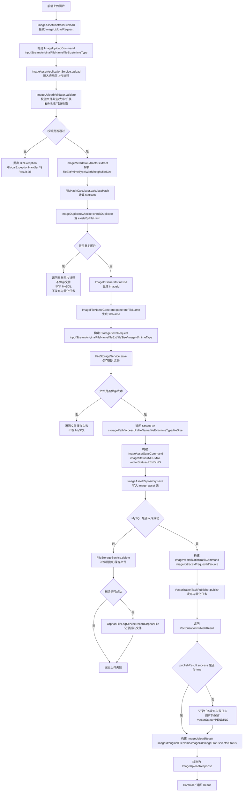

# 图片上传主流程

## 1. 流程定位

图片上传链路由 `image-asset` 模块主导，核心入口是：

```
ImageAssetController.upload  → ImageAssetApplicationService.upload  → DefaultImageAssetApplicationService.upload
```

`DefaultImageAssetApplicationService` 负责编排上传完整流程，并依赖 `ImageUploadValidator`、`ImageMetadataExtractor`、`FileHashCalculator`、`ImageFileNameGenerator`、`ImageIdGenerator`、`ImageDuplicateChecker`、`ImageAssetRepository`、`FileStorageService`、`VectorizationTaskPublisher`、`OrphanFileLogService`、`LogService`、`MetricRecorder` 等组件。

---

## 2. 本流程涉及的接口 / 类

### 2.1 Controller 层

|类 / 接口|函数|作用|
|---|---|---|
|`ImageAssetController`|`upload`|接收前端图片上传请求|
|`ImageUploadRequest`|`imageFile`|图片上传请求对象|
|`ImageUploadResponse`|`imageId`、`originalFileName`、`imageUrl`、`imageStatus`、`vectorStatus`|Controller 返回给前端的数据|

这里要注意：`ImageUploadResponse` 是接口返回对象，不是应用层内部结果。

---

### 2.2 Application 层

|类 / 接口|函数 / 字段|作用|
|---|---|---|
|`ImageAssetApplicationService`|`upload`|上传图片并写入元数据|
|`DefaultImageAssetApplicationService`|`upload`|编排完整上传流程|
|`ImageUploadCommand`|`inputStream`、`originalFileName`、`fileSize`、`mimeType`、`fileHash`、`fileExt`、`width`、`height`、`imageId`|应用层上传命令|
|`ImageUploadResult`|`imageId`、`originalFileName`、`imageUrl`、`imageStatus`、`vectorStatus`|应用层上传结果|

`ImageUploadCommand` 和 `ImageUploadResult` 是应用层内部对象，`ImageUploadResponse` 是 Controller 对外响应对象。模块设计文档明确列出了这几个数据类及其字段。

---

### 2.3 图片校验、解析、去重

|类 / 接口|函数|作用|
|---|---|---|
|`ImageUploadValidator`|`validate`|执行上传前完整校验|
|`DefaultImageUploadValidator`|`validateFileNotEmpty`|校验文件不能为空|
|`DefaultImageUploadValidator`|`validateFileSize`|校验文件大小|
|`DefaultImageUploadValidator`|`validateFileExt`|校验文件扩展名|
|`DefaultImageUploadValidator`|`validateMimeType`|校验 MIME 类型|
|`DefaultImageUploadValidator`|`validateImageReadable`|校验图片是否可解析|
|`ImageMetadataExtractor`|`extract`|解析图片基础信息|
|`ImageMetadata`|`fileExt`、`mimeType`、`width`、`height`、`fileSize`|图片基础元数据|
|`FileHashCalculator`|`calculateHash`|计算文件 hash|
|`ImageIdGenerator`|`nextId`|生成图片 ID|
|`ImageFileNameGenerator`|`generateFileName`|生成系统文件名|
|`ImageDuplicateChecker`|`checkDuplicate`|检查是否重复|
|`ImageDuplicateChecker`|`existsByFileHash`|根据 `fileHash` 判断是否存在|

模块设计文档中 `ImageUploadValidator`、`ImageMetadataExtractor`、`FileHashCalculator`、`ImageFileNameGenerator`、`ImageIdGenerator`、`ImageDuplicateChecker` 都是上传链路直接使用的接口。

---

### 2.4 文件存储

|类 / 接口|函数 / 字段|作用|
|---|---|---|
|`FileStorageService`|`save`|保存图片文件|
|`FileStorageService`|`delete`|MySQL 入库失败时补偿删除文件|
|`FileStorageService`|`getAccessUrl`|获取前端可访问图片 URL|
|`StorageSaveRequest`|`inputStream`、`originalFileName`、`fileExt`、`fileSize`、`imageId`、`mimeType`|文件保存请求|
|`StoredFile`|`storagePath`、`accessUrl`、`fileName`、`fileExt`、`mimeType`、`fileSize`|文件保存结果|

`FileStorageService.save` 返回的是 `StoredFile`，不是上传结果。`StoredFile` 只表达“文件保存成功后的存储信息”。

---

### 2.5 MySQL 元数据入库

| 类 / 接口                  | 函数 / 字段                                                                                                                                                   | 作用       |
| ----------------------- | --------------------------------------------------------------------------------------------------------------------------------------------------------- | -------- |
| `ImageAssetRepository`  | `save`                                                                                                                                                    | 保存图片元数据  |
| `ImageAssetRepository`  | `existsByFileHash`                                                                                                                                        | 支撑重复图片判断 |
| `ImageAssetSaveCommand` | `id`、`fileName`、`originalFileName`、`fileHash`、`fileSize`、`mimeType`、`fileExt`、`width`、`height`、`storagePath`、`thumbnailPath`、`imageStatus`、`vectorStatus` | 入库命令     |
| `ImageAssetPO`          | 对应 `image_asset` 表字段                                                                                                                                      | 数据库持久化对象 |

`ImageAssetSaveCommand` 是写入 MySQL 前的保存命令；`ImageAssetPO` 是持久化对象。上传时初始化：

```
imageStatus = NORMALvectorStatus = PENDING
```

相关字段在模块设计文档中已经列出。

---

### 2.6 向量化任务发布

|类 / 接口|函数 / 字段|作用|
|---|---|---|
|`VectorizationTaskPublisher`|`publish`|发布图片向量化任务|
|`ThreadPoolVectorizationTaskPublisher`|`publish`|MVP 阶段本地线程池实现|
|`ImageVectorizationTaskCommand`|`imageId`、`traceId`、`requestId`、`source`|向量化任务命令|
|`VectorizationPublishResult`|`success`、`imageId`、`errorCode`、`message`|任务发布结果|


---

### 2.7 日志、指标、补偿

|类 / 接口|函数 / 字段|作用|
|---|---|---|
|`OrphanFileLogService`|`recordOrphanFile`|记录孤儿文件|
|`OrphanFileRecord`|`storagePath`、`fileHash`、`failReason`、`retryCount`、`cleanStatus`|孤儿文件记录|
|`LogService`|`recordBizLog`、`recordErrorLog`、`recordStateChangeLog`|记录上传链路日志|
|`MetricRecorder`|`increment`、`recordTimer`、`recordValue`|记录上传指标|

`OrphanFileLogService` 主要用于“文件保存成功，但 MySQL 入库失败，文件未能及时清理”的补偿记录。模块设计文档中它依赖 `OrphanFileRecord` 和 `LogService`。

---

## 3. 图片上传主流程


---


# 向量化任务发布后向量化流程
## 1. 本流程使用的接口与数据类

### 1.1 任务发布入口

|类 / 接口|函数 / 字段|作用|
|---|---|---|
|`VectorizationTaskPublisher`|`publish`|发布图片向量化任务|
|`ThreadPoolVectorizationTaskPublisher`|`publish`|MVP 阶段用本地线程池发布任务|
|`ImageVectorizationTaskCommand`|`imageId`、`traceId`、`requestId`、`source`|上传流程传给向量化模块的任务命令|
|`VectorizationPublishResult`|`success`、`imageId`、`errorCode`、`message`|任务发布结果|

注意：这里的 `publish` 只表示任务是否成功提交到线程池 / 队列，不代表向量化成功。

---

### 1.2 任务执行核心接口

|类 / 接口|函数 / 字段|作用|
|---|---|---|
|`ImageVectorizationProcessor`|`process`|执行图片向量化主流程|
|`DefaultImageVectorizationProcessor`|`process`|默认实现|
|`ImageVectorizationContext`|`imageId`、`storagePath`、`fileExt`、`mimeType`、`retryCount`|向量化过程上下文|
|`ImageVectorizationResult`|`imageId`、`success`、`vectorStatus`、`failReason`、`message`|图片向量化执行结果|

`DefaultImageVectorizationProcessor` 依赖 `ImageAssetQueryService`、`ImageAssetStatusService`、`FileStorageService`、`ModelVectorizationClient`、`VectorIndexClient`、`ActiveCollectionResolver`、`VectorizationRetryPolicy`、`VectorizationFailureHandler` 等接口。

---

### 1.3 图片资产查询与状态更新

|类 / 接口|函数|作用|
|---|---|---|
|`ImageAssetQueryService`|`getById`|根据 `imageId` 查询图片元数据|
|`ImageAssetStatusService`|`markVectorProcessing`|标记 `vector_status = PROCESSING`|
|`ImageAssetStatusService`|`markVectorReady`|标记 `vector_status = READY`|
|`ImageAssetStatusService`|`markVectorPending`|失败可重试时回退为 `PENDING`|
|`ImageAssetStatusService`|`markVectorFailed`|标记 `vector_status = FAILED`|
|`ImageAssetStatusService`|`markInvalid`|文件缺失时标记 `image_status = INVALID`|
|`ImageAssetStatusService`|`increaseRetryCount`|增加重试次数|

状态流转约束是：

```
PENDING → PROCESSING → READY
```

临时失败：

```
PROCESSING → PENDING → 重新入队
```

超过重试次数：

```
PROCESSING → FAILED
```

PRD 中明确 `FAILED` 不能去掉，否则会导致不可恢复错误无限重试。

---

### 1.4 文件读取

|类 / 接口|函数 / 字段|作用|
|---|---|---|
|`FileStorageService`|`exists`|检查 `storagePath` 对应文件是否存在|
|`FileStorageService`|`read`|读取图片文件|
|`StorageResource`|`inputStream`、`fileSize`、`fileExt`、`mimeType`、`accessUrl`|读取出的文件资源|

文件不存在不是普通模型失败，而是图片资产与文件存储不一致。约束是：不继续调用 Python 服务，直接标记 `image_status = INVALID`、`vector_status = FAILED`、`fail_reason = FILE_NOT_FOUND`。

---

### 1.5 collection 配置

|类 / 接口|函数 / 字段|作用|
|---|---|---|
|`ActiveCollectionResolver`|`resolveActiveCollection`|获取当前 active collection|
|`VectorCollectionConfig`|`collectionName`、`modelName`、`vectorDim`、`vectorVersion`、`distanceMetric`|当前向量库配置|

这里主要用于确认：模型返回的向量维度必须等于 `vectorDim`，否则不能写入向量库。

---

### 1.6 模型服务调用

|类 / 接口|函数 / 字段|作用|
|---|---|---|
|`ModelVectorizationClient`|`vectorizeImage`|调用 Python 模型服务生成图片向量|
|`VectorizeResult`|`vectorizeType`、`embedding`、`dim`、`modelName`、`imageId`、`requestId`|模型向量化返回结果|

`ModelVectorizationClient` 同时有 `vectorizeImage` 和 `vectorizeText`，但本流程只用 `vectorizeImage`。`vectorizeText` 是搜索里的以文搜图查询向量化，不属于上传后的图片入库向量化。

---

### 1.7 向量库写入

|类 / 接口|函数|作用|
|---|---|---|
|`VectorIndexClient`|`upsert`|将图片向量写入向量库|
|`VectorIndexClient`|`exists`|检查向量是否存在，主流程可不用|

写入向量库成功后，才允许调用 `ImageAssetStatusService.markVectorReady`。模块设计文档也明确了“调用 `VectorIndexClient.upsert`，成功后才允许标记 READY”。

---

### 1.8 失败重试

|类 / 接口|函数 / 字段|作用|
|---|---|---|
|`VectorizationRetryPolicy`|`canRetry`|判断是否还能重试|
|`VectorizationRetryPolicy`|`isRetryableFailReason`|判断失败原因是否可重试|
|`VectorizationFailureHandler`|`handleFileMissing`|处理文件缺失|
|`VectorizationFailureHandler`|`handleRetryableFailure`|处理可重试失败|
|`VectorizationFailureHandler`|`handleDeadFailure`|处理不可恢复失败|
|`VectorizationFailureContext`|`imageId`、`failReason`、`retryCount`、`maxRetryCount`、`errorMessage`|失败处理上下文|
|`VectorizationProperties`|`maxRetryCount`、`processingTimeoutSeconds`、`publishMode`、`scannerEnabled`、`pendingScanBatchSize`|向量化配置|

---

## 2. 图片向量化主流程图

```mermaid
flowchart TD
    A["上传流程调用<br/>VectorizationTaskPublisher.publish"] --> A1["输入数据类<br/>ImageVectorizationTaskCommand<br/>imageId/traceId/requestId/source"]

    A1 --> A2["ThreadPoolVectorizationTaskPublisher.publish<br/>提交本地线程池任务"]

    A2 --> A3["返回<br/>VectorizationPublishResult<br/>success/imageId/errorCode/message"]

    A2 --> B["异步执行<br/>ImageVectorizationProcessor.process"]

    B --> C["ImageAssetQueryService.getById(imageId)<br/>查询图片资产"]

    C --> C1["返回 ImageAssetDTO<br/>id/storagePath/imageStatus/vectorStatus/retryCount"]

    C1 --> D{"图片记录是否存在"}

    D -- 否 --> D1["返回 ImageVectorizationResult<br/>success=false<br/>failReason=IMAGE_NOT_FOUND"]

    D -- 是 --> E{"状态是否允许处理<br/>imageStatus=NORMAL<br/>vectorStatus=PENDING"}

    E -- 否 --> E1["跳过任务<br/>返回 ImageVectorizationResult<br/>success=false 或 skipped"]

    E -- 是 --> F["构建 ImageVectorizationContext<br/>imageId/storagePath/fileExt/mimeType/retryCount"]

    F --> G["ImageAssetStatusService.markVectorProcessing<br/>vectorStatus=PROCESSING<br/>processingStartedTime=now"]

    G --> H{"PROCESSING 更新是否成功"}

    H -- 否 --> H1["跳过任务<br/>避免重复执行或并发覆盖"]

    H -- 是 --> I["FileStorageService.exists(storagePath)<br/>检查文件是否存在"]

    I --> J{"文件是否存在"}

    J -- 否 --> J1["VectorizationFailureHandler.handleFileMissing"]
    J1 --> J2["ImageAssetStatusService.markInvalid<br/>imageStatus=INVALID"]
    J2 --> J3["ImageAssetStatusService.markVectorFailed<br/>vectorStatus=FAILED<br/>failReason=FILE_NOT_FOUND"]
    J3 --> J4["返回 ImageVectorizationResult<br/>success=false<br/>vectorStatus=FAILED"]

    J -- 是 --> K["FileStorageService.read(storagePath)<br/>读取图片文件"]

    K --> K1["返回 StorageResource<br/>inputStream/fileSize/fileExt/mimeType/accessUrl"]

    K1 --> L["ActiveCollectionResolver.resolveActiveCollection<br/>获取当前向量库配置"]

    L --> L1["返回 VectorCollectionConfig<br/>collectionName/modelName/vectorDim/vectorVersion/distanceMetric"]

    L1 --> M["ModelVectorizationClient.vectorizeImage<br/>输入 StorageResource + imageId + requestId"]

    M --> N{"模型调用是否成功"}

    N -- 否 --> N1["构建 VectorizationFailureContext<br/>failReason=MODEL_SERVICE_TIMEOUT 或 MODEL_SERVICE_ERROR"]
    N1 --> R["VectorizationRetryPolicy.canRetry"]

    N -- 是 --> O["返回 VectorizeResult<br/>vectorizeType=IMAGE<br/>embedding/dim/modelName/imageId/requestId"]

    O --> P{"VectorizeResult.dim == VectorCollectionConfig.vectorDim"}

    P -- 否 --> P1["构建 VectorizationFailureContext<br/>failReason=VECTOR_DIM_MISMATCH"]
    P1 --> R

    P -- 是 --> Q["VectorIndexClient.upsert<br/>vectorId=imageId<br/>embedding<br/>collectionName"]

    Q --> Q1{"向量库 upsert 是否成功"}

    Q1 -- 否 --> Q2["构建 VectorizationFailureContext<br/>failReason=VECTOR_DB_UPSERT_FAILED"]
    Q2 --> R

    Q1 -- 是 --> S["ImageAssetStatusService.markVectorReady<br/>vectorStatus=READY<br/>vectorUpdatedTime=now"]

    S --> S1{"READY 更新是否成功"}

    S1 -- 否 --> S2["记录 READY_UPDATE_FAILED<br/>EventPublisher.publish 记录待补偿事件"]
    S2 --> R

    S1 -- 是 --> T["返回 ImageVectorizationResult<br/>success=true<br/>vectorStatus=READY"]

    R --> R1{"是否可重试"}

    R1 -- 是 --> R2["VectorizationFailureHandler.handleRetryableFailure"]
    R2 --> R3["ImageAssetStatusService.increaseRetryCount"]
    R3 --> R4["ImageAssetStatusService.markVectorPending<br/>vectorStatus=PENDING"]
    R4 --> R5["等待后续重新发布任务"]
    R5 --> R6["返回 ImageVectorizationResult<br/>success=false<br/>vectorStatus=PENDING"]

    R1 -- 否 --> R7["VectorizationFailureHandler.handleDeadFailure"]
    R7 --> R8["ImageAssetStatusService.markVectorFailed<br/>vectorStatus=FAILED<br/>failReason"]
    R8 --> R9["返回 ImageVectorizationResult<br/>success=false<br/>vectorStatus=FAILED"]
```

---
# 图片搜索流程
## 1. 三个搜图用例共用接口

### 1.1 搜索入口层

|用例|Controller 方法|请求数据类|统一转换|
|---|---|---|---|
|以图搜图|`SearchController.searchByImage`|`ImageSearchRequest(queryImage, topK)`|`SearchCommand(searchType=IMAGE, queryImage, topK)`|
|以文搜图|`SearchController.searchByText`|`TextSearchRequest(queryText, topK)`|`SearchCommand(searchType=TEXT, queryText, topK)`|
|图文联合搜图|`SearchController.searchByHybrid`|`HybridSearchRequest(queryImage, queryText, topK)`|`SearchCommand(searchType=HYBRID, queryImage, queryText, topK)`|

模块设计文档明确：三个 Controller 入口只负责接收不同请求，最终都转换成统一 `SearchCommand`。

---

### 1.2 搜索应用层

|类 / 接口|函数|作用|
|---|---|---|
|`SearchApplicationService`|`search`|搜索应用服务入口|
|`DefaultSearchApplicationService`|`search`|调用 `SearchPipeline`，记录日志和指标|
|`SearchCommand`|`searchType`、`queryImage`、`queryText`、`topK`|三类搜索统一命令|
|`SearchResponse`|`searchType`、`total`、`items`、`costMs`|搜索统一返回|
|`SearchResultItem`|`imageId`、`imageUrl`、`fileName`、`score`、`width`、`height`、`mimeType`|单条搜索结果|

---

### 1.3 SearchPipeline 统一主链路

|环节|接口 / 类|关键数据类|
|---|---|---|
|创建上下文|`SearchPipeline.execute`|`SearchContext`|
|参数校验|`SearchRequestValidator.validate`|`SearchValidateResult`|
|collection 解析|`SearchCollectionResolver.resolve`|`SearchCollectionContext`|
|查询向量化选择|`QueryVectorizerSelector.select`|`QueryVectorizer`|
|查询向量化|`QueryVectorizer.vectorize`|`QueryVectorizeRequest`、`QueryEmbedding`|
|向量维度校验|`SearchEmbeddingValidator.validateDim`|`SearchEmbeddingValidateResult`|
|over-fetch 计算|`OverFetchStrategy.calculateTopN`|`OverFetchContext`|
|向量召回|`VectorSearchClient.search`|`VectorSearchRequest`、`VectorSearchResult`、`VectorSearchItem`|
|MySQL 回表|`ImageAssetQueryService.batchQueryByIds`|`ImageAssetBatchQueryResult`|
|结果过滤|`SearchResultFilter.filter`|`SearchFilterContext`、`SearchFilterResult`|
|可选重排|`RerankStrategy.rerank`|`RerankContext`、`RerankResult`|
|结果组装|`SearchResultAssembler.assemble`|`SearchAssembleContext`、`SearchResponse`|

`DefaultSearchPipeline` 依赖这些接口：`SearchRequestValidator`、`SearchCollectionResolver`、`QueryVectorizerSelector`、`SearchEmbeddingValidator`、`OverFetchStrategy`、`VectorSearchClient`、`ImageAssetQueryService`、`SearchResultFilter`、`RerankStrategy`、`SearchResultAssembler`。

---

## 2. 以图搜图流程

### 2.1 特有接口

|类 / 接口|作用|
|---|---|
|`ImageSearchRequest`|接收查询图片和 topK|
|`ImageSearchRequestValidator`|校验查询图片是否为空、格式是否合法、topK 是否合法|
|`ImageQueryVectorizer`|将查询图片转换为 query embedding|
|`ModelVectorizationClient.vectorizeImage`|调用 Python 图片向量化服务|
|`VectorizeResult`|Python 模型返回的图片向量结果|
|`QueryEmbedding`|SearchPipeline 统一使用的查询向量|

### 2.2流程图

```mermaid
flowchart TD
    A["前端发起以图搜图"] --> B["SearchController.searchByImage<br/>接收 ImageSearchRequest<br/>queryImage/topK"]

    B --> C["构建 SearchCommand<br/>searchType=IMAGE<br/>queryImage/topK"]

    C --> D["SearchApplicationService.search(command)"]

    D --> E["SearchPipeline.execute<br/>创建 SearchContext"]

    E --> F["ImageSearchRequestValidator.validate<br/>校验 queryImage/topK"]

    F --> G{"参数是否合法"}
    G -- 否 --> G1["返回参数错误<br/>Result.fail"]

    G -- 是 --> H["SearchCollectionResolver.resolve<br/>解析 active collection"]

    H --> I["返回 SearchCollectionContext<br/>collectionName/modelName/vectorDim"]

    I --> J{"collection 是否可用"}
    J -- 否 --> J1["返回搜索服务暂不可用"]

    J -- 是 --> K["QueryVectorizerSelector.select<br/>选择 ImageQueryVectorizer"]

    K --> L["构建 QueryVectorizeRequest<br/>searchType=IMAGE<br/>queryImage"]

    L --> M["ImageQueryVectorizer.vectorize"]

    M --> N["ModelVectorizationClient.vectorizeImage<br/>调用 Python 图片向量化服务"]

    N --> O{"图片向量化是否成功"}
    O -- 否 --> O1["返回图片查询向量化失败"]

    O -- 是 --> P["返回 VectorizeResult<br/>embedding/dim/modelName"]

    P --> Q["转换为 QueryEmbedding<br/>searchType=IMAGE<br/>embedding/dim/modelName"]

    Q --> R["SearchEmbeddingValidator.validateDim<br/>校验 dim == collection.vectorDim"]

    R --> S{"维度是否匹配"}
    S -- 否 --> S1["返回向量维度不匹配"]

    S -- 是 --> T["OverFetchStrategy.calculateTopN<br/>topK → topN"]

    T --> U["构建 VectorSearchRequest<br/>collectionName/queryEmbedding/topN"]

    U --> V["VectorSearchClient.search<br/>向量库召回"]

    V --> W{"召回是否成功"}
    W -- 否 --> W1["返回向量检索失败"]

    W -- 是 --> X["返回 VectorSearchResult<br/>items: vectorId/score"]

    X --> Y["提取 vectorId 列表"]

    Y --> Z["ImageAssetQueryService.batchQueryByIds<br/>批量回表"]

    Z --> AA["返回 ImageAssetBatchQueryResult<br/>items: ImageAssetDTO"]

    AA --> AB["SearchResultFilter.filter<br/>过滤非 NORMAL + READY<br/>过滤孤儿向量"]

    AB --> AC["返回 SearchFilterResult<br/>items/orphanVectorCount/invalidImageCount"]

    AC --> AD["RerankStrategy.rerank<br/>MVP 可用 NoOpRerankStrategy"]

    AD --> AE["返回 RerankResult<br/>items/rerankApplied"]

    AE --> AF["截取 topK"]

    AF --> AG["SearchResultAssembler.assemble<br/>构建 SearchAssembleContext"]

    AG --> AH["返回 SearchResponse<br/>searchType=IMAGE<br/>total/items/costMs"]
```

### 2.3 数据流
```
ImageSearchRequest(queryImage, topK)
  ↓
SearchCommand(searchType=IMAGE, queryImage, topK)
  ↓
SearchContext(command)
  ↓
SearchCollectionContext(collectionName, modelName, vectorDim)
  ↓
QueryVectorizeRequest(searchType=IMAGE, queryImage)
  ↓
VectorizeResult(embedding, dim, modelName)
  ↓
QueryEmbedding(searchType=IMAGE, embedding, dim, modelName)
  ↓
VectorSearchRequest(collectionName, queryEmbedding, topN)
  ↓
VectorSearchResult(items: VectorSearchItem(vectorId, score))
  ↓
ImageAssetQueryService.batchQueryByIds(vectorIds)
  ↓
ImageAssetBatchQueryResult(items: ImageAssetDTO)
  ↓
SearchFilterResult(items, orphanVectorCount, invalidImageCount)
  ↓
RerankResult(items, rerankApplied)
  ↓
SearchAssembleContext(searchType, items, topK, costMs, totalRecallCount, orphanVectorCount, invalidImageCount)
  ↓
SearchResponse(searchType=IMAGE, total, items, costMs)
```
---
## 3. 以文搜图流程

### 3.1 特有接口

|类 / 接口|作用|
|---|---|
|`TextSearchRequest`|接收查询文本和 topK|
|`TextSearchRequestValidator`|校验查询文本是否为空、长度是否合法、topK 是否合法|
|`TextQueryVectorizer`|将查询文本转换为 query embedding|
|`ModelVectorizationClient.vectorizeText`|调用 Python 文本向量化服务|
|`VectorizeResult`|Python 模型返回的文本向量结果|
|`QueryEmbedding`|SearchPipeline 统一使用的查询向量|

### 3.2 流程图


### 3.3 数据流

```
TextSearchRequest(queryText, topK)
  ↓
SearchCommand(searchType=TEXT, queryText, topK)
  ↓
SearchContext(command)
  ↓
SearchCollectionContext(collectionName, modelName, vectorDim)
  ↓
QueryVectorizeRequest(searchType=TEXT, queryText)
  ↓
VectorizeResult(embedding, dim, modelName)
  ↓
QueryEmbedding(searchType=TEXT, embedding, dim, modelName)
  ↓
VectorSearchRequest(collectionName, queryEmbedding, topN)
  ↓
VectorSearchResult(items: VectorSearchItem(vectorId, score))
  ↓
ImageAssetQueryService.batchQueryByIds(vectorIds)
  ↓
ImageAssetBatchQueryResult(items: ImageAssetDTO)
  ↓
SearchFilterResult(items, orphanVectorCount, invalidImageCount)
  ↓
RerankResult(items, rerankApplied)
  ↓
SearchAssembleContext(searchType, items, topK, costMs, totalRecallCount, orphanVectorCount, invalidImageCount)
  ↓
SearchResponse(searchType=TEXT, total, items, costMs)
```

---

## 4. 图文联合搜图流程

### 4.1 特有接口

|类 / 接口|作用|
|---|---|
|`HybridSearchRequest`|接收查询图片、查询文本和 topK|
|`HybridSearchRequestValidator`|校验图片、文本、topK|
|`HybridQueryVectorizer`|生成图文融合 query embedding|
|`ImageQueryVectorizer`|生成 image embedding|
|`TextQueryVectorizer`|生成 text embedding|
|`HybridFusionStrategy`|融合 image embedding 和 text embedding|
|`WeightedHybridFusionStrategy`|MVP 阶段加权融合实现|
|`HybridFusionRequest`|融合请求|
|`HybridFusionResult`|融合结果|
|`HybridFusionProperties`|融合权重配置|

图文联合搜图在 MVP 阶段使用“早期融合”：先融合 image embedding 和 text embedding，再执行一次向量检索。融合发生在 `HybridQueryVectorizer` 内部，`SearchPipeline` 不直接感知融合细节。

### 4.2 流程图

```mermaid
flowchart TD
    A["前端发起图文联合搜图"] --> B["SearchController.searchByHybrid<br/>接收 HybridSearchRequest<br/>queryImage/queryText/topK"]

    B --> C["构建 SearchCommand<br/>searchType=HYBRID<br/>queryImage/queryText/topK"]

    C --> D["SearchApplicationService.search(command)"]

    D --> E["SearchPipeline.execute<br/>创建 SearchContext"]

    E --> F["HybridSearchRequestValidator.validate<br/>校验 queryImage/queryText/topK"]

    F --> G{"参数是否合法"}
    G -- 否 --> G1["返回参数错误<br/>Result.fail"]

    G -- 是 --> H["SearchCollectionResolver.resolve<br/>解析 active collection"]

    H --> I["返回 SearchCollectionContext<br/>collectionName/modelName/vectorDim"]

    I --> J{"collection 是否可用"}
    J -- 否 --> J1["返回搜索服务暂不可用"]

    J -- 是 --> K["QueryVectorizerSelector.select<br/>选择 HybridQueryVectorizer"]

    K --> L["构建 QueryVectorizeRequest<br/>searchType=HYBRID<br/>queryImage/queryText"]

    L --> M["HybridQueryVectorizer.vectorize"]

    M --> N1["ImageQueryVectorizer.vectorize<br/>生成 image embedding"]
    M --> N2["TextQueryVectorizer.vectorize<br/>生成 text embedding"]

    N1 --> O1["ModelVectorizationClient.vectorizeImage<br/>调用 Python 图片向量化服务"]
    N2 --> O2["ModelVectorizationClient.vectorizeText<br/>调用 Python 文本向量化服务"]

    O1 --> P1{"image embedding 是否成功"}
    O2 --> P2{"text embedding 是否成功"}

    P1 -- 否 --> P1F["返回图片向量化失败"]
    P2 -- 否 --> P2F["返回文本向量化失败"]

    P1 -- 是 --> Q1["返回 image QueryEmbedding"]
    P2 -- 是 --> Q2["返回 text QueryEmbedding"]

    Q1 --> R["构建 HybridFusionRequest<br/>imageEmbedding/textEmbedding/imageWeight/textWeight"]
    Q2 --> R

    R --> S["HybridFusionStrategy.fuse<br/>WeightedHybridFusionStrategy 加权融合"]

    S --> T["返回 HybridFusionResult<br/>hybridEmbedding/dim"]

    T --> U["转换为 QueryEmbedding<br/>searchType=HYBRID<br/>embedding=hybridEmbedding<br/>dim/modelName"]

    U --> V["SearchEmbeddingValidator.validateDim<br/>校验 dim == collection.vectorDim"]

    V --> W{"维度是否匹配"}
    W -- 否 --> W1["返回向量维度不匹配"]

    W -- 是 --> X["OverFetchStrategy.calculateTopN<br/>topK → topN"]

    X --> Y["构建 VectorSearchRequest<br/>collectionName/queryEmbedding/topN"]

    Y --> Z["VectorSearchClient.search<br/>向量库召回"]

    Z --> AA{"召回是否成功"}
    AA -- 否 --> AA1["返回向量检索失败"]

    AA -- 是 --> AB["返回 VectorSearchResult<br/>items: vectorId/score"]

    AB --> AC["提取 vectorId 列表"]

    AC --> AD["ImageAssetQueryService.batchQueryByIds<br/>批量回表"]

    AD --> AE["返回 ImageAssetBatchQueryResult<br/>items: ImageAssetDTO"]

    AE --> AF["SearchResultFilter.filter<br/>过滤非 NORMAL + READY<br/>过滤孤儿向量"]

    AF --> AG["返回 SearchFilterResult<br/>items/orphanVectorCount/invalidImageCount"]

    AG --> AH["RerankStrategy.rerank<br/>MVP 可用 NoOpRerankStrategy"]

    AH --> AI["返回 RerankResult<br/>items/rerankApplied"]

    AI --> AJ["截取 topK"]

    AJ --> AK["SearchResultAssembler.assemble<br/>构建 SearchAssembleContext"]

    AK --> AL["返回 SearchResponse<br/>searchType=HYBRID<br/>total/items/costMs"]
```


### 4.3 数据流

```
HybridSearchRequest(queryImage, queryText, topK)  
↓  
SearchCommand(searchType=HYBRID, queryImage, queryText, topK)  
↓  
SearchContext(command)  
↓  
SearchCollectionContext(collectionName, modelName, vectorDim)  
↓  
QueryVectorizeRequest(searchType=HYBRID, queryImage, queryText)  
↓  
HybridQueryVectorizer.vectorize  
↓  
ImageQueryVectorizer.vectorize → image QueryEmbedding  
TextQueryVectorizer.vectorize → text QueryEmbedding  
↓  
HybridFusionRequest(imageEmbedding, textEmbedding, imageWeight, textWeight)  
↓  
HybridFusionStrategy.fuse  
↓  
HybridFusionResult(hybridEmbedding, dim)  
↓  
QueryEmbedding(searchType=HYBRID, embedding=hybridEmbedding, dim, modelName)  
↓  
VectorSearchRequest(collectionName, queryEmbedding, topN)  
↓  
VectorSearchResult(items: VectorSearchItem(vectorId, score))  
↓  
ImageAssetQueryService.batchQueryByIds(vectorIds)  
↓  
ImageAssetBatchQueryResult(items: ImageAssetDTO)  
↓  
SearchFilterResult(items, orphanVectorCount, invalidImageCount)  
↓  
RerankResult(items, rerankApplied)  
↓  
SearchAssembleContext(searchType, items, topK, costMs, totalRecallCount, orphanVectorCount, invalidImageCount)  
↓  
SearchResponse(searchType=HYBRID, total, items, costMs)
```

---
