# 系统架构设计文档

## 6.1 系统架构设计目标与原则

系统架构部分的写法要和前面的用例部分区分开：**用例部分回答“流程怎么走”，系统架构部分回答“系统为什么这样组织，以及这样组织如何方便后续扩展和优化”。**

PRD 前面已经明确：MVP 阶段先跑通核心搜索闭环，但数据库设计、接口设计、服务分层和代码结构必须支持后续缓存、异步任务、限流、降级、压测和向量检索优化；同时搜索能力和工程优化能力不能硬编码在一起，要分层解耦。

所以架构章的核心不是重复上传流程、向量化流程和搜索流程，而是把这些流程背后的组织方式抽象出来。

### 6.1.1 保证核心链路简单可运行

MVP 阶段不追求一开始就做成完整分布式系统，而是优先保证图片上传、图片向量化、向量入库、三类搜索、结果返回这条主链路稳定跑通。

原因是：这个系统本身依赖 Java 后端、Python 模型服务、MySQL、文件存储、向量数据库等多个组件。过早引入复杂微服务、完整 MQ、复杂缓存和完整治理体系，会增加调试成本，反而影响主链路落地。

这里的架构结论是：

```text
MVP 采用模块化单体架构
不一开始拆微服务
但模块边界、接口边界、数据边界要按可扩展方式设计
```

### 6.1.2 采用模块化单体，而不是过早微服务化

“模块化单体”指系统部署上仍然是一个 Java 后端应用，但代码内部按照业务能力拆分模块，例如图片资产模块、向量化模块、搜索模块、向量库适配模块、文件存储模块、模型服务调用模块。

这样设计的好处是：

```text
开发和部署简单
调试成本低
事务和状态处理更直观
后续可以按模块逐步拆分
```

它和普通单体的区别在于：普通单体容易所有代码互相调用，最后变成“大泥球”；模块化单体要求模块之间通过明确接口协作，不能随意跨模块访问内部实现。

### 6.1.3 核心业务能力和工程治理能力解耦

核心业务能力包括：

```text
图片上传
图片向量化
以图搜图
以文搜图
图文联合搜图
搜索结果组装
```

工程治理能力包括：

```text
缓存
异步任务
限流
降级
线程池隔离
超时控制
日志监控
压测指标
```

架构上不能让这些治理能力侵入核心业务流程。例如搜索主流程不应该写死 Redis 缓存逻辑，也不应该把限流、熔断、降级规则混在搜索算法里。

更合理的方式是：

```text
SearchPipeline 负责搜索主流程
CacheService 负责缓存扩展
RateLimiter 负责限流扩展
FallbackHandler 负责降级扩展
MetricCollector 负责指标采集
```

这样后续增加缓存、限流、重排、降级时，不需要重写搜索主链路。

### 6.1.4 通过抽象接口隔离外部基础设施

系统依赖很多外部基础设施：

```text
MySQL
本地文件系统 / 对象存储
向量数据库
Python 向量化服务
后续 Redis
后续 MQ
```

这些外部组件不应该直接散落在业务代码中，而应该通过适配层隔离。

例如：

```text
FileStorageService 隔离本地文件和对象存储
VectorIndexClient 隔离 FAISS / Qdrant / Milvus
ModelVectorizationClient 隔离 Python 模型服务调用
VectorizationTaskPublisher 隔离本地线程池和 MQ
SearchCollectionResolver 隔离 active collection 配置获取
```

这样设计的原因是：后续从本地文件系统迁移到 MinIO/S3，从本地线程池迁移到 Kafka，从一个向量库迁移到另一个向量库时，业务层不需要大改。

### 6.1.5 以状态和配置驱动系统演进

这个系统后续一定会涉及模型升级、collection 切换、任务重试、索引重建、搜索策略调整。架构上不能靠硬编码解决，而应该通过状态和配置驱动。

典型状态包括：

```text
image_status
vector_status
collection_status
clean_status
```

典型配置包括：

```text
active collection
model name
vector dimension
topK 默认值
over-fetch 策略
融合权重
线程池参数
超时时间
重试次数
```

这样设计的好处是：后续优化时更多是调整配置或扩展状态机，而不是改核心流程代码。

### 6.1.6 所有核心链路都要可观测、可排查、可优化

系统架构不能只保证“能跑”，还要能回答这些问题：

```text
搜索慢在哪里？
是模型向量化慢，还是向量库检索慢？
是 MySQL 回表慢，还是结果组装慢？
向量化失败是文件问题、模型问题，还是向量库问题？
某个 collection 是否构建完整？
某次搜索过滤掉了多少孤儿向量？
```

所以架构上要预留日志、指标和链路耗时统计。MVP 可以先记录日志，后续再接入 Prometheus、Grafana、链路追踪或更完整的监控系统。

## 6.2 系统架构关系总览

我建议在架构章开头先给出一个整体关系，而不是直接进入每个架构细节。可以把系统架构分成四层：

```text
第一层：目标约束层
  1. 架构设计目标与原则

第二层：系统组件层
  2. 系统整体架构

第三层：后端组织层
  3. Java 后端模块架构
  4. 后端分层架构

第四层：业务链路与支撑层
  5. 图片上传与向量化任务架构
  6. 搜索 Pipeline 架构
  7. 存储与数据一致性架构
  8. 向量数据库与 collection 架构
  9. 高并发与扩展预留架构
  10. 配置、日志与可观测性架构
```

它们的逻辑关系可以这样理解：

```text
架构目标与原则
  ↓
决定系统整体架构采用什么形态
  ↓
系统整体架构决定有哪些组件参与协作
  ↓
Java 后端模块架构决定后端内部按哪些业务能力拆分
  ↓
后端分层架构决定每个模块内部的代码职责边界
  ↓
上传与向量化架构、搜索 Pipeline 架构承载核心业务链路
  ↓
存储一致性架构和向量 collection 架构支撑业务链路的数据可靠性
  ↓
高并发架构和可观测性架构横向保护、治理和监控所有链路
```

可以画成这个总览图：

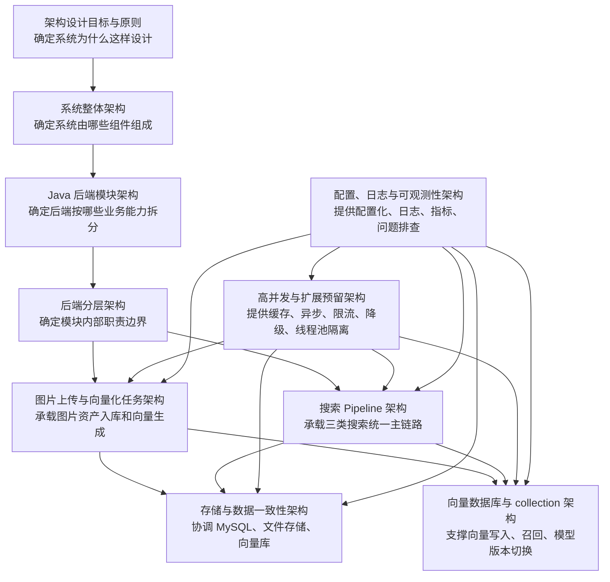

这里要特别说明几个依赖关系。

### 6.2.1 系统整体架构是所有架构的容器

系统整体架构定义前端、Java 后端、Python 模型服务、MySQL、文件存储、向量数据库以及后续 Redis、MQ、监控系统之间的关系。没有整体架构，后面的模块架构和链路架构就缺少边界。

### 6.2.2 Java 后端模块架构是业务能力的拆分方式

比如图片资产模块负责图片元数据和状态，向量化模块负责任务发布和处理，搜索模块负责统一搜索流程，向量索引模块负责屏蔽向量库差异，文件存储模块负责屏蔽本地存储和对象存储差异。

### 6.2.3 后端分层架构是每个模块内部的代码组织方式

模块架构解决“按什么业务能力拆”；分层架构解决“每个模块里面 Controller、应用服务、领域规则、基础设施适配怎么放”。

### 6.2.4 上传与向量化架构、搜索 Pipeline 架构是两个核心业务链路

上传与向量化链路负责让图片从普通文件变成可检索资源；搜索 Pipeline 负责让三类搜索入口复用同一套召回、回表、过滤、组装流程。

### 6.2.5 存储一致性架构和向量 collection 架构是底层支撑

上传、向量化、搜索都依赖 MySQL、文件存储和向量数据库之间的一致性。向量 collection 架构则负责模型版本、向量维度、active collection、索引构建和切换。

### 6.2.6 高并发架构和可观测性架构是横切能力

高并发架构和可观测性架构不只属于某一个模块，而是覆盖上传、向量化、搜索、MySQL、向量库、模型服务等所有链路。它们的设计目标是让系统后续能承接缓存、MQ、限流、降级、压测和问题排查。

所以这一部分最终可以收束成一句话：

```text
EverythingFound 的系统架构采用模块化单体作为 MVP 形态，以分层架构保证代码职责清晰，以上传向量化链路和搜索 Pipeline 链路承载核心业务，以存储一致性和向量 collection 管理保证数据可靠，以高并发治理和可观测能力支撑后续性能优化和工程演进。
```

这一版方向比较适合作为系统架构章开头。下一步可以开始写成 PRD 正文里的：

```text
6.1 系统架构设计目标与原则
6.2 系统架构关系总览
```

---

## 6.3 Java 后端模块架构

### 6.3.1 核心模块拆分

核心模块拆分如下：

| 模块          | 职责                                                         |
| ------------- | ------------------------------------------------------------ |
| image-asset   | 图片资产模块，负责图片上传、图片元数据、图片状态、去重和基础管理 |
| vectorization | 向量化任务模块，负责图片向量化任务发布、处理、重试和状态更新 |
| search        | 搜索模块，负责以图搜图、以文搜图、图文联合搜图和 SearchPipeline |
| storage       | 文件存储模块，负责本地文件存储，后续可扩展到 MinIO / S3      |
| model-client  | 模型服务调用模块，负责调用 Python 图片向量化、文本向量化服务 |
| vector-index  | 向量索引模块，负责向量数据库写入、检索、删除和 collection 适配 |
| common        | 通用模块，负责统一响应、异常码、枚举、工具类和通用配置       |

### 6.3.2 模块依赖关系

模块依赖关系可以画成这样：

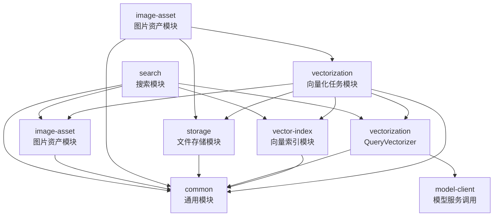

这个依赖图表达三个重点：

第一，`image-asset` 是图片资产的入口。上传、元数据、图片状态都从这里开始。它依赖 `storage` 保存图片文件，也会触发 `vectorization` 开始向量化任务。

第二，`vectorization` 是图片变成可搜索资源的中间模块。它需要读取图片资产信息，读取图片文件，调用模型服务生成向量，再写入向量数据库。因此它依赖 `image-asset`、`storage`、`model-client`、`vector-index`。

第三，`search` 是搜索主链路模块。它需要调用模型服务生成查询向量，调用向量索引模块召回结果，再回到图片资产模块查询图片元数据和状态。

### 6.3.3 模块设计原则

第一，**模块按业务能力拆分，不按技术组件堆叠。**  
比如搜索模块不是简单放几个 Controller，而是围绕“搜索能力”组织；向量化模块不是简单放一个线程池，而是围绕“图片向量生成任务”组织。这样模块职责更贴近业务。

第二，**核心业务模块只依赖接口，不直接绑定具体基础设施。**  
例如搜索模块不直接依赖某个具体向量数据库 SDK，而是依赖 `vector-index` 提供的向量检索接口；图片资产模块不直接写死本地文件路径，而是依赖 `storage` 提供的文件存储接口。这样后续替换向量库、迁移对象存储时，不需要改动主业务流程。

第三，**基础模块不反向依赖业务模块。**  
`storage`、`model-client`、`vector-index` 只提供基础能力，不应该知道“上传流程”“搜索流程”“向量化状态流转”这些业务规则。业务规则应由 `image-asset`、`vectorization`、`search` 这些业务模块组织。

---

## 6.4 后端分层架构

后端分层架构用于约束每个模块内部的代码组织方式。

在前面的 Java 模块架构中，系统已经按照业务能力拆分为图片资产、向量化任务、搜索、文件存储、模型服务调用、向量索引等模块。模块架构解决的是“后端按哪些业务能力拆分”，而分层架构解决的是“每个模块内部的代码职责如何划分”。

这一节不展开具体类和接口实现，只作为后续细化模块组成、代码结构和开发范式的基础约束。

### 6.4.1 分层架构的作用

后端分层架构的核心作用是让模块内部职责清晰，避免接口接入、业务编排、业务规则和外部系统调用混在一起。

如果不做分层约束，随着上传、向量化、搜索、状态流转、向量库适配、模型服务调用等逻辑增加，代码很容易堆叠在 Controller 或 Service 中，导致后续扩展、测试和排查困难。

因此，当前系统采用轻量分层方式：

```text
interfaces       接口层
application      应用层
domain           领域层
infrastructure   基础设施层
```

该分层方式不是为了引入复杂理论，而是为了让后续代码组织更清晰，并为缓存、异步任务、对象存储、向量库替换、搜索策略扩展等能力预留稳定边界。

### 6.4.2 分层结构说明

| 分层           | 职责范围   | 说明                                                         |
| -------------- | ---------- | ------------------------------------------------------------ |
| interfaces     | 对外接口层 | 负责接收外部请求、参数转换、基础参数校验和响应结果返回       |
| application    | 应用层     | 负责编排完整业务用例，协调领域规则和基础设施能力             |
| domain         | 领域层     | 负责核心业务规则、领域模型、状态规则和策略接口定义           |
| infrastructure | 基础设施层 | 负责 MySQL、文件存储、模型服务、向量数据库、MQ、Redis 等外部系统适配 |

#### interfaces 接口层

接口层负责对外暴露 HTTP 接口，例如图片上传接口、搜索接口、图片管理接口等。

它主要处理：

```text
请求参数接收
请求 DTO 转换
基础参数校验
调用应用服务
返回统一响应
```

接口层不应该承载复杂业务逻辑，也不应该直接访问数据库、文件系统、向量数据库或 Python 模型服务。

#### application 应用层

应用层负责编排一个完整业务用例。

例如：

```text
图片上传应用服务
  负责协调文件校验、文件存储、元数据入库、向量化任务触发

搜索应用服务
  负责接收标准化搜索命令，调用 SearchPipeline，返回搜索结果
```

应用层关注“业务流程如何组织”，但不直接关心底层技术实现细节。

#### domain 领域层

领域层负责系统中稳定的核心业务规则。

例如：

```text
图片状态规则
向量状态规则
搜索类型定义
TopK 参数规则
向量化状态规则
搜索策略接口
```

领域层不应该依赖具体数据库、具体文件系统、具体向量库 SDK 或具体模型服务调用方式。

#### infrastructure 基础设施层

基础设施层负责和外部系统交互。

例如：

```text
MySQL 数据访问
本地文件系统或对象存储访问
Python 向量化服务调用
向量数据库写入和检索
MQ 任务投递和消费
Redis 缓存读写
```

基础设施层只负责技术适配，不负责决定核心业务规则。

### 6.4.3 分层依赖关系

分层依赖关系如下：

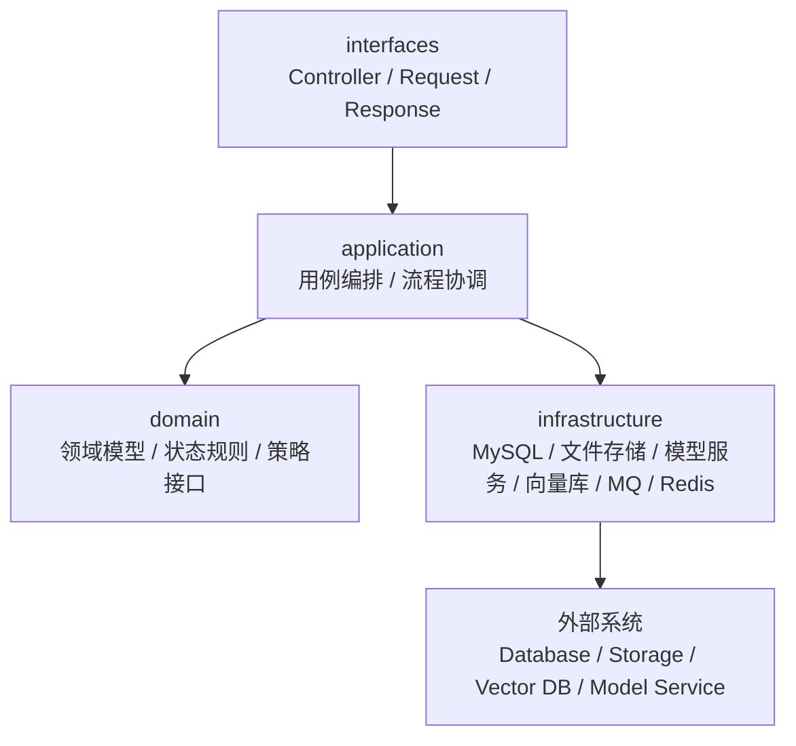

分层交互原则如下：

```text
外部请求先进入 interfaces 层；
interfaces 层只负责接口接入和参数转换，然后调用 application 层；
application 层负责编排业务流程，并调用 domain 层的业务规则；
application 层通过接口使用 infrastructure 层提供的外部能力；
infrastructure 层负责访问具体外部系统；
domain 层不依赖具体技术实现。
```

一次典型调用流程可以理解为：

```text
Controller 接收请求 (interfaces)
  ↓
转换为 Command 或 Query 对象
  ↓
Application Service 编排业务流程 (application)
  ↓
调用领域规则完成状态判断、策略选择或参数约束 (domain)
  ↓
调用基础设施能力访问 MySQL、文件存储、模型服务或向量数据库 (infrastructure)
  ↓
组装结果并返回接口层
```

该依赖关系的重点是：

```text
业务流程可以使用基础设施能力
但业务规则不应该被具体基础设施绑定
```

这样后续替换本地文件存储、向量数据库、MQ 或模型服务时，核心业务流程不需要大范围改动。

### 6.4.4 分层设计原则

**1. 接口层保持轻量**

接口层只负责请求接入、参数转换和结果返回，不编写复杂业务逻辑。

这样可以避免 Controller 变得臃肿，也便于接口测试和业务逻辑复用。

**2. 应用层负责编排，不沉淀底层技术细节**

应用层负责组织完整业务流程，例如上传、向量化、搜索等，但不直接绑定具体文件系统、向量库 SDK 或模型服务调用实现。

这样可以让业务流程保持稳定，底层技术组件可以独立替换。

**3. 领域层保存核心业务规则**

状态流转、搜索类型、参数约束、策略接口等核心规则应放在领域层或由领域层定义。

这样可以避免业务规则散落在 Controller、Mapper 或外部系统适配代码中。

**4. 基础设施层只做技术适配**

基础设施层负责访问 MySQL、文件存储、Python 服务、向量数据库、Redis、MQ 等外部系统。

它不应该反向控制业务流程，也不应该决定图片是否可搜索、任务是否应该重试、搜索结果是否应该返回等核心业务规则。

**5. 依赖接口而不是具体实现**

业务层应优先依赖抽象接口，而不是直接依赖具体技术实现。

例如：

```text
依赖 FileStorageService，而不是直接依赖本地文件路径操作；
依赖 VectorIndexClient，而不是直接依赖某个向量数据库 SDK；
依赖 ModelVectorizationClient，而不是直接在业务代码中写 HTTP 调用；
依赖 VectorizationTaskPublisher，而不是直接写死线程池或 MQ。
```

这样可以为后续对象存储迁移、向量库替换、MQ 异步化和模型服务调整预留扩展空间。

---

## 6.5 业务协作细化架构设计

### 6.5.1 图片上传与向量化任务架构

**架构流程图设计：**

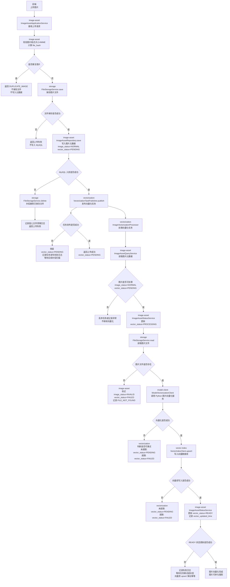


**涉及模块与接口汇总**

| 模块          | 所需接口                                     | 作用                                                         |
| ------------- | -------------------------------------------- | ------------------------------------------------------------ |
| image-asset   | ImageAssetApplicationService                 | 接收图片上传请求，完成图片校验、去重、元数据入库和向量化任务触发 |
| image-asset   | ImageAssetQueryService                       | 向向量化任务提供图片元数据查询能力                           |
| image-asset   | ImageAssetStatusService                      | 维护 image_status、vector_status、vector_updated_time、fail_reason 等图片资产状态字段 |
| image-asset   | ImageAssetRepository                         | 访问 MySQL 图片资产表，完成图片元数据新增、查询和状态更新    |
| storage       | FileStorageService                           | 保存、读取、删除图片文件；MVP 使用本地文件系统，后续可替换为对象存储 |
| vectorization | VectorizationTaskPublisher                   | 发布图片向量化任务；MVP 使用本地线程池，后续可替换为 MQ      |
| vectorization | ImageVectorizationProcessor                  | 执行图片向量化任务，负责任务状态流转、模型调用、向量写入和失败处理 |
| model-client  | ModelVectorizationClient                     | 调用 Python 图片向量化服务，生成 image embedding             |
| vector-index  | VectorIndexClient                            | 向向量数据库写入、删除、检查图片向量，当前核心能力是 upsert  |
| common        | ErrorCode / StatusEnum / Result / LogContext | 提供统一异常码、状态枚举、响应结构和日志上下文               |

---

### 6.5.2 搜索Pipeline架构

**架构流程图设计：**

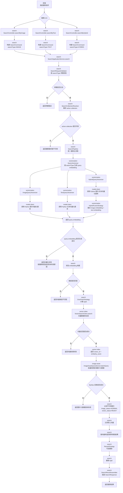


**涉及模块与接口汇总**

| 模块          | 所需接口                                     | 作用                                                        |
| ------------- | -------------------------------------------- | ----------------------------------------------------------- |
| search        | SearchController                             | 提供以图搜图、以文搜图、图文联合搜图三个搜索入口            |
| search        | SearchApplicationService                     | 接收 SearchCommand，作为搜索用例的应用服务入口              |
| search        | SearchPipeline                               | 编排统一搜索主流程                                          |
| search        | SearchRequestValidator                       | 按 searchType 执行搜索请求参数校验                          |
| search        | SearchCollectionResolver                     | 获取当前 active collection 配置                             |
| search        | OverFetchStrategy                            | 根据 topK 计算实际向量召回数量 topN                         |
| search        | RerankStrategy                               | 对召回结果进行可选重排，MVP 阶段可为空实现                  |
| search        | SearchResultAssembler                        | 组装统一 SearchResponse                                     |
| vectorization | QueryVectorizer                              | 查询向量化策略接口，根据 searchType 选择具体实现            |
| vectorization | ImageQueryVectorizer                         | 处理以图搜图的查询图片向量化                                |
| vectorization | TextQueryVectorizer                          | 处理以文搜图的查询文本向量化                                |
| vectorization | HybridQueryVectorizer                        | 处理图文联合搜图的图片向量、文本向量和融合向量生成          |
| vectorization | HybridFusionStrategy                         | 在图文联合搜图中执行 image embedding 与 text embedding 融合 |
| model-client  | ModelVectorizationClient                     | 调用 Python 模型服务，生成图片或文本 query embedding        |
| vector-index  | VectorSearchClient                           | 调用向量数据库执行相似度召回                                |
| image-asset   | ImageAssetQueryService                       | 根据 imageId 批量查询图片元数据                             |
| image-asset   | ImageAssetStatusService                      | 提供图片状态判断能力，用于过滤不可用图片                    |
| common        | SearchType / ErrorCode / Result / LogContext | 提供搜索类型、统一异常码、统一响应结构和日志上下文          |

---

### 6.5.3 存储与数据一致性架构

**架构流程图设计：**

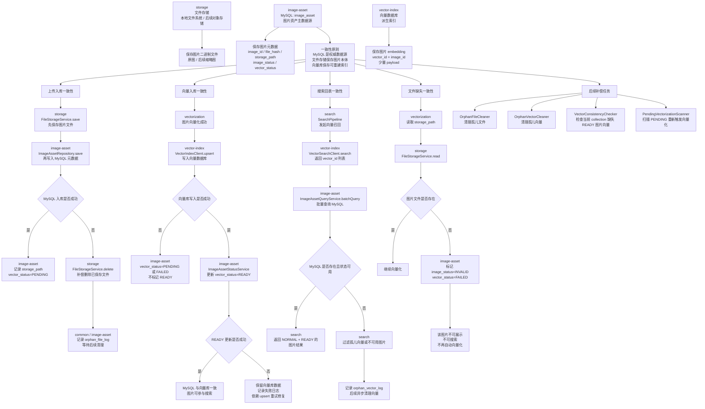


**涉及模块与接口汇总：**

| 模块          | 所需接口                            | 作用                                                         |
| ------------- | ----------------------------------- | ------------------------------------------------------------ |
| image-asset   | ImageAssetRepository                | 访问 MySQL 图片资产表，保存图片元数据、查询图片记录、更新状态字段 |
| image-asset   | ImageAssetQueryService              | 根据 imageId / vectorId 批量查询图片元数据，供搜索回表和一致性校验使用 |
| image-asset   | ImageAssetStatusService             | 维护 image_status、vector_status、fail_reason 等图片资产状态字段 |
| image-asset   | OrphanFileLogService                | 记录文件已保存但 MySQL 入库失败产生的孤儿文件，供后续清理    |
| image-asset   | OrphanVectorLogService              | 记录向量库存在但 MySQL 不存在或状态不可用的孤儿向量，供后续清理 |
| storage       | FileStorageService                  | 保存、读取、删除图片文件；用于上传入库、向量化读取和孤儿文件补偿删除 |
| vector-index  | VectorIndexClient                   | 向量写入、删除、检查是否存在；用于向量入库、一致性校验和孤儿向量清理 |
| vector-index  | VectorSearchClient                  | 执行向量召回，返回 vector_id 和 similarity_score             |
| vectorization | PendingVectorizationScanner         | 后续补偿扫描 PENDING 图片，重新触发向量化任务                |
| vectorization | ProcessingTimeoutScanner            | 后续扫描长时间 PROCESSING 的任务，将其回退为 PENDING         |
| vectorization | VectorConsistencyChecker            | 后续检查当前 collection 是否缺少 READY 图片向量，并触发该 collection 的向量补建 |
| search        | SearchPipeline                      | 搜索时必须回表 MySQL，并过滤不可用图片和孤儿向量             |
| common        | StatusEnum / ErrorCode / LogContext | 提供状态枚举、错误码、日志上下文和补偿任务通用字段           |

---

### 6.5.4 向量库与collection架构

**架构流程图设计：**

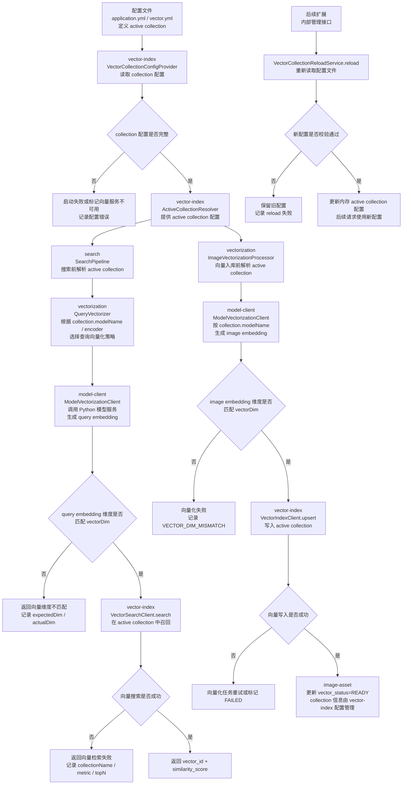


**涉及模块与接口汇总：**

| 模块          | 所需接口                                          | 作用                                                         |
| ------------- | ------------------------------------------------- | ------------------------------------------------------------ |
| vector-index  | VectorCollectionConfigProvider                    | 从 YAML 或其他配置源读取 collection 配置                     |
| vector-index  | ActiveCollectionResolver                          | 对外提供当前 active collection 配置                          |
| vector-index  | VectorSearchClient                                | 在指定 collection 中执行向量召回                             |
| vector-index  | VectorIndexClient                                 | 在指定 collection 中执行 upsert、delete、exists 等向量操作   |
| vector-index  | VectorCollectionHealthChecker                     | 启动时或定时检查 collection 配置与向量库实际状态是否可用     |
| search        | SearchPipeline                                    | 搜索前获取 active collection，并校验 query embedding 维度    |
| vectorization | QueryVectorizer                                   | 根据 active collection 的模型和 encoder 配置生成查询向量     |
| vectorization | ImageVectorizationProcessor                       | 图片向量入库前获取 active collection，并校验 image embedding 维度 |
| model-client  | ModelVectorizationClient                          | 根据 collection 配置调用对应模型服务生成 embedding           |
| image-asset   | ImageAssetStatusService                           | 向量写入成功后记录图片级 vector_status 和 vector_updated_time |
| common        | VectorCollectionConfig / VectorMetric / ErrorCode | 提供 collection 配置对象、距离度量枚举和统一错误码           |
| 后续扩展      | VectorCollectionReloadService                     | 提供内部接口触发重新读取配置文件并校验配置                   |

---

### 6.5.5 配置、日志与可观测性框架

**架构流程图设计：**

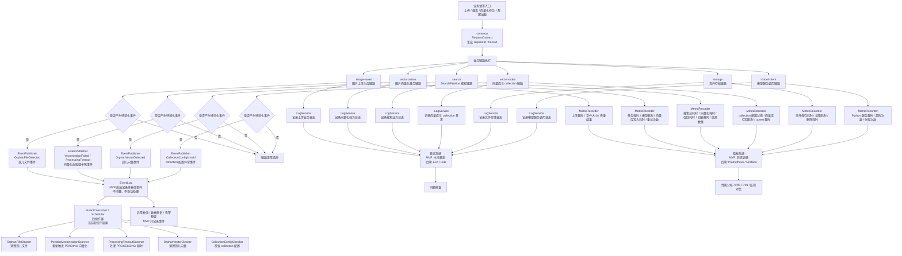


**设计模块与接口汇总：**

| 接口                                  | 所属模块 | 作用                                                         |
| ------------------------------------- | -------- | ------------------------------------------------------------ |
| RequestContext                        | common   | 保存当前请求或任务的链路上下文，例如 requestId、traceId、searchType、imageId、taskId |
| TraceIdGenerator                      | common   | 生成 requestId / traceId，保证上传、搜索、向量化任务、配置加载都有统一追踪标识 |
| LogService                            | common   | 统一记录结构化日志，包括业务日志、异常日志、链路日志         |
| MetricRecorder                        | common   | 统一记录指标，包括耗时、计数、数量、成功次数、失败次数       |
| EventPublisher                        | common   | 统一记录待补偿事件，例如孤儿文件、孤儿向量、向量化失败、PROCESSING 超时；MVP 写入 event.log |
| EventLog                              | common   | MVP 追加记录待补偿事件，不消费、不自动处理；后续可扩展为落库、投递 MQ 或被补偿任务扫描 |
| ObservabilityProperties               | common   | 配置日志开关、指标开关、事件开关、慢请求阈值、采样率等       |
| EventType / MetricName / LogEventName | common   | 统一事件类型、指标名称、日志事件名称，避免各模块命名不一致   |


**LogService所需能力：**

| 接口能力             | 作用                                                         |
| -------------------- | ------------------------------------------------------------ |
| recordBizLog         | 记录普通业务节点日志，例如上传开始、搜索开始、任务开始       |
| recordSuccessLog     | 记录成功节点日志，例如上传成功、向量化成功、搜索成功         |
| recordErrorLog       | 记录异常节点日志，例如模型调用失败、向量库失败、MySQL 回表失败 |
| recordStateChangeLog | 记录状态变化日志，例如 vector_status 从 PENDING 到 PROCESSING |
| recordSlowLog        | 记录慢链路日志，例如搜索总耗时超过阈值                       |


**MatricRecorder所需能力：**

| 接口能力    | 作用                                                         |
| ----------- | ------------------------------------------------------------ |
| increment   | 记录次数类指标，例如 upload_total_count、search_failed_count |
| recordTimer | 记录耗时类指标，例如 search_total_duration_ms、vector_upsert_duration_ms |
| recordValue | 记录数值类指标，例如 file_size、result_count、topN、orphan_vector_count |


**EventPublisher / EventLog 能力：**

| 接口能力       | 作用                       |
| -------------- | -------------------------- |
| publish        | 记录待补偿事件；MVP 写入 event.log |
| recordEvent    | 追加事件日志；MVP 不落库、不消费 |
| markProcessing | 后续扩展，标记事件处理中   |
| markSuccess    | 后续扩展，标记事件处理成功 |
| markFailed     | 后续扩展，标记事件处理失败 |
| retryLater     | 后续扩展，记录下次重试时间 |

MVP 阶段不设计补偿事件表，也不执行 EventConsumer / Scheduler。事件记录只用于排查和后续扩展，真正的自动补偿能力在后续迭代中再引入。


**各模块涉及日志及发布事件：**

1. image-assert

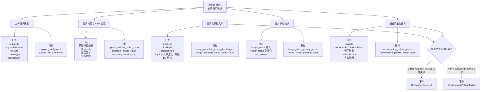

2. vectorization

```mermaid
flowchart TD
    A["vectorization<br/>向量化模块"] --> B["向量化任务开始"]
    A --> C["读取图片元数据并校验状态"]
    A --> D["更新 PROCESSING 状态"]
    A --> E["读取图片文件"]
    A --> F["调用模型生成 embedding"]
    A --> G["校验向量维度"]
    A --> H["写入向量数据库"]
    A --> I["更新 READY 状态"]
    A --> J["失败重试与补偿扫描"]

    B --> B1["日志<br/>taskId<br/>imageId<br/>retryCount<br/>taskStart"]
    B --> B2["指标<br/>vectorization_task_total_count"]

    C --> C1["日志<br/>imageId<br/>image_status<br/>vector_status<br/>是否允许处理"]
    C --> C2["指标<br/>vectorization_skip_count<br/>image_metadata_query_duration_ms"]

    D --> D1["日志<br/>vector_status=PROCESSING<br/>processing_started_time<br/>状态更新结果"]
    D --> D2["指标<br/>vector_status_processing_count<br/>processing_update_duration_ms"]

    E --> E1["日志<br/>storagePath<br/>文件是否存在<br/>读取结果"]
    E --> E2["指标<br/>image_file_read_duration_ms<br/>image_file_missing_count"]

    F --> F1["日志<br/>modelName<br/>modelVersion<br/>调用结果<br/>超时 / 异常"]
    F --> F2["指标<br/>image_model_inference_duration_ms<br/>model_timeout_count<br/>model_failed_count"]

    G --> G1["日志<br/>expectedDim<br/>actualDim<br/>维度是否匹配"]
    G --> G2["指标<br/>vector_dim_mismatch_count"]

    H --> H1["日志<br/>vectorId<br/>collectionName<br/>upsert 成功 / 失败"]
    H --> H2["指标<br/>vector_upsert_duration_ms<br/>vector_upsert_failed_count"]

    I --> I1["日志<br/>vector_status=READY<br/>vector_updated_time<br/>READY 更新结果"]
    I --> I2["指标<br/>vector_ready_update_duration_ms<br/>vectorization_success_count"]

    J --> J1["日志<br/>failReason<br/>retryCount<br/>nextStatus<br/>是否进入 FAILED"]
    J --> J2["指标<br/>vectorization_failed_count<br/>vectorization_retry_count<br/>processing_timeout_count"]

    E --> K{"是否产生事件"}
    F --> K
    H --> K
    I --> K
    J --> K

    K -- "文件不存在" --> L["事件<br/>ImageFileMissing"]
    K -- "向量化失败可重试" --> M["事件<br/>VectorizationFailed"]
    K -- "超过重试上限" --> N["事件<br/>VectorizationDeadFailed"]
    K -- "向量库写入失败" --> O["事件<br/>VectorUpsertFailed"]
    K -- "READY 更新失败" --> P["事件<br/>VectorReadyUpdateFailed"]
    K -- "PROCESSING 超时" --> Q["事件<br/>ProcessingTimeout"]
```

3. search

```mermaid
flowchart TD
    A["search<br/>搜索模块"] --> B["接收搜索请求"]
    A --> C["参数校验"]
    A --> D["解析 active collection"]
    A --> E["生成 query embedding"]
    A --> F["校验 embedding 维度"]
    A --> G["计算 topN"]
    A --> H["向量召回"]
    A --> I["MySQL 批量回表"]
    A --> J["状态过滤与孤儿向量过滤"]
    A --> K["重排与结果组装"]
    A --> L["返回搜索结果"]

    B --> B1["日志<br/>requestId<br/>searchType<br/>topK<br/>输入类型"]
    B --> B2["指标<br/>search_total_count"]

    C --> C1["日志<br/>参数校验结果<br/>错误码<br/>失败原因"]
    C --> C2["指标<br/>search_validate_failed_count"]

    D --> D1["日志<br/>collectionName<br/>modelName<br/>vectorDim<br/>vectorVersion"]
    D --> D2["指标<br/>active_collection_resolve_duration_ms"]

    E --> E1["日志<br/>searchType<br/>vectorizerType<br/>modelName<br/>向量化成功 / 失败"]
    E --> E2["指标<br/>query_vectorize_duration_ms<br/>query_vectorize_failed_count"]

    F --> F1["日志<br/>expectedDim<br/>actualDim<br/>维度是否匹配"]
    F --> F2["指标<br/>query_embedding_dim_mismatch_count"]

    G --> G1["日志<br/>topK<br/>topN<br/>overFetchStrategy"]
    G --> G2["指标<br/>over_fetch_topN_value"]

    H --> H1["日志<br/>collectionName<br/>topN<br/>recallCount<br/>向量召回结果"]
    H --> H2["指标<br/>vector_search_duration_ms<br/>vector_recall_count<br/>vector_search_failed_count"]

    I --> I1["日志<br/>imageIdCount<br/>dbHitCount<br/>MySQL 回表结果"]
    I --> I2["指标<br/>mysql_backfill_duration_ms<br/>mysql_backfill_failed_count"]

    J --> J1["日志<br/>beforeFilterCount<br/>afterFilterCount<br/>orphanVectorCount<br/>过滤原因分布"]
    J --> J2["指标<br/>filtered_result_count<br/>orphan_vector_count"]

    K --> K1["日志<br/>rerankEnabled<br/>resultCount<br/>topScore<br/>bottomScore"]
    K --> K2["指标<br/>rerank_duration_ms<br/>result_assemble_duration_ms<br/>search_result_count"]

    L --> L1["日志<br/>searchStatus<br/>totalDuration<br/>resultCount<br/>errorCode"]
    L --> L2["指标<br/>search_success_count<br/>search_failed_count<br/>search_empty_result_count<br/>search_total_duration_ms"]

    H --> M{"是否产生事件"}
    I --> M
    J --> M
    L --> M

    M -- "向量召回失败" --> N["事件<br/>VectorSearchFailed"]
    M -- "模型服务超时" --> O["事件<br/>ModelServiceTimeout"]
    M -- "发现孤儿向量" --> P["事件<br/>OrphanVectorDetected"]
    M -- "搜索耗时过高" --> Q["事件<br/>SearchSlowDetected"]
    M -- "空结果率过高" --> R["事件<br/>HighEmptyResultRate"]
```

4. vector-index

```mermaid
flowchart TD
    A["vector-index<br/>向量索引模块"] --> B["collection 配置加载"]
    A --> C["collection 配置校验"]
    A --> D["active collection 解析"]
    A --> E["collection reload"]
    A --> F["向量 search"]
    A --> G["向量 upsert"]
    A --> H["向量 delete / exists"]
    A --> I["collection 健康检查"]

    B --> B1["日志<br/>配置文件路径<br/>activeCollection<br/>加载成功 / 失败"]
    B --> B2["指标<br/>collection_config_load_count"]

    C --> C1["日志<br/>collectionName<br/>modelName<br/>vectorDim<br/>metric<br/>校验失败字段"]
    C --> C2["指标<br/>collection_config_invalid_count"]

    D --> D1["日志<br/>activeCollection<br/>vectorVersion<br/>distanceMetric"]
    D --> D2["指标<br/>active_collection_resolve_count"]

    E --> E1["日志<br/>reload 前配置<br/>reload 后配置<br/>是否成功<br/>失败原因"]
    E --> E2["指标<br/>collection_reload_count<br/>collection_reload_failed_count"]

    F --> F1["日志<br/>collectionName<br/>topN<br/>metric<br/>recallCount<br/>search 成功 / 失败"]
    F --> F2["指标<br/>vector_search_duration_ms<br/>vector_search_failed_count<br/>vector_recall_count"]

    G --> G1["日志<br/>collectionName<br/>vectorId<br/>vectorDim<br/>upsert 成功 / 失败"]
    G --> G2["指标<br/>vector_upsert_duration_ms<br/>vector_upsert_failed_count"]

    H --> H1["日志<br/>collectionName<br/>vectorId<br/>operationType<br/>操作结果"]
    H --> H2["指标<br/>vector_delete_duration_ms<br/>vector_exists_duration_ms<br/>vector_delete_failed_count"]

    I --> I1["日志<br/>collectionName<br/>是否存在<br/>向量库连接状态<br/>健康检查结果"]
    I --> I2["指标<br/>vector_index_health_check_count<br/>vector_index_unavailable_count"]

    C --> J{"是否产生事件"}
    E --> J
    F --> J
    G --> J
    I --> J

    J -- "配置非法" --> K["事件<br/>CollectionConfigInvalid"]
    J -- "reload 失败" --> L["事件<br/>CollectionReloadFailed"]
    J -- "向量库不可用" --> M["事件<br/>VectorIndexUnavailable"]
    J -- "READY 但向量不存在" --> N["事件<br/>VectorMissingForReadyImage"]
```

5. storage

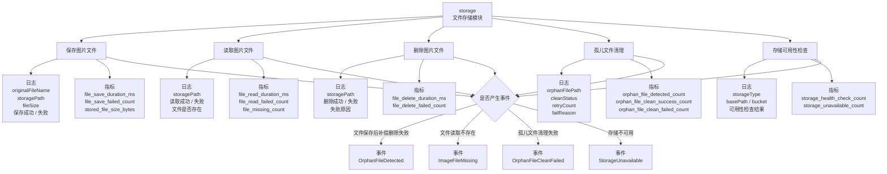

6. model-client

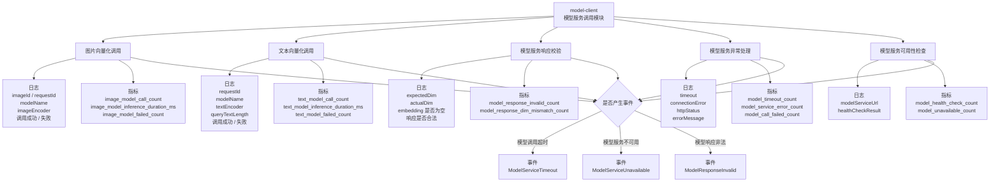

---

### 6.5.6高并发扩展优化架构

高并发与扩展预留架构不在 MVP 阶段直接实现完整缓存、限流、MQ 和业务线程池隔离，而是**先提供统一的扩展接口和默认空实现。**MVP 阶段使用公共线程池、NoOpCacheService、NoOpRateLimiter 和本地线程池任务发布器；**后续优化时可以替换接口实现**，升级为业务隔离线程池、Redis 缓存、接口限流和 MQ 异步任务，而不需要改动上传、向量化和搜索主流程。

**模块预留与接口架构：**

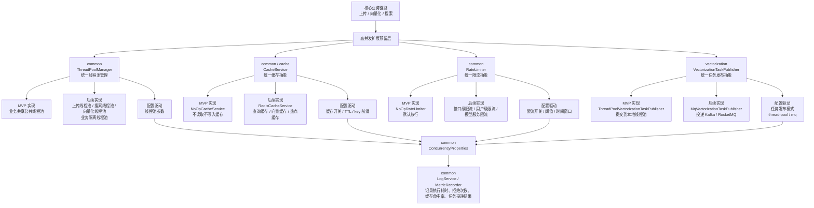


**涉及模块与接口汇总：**

| 模块           | 接口 / 能力                          | 作用                                                         |
| -------------- | ------------------------------------ | ------------------------------------------------------------ |
| common         | ThreadPoolManager                    | 统一提供线程池，不允许业务代码直接 new 线程池                |
| common         | ExecutorProvider                     | 根据业务类型返回对应 Executor；MVP 返回公共线程池，后续返回业务隔离线程池 |
| common         | ConcurrencyProperties                | 统一管理线程池、缓存、限流、任务发布模式等配置               |
| common / cache | CacheService                         | 缓存抽象接口，提供 get、put、evict 等能力                    |
| common / cache | NoOpCacheService                     | MVP 默认实现，不实际读写缓存                                 |
| common / cache | CacheKeyBuilder                      | 统一构建缓存 key，避免后续缓存 key 散落在业务代码中          |
| common         | RateLimiter                          | 限流抽象接口，判断当前请求是否允许继续执行                   |
| common         | NoOpRateLimiter                      | MVP 默认实现，所有请求直接放行                               |
| vectorization  | VectorizationTaskPublisher           | 任务发布抽象接口，屏蔽本地线程池和 MQ 的差异                 |
| vectorization  | ThreadPoolVectorizationTaskPublisher | MVP 实现，将向量化任务提交到统一线程池                       |
| vectorization  | MqVectorizationTaskPublisher         | 后续实现，将向量化任务投递到 Kafka / RocketMQ                |
| common         | MetricRecorder                       | 记录线程池队列长度、缓存命中率、限流拒绝次数、任务发布失败次数等指标 |
| common         | LogService                           | 记录线程池拒绝、缓存异常、限流拒绝、MQ 投递失败等日志        |
